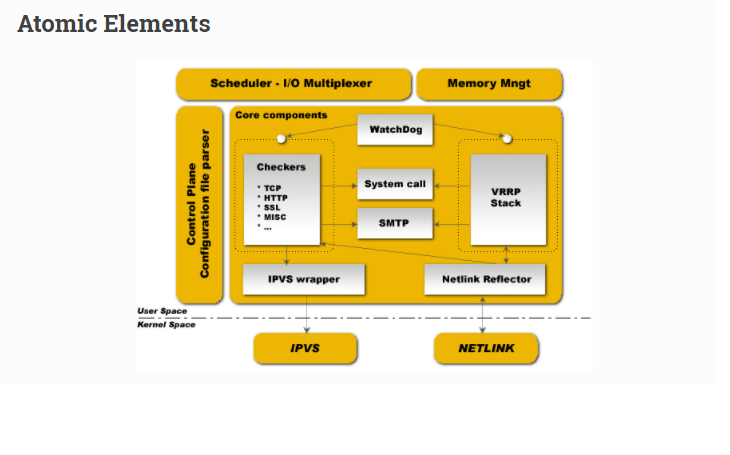

## To ensure robustness and stability, daemon is split into 3 distinct processes: ##

- A minimalistic parent process in charge with forked children process monitoring.
- Two children processes, one responsible for VRRP framework and the other for healthchecking.

**Each children process** has its own scheduling I/O multiplexer, that way VRRP scheduling jitter is optimized since VRRP scheduling is more sensible/critical than healthcheckers. This split design minimalize for healthchecking the usage of foreign libraries and minimalize its own action down to and idle mainloop in order to avoid malfunctions caused by itself.

**The parent process** monitoring framework is called watchdog, the design is each children process open an accept unix domain socket, then while daemon bootstrap, parent process connect to those unix domain socket and send periodic (5s) hello packets to children. If parent cannot send hello packet to remote connected unix domain socket it simply restart children process.

This watchdog design offers 2 benefits, first of all hello packets sent from parent process to remote connected children is done throught I/O multiplexer scheduler that way it can detect deadloop in the children scheduling framework. The second benefit is brought by the uses of sysV signal to detect dead children. When running you will see in process list:

	PID         111     Keepalived  <-- Parent process monitoring children
	            112     \_ Keepalived   <-- VRRP child
	            113     \_ Keepalived   <-- Healthchecking child

Keepalived uses four Linux kernel components:

- LVS Framework: Uses the getsockopt and setsockopt calls to get and set options on sockets.
- Netfilter Framework: IPVS code that supports NAT and Masquerading.
- Netlink Interface: Sets and removes VRRP virtual IPs on network interfaces.
- Multicast: VRRP advertisements are sent to the reserved VRRP MULTICAST group (224.0.0.18).

