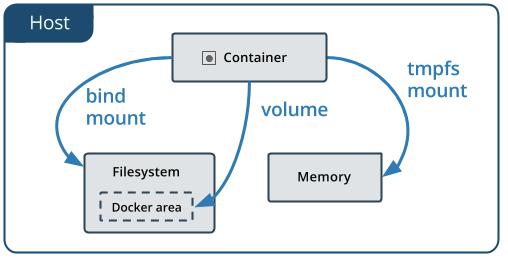

## manage data in Docker ##

It is possible to store data within the writable layer of a container, but there are some downside:

- The data doesn’t persist when that container is no longer running, and it can be difficult to get the data out of the container if another process needs it.

- A container’s writable layer is tightly coupled to the host machine where the container is running. You can’t easily move the data somewhere else.

-     Writing into a container’s writable layer requires a **storage driver** to manage the filesystem. The storage driver provides a union filesystem, using the Linux kernel. This extra abstraction reduces performance as compared to using data volumes, which write directly to the host filesystem.

Docker offers three different ways to mount data into a container from the Docker host: **volumes, bind mounts, or tmpfs volumes.** When in doubt, **volumes are almost always the right choice.** Keep reading for more information about each mechanism for mounting data into containers.

- An easy way to visualize the difference among **volumes**, **bind mounts**, and **tmpfs** mounts is to think about where the data lives on the Docker host.

    
    
    - **Volumes** are stored in a part of the host filesystem which is managed by Docker (/var/lib/docker/volumes/ on Linux). Non-Docker processes should not modify this part of the filesystem. Volumes are the best way to persist data in Docker.
    
        Volumes also support the use of volume drivers, which allow you to store your data on remote hosts or cloud providers, among other possibilities.
    
    - **Bind mounts** may be stored anywhere on the host system. They may even be important system files or directories. Non-Docker processes on the Docker host or a Docker container can modify them at any time. 
    
    - **tmpfs** mounts are stored in the host system’s memory only, and are never written to the host system’s filesystem.
    
    
    
