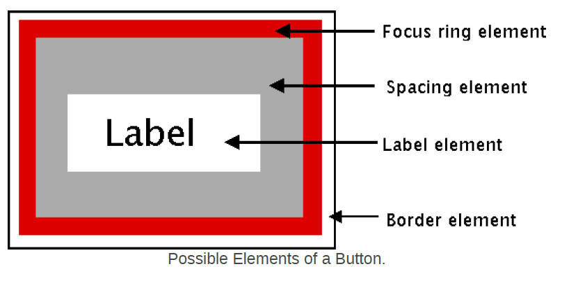
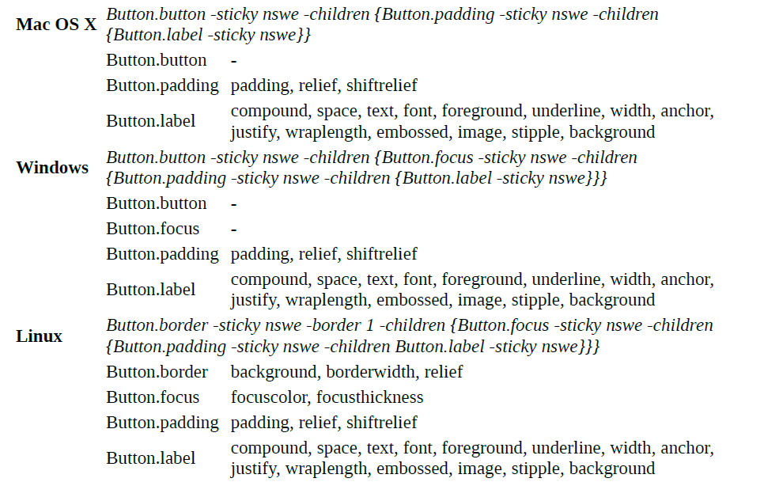

## Styles and Themes ##

- 新部件的"themed"方面是最强大且令人激动的。 因为它与传统的Tk部件相比，用许多不同的方式来工作，因此需要灵活的来使用，以免在使用时产生迷惑。

### Definitions ###

- 首先定义一些ttk themes and styles相关的概念和术语

#### widget class ####

- 一个部件类被使用标记一个特别的部件，whether it is a button, a label, a canvas etc. 在传统的Tk中，所有的buttons都有一样的类("Button"), 所有的labels都有一样的类("Label"), etc

- 可以通过部件类并结合option database，来改变options globally。 This could let you say for example that all buttons by default had a red background.

- There were a few classic Tk widgets, including frame and toplevel widgets, 允许当部件第一次被创建时，改变一个特别部件的类 by passing it a "class" configuration option. 因此当一般frames有一个“Frame”部件类时，你可以规定一个特别的frame部件有一个"SpecialFrame"部件类。

- Because of that, you could use the option database to define different looks for different types of frame widgets (not just all frame widgets, or frame widgets located at a particular place in the hierarchy).

#### Widget State ####

- a widget state allows a single widget to have more than one apperance or behavior, depending on things like mouse position, different state optoins set by the application, and so on. 

- In classic Tk, 几个widgets有"state"配置选项，通过值"normal" or "disabled"来设定部件状态。 对于button来说，"disabled"将使其标签文字变灰。 some used an addition sate, "active", again which represented a different behavior.

- The widget itself, or more typically, the widget's class bindings, controlled how the appearance of the widget changed in different states, typically via consulting widget configuration options like "foreground","activeforeground", and "disabledforeground".

- TTk部件极大的扩展了了基本的widget state, 有两个重要的改变。 第一个,不是通过选项，而是通过"state"和"instate"命令来访问state选项。

- 一个ttk部件的状态实际上依赖于一集合独立状态标志位(independent state flags)：
	“active”，“disabled”，“focus”，“pressed”，“selected”，“background”，“readonly”，“alternate” or “invalid”

- 虽然状态标识可以用于每个部件，但是具体的部件会忽略其中一部分标记，例如label部件将会忽略"invalid"标识。

- The second major change that Ttk makes is that it takes the decision of what to change when the state is adjusted out of the widget's control. That is, a widget author will no longer hardcode logic to the effect of "when the state is disabled, consult the disabledforeground configuration option and use that for the foreground color". With that logic hardcoded, not only did it make coding widgets longer (and more repetitive), but also restricted how a widget could be changed based on its state. That is, if the widget author hadn't coded in logic to change the font when the state changed, you as the user of the widget were out of luck.

- Instead of hardcoding these decisions within each widget, Ttk moves the decisions into a separate location: styles. This means that the widget author doesn't need to provide code for every possible appearance option, which not only simplifies the widget, but paradoxically ensures that a wider range of appearances can be set, including those the widget author may not have anticipated.

#### Style ####

- a style describes the appearance(or appearances) of a ttk widget class.

- all themed widgets support "style" configuration option.

- 一个style定义一个确定部件类的外观，但是其具体的能力依赖于当前的state flag. so for example a style can specify that when the "pressed" state flag us set, the appearance should change in a particular way.

#### Themes ####

- **you can think of a theme as a collection of styles**. While each style is widget-specific (one for buttons, one for entries, etc.) a theme will collect many styles together. Typically, a theme will then define one style for each type of widget, but each of those styles will be designed so that they visually "fit" together with each other — though perhaps unfortunately Ttk doesn't technically restrict bad design or judgement!
To use a particular theme for an application is really to say that you'd like to have a set of styles defined so that by default all the different type of widgets will have some common appearance, and fit in well with each other.

### Using Styles and Themes ###

- Style names

	you can first check the value of its "style" configuration option. **If that is empty, it means the widget is using the default style for the widget.** You can retrieve that via the widget's class. For example:

		>>> b = ttk.Button()
		>>> b['style']
		''
		>>> b.winfo_class()
		'TButton'

	themed 部件默认styles都是相似的命名方式：e.g. "TEntry", "TLabel", "TSizeGrip", etc. 当然也有一些特别的需要注意，例如treeview部件的类为"Treeview"

	当然自己创建的Style可以随便命名，但是最好还是遵循约定，是代码易于管理。

- Using a Style

	- 在创建部件时，使用style：

			b = ttk.Button(parent, text='Hello', style='Fun.TButton')

	- 在后期利用"style"配置选项改变：
	
			b['style'] = 'NuclearReactor.TButton'

- Using Themes

	style控制单独部件实例的外观，而themes控制整个用户接口。 交换themed的能力是themed widgets有意义特征中的一个。

- 主题被name标识，可以获取所有可用themes的名字：

		>>> s = ttk.Style(root)
		>>> s.theme_names()
		('aqua', 'step', 'clam', 'alt', 'default', 'classic')

- 在某一时刻通过，只能有一个theme被激活，通过下面方法获取当前激活themed:

		>>> s.theme_use()
		'aqua'

- 交换theme:
	
		s.theme_use('themename')

	该方法将刷新所有的widgets，so that they take on the appearance by the new theme

#### What's inside a Style ####

- 在知道如何使用一个style后，下面将焦点放到Style里面的内容

- Elements

	- 每个style代表了一个部件，每个部件一般由更小的块组成，called elements. style author的任务是构造更小的elements. what these elements are depends on the widget.

	- 下面以button为案例：It might have a **border** on the very outside, which is one element. Just inside that there may be a **focus ring**, which is normally just the background color but may be highlighted when the user tabs into the button. So that's a second element. Then there might be **some spacing** between that focus ring and the button's **label**. So that spacing would be a third element. Finally, there is the label of the button itself, a fourth element.

		
	
	
	- 下面是一个vertical scrollbar案例：containing a "trough" element containing the rest, which includes the up and down arrow elements at either end, and a "thumb" element in the middle.

		

- Layout

	- 除了对a widget里elements的选择，a style还要将这些元素在部件内排序。

	- 下面是button案例：we had a label element inside a spacing element, inside a focus ring element, inside a border element. So the logical layout is like this:
	
			border {
				focus {
					spacing {
							label
						}
				}
			}

	- we can ask ttk what the layout of the Tbutton style is like this:

			>>> s.layout('TButton')
			[("Button.border", {"children": [("Button.focus", {"children": [("Button.spacing",
			{"children": [("Button.label", {"sticky": "nswe"})], "sticky": "nswe"})],
			"sticky": "nswe"})], "sticky": "nswe", "border": "1"})]

	- If we clean this up and format it a bit, we get something with this structure:

			Button.border -sticky nswe -border 1 -children {
				Button.focus -sticky nswe -children {
					Button.spacing -sticky nswe -children {
							Button.label -sticky nswe
					}
				}
			}

	- This starts to make sense; we have four elements, named "Button.border", "Button.focus", "Button.spacing", and "Button.label". Each of these has different element options, such as "-children", "-sticky", and "-border" that here specify layout or sizes. Without getting into two much detail at this point, we can clearly see the nested layout, based on the "-children" and "-sticky" attributes; Ttk uses a simplified version of Tk's "pack" geometry manager to specify element layout

- Element Options

	- 这些不同元素的每个都有许多不同的选项。 例如，scrollbar的"thumb"元素有一个设定background color的选项，和一个设定border宽度的选项。

	- 通过下面的方法来检查每个元素的可用性：

			>>> s.element_options('Button.label')
			('-compound', '-space', '-text', '-font', '-foreground', '-underline', '-width', '-anchor', '-justify',
			'-wraplength', '-embossed', '-image', '-stipple', '-background')

#### Changing Style Options ####

	
- 这一章焦点在通过修改style options来改变style's appearance.

- Modifying a Style Option

	- 修改一个style的元素选项与修改任何另外的配置选项是相同的，by specifying the style, name of the options, and new value:

			s.configure('TButton', font='helvetica 24')

	- 通过"lookup"方法来检索the current value of an option:

			>>> s.lookup('TButton', 'font')
			'helvetica 24'

- Creating a New, Derived Style

	- 如果修改一个存在的style, such as "TButton", 这个修改将被应用到所有使用该style的部件。

	- 在某些时候，可能因为特殊需求，需要创建一个新的style，例如，你想要应用程序内的大多数button保持默认显示，但是对于一类特别的"emergency" buttons，想要有不同的高亮方式。 **In this case, creating a new style(e.g. "Emergency.TButton") derived from the base style("TButton")将是合适的选择**

	- 通过Emergency.TButton的方式，you are implicitly creating a new style derived from the existing one。

		s.configure('Emergency.TButton', font='helvetica 24',
			foreground='red', padding=10)

- State Specific Style Options

	- 除了一般的配置选项，the widget author还可以规定在特别的状态下，该类部件呈现不同的options。 For example, when a button is disabled, you'd like to have the color of the button's label greyed out.

	- 可以通过"map"来实现该功能，which allows you to specify variations for one or more of a style's configuration options. For each configuration option, you can specify a list of widget states, along with the particular value the option should be assigned when the widget is in that state.

	- The following example provides for the following variations from a button's "normal" appearance:

			when the widget is in the disabled state, the background color 
			should be set to "#d9d9d9"

			when the widget is in the active state (mouse over it), the 
			background color should be set to "#ececec"

			when the widget is in the disabled state, the foreground color 
			should be set to "#a3a3a3" (this is in addition to the 
			background color change we already noted)
			
			when the widget is in the state where the button is pressed and 
			the widget is not disabled, the relief should be set to "sunken"

	-	Remember that in the past, with classic Tk widgets, exactly what changed when the widget was in each state would have been determined solely by the widget author. With themed widgets, it is the style itself that determines what changes, which could include things that the original widget author had never anticipated.

	>>Because widget states can contain multiple flags, it's possible that more than one state will match for an option (e.g. "pressed" and "pressed !disabled" will both match if the widget's "pressed" state flag is set). The list of states is evaluated in the order you provide in the map command, with the first state in the list that matches being used.

	- 实例

			s.map('Emergency.TButton', foreground=[("pressed !disabled", "blue")])

#### Sound Difficult to you? ####

- 现在已经知道style由elements组成，element拥有各种option，并且elment需要构成了一个特定的layout来关联部件类。 可以通过改变各个style的各种option来让部件表现得不同。 具体类的style关联一个具体类。 themes收集相关的styles，从而组成一个大的主题。

- So what makes styles and themes so difficult in practice? **Three things.**

- First :　**You can only modify options for a style, not element options (except sometimes).**

	在实现中，style维护一个选项集，所有elements的选项都在该选项集中，当遇到不同element参考相同名字的option时，他们共享同一个option。 **这也是为什么在利用configure对style进行修改时， 直接基于option修改的原因。**

- second : **Options that are available don't necessarily have an effect, and it's not an error to modify a bogus option.**
	

	有适合在修改一个option的时候，会出现支持该选项但是没有效果的现象。As an example, you can't modify the background color of a button in the "aqua" theme used by Mac OS X.

	Perhaps more frustrating when you're experimenting is that specifying an "incorrect" style name or option name does not generate an error。

- Finally : **The elements available, the names of those elements, which options are available or have an effect for each of those elements, and which are used for a particular widget can be different in every theme.**

	- **Keep in mind among other things that the default theme for each platform (Windows, Mac OS X, and Linux) are different**

	- Some implications of this:

		1.If you want to define a new type of widget (or more likely a variation of an existing widget) for your application, you're going to need to do it separately and differently for each theme your application uses (so at least three for a cross-platform application).
		
		2.The elements and options available will differ for each theme/platform, meaning you may have to come up with a quite different customization approach for each theme/platform.
		
		3.The elements, names, and element options available with each theme are not typically documented (outside of reading the theme definition files themselves), but are generally identified via theme introspection (which we'll see soon). Because all themes aren't available on all platforms (e.g. "aqua" will only run on Mac OS X), you'll need ready access to every platform and theme you need to run on.

	- As an example, here is what the layout of the "TButton" style looks like on the theme used by default on three different platforms, as well as the advertised options for each element (not all of which have an effect):

		

	- The bottom line is that in classic Tk, where you had the ability to modify any of a large set of attributes for an individual widget, you'd be able to do something on one platform and it would sorta kinda work (but probably need tweaking) on others. In themed Tk, the easy option just isn't there, and you're pretty much forced to do it the right way if you want your application to work with multiple themes/platforms. It's more work up front.

#### Advanced : More on Elements ####

While that's about as far as we're going to go on styles and themes in this tutorial, for curious users and those who want to delve further into creating new themes, we can provide a few more interesting tidbits about elements.

Because elements are the building blocks of styles and themes, it begs the question of "where do elements come from?" Practically speaking, we can say that elements are normally created in C code, and conform to a particular API that the theming engine understands.

**At the very lowest level, elements come from something called an element factory. At present, there is a "default" one, which most themes use, and uses Tk drawing routines to create elements. A second allows you to create elements from images, and is actually accessible at the script level using the "ttk::style element create" method (from Tcl). Finally, there is a third, Windows-specific engine using the underlying "Visual Styles" platform API.**

If a theme uses elements created via a platform's native widgets, the calls to use those native widgets will normally appear within that theme's element specification code. Of course, themes whose elements depend on native widgets or API calls can only run on the platforms that support them.

Themes will then take a set of elements, and use those to assemble the styles that are actually used by the widgets. And given the whole idea of themes is so that several styles can share the same appearance, it's not surprising that different styles share the same elements.

So while the "TButton" style includes a "Button.padding" element, and the "TEntry" style includes a "Entry.padding" element, underneath these padding elements are more than likely one and the same. They may appear differently, but that's because of different configuration options, which as we recall, are stored in the style that uses the element.

It's also probably not surprising to find out that a theme can provide a set of common options which are used as defaults for each style, if the style doesn't specify them otherwise. This means that if pretty much everything in an entire theme has a green background, the theme doesn't need to explicitly say this for each style. This uses a root style named "."; after all, if "Fun.TButton" can inherit from "TButton", why can't "TButton" inherit from "."?

**Finally, it's worth having a look at how existing themes are defined, both at the C code level in Tk's C library, but also via the Tk scripts found in Tk's "library/ttk" directory. Search for "Ttk_RegisterElementSpec" in Tk's C library to see how elements are specified.**