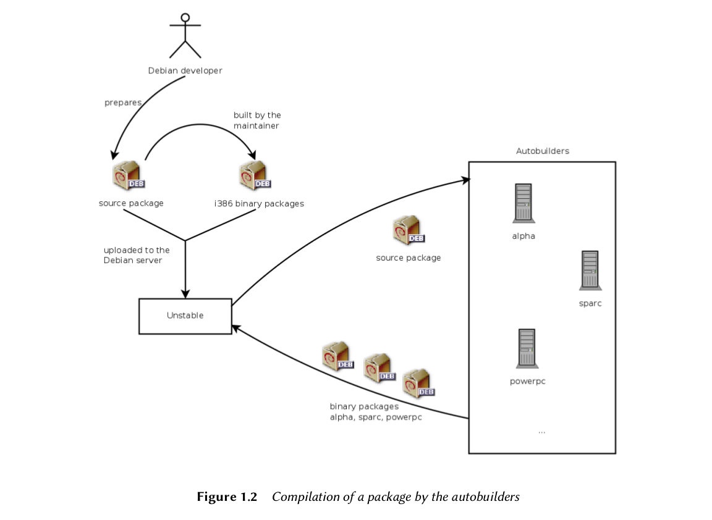
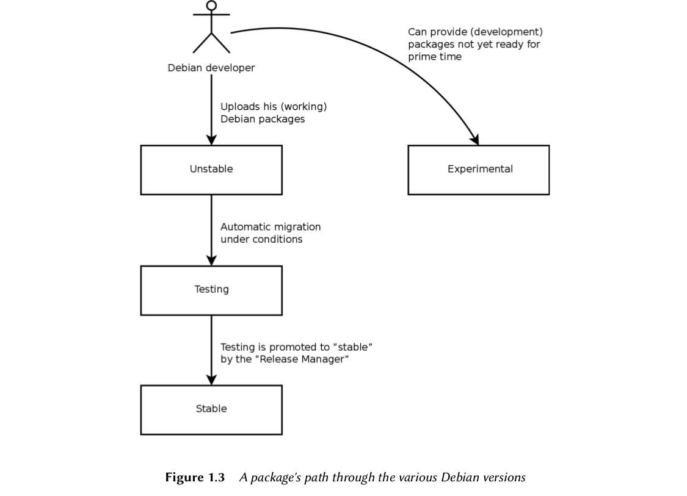
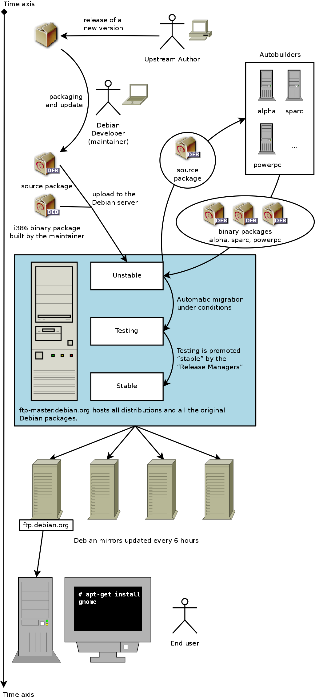

## Origin of the debian name ##

   Debian is not an acronym. This name is, in reality, a contraction of two first name: that of lan murdock, and his girlfriend at the time, Debra. Debra + Ian = Debian.
        
## Ian sought that debian would have to two principle features: ##
    
   Debian would be developed with greatest care, to be worthy of the Linux kernel. It would also be a non-commerical distribution, sufficiently credible to compete with majoy commerical distributions. 
   
## Two author ##

- founder of Debian project : Ian and his girl friend Derbra

- FSF's founder and author of the GPL licnese : Richard Stallman

## Meta distribution ##

- Debian derive more specific distributions intended for a particular public. So it is as a role of meta distribution.

## Debian-cd ##

- debian-cd creates CD-ROM ISO installaion images ready for use. Hertzog is the author of the latest rewrite, but maintenance is essentially conducted by Steve Mclntyre. 

- Any matter regarding this software is discussed(in English) on the **debian-cd@list.debian.org** mailling list.

## Debian-install ##

- debian-install is the name of the debian installation program. Its modular design allows it to be used in a broad range of installation scenarios. The development work is coordinated on the **debian-boot@lists.debian.org** mailling list under the direction of Otavio Salador and Joey Hess.

## Where is Debian ##

- Debian doesn't own any server in its own name, since it is only a project within
the association Soware in the Public Interest (SPI) which manages the hard-
ware and financial aspects (donations, purchase of hardware, etc.).

        http://www.spi-inc.org/

- In addition to SPI, various local associations collaborate closely with Debian
in order to generate funds for Debian, without centralizing everything in the
U.S.A. This setup avoids prohibitive international transfer costs, and fits well
with the decentralized nature of the project. It is in this spirit that the Debian
France association was founded in the summer of 2006. Do not hesitate to join
and support the project!

        http://france.debian.net/
        

## Licence ##

- The GNU General Public License, the BSD License, and the Artistic License are examples of tradi-
tional free licenses that follow the 9 points mentioned in this text. Below you will find the text
as it is published on the Debian website.

        http://www.debian.org/social_contract#guidelines
        
## The second leader of debian ##

- Bruce Perens

- Last anecdotal point, it was Bruce who was responsible for inspiring the dif-
  ferent “codenames” for Debian versions (1.1 — Rex, 1.2 — Buzz, 1.3 — Bo, 2.0
  — Hamm, 2.1 — Slink, 2.2 — Potato, 3.0 — Woody, 3.1 — Sarge, 4.0 — Etch, 5.0 —
    Lenny, 6.0 — Squeeze, Testing — Wheezy, Unstable — Sid). They are taken from
    the names of characters in the Toy Story movie. This animated film entirely
    composed of computer graphics was produced by Pixar Studios, with whom
    Bruce was employed at the time that he led the Debian project. The name
    “Sid” holds particular status, since it will eternally be associated with the Un-
    stable branch. In the film, this character was the neighbor child, who was
    always breaking toys — so beware of geting too close to Unstable. Otherwise,
    Sid is also an acronym for “Still In Development”.
    
## The Inner workings of the Debian Project ##

- The Debian Developers

    A Debian developer is generally responsi-ble for at least one package, but according to their available time and desire, they are free to become involved in numerous teams, acquiring, thus, more responsibilities within the project.
    
        http://www.debian.org/devel/people
        http://www.debian.org/intro/organization
        http://wiki.debian.org/Teams
        
    - Good map weisite
    
             http://www.multimap.com/
         

    - the contact way of developer is saved to debian's database:
    
            http://db.debian.org/

- The Debian Policy : Debian remains consistent despite its gigantic size.
         
    - http://www.debian.org/doc/debian-policy/
    
    - Debian policy mailing list : debian-policy@lists.debian.org mailing
list
    
    - http://bugs.debian.org/debian-policy

    - discussion thereof then begins on the debian-policy@lists.debian.org mailing list until a
consensus is reached and a proposal issued.

- The /usr/share/doc/package/

    Documentation for each package is stored in /usr/share/doc/package/ .
This directory ofen contains a **README.Debian** file describing the Debian spe-
cific adjustments made by the package maintainer. It is, thus, wise to read
this file prior to any configuration, in order to benefit from their experience.
We also find a **changelog.Debian.gz** file describing the changes made from
one version to the next by the Debian maintainer. his is not to be confused 
with the **changelog.gz** file (or equivalent), which describes the changes made
by the upstream developers. The **copyright** file includes information about
the authors and the license covering the software. Finally, we may also find
a file named **NEWS.Debian.gz** , which allows the Debian developer to commu-
nicate important information regarding updates (if apt-listchanges is used,
the messages are automatically shown by apt). All other files are specific to
the software in question. We especially like to point out the **examples sub-
directory**, which frequently contains examples of configuration files.

- constitution election to solve technical problem, so it is also defined "technical committee"

    http://www.debian.org/devel/constitution.en.html
    
- **Meritocracy** is a form of government in which authority is exercised by those
with the greatest merit.

- Here introduce Integration of new maintainers

- language-specific mailings list:

    debian-l10n-french@lists.debian.org

- User discussion mailing list

    debian-user@lists.debian.org
    
- Volunteers make posters, brochures, and other useful promotional materials for the project,
which they make available to everyone, and which Debian provides freely on its website:

    http://www.debian.org/events/material
    
- **ftpmaster** are in charge of the official archive of Debian packages.They maintain the
program that receives packages sent by developers and automatically stores them, after some
checks, on the reference server ( ftp-master.debian.org ).

    When a developer wishes to remove a package, they address this team through the bug tracking system and the “pseudo-package” ftp.debian.org.
    
    The BTS has an entry **ftp.debian.org** to report problems on the official package archive or simply to request removal of a package. Likewise, the pseudo-package www.debian.org
refers to errors on the Debian website, and lists.debian.org gathers all the prob-
lems concerning the mailing lists.

- Package tracking system : Centralize as much information as possible on a single page.

    **http://packages.qa.debian.org/**
    
- Another web interface, known as Debian Developer's Packages Overview
(DDPO), provides each developer a synopsis of the status of all Debian pack-
ages placed under their charge.

    **http://qa.debian.org/developer.php**
    

- GNOME (GNU Network Object Model Environment) and KDE (K Desktop
Environment) are the two most popular graphical desktop environments in
the free soware world. A desktop environment is a set of programs grouped
together to allow easy management of the most common operations through
a graphical interface. They generally include a file manager, office suite, web
browser, e-mail program, multimedia accessories, etc. The most visible differ-
ence resides in the choice of the graphical library used: GNOME has chosen
GTK+ (free soware licensed under the LGPL), and KDE has selected Qt (from
the company, Trolltech, who released it under the GPL license).
è http://www.gnome.org/
è http://www.kde.org/

## Bug ##

- The Bug Define:

        http://www.debian.org/Bugs/Developer#severities
        
- Send Bug
    
    - Any e-mail sent to **12345@bugs.debian.org** will, thus, be assigned to the his-
tory for bug no. 12345.

    - Authorized persons may “close” a bug by writing
a message describing the reasons for the decision to close to 12345-done@
bugs.debian.org (a bug is closed when the indicated problem is resolved or
no longer relevant).

    - A new bug is reported by sending an e-mail to **submit@
bugs.debian.org** according to a specific format which identifies the package
in question.

    - The address **control@bugs.debian.org** allows editing of all the
“meta-information” related to a bug.

- help website : It's worth to learn
    
    **http://www.debian.org/Bugs/**
        
- The **reportbug** tool facilitates sending bug reports on a Debian package

## Patch, How to send a fix ##

- A patch is a file describing changes to be made to one or more reference files.
Specifically, it will contain a list of lines to be removed or added to the code,
as well as (sometimes) lines taken from the reference text, replacing the modi-
fications in context (they allow identification of the placement of the changes
if the line numbers have been changed).
       
- create patch

        $ diff -u file.old file.new >file.patch
        
- apply patch

        $ patch -p0 file.old <file.patch

## some sub-project of Debian ##

- Debian in academia 
    
    - Debian-Edu was, initially, a French project, created by Stéphane Casset and
      Raphaël Hertzog, within the company, Logidée, on behalf of a pedagogical
      documentation departmental center. Raphaël then integrated it with Debian
      as a sub-project. Due to time constraints, it has not progressed further, as is
      oen the case with free software projects lacking contributors.
    
    - Likewise, a team of Norwegians worked on a similar distribution, also based on
      the debian-installer . SkoleLinux's progress being significant, Raphaël sug-
      gested that it become part of the Debian family and to take over the Debian-
      Edu sub-project.
      
- Debian for multimedia

    - Agnula was a European project, managed under the direction of an Italian
    team. It entailed, for the “DeMuDi” part, the development of a version of
    Debian dedicated to multimedia applications. Certain members of the project,
    especially Marco Trevisani, wanted to perpetuate it by integrating it within
    the Debian Project. The Debian-Multimedia sub-project was born.
       
             http://wiki.debian.org/DebianMultimedia
    
    - The project, however, had difficulty in forging an identity and taking off. Free
    Ekanayaka did the work within Debian, but offered the results under the form
    of a derivative distribution, which is now known as 64Studio. This distribution
    is affiliated with a new company that offers technical support.
   
             http://www.64studio.com/
    
## Debian-install and debian-cd ##

- All of this work is coordinated on the **debian-boot@lists.debian.org** mailing
list, under the direction of Otavio Salvador and Joey Hess.

        http://www.debian.org/devel/debian-installer/
        
        http://kitenet.net/~joey/blog/entry/d-i_retrospective/
            
- The debian-cd program team, very small, has an even more modest objective. Many “small”
contributors are responsible for their architecture, since the main developer can not know all
the subtleties, nor the exact way to start the installer from the CD-ROM.

## The Role of Distribution ##

- A distribution has two main objectives : install a free operating system on a computer(either with or without an existing system or systems), and provide a range of software covering all of the users' needs.

## Lifecycle of a Release ##

- The project will simultaneously have three or four different versions of each program, named
Experimental, Unstable, Testing, and Stable. Each one corresponds to a different phase in devel-
opment. For a good understanding, let us take a look at a program's journey, from its initial
packaging to inclusion in a stable version of Debian.

   - The experimental status
    
       - First let us take a look at the particular case of the Experimental distribution: this is a group of Debian packages corresponding to the software currently in development, and not necessarily
completed, explaining its name. Not everything passes through this step; some developers add
packages here in order to get feedback from more experienced (or braver) users.

   - The Unstable Status
    
       - Let us turn back to the case of a typical package. The maintainer creates an initial package,
which they compile for the Unstable version and place on the ftp-master.debian.org server. This
first event involves inspection and validation from the **ftpmasters.** The software is then avail-
able in the Unstable distribution, which is risky, but chosen by users who are more concerned
with staying close to the cutting edge, with more up to date packages, than they are worried
about serious bugs. They discover the program and then test it.

        If they encounter bugs, they report them to the package's maintainer. The maintainer then
regularly prepares corrected versions, which they upload to the server.

        Every newly updated package is updated on all Debian mirrors around the world within less than six hours. The users then test the corrections and search for other problems resulting from the
modifications. Several updates may then occur rapidly. During these times, autobuilder robots
come into action. Most frequently, the maintainer has only one traditional PC and has com-
piled his package on i386 architecture (or amd64); the autobuilders take over and automatically
compile versions for all the other architectures. Some compilations may fail; the maintainer
will then receive a bug report indicating the problem, which is then to be corrected in the next
versions. When the bug is discovered by a specialist for the architecture in question, the bug
report may come with a patch ready to use.

   

   - Migration to Testing
    
       - A bit later, the package will have matured; compiled on all the architectures, it will not have un-dergone recent modifications. It is then a candidate for inclusion in the Testing distribution — a
group of Unstable packages chosen according to some quantifiable criteria. Every day a program
automatically selects the packages to include in Testing, according to elements guaranteeing a
certain level of quality:

                1. lack of critical bugs, or, at least fewer than the version currently included in Testing;        
                2. at least 10 days spent in Unstable, which is sufficient time to find and report any serious problems;    
                3. successful compilation on all officially supported architectures;
                4. dependencies that can be satisfied in Testing, or that can at least be moved there together with the package in question.
            
       - This system is clearly not infallible; critical bugs are regularly found in packages included in Testing. Still, it is generally effective, and Testing poses far fewer problems than Unstable, being
for many, a good compromise between stability and novelty.

   - The promotion from Testing to Stable 
     
    - Let us suppose that our package is now included in Testing. While it has room for improvement,the maintainer thereof must continue to improve it and restart the process from Unstable (but its later inclusion in Testing is generally faster: If it has not changed significantly, all of its de- pendencies are already available). When it reaches perfection, the maintainer has completed    
     their work. The next step is the inclusion in the Stable distribution, which is, in reality, a simple copy of Testing at a moment chosen by the Release Manager. Ideally this decision is made when
the installer is ready, and when no program in Testing has any known critical bugs.
Since this moment never truly arrives, in practice, Debian must compromise: remove packages
whose maintainer has failed to correct bugs on time, or agree to release a distribution with
some bugs in the thousands of programs. The Release Manager will have previously announced
a freeze period, during which each update to Testing must be approved. The goal here is to
prevent any new version (and its new bugs), and to only approve updates fixing bugs.  
      
    - During the freeze period, development of the Testing distribution is blocked;
no more automatic updates are allowed. Only the Release Managers are then
authorized to change packages, according to their own criteria. The purpose
is to prevent the appearance of new bugs by introducing new versions; only
thoroughly examined updates are authorized when they correct significant
bugs.
    After the release of a new stable version, the Stable Release Manager manages all further devel-
opment (called “revisions”, ex: 5.0.1, 5.0.2, 5.0.3 for version 5.0). These updates systematically
include all security patches. They will also include the most important corrections (the main-
tainer of a package must prove the gravity of the problem that they wish to correct in order to
have their updates included).

    
## Release management ##
- Release Manager is an important title, associated with heavy responsibilities.
The bearer of this title must, in effect, manage the release of a new, stable
version of Debian, and define the process for development of Testing until it
meets the quality criteria for Stable. They also define a tentative schedule (not
always followed).

- We also have Stable Release Managers, often abbreviated SRM, who manage
and select updates for the current stable version of Debian. They systemati-
cally include security patches and examine all other proposals for inclusion, on
a case by case basis, sent by Debian developers eager to update their package
in the stable version.

    
    

