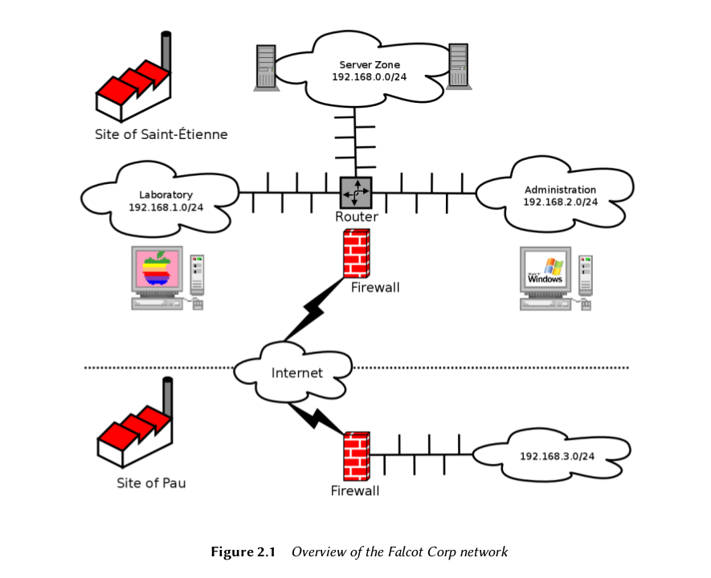

## The Goals ##

The computer system has had difficulty keeping up with the company's growth, so they are now
determined to completely redefine it to meet various goals established by management:

- modern, easily scalable infrastructure;
    
- reducing cost of software licenses thanks to use of Open Source software;

- installation of an e-commerce website, possibly B2B (business to business, i.e. linking of
information systems between different companies, such as a supplier and its clients);

- significant improvement in security to better protect industrial secrets related to new
products.

## Master Plan ##

- With your collaboration, IT management has conducted a slightly more extensive study, iden-
tifying some constraints and defining a plan for migration to the chosen Open Source system,
Debian.

- A significant constraint identified is that the accounting department uses specific software,
which only runs on Microsoft WindowsTM. The laboratory, for its part, uses computer aided
design software that runs on MacOS X

- The switch to Debian will be gradual; a small business, with limited means, can not change
everything overnight. For starters, the IT staff must be trained in Debian administration. The
servers will then be converted, starting with the network infrastructure (routers, firewalls, etc.)
followed by the user services (file sharing, Web, SMTP, etc.). Then the office computers will be
gradually migrated to Debian, for each department to be trained (internally) during the deploy-
ment of the new system.

- The switch to Debian will be gradual; a small business, with limited means, can not change
everything overnight. For starters, the IT staff must be trained in Debian administration. The
servers will then be converted, starting with the network infrastructure (routers, firewalls, etc.)
followed by the user services (file sharing, Web, SMTP, etc.). Then the office computers will be
gradually migrated to Debian, for each department to be trained (internally) during the deploy-
ment of the new system.

## Why a GNU/Linux Distribution? ##

- Total cost of ownership => opensource
- the advantage of linux between BSD and linux:

    Pragmatism indicates, however, the choice
of a Linux system since, its installed base and popularity are both very significant and have
numerous positive consequences. Consequent to this popularity, it is easier to find qualified
personnel to administer Linux machines than technicians experienced with BSD. Furthermore,
Linux adapts to newer hardware faster than BSD (although they are often neck and neck in this
race). Finally, Linux distributions are often more adapted to user-friendly graphical user inter-
faces, indispensable for beginners during migration of all office machines to a new system.

## Why the Debian Distribution? ##

- Commercial and Community Driven Distributions

    - It is a community distribution, with development ensured independently from any com-
    mercial constraints; its objectives are, thus, essentially of a technical nature, which seem
    to favor the overall quality of the product.
    
    - Of all community distributions, it is the most significant from any perspective: in num-
    ber of contributors, number of software packages available, and years of continuous ex-
    istence. The size of its community is an incontestable witness to its continuity.
    
    - Statistically, new versions are released every 18 to 24 months, a schedule which is agree-
    able to administrators.
    
    - A survey of several French service companies specialized in free software has shown that
all of them provide technical assistance for Debian; it is also, for many of them, their
chosen distribution, internally. This diversity of potential providers is a major asset for
Falcot Corp's independence.
    - Finally, Debian is available on a multitude of architectures, including Sparc; it will, thus,
be possible to install it on Falcot Corp's several Sun servers.