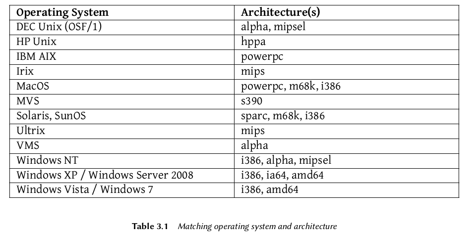

## Coexistence in Heterogeneous Environments ##

- Integration with windows machines

    - **Samba's SMB/CIFS** support ensures excellent communication within a Windows context. It
shares files and print queues to Windows clients and includes software that allow a Linux ma-
chine to use resources available on Windows servers.

- Integration with Mac OS machines

    - **Netatalk** is a program which uses the Appletalk protocol (running on a Linux kernel) and allows
Debian to interface with a Mac OS network. It ensures the operation of the file server and print
queues, as well as time server (clock synchronization). Its router function allows interconnec-
tion with Appletalk networks.

- Integration with other Linux/Unix Machines

    - **NFS and NIS**, both included, guarantee interaction with Unix systems. NFS ensures file
server functionality, while NIS creates user directories. The BSD printing layer, used by most
Unix systems, also allows sharing of print queues.

## How to Migration ##

- In order to guarantee continuity of the services, each computer migration must be planned
and executed according to the plan. Whatever the operating system used, this principle never
changes.

    - Survey and Identify Services
    
        As simple as it seems, this step is essential. A serious administrator truly knows the principal roles of each server, but such roles can change, and sometimes experienced users may have
installed “wild” services. Knowing that they exist will at least allow you to decide what to do
with them, rather than delete them haphazardly.

        For this purpose, it is wise to inform your users of the project before migrating the server. To involve them in the project, it may be useful to install the most common free software programs
on their desktops prior to migration, which they will come across again after the migration to
Debian; OpenOffice.org and the Mozilla suite are the best examples here.
    
    - **Network and Process**
    
        - The **nmap** tool (in the package with the same name) will quickly identify Internet services hosted by a network connected machine without even requiring to log in to it. Simply call the following
command on another machine connected to the same network:

            $nmap mirlaine
            
                Starting Nmap 5.00 ( http://nmap.org ) at 2010-07-29 16:36 CET

                Interesting ports on mirlaine (192.168.1.99):

                    Not shown: 1694 closed ports
                    PORT
                    STATE SERVICE
                    22/tcp open ssh
                    79/tcp open finger
                    111/tcp open rpcbind
                    Nmap done: 1 IP address (1 host up) scanned in 0.19 seconds
                        
        - **netstat -tupan** command will show the list of active or pending TCP sessions, as well UDP ports on which running programs are listening. This facilitates identification of services offered on the network.
        
        - Some network commands may work either with IPv4 (the default usually) or with IPv6. This is especially the case with the nmap and netstat commands, but also others, **such as route or ip** . The convention is that this behavior is enabled by the -6 command-line option. 
        
    
        - The command **ps auxw** displays a list of all processes with their user identity.
        
    
        - **who** command, which gives a list of logged in users
        
        - **crontabs** (tables listing automatic actions scheduled by users) will often provide interesting information on functions fulfilled by the server
    
 
    - In any case, it is essential to backup your servers: this allows recovery of information after the fact, when users will report specific problems due to the migration.
    
    - **Backing up the Configuration**
    
        - It is wise to retain the configuration of every service identified in order to be able to install the equivalent on the updated server. The strict minimum is to print the configuration files and make a backup copy of them.

        - For Unix machines, the configuration files are usually found in **/etc/** , but they may be located in a sub-directory of **/usr/local/** . This is the case if a program has been installed from sources, rather than with a package. One may also find them, in some cases, under **/opt/**.
For data managing services (such as databases), it is strongly recommended to export them to
a standard format that will be easily imported by the new software. Such a format is usually in
text mode and documented; it may be, for example, an SQL dump for a database, or an LDIF file
for an LDAP server.
    
        - For data managing services (such as databases), **it is strongly recommended to export them to a standard format that will be easily imported by the new software.Such a format is usually in
text mode and documented; it may be, for example, an SQL dump for a database, or an LDIF file
for an LDAP server.** 

- Taking over an existing Debian Server

    - check is **/etc/debian_version**, which usually contains the version number for installed debian system.    

    - the **`apt-show-versions`** program checks the list of package installed and identified the versions available. **aptitude** can also be used for these tasks, albeit in a less systematic manner.
   
     - a glance at the **/etc/apt/sources.list** file will show where the installed Debian package likely came fome. If many unknown sources appear, the administrator may choose to com-
pletely reinstall the computer's system to ensure optimal compatibility with the software pro-
vided by Debian.

    - `sources.list` file is often a good indicator : the majority of administrators keep, at least in comments, the list of prior APT sources used. the list of prior APT sources used. But you should not forget that sources used in the past might have been deleted, and that some random packages grabbed on the internat might have been manually installed(with the dpkg command). In this case, the machine is misleading in its appearance of "standard" Debian. This is why you should pay attention to any indication that will give away the presence of external packages(appearance of deb files in unusual directories, package version numbers with a special suffix indicating that it orginated from outside the debian project, such as ubuntu or ximian. etc.)     
    
    - Likewise, it is interesting to analyze the contents of the directory **/usr/local**, intended to contain programs compiled and installed manually. Listing software installed in this manner is intructive, since this raises questions on the reasons for not using the corresponsing Debian package, if such a package exists.
    
            cruft : 
            
                The Cruft package proposes to list the available files that are not owned by any
            packge. It has some filters(more or less effective, and more and less up or date), 
            to avoid reporting some legitimate files(files generated by Debian packages, or
            generated configuration files not managed by dpkg, etc)
            
            Be careful not bindly delete everything that cuft might list!      

                
- installing Debian

    - operating system and architecture
    
     
    
    
    - Installing and Configuring the Selected Services
    
    
       

   

  

