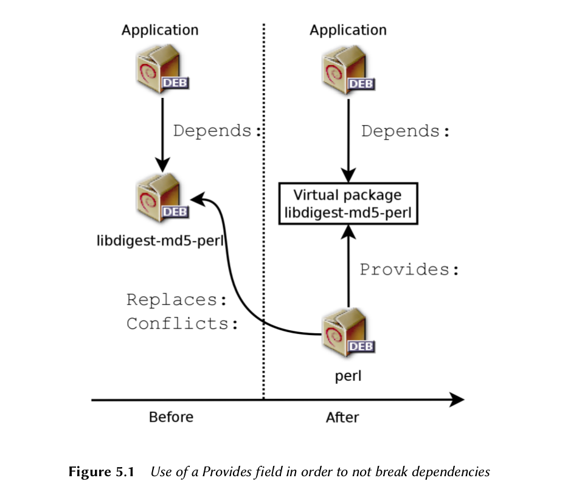

As a Debian system administrator, you will routinely handle .deb packages, since they contain consistent functional units(applications, document, etc), whose installation and maintenance they facilitate. It is therefore a good idea to know what they are and how to use them.

This chapter describes the structure and contents of "binary" and "source" package. The former are .deb fiels, directly usable by **dpkg**, while the latter contain the program source code, as well as intructions for building binary package.

## Structure of a Binary Package ##

- The Debian package format is designed so that its content may be extracted on any Unix system that has classic commands ar, tar, and gzip. This seemingly trivial property is important for portability and disaster recovery.

- **when you mistakenly deleted the dpkg program. if you know format of package, you can download the **.deb** file of the dpkg package and install it manually.**

- **dpkg, apt and ar**

    dpkg is the program that handles .deb files, notably extracting, analyzing, and unpacking them.
    
    
    APT is a group of programs that allows the execution of higher-level modification to the system: installing or removing a package(while keeping depencies statified), updating the system, listing the available packages. etc.
    
    As for the ar program, it allows handlings files of the same name, **ar t archive**
displays the list of files contained in such an archive, **ar x archive** extracts
the files from the archive into the current working directory, **ar d archive
file** deletes a file from the archive, etc. Its man page (ar(1)) documents its
many other operations. ar is a very rudimentary tool that a Unix administra-
tor would only use on rare occasions, but admins routinely use **tar** , a more
envolved archive and file management program. This is why it is easy to restore
dpkg in the event of an erroneous deletion. You would only have to download
the Debian package and extract the content from the archive data.tar.gz in
the system's root ( / ):

        # ar x dpkg_1.15.8.5_i386.deb
        # tar -C / -p -xzf data.tar.gz
        
      
   - It can be confusing for beginners to find references to “ar(1)” in the literature.
This is generally a convenient means of referring to the man page entitled ar
in section 1.

        $ ar t dpkg_1.15.8.5_i386.deb
        debian-binary
        control.tar.gz
        data.tar.gz
        $ ar x dpkg_1.15.8.5_i386.deb
        $ ls
        control.tar.gz data.tar.gz debian-binary
        $ tar tzf data.tar.gz | head -15
        ./
        ./var/
        ./var/lib/
        ./var/lib/dpkg/
        ./var/lib/dpkg/updates/
        ./var/lib/dpkg/parts/
        ./var/lib/dpkg/info/
        ./var/lib/dpkg/alternatives/
        ./sbin/
        ./sbin/start-stop-daemon
        ./usr/
        ./usr/sbin/
        ./usr/sbin/install-info
        ./usr/bin/
        ./usr/bin/dpkg-split
        $ tar tzf control.tar.gz
        ./
        ./control
        ./preinst
        ./md5sums
        ./conffiles
        ./postrm
        ./postinst
        $ cat debian-binary
        2.0  
        
   - debian-binary : This is a text file which simply indicates the version of the .deb file used(in 2011: version 2.0)
   - control.tar.gz : This archive file contains all of the available meta-information. In it, package management tools find, among other things, the name and version of the pacakge. Some of this meta-information allows them to determine if it is possible to install or uninstall the programs inside, for example according to the list of packages already on the machine.
   
   - data.tar.gz : This archive file contains all of the files to be extracted from the package; this is where the executable files, documentation, etc. are all stored. some package may use other compression formats, in which case the file will be named differently(data.tar.bz2 for bzip2, data.tar.xz for XZ, data.tar.lzma for LZMA)
    
## Package Meta-Information ##

The Debian pacakge is not only an archive of files indented for installation. It is part of a larger whole, and it describes its relationship with other Debian packages(dependencies, conflicts, suggestions). It also provides scripts that enable the execution of commands at different stages in the packages' lifecycle(installation, removal, upgrades). These data used by the package management tools are not part of the packaged software, but are, within the package, what is called its "meta-information"(information about other information)

### Description : the control file ### 

This file uses a structure similar to email headers(as defined by RFC 2822)

- RFC is the abbreviation of “Request For Comments”. An RFC is generally a
technical document that describes what will become an Internet standard.
Before becoming standardized and frozen, these standards are submied for
public review (hence their name). The IETF (Internet Engineering Task Force)
decides on the evolution of the status of these documents (proposed standard,
dra standard, or standard).
RFC 2026 defines the process for standardization of Internet protocols.

    http://www.faqs.org/rfcs/rfc2026.html   
    
### Dependencies : the depends field ###

The dependencies are defined in the Depends field in the package header. This is a list of condi-
tions to be met for the package to work correctly — this information is used by tools such as apt
in order to install the required libraries, in their appropriate versions, that the program to be
installed depends on

        • << : less than;
        • <= : less than or equal to;
        • = : equal to (note, “ 2.6.1 ” is not equal to “ 2.6.1-1 ”);
        • >= : greater than or equal to;
        • >> : greater than.
        
   - comma(,) meanings "and", vertical bar('|') means "or", and Depends field does not tolerate parentheses.
   
             http://www.debian.org/doc/debian-policy/ch-relationships.html

    The dependencies system is a good mechanism for guaranteeing the operation of a program,
but it has another use with “meta-packages”. These are empty packages that only describe
dependencies. They facilitate the installation of a consistent group of programs preselected
by the meta-package maintainer; as such, apt-get install meta-package will automatically
install all of these programs using the meta-package's dependencies. The gnome, kde and linux-
image-2.6-686 packages are examples of meta-packages.

   - Pre-Depends, a more demanding Depends
   
        Pre-dependencies = > pre-install => dependencies => install 
        
    A pre-dependency is very demanding for apt , because it adds a strict con-
straint on the ordering of the packages to install. As such, pre-dependencies
are discouraged unless absolutely necessary. It is even recommended to con-
sult other developers on debian-devel@lists.debian.org before adding a pre-
dependency. It is generally possible to find another solution as a work-around.

   - Recommends, Suggests, and Enhances fields
    
    
    he Recommends and Suggests fields describe dependencies that are not com-
pulsory. The “recommended” dependencies, the most important, considerably
improve the functionality offered by the package but are not indispensable to
its operation. The “suggested” dependencies, of secondary importance, in-
dicate that certain packages may complement and increase their respective
utility, but it is perfectly reasonable to install one without the others.
You should always install the “recommended” packages, unless you know ex-
actly why you do not need them. Conversely, it is not necessary to install
“suggested” packages unless you know why you need them.
The Enhances field also describes a suggestion, but in a different context. It is
indeed located in the suggested package, and not in the package that benefits
from the suggestion. Its interest lies in that it is possible to add a suggestion
without having to modify the package that is concerned. Thus, all add-ons,
plug-ins, and other extensions of a program can then take place in the list of
suggestions related to the soware. Although it has existed for several years,
this last field is still largely ignored by programs such as apt-get or synaptic .
Its purpose is for a suggestion made by the Enhances field to appear to the
user in addition to the traditional suggestions — found in the Suggests field.

### Conflicts : The Conflics field ###

The conficts field indicates when a package cannnot be installed simultaneously with another. The most common reasons for this are that both packages include a file containing the same
name, or provide the same service on the same TCP port, or would hinder each other's operation.
will refuse to install a package if it triggers a conflict with an already installed package,
**except if the new package specifies that it will “replace” the installed packages**, in which case
dpkg will choose to replace the old package with the new one. apt-get always follows your
instructions: if you choose to install a new package, it will automatically offer to uninstall the
package that poses a problem.

### Incompatibilities: the Breaks Field ###

The Breaks field has an effect similar to that of the Conflicts field, but with a special meaning.
It signals that the installation of a package will “break” another package (or particular versions
of it). In general, this incompatibility between two packages is transitory, and the Breaks rela-
tionship specifically refers to the incompatible versions.

dpkg will refuse to install a package that breaks an already installed package, and apt-get will
try to resolve the problem by updating the package that would be broken to a newer version
(which is assumed to be fixed and, thus, compatible again).

This type of situation may occur in the case of updates without backwards compatibility: this is
the case if the new version no longer functions with the older version, and causes a 
in another program without making special provisions. The Breaks field prevents the user from
running into these problems.

### Provided Items: the Provided Field ###

This field introduces the very interesting concept of a “virtual package”. It has many roles, but
two are of particular importance. **The first role consists in using a virtual package to associate a
generic service with it (the package “provides” the service). The second indicates that a package
completely replaces another, and that for this purpose it can also satisfy the dependencies that
the other would satisfy.** It is thus possible to create a substitution package without having to
use the same package name.

   - Meta-package and virtual package 
    
    It is essential to clearly distinguish meta-packages from virtual packages. The
former are real packages (including real .deb files), whose only purpose is to
express dependencies.

    Virtual packages, however, do not exist physically; they are only a means of
identifying real packages based on common, logical criteria (service provided,
compatibility with a standard program or a pre-existing package, etc.).

   - **Providing a “Service”** Let us discuss the first case in greater detail with an example: all mail servers, such as postfix or sendmail are said to “provide” the mail-transport-agent virtual package. Thus, any package that needs this service to be functional (e.g. a mailing list manager, such as smartlist or sympa) simply states in its dependencies that it requires a mail-transport-agent instead of specifying a large yet incomplete list of possible solutions (e.g. postfix | sendmail | exim
| ... ). Furthermore, it is useless to install two mail servers on the same machine, which is why
each of these packages declares a conflict with the mail-transport-agent virtual package. The
conflict with itself is ignored by the system, but this technique will prohibit the installation of
two mail servers side by side.

   - List of virtual packages
   
    For virtual packages to be useful, everyone must agree on their name. This
is why they are standardized in the Debian Policy. The list includes among
others mail-transport-agent for mail servers, c-compiler for C programming
language compilers, www-browser for web browsers, httpd for web servers, ftp-
server for FTP servers, x-terminal-emulator for terminal emulators in graphical
mode ( xterm ), and x-window-manager for window managers.
The full list can be found on the Web, at

        The full list can be found on the Web, at
            http://www.debian.org/doc/packaging-manuals/
            virtual-package-names-list.txt
            
   - Interchangeability with Another Package
   
    The Provides field is again interesting when the
content of a package is included in a larger package. For example, the libdigest-md5-perl Perl
module was an optional module in Perl 5.6, and has been integrated as standard in Perl 5.8 (and
later versions, such as 5.10 present in Squeeze). As such, the package perl has since version 5.8
declared Provides:libdigest-md5-perl so that the dependencies on this package are met if the
user has Perl 5.8 or 5.10. The libdigest-md5-perl package itself has eventually been deleted, since
it no longer had any purpose when old Perl versions were removed.

    
    
    
    This feature is very useful, since it is never possible to anticipate the vagaries of development,
and it is necessary to be able to adjust to renaming, and other automatic replacement, of obso-
lete software.

    **Current Limitations** Virtual packages suffer from some troubling limitations, the most sig-
nificant of which being the absence of a version number. To return to the previous example,
a dependency such as Depends:libdigest-md5-perl (>=1.6) , despite the presence of Perl 5.10,
will never be considered as satisfied by the packaging system — while in fact it most likely is
satisfied. Unaware of this, the package system chooses the least risky option, assuming that the
versions do not match.

    **Virtual package versions** Although today virtual packages can't have versions, this will not necessarily always be the case. Indeed, apt is already able to manage the versions of virtual packages and it is likely that dpkg eventually will too. We will then be able to write fields such as Provides:libstorable-perl (=1.7) to indicate that a package provides the same functionality as libstorable-perl in its 1.7 version.
    
### Replacint Files : The Replace Field ###

The Replaces field indicates that the package contains files that are also present in another
package, but that the package is legitimately entitled to replace them. Without this specifi-
cation, dpkg fails, stating that it can not overwrite the files of another package (in fact, it is
possible to force it to do so with the --force-overwrite option). This allows identification of po-
tential problems and requires the maintainer to study the matter prior to choosing whether to
add such a field.

The use of this field is justified when package names change or when a package is included in
another. This also happens when the maintainer decides to distribute files differently among
various binary packages produced from the same source package: a replaced file no longer be-
longs to the old package, but only to the new one.

If all of the files in an installed package have been replaced, the package is considered to be
removed. Finally, this field also encourages dpkg to remove the replaced package where there
is a conflict.

### The Tag Filed ###
In the apt example above, we can see the presence of a field that we have
not yet described, the Tag field. This field does not describe a relationship
between packages, but is simply a way of categorizing a package in a thematic
taxonomy. This classification of packages according to several criteria (type
of interface, programming language, domain of application, etc.) is a recent
development in Debian. For this purpose, it is not yet integrated in all of
its tools; aptitude displays these tags, and allows them to be used as search
criteria. For those who are repelled by aptitude 's search criteria, the following
site allows navigation of the tag database:

    http://debtags.alioth.debian.org/   
    
## Configuraton Script ##
 
In addition to the control file, the control.tar.gz archive for each Debian package may contain a number of scripts, called by dpkg at different stages in the processing of a package. The Debian Policy describes the possible cases in detail, specifying the scripts called and the arguments that they receive. These sequences may be complicated, since if one of the scripts fails,
dpkg will try to return to a satisfactory state by canceling the installation or removal in progress
(insofar as it is possible).

- dpkg data directory

    All of the configuration scripts for installed packages are stored in the **/var/lib/dpkg/info/** directory, in the form of a file prefixed with the package's name. This directory also includes a file with the .list extension for each package, containing the list of files that belong to that package.

    The **/var/lib/dpkg/status** file contains a series of data blocks (in the format
of the famous mail headers, RFC 2822) describing the status of each pack-
age. The information from the control file of the installed packages is also
replicated there.

- In general, the **preinst** script is executed prior to installation of the package, while the **postinst** follows it. Likewise, **prerm** is invoked before removal of a package and **postrm** after-wards. **An update of a package is equivalent to removal of the previous version and installation
of the new one.**  **It is not possible to describe in detail all the possible scenarios here, but we will discuss the most common two: an installation/update and a removal.**

- Symbolic names of the scripts 

    The sequences described in this section call configuration scripts by specific
names, such as old-prerm or new-postinst . They are, respectively, the prerm
script contained in the old version of the package (installed before the update)
and the postinst script contained in the new version (installed by the update).

- State diagrams

    Manoj Srivastava made these diagrams explaining how the configuration
scripts are called by dpkg . Similar diagrams have also been developed by the
Debian Women project; they are a bit simpler to understand, but less com-
plete.

        http://people.debian.org/~srivasta/MaintainerScripts.html
        http://wiki.debian.org/MaintainerScripts

### Installation and Upgrade ###

Here is what happens during an installation(or an update):

- For an update, dpkg calls the **old-prerm** upgrade new-version.
- Still an update, dpkg then executes **new-preinst** upgrade old-version; for a first installation, it executes new-preinst install. It may add the old version in the last parameter, if the package has already been installed and removed since (but not purged, the configuration files having been retained.)
- The new package files are then unpacked. If a file already exists, t is replaced, but a backup copy is temporarily made.
- For an update, dpkg executes **old-postrm** upgrade new-version.
- dpkg updates all of the internal data(file list, configuration scripts, etc.) and removes the backups of repalced files. This is the point of no return: dpkg no longer has access to all of the elements necessary to return to the previous state.
- dpkg will update the configuraton files, asking the user to decide if it is unable to auto-matically manage this task. The detail of this procedure are discussed in Secsion 5.2.3 “Checksums, List of Configuration Files” (page 87).
- Finally, dpkg configures the package by executing **new-postinst** configure last-ver
sion-configured .

### Pacakge Removal ###

Here is what happends during a package removal:

- dpkg calls **prerm remove**.
- dpkg remvoves all of the package's files, with the exeception of the configuration files and configuraton scripts.
- dpkg executes **postrm remove**. All of the configuration scripts, except postrm, are removed. **If the user has not used the "purge" option, the operates are completed there.**
- **For a complete purge of the package(command issued with dpkg --purge or dpkg -P), the configuration files are also deleted,** as well as a certain number of copies(*.dpkg-tmp, *.dpkg-old, *.dpkg-new) and temporary files; dpkg then executes postrm purge.

Purge, complete removal

- When a Debian package is removed, the configuration files are retained in order to facilitate possible re-installation. Likewise, the data generated by daemon(such as the content of an LDAP server directory, or the content of a database for an SQL server) are usually retained. 

### debconf ###

**The four scripts detailed below are complemented by a config script**, **provided by packages using debconf to acquire information from the user for configuraton. ** During installation, this script defines in detail the questions asked by debconf. **The responses are recorded in the debconf database for future reference.** The script is generally executed by apt prior to installing packages one by one in order to group all the questions  and ask them all to the user at the beginning of the process. **The pre- and post-installation scripts can then use this information to operate according to the user's wishes.**

debconf was created to resolve a recurring problem in Debian. All Debian
packages unable to function without a minimum of configuration used to ask
questions with calls to the echo and read commands in shell scripts such as
postinst and similar scripts.
But this also means that during a large installa-
tion or update the user must stay with their computer to respond to various
questions that may arise at any time. These manual interactions have now
been almost entirely dispensed with, thanks to the debconf tool.

debconf has many interesting features: it requires the developer to specify
user interaction; it allows localization of various strings of characters posted
(all translations are stored in the templates file describing the interactions);
it has different display models for presenting the questions to the user (text
mode, graphical mode, non-interactive); and it allows creation of a central
database of responses to share the same configuration with several comput-
ers... but the most important is that it is now possible to present all of the
questions in a block to the user prior to starting a long installation or up-
date process. The user can go about their business while the system handles
the installation on its own, without having to stay there staring at the screen
waiting for questions.

## Checksums, list of Configuraton Files ##

In addition to the configuration files mentioned in the previous secions, the control.tar.gz file in a Debian package contains others.

The first, **md5sums**, contains the list of digital finger-prints for all the package's files. Its main advantage is that it allows a tool such as debsums
(which we will study in Section 14.3.3.1, “Auditing Packages: debsums and its Limits” (page 385))
to check if these files have been modified since their installation.

**conffiles** lists package files that must be handled as configuration files. This involves a special handling, since conifguration files can be modified by the administrator, and the changes are usually preserved during a package update.

In effect, in this situation, dpkg behaves as intelligently as possible: if the standard configuration
file has not changed between the two versions, it does nothing. If, however, the file has changed,
it will try to update this file. Two cases are possible: either the administrator has not touched
this configuration file, in which case dpkg automatically installs the new version; or the file has
been modified, in which case dpkg asks the administrator which version they wish to use (the
old one with modifications, or the new one provided with the package). To assist in making this
decision, dpkg offers to display a “ diff ” that shows the difference between the two versions. If
the user chooses to retain the old version, the new one will be stored in the same location in a
file with the .dpkg-dist suffix. If the user chooses the new version, the old one is retained in a
file with the .dpkg-old suffix. Another available action consists of momentarily interrupting
dpkg to edit the file and attempt to re-instate the relevant modifications (previously identified
with diff ).

### Avoiding the configuration file questions ###

dpkg handles configuration file updates, but regularly interrupts these oper-
ations to ask for input from the administrator. This makes it less than enjoy-
able for those who wish to run updates in a non-interactive manner. This is
why this program offers options that allow the system to respond automati-
cally according to the same logic: --force-confold retains the old version of
the file; --force-confnew will use the new version of the file (these choices
are respected, even if the file has not been changed by the administrator,
which only rarely has the desired effect). Adding the --force-confdef op-
tion tells dpkg to use the default option when a choice is offered (in other
words, when the original configuration file has not been touched), and only
uses --force-confnew or --force-confold for other cases.

These options apply to dpkg , but most of the time the administrator will work
directly with the aptitude or apt-get programs. It is, thus, necessary to
know the syntax used to indicate the options to pass to the dpkg command
(their command line interfaces are very similar).

        # apt-get -o DPkg::Options::="--force-confdef" -o DPkg::options
         ::="--force-confold" dist-upgrade
         
These options can be stored directly in the configuration for the apt program,
rather than specified them each time on the command line. To do so, simply
write the following line in the /etc/apt/apt.conf.d/local file:

        DPkg::Options { "--force-confdef"; "--force-confold"; }

Including this option in the configuration file will allow it to also be used in
a graphical interface such as aptitude .

### Force dpkg to ask configuration file questions ###

The option, --force-confask requires dpkg to display the questions about the
configuration files, even in cases where they would not normally be necessary.
Thus, when reinstalling a package with this option, dpkg will ask the questions
again for all of the configuration files modified by the administrator. This is
very convenient, especially for reinstalling the original configuration file if it
has been deleted and no other copy is available: a normal re-installation won't
work, because dpkg considers removal as a form of legitimate modification,
and, thus, doesn't install the desired configuration file.

## Structure of a Source Package ##

### Format ###

a source package is usually comprised of three files, a **.desc**, a **.orig.tar.gz**, and a **.debian.tar.gz or .diff.gz**

- **.desc(debian source control)** file is a short text file containing an RFC 2822 header(just like the control file). describes the soure package and indicates which other files are part thereof.It is signed by its maintainer, which guarantees authenticity.  

    Note that the source package also has dependencies(Build-Depends) completely distinct from those of binary packages, since they indicate tools required to compile the software in question and contruct its binary package.
    
- **.orig.tar.gz is an archive containing the programe source code as provided original developer. Developers are asked to not modify this archive in order to be able to easily check the source and integrity of the file(by simple comparision with a checksum)** and to respect the wishes of some authors.

- **.debian.tar.gz** contains all of the modifications made by the Debian maintainer, especially the addition of a debian directory containing instructions to execute to contruct a Debian package.

    
### Different source packages formats ###

Originally there was only one source package format. This is the 1.0 for-
mat, which associates an .orig.tar.gz archive to a .diff.gz “debianization”
patch (there is also a variant, consisting of a single .tar.gz archive, which is
automatically used if no .orig.tar.gz is available).

Since Debian Squeeze, Debian developers have the option to use new for-
mats that correct many problems of the historical format. Format 3.0 (quilt)
can combine multiple upstream archives in the same source package: in ad-
dition to the usual .orig.tar.gz , supplementary .orig- component .tar.gz
archives. This is useful with soware that are distributed in several upstream
components but for which a single source package is desired. These archives
can also be compressed with bzip2 rather than gzip ( lzma and xz are sup-
ported by dpkg-source but not accepted into the official archive), which saves
disk space and network resources. Finally, the monolithic patch, .diff.gz is
replaced by a .debian.tar.gz archive containing the compiling instructions
and a set of upstream patches contributed by the package maintainer. These
last are recorded in a format compatible with quilt , a tool that facilitates the
management of a series of patches.

### Decompressing a source package ###

- If you have a source package, you can use the dpkg-source (from the dpkg-dev
package) to decompress it:

    **$ dpkg-source -x package_0.7-1.dsc**

- You can also use apt-get to download a source package and unpack it right
away. It requires that the appropriate **deb-src** lines be present in the **/etc/
apt/sources.list** file, however (for further details, see Section 6.1, “Filling
in the sources.list File” (page 102)). These are used to list the “sources” of
source packages (meaning the servers on which a group of source packages
are hosted).
    
    **$ apt-get source package**
    
### Usage within Debian ###

The source package is the foundation of everything in Debian. All Debian packages come from a
source package, and each modification in a Debian package is the consequence of a modification
made to the source package. The Debian maintainers work with the source package, knowing,
however, the consequences of their actions on the binary packages. The fruits of their labors
are found, thus, in the source packages available from Debian: you can easily go back and follow
everything.

When a new version of a package (source package and one or more binary packages) arrives on
the Debian server, the source package is the most important. Indeed, it will then be used by
a network of machines of different architectures for compilation of the various architectures
supported by Debian. The fact that the developer also sends one or more binary packages for
a given architecture (usually i386 or amd64) is relatively unimportant, since these could just as
well have been automatically generated.

## Manipulation Pacakges with dpkg ##

**dpkg** is the base command for handling Debian packages on the system. If you have **.deb** packges, it is dpkg that allows instlalation or ananysis of their contents. 

But this program only has partial view of the debian universe: it knows what is installed on the system, and whatever it is given on the command line, **but knows nothing of the other available packages. As such, it will fail if a dependency is not met. **
    
Tools such as apt-get, on the contrary, will create a list of dependencies to be installed as automatically as possible.

**dpkg should be seen as a system tool(backend), and apt-get as a tool closer to the user, which overcomes the previous limitations. These tools work together, each one with its particularities, suited to specific tasks.**

### Installing Packages ###

- dpkg -i man-db_2.5.7-4_i386.deb

        (Reading database... 284247 files and directories currently installed.)
        Preparing replacement man-db 2.5.7-3 (using .../man-db_2.5.7-4_i386.deb) ...
        Unpacking the man-db update...
        Configuring man-db (2.5.7-4) ...
        Updating database of manual pages ...
        Processing triggers for “doc-base”...
        Processing 1 modified documentation file(s)
        Recording documents with scrollkeeper ...

- The installation can also effected in two stagets:

    - the first stage : unpacking
    
        dpkg --unpack man-db_2.5.7-4_i386.deb
        
            (Reading database... 284247 files already installed.)
            Preparing replacement of man-db 2.5.7-3 (using .../man-db_2.5.7-4_i386.deb) ...
            Unpacking the man-db update...
            Processing triggers for “doc-base”...
            Treatment of a modified documentation file(s)
            Recording documents with scrollkeeper ...
    
    - the second stage : configuration
    
        dpkg --configure man-db
        
            Configuring man-db (2.5.7-4) ...
            Updating database of manual pages ...
           
- sometimes dpkg will fail to install a package and return an error:

    - if you know what to do, the **--force-*** options will ignore error and only issue a warning; 
    
    - The **dpkg --force-help** command give a complete list of these options.
    
    - The **dpkg --force-overwrite** tells dpkg to ignore this error and overwrite the file.
    
    - While there are many available **--force--** options, only **--force-overwrite** is likely to be used regularly.
    

- The **--force-*** options can lead to a system where the APT family of commands will refuse to function. Because of an inconsistent system from the point view of dependencies.

    In this case, if they want to be able to continue to use apt-
get or aptitude , they must edit /var/lib/dpkg/status to delete/modify the
dependency, or conflict, that they chose to override.

    **This manipulation is an ugly hack, and should never be used,** except in the
most extreme case of necessity. Quite frequently, a more fitting solution is to
recompile the package that's causing the problem (see Section 15.1, “Rebuild-
ing a Package from its Sources” (page 412)) or use a new version (potentially
corrected) from a site such as backports.debian.org (see Section 6.1.1.2, “The
Backports From backports.debian.org” (page 105)).

### Package Removal ###

- dpkg -r debian-cd

        (Reading database... 14170 files and directories already installed.) 
         Removing debian-cd ...

    all of the configuration files and scripts, log files (system logs) and other user data handled by the package remain.
    
    The reason for keeping them is to disable the program by uninstalling it, while preserving the option to reinstall it quickly and with the same configurations.
    
- dpkg -P debian-cd

        (Reading database... 13794 files and directories already installed.)
        Removing debian-cd ...
        Removing debian-cd configuration files...
        
### Other dpkg Features ###

- Option syntax

    Most options are available in the "long" version(one or more relavant words, preceded by a double dash) or a "short" version(a single letter, often the initial of one word from the long version, and preceded by a signle dash). **This convention is so common that it is a POSIX standard.**

    - **--listfiles package(or -L), which lists the files installed by this package;**
    
    - **--search file(or -S), which finds the package from which files comes;**
    
    - **--status package(or -s), which displays the headers of an installed package;**
    
    - **--list (or -l), which diplays the list of packages known to the system and their installation status;**
    
    - **--contents file.deb(or -c), which lists the files in the Debian package specified;**
    
    - **--info files.deb(or -I), which diplays the headers of the debian package;**

- Comparision of versions

        dpkg --compare-versions 1.2-3 gt 1.1-4
        echo $?
        0
        dpkg --compare-versions 1.2-3 lt 1.1-4
        echo $?
        1
        dpkg --compare-versions 2.6.0pre3-1 lt 2.6.0-1
        echo $?
        1
        
    Note the unexpected failure of the last comparision: for dpkg, pre, usually denoting a pre-release, has no particular meaning, and this program compares the alphabetic characters in the same way as the numeber(a<b<c ...), in alphabetical order. This is why it considers "0pre3" to be greater than "0". **When we want a packages' versoin number to indicate that is a pre-release, we use the tilde character, "~".**
    
        $ dpkg --compare-versions 2.6.0~pre3-1 lt 2.6.0-1
        $ echo $?
        0
        
### dpkg's log file ###

- /var/log/dpkg.log

    This log is extremely verbose, since it details every one of the stages through which packages handled by dpkg go.
    

## Coexistence with Other packaging Systems ##

Debian packages are not the only software packages used in the free software world. The main competitor is the RPM format for Red Hat Linux and its many derivatives. It is common for software provided by third parties to be offered as RPM packages rather than Debian.

RPM uses own database, separate from those of native software (such as dpkg ). This is why it is not
possible to ensure a stable coexistence of two packaging systems.

On the other hand, the **alien utility** can convert RPM packages into Debian packages, and vice
versa.

        $ fakeroot alien --to-deb phpMyAdmin-2.0.5-2.noarch.rpm
        phpmyadmin_2.0.5-2_all.deb generated
        $ ls -s phpmyadmin_2.0.5-2_all.deb
        64 phpmyadmin_2.0.5-2_all.deb

- Note : The pacakge generated by **alien utility** don't have any infromation on dependencies. The administorator must manually ensure that the converted package will function corerectly.

- Looking at the man page for the alien command, you will also note that this program also handles other packaging formats, especially those from the Slackware distribution (they are a
simple tar.gz archive). 