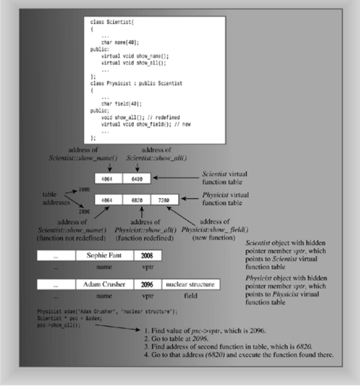
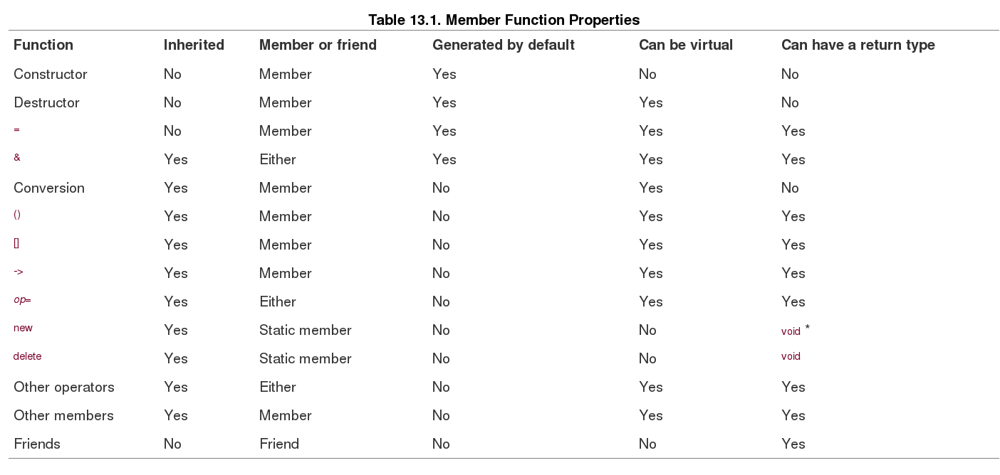

Inheritance models the is-a relationship

## Virtual Function ##

### Feature ###

- If you don't use the keyword virutal, the program chooses a method based on the reference type or pointer type. 
- If you do use the keyword virtual, the program chooses a method based on the type of object the reference or pointer refers to.

### The Need for Virtual Destructors ###

- The code using `delete` to free objects allocated by `new` illustrates why the base class should have a virtual destructor, **even if no destructor appears to be needed. If the destructors are not virtual, then just the destructor corresponding to the pointer type is called.**, even in the pointer points to a BrassPlus object,  **if the destructors are virtual, the destructor corresponding to the object type is called.  So if a pointer points to a BrassPlus object, the BrassPlus destructor is called.**

## Dynamic Binding and Static Binding ##

- Which block of executable code gets used when a program calls a function? The compiler has the responsibility of answering this question. Interpreting a function call in the source code as executing a particular block of function code **is termed binding** the function name. 

- binding that takes place during compilation is called **static binding (or early binding)**. 

- the decision of which function to use can't be made at compile time because the compiler doesn't know **which kind of object** the user is going to choose to make. Therefore, the compiler has to generate code that allows the correct **virtual method** to be selected as the program runs; this is called **dynamic binding (or late binding)**.

### Why Two Kinds of Binding ###

- Because dynamic binding allows you to redefine class methods while static binding makes a partial botch of it, why have static binding at all? There are two reasons: **efficiency and a conceptual model.**

- efficiency : Stroustrup says one of the guiding principles of C++ is that you shouldn't have to pay (in memory usage or processing time) for those features you don't use. Go to virtual functions only if your program design needs them.

- conceptual model : When you design a class, you may have member functions that you don't want redefined in derived classes. For example, the Brass::Balance() function, which returns the account balance, seems like a function that shouldn't be redefined. By making this function nonvirtual, you accomplish two things. First, you make it more efficient. **Second, you announce that it is your intention that this function not be redefined. That suggests the following rule of thumb.**

        If a method in a base class will be redefined in a derived class, make it virtual. 
        If the method should not be redefined, make it nonvirtual.
        
## How Virtual Functions Work ##

- C++ specifies how virtual functions should behave, but it leaves the implementation up to the compiler writer. You don't need to know the implementation method to use virtual functions, but seeing how it is done may help you understand the concepts better, so let's take a look.

### 实现设计 ###

- The usual way compilers handle virtual functions is to add a hidden member to each object. The hidden member holds a pointer to an array of function addresses. Such an array usually is termed **a virtual function table, or vtbl.** The table holds the addresses of the virtual functions declared for objects of that class. For example, an object of a base class will contain a pointer to a table of addresses of all the virtual functions for that class. An object of a derived class will contain a pointer to a separate table of addresses. If the derived class provides a new definition of a virtual function, the table holds the address of the new function. If the derived class doesn't redefine the virtual function, the table holds the address of the original version of the function. If the derived class defines a new function and makes it virtual, its address is added to the table (see Figure 13.5). Note that whether you define one or ten virtual functions for a class, you add just one address member to an object; it's the table size that varies.

### vtbl实现示例 ###

### 实现过程 ###

- When you call a virtual function, the program looks at the table address stored in an object and goes to the corresponding table of function addresses. If you use the first virtual function defined in the class declaration, the program will use the first function address in the array and execute the function having that address. If you use the third virtual function in the class declaration, the program will use the function whose address is in the third element of the array.

### 通过virtual函数总结动态绑定 ###

- Each object has its size increased by the amount needed to hold an address.
- For each class, the compiler creates a table (an array) of addresses of virtual functions.
- For each function call, there's an extra step of going to a table to look up an address.

    Keep in mind that although nonvirtual functions are slightly more efficient than virtual functions, they don't provide dynamic binding

## Virtual Things to Know ##

- Beginning a class method declaration with the keyword virtual in a base class makes the function virtual for the base class and all classes derived from the base class, including classes derived from the derived classes, and so on.

- If a virtual method is invoked by using a reference to an object or by a pointer to an object, the program will use the method defined for the object type rather than the method defined for the reference or pointer type. This is called dynamic, or late, binding. This behavior is important, for it's always valid for a base class pointer or reference to refer to an object of a derived type.

- If you're defining a class that will be used as a base class for inheritance, declare as virtual functions those class methods that may have to be redefined in derived classes.

### Constructors ###
    
- Constructors can't be virtual. A derived class doesn't inherit the base class constructors, so usually there's not much point to making them virtual, anyway.

### Destructors ###

- Destructors should be virtual unless a class isn't to be used as a base class. For example, suppose **Employee** is a base class and **Singer** is a derived class that adds a char * member that points to memory allocated by **new**. Then, when a **Singer** object expires, it's vital that the **~Singer()** destructor be called to free that memory.

### friends ###

- Friends can't be virtual functions because friends are not class members, and only members can be virtual functions. If this poses a problem for a design, you may be able to sidestep it by having the friend function use virtual member functions internally.

### No Redefinition ###

- If a derived class fails to redefine a virtual function, the class will use the base class version of the function. If a derived class is part of a long chain of derivations, it will use the most recently defined version of the virtual function. The exception is if the base versions are hidden, as described next.

### Redefinition Hides Methods ###

- Suppose you create something like the following:

            class Dwelling
            
            {
            
            public:
            
                  virtual void showperks(int a) const;
            
            ...
            
            };
            
            class Hovel : public Dwelling
            
            {
            
            {
            
            public:
            
                  void showperks();
            
            ...
            
            };
        
- This causes a problem. You may get a compiler warning similar to the following:    

            Warning: Hovel::showperks(void) hides Dwelling::showperks(int)

- Or perhaps you won't get a warning. Either way, the code has the following implications:

            Hovel trump;
    
            trump.showperks();      // valid
            
            trump.showperks(5);     // invalid
        
- The new definition defines a **showperks()** that takes no arguments. Rather than resulting in two overloaded versions of the function, this redefinition `hides` the base class version that takes an int argument. In short, redefining inherited methods is not a variation of overloading. If you redefine a function in a derived class, it doesn't just override the base class declaration with the same function signature. Instead, it hides all base class methods of the same name, regardless of the argument signatures.

- This fact of life leads to a couple of rules of thumb. First, **if you redefine an inherited method, make sure you match the original prototype exactly**. One exception is that a return type that is a reference or pointer to a base class can be replaced by a reference or pointer to the derived class. (This exception is new, and not all compilers recognize it yet. Also, note that this exception applies only to return values, not to arguments.) Second, **if the base class declaration is overloaded, redefine all the base class versions in the derived class**:

            class Dwelling
            
            {
            
            public:
            
            // three overloaded showperks()
            
                  virtual void showperks(int a) const;
            
                  virtual void showperks(double x) const;
            
                  virtual void showperks() const;
            
                  ...
            
            };
            
            class Hovel : public Dwelling
            
            {
            
            public:
            
            // three redefined showperks()
            
                  void showperks(int a) const;
            
                  void showperks(double x) const;
            
                  void showperks() const;
            
                  ...
            
            };
            
- if you redefine just one version, the other two become hidden and cannot be used by objects of the derived class. Note that if no change is needed, the redefinition can simply call the base-class version.

## Access Control-protected ##

- **So members in the protected category behave like private members as far as the outside world is concerned but behave like public members as far as derived classes are concerned.**

- For example, suppose the Brass class declared the balance member as protected:

            class Brass
            
            {
            
            protected:
            
                double balance;
            
            ...
            
            };
            
- Then the BrassPlus class could access balance directly without using Brass methods. For example, the core of BrassPlus::Withdraw() could be written this way:

            void BrassPlus::Withdraw(double amt)
            {
            
                if (amt < 0)
            
                    cout << "Negative deposit not allowed; "
            
                         << "withdrawal canceled.\n";
            
                else if (amt <= balance)       // access balance directly
            
                    balance -= amt;
            
                else if ( amt <= balance + maxLoan - owesBank)
            
                {
            
                    double advance = amt - balance;
            
                    owesBank += advance * (1.0 + rate);
            
                    cout << "Bank advance: $" << advance << endl;
            
                    cout << "Finance charge: $" << advance * rate << endl;
            
                    Deposit(advance);
            
                    balance -= amt;
            
                }
            
                else
            
                    cout << "Credit limit exceeded. Transaction cancelled.\ n";
            
            }
            

- Prefer private to protected access control for class data members, and use base-class methods to provide derived classes access to base-class data. **However, protected access control can be quite useful for member functions, giving derived classes access to internal functions that are not available publicly.**

## Abstract Base Class ##

- In short, an ABC describes an interface using **a least one pure virtual function**, and classes derived from an ABC use regular virtual functions to implement the interface in terms of the properties of the particular derived class.

            // Abstract Base Class
            class AcctABC
            
            {
            
            private:
            
                enum { MAX = 35};
            
                char fullName[MAX];
            
                long acctNum;
            
                double balance;
            
            protected:
            
                const char * FullName() const {return fullName;}
            
                long AcctNum() const {return acctNum;}
            
                ios_base::fmtflags SetFormat() const;
            
            public: 
            
                AcctABC(const char *s = "Nullbody", long an = -1,
            
                            double bal = 0.0);
            
                void Deposit(double amt) ;
            
                virtual void Withdraw(double amt) = 0; // pure virtual function
            
                double Balance() const {return balance;};
            
                virtual void ViewAcct() const = 0;     // pure virtual function
            
                virtual ~AcctABC() {}
            
            };
          
### Comments ###

- The abstract base class methodology is a much more systematic, disciplined way to approach inheritance than the more ad hoc, spur of the moment approach used by the RatedPlayer example. Before designing an abstract base class, you first have to develop a model of what classes are needed to represent a programming problem and how they relate to one another. **One school of thought holds that if you design an inheritance hierarchy of classes, the only concrete classes(那些产生具体对象的类被称为concrete classes) should be those that never serve as a base class. This approach does tend to produce cleaner designs with fewer complications.**

### Real World Note: Enforcing Interface Rules with Abstract Base Classes ###

- One way of thinking about abstract base classes is to consider them an enforcement of interface. **The abstract base class demands that its pure virtual functions be overridden in any derived classes—forcing the derived class to obey the rules of interface the ABC has set.** This model is common in component-based programming paradigms, where the use of ABCs allows the **component designer** to create an "interface contract" where all components derived from the ABC are guaranteed to uphold at least the common functionality specified by the ABC.

## Inheritance and Dynamic Memory Allocation ##

- A derived class destructor automatically calls the base class constructor, so its own responsibility is to clean up after what the derived class constructors do.

            baseDMA::~baseDMA()  // takes care of baseDMA stuff
            
            {
            
               delete [] label;
            
            }
            
            
            
            hasDMA::~hasDMA()      // takes care of hasDMA stuff
            
            {
            
                delete [] style;
            
            }
        
- The new feature to note is how derived classes can make use of a friend to a base class.

    Being a friend to the hasDMA class gives this function access to the style member. But there's a problem: This function is not a friend to the baseDMA class, so how can it access the label and rating members? The answer is to **use the operator<<()** function that is a friend to the baseDMA class. The next problem is that because friends are not member functions, you can't use the scope resolution operator to indicate which function to use. The answer to this problem is to **use a type cast** so that prototype matching will select the correct function. Thus, the code type casts the type const hasDMA & parameter to a type const baseDMA & argument:
    
        ostream & operator<<(ostream & os, const hasDMA & hs)
        
        {
        
        //  typecast to match operator<<(ostream & , const baseDMA &)
        
            os << (const baseDMA &) hs;
        
            os << "Style: " << hs.style << endl;
        
            return os;
        
        }
        

## Class Design Review : 这儿很重要，总结了C++类设计需要注意的各个细节 ##

- C++ can be applied to a wide variety of programming problems, and you can't reduce class design to some paint-by-the-numbers routine. However, there are some guidelines that often apply, and this is as good a time as any to go over them, by reviewing and amplifying earlier discussions.

### Member Functions That the Compiler Generates for You ###

- As first discussed in Chapter 13, "Class Inheritance," the compiler automatically generates certain public member functions. The fact that it does suggests that these member functions are particularly important. Let's look again at some of them now.

#### The Default Constructor ####

- A default constructor is one with no arguments, or else one for which all the arguments have default arguments. If you don't define any constructors, the compiler defines a default constructor for you. It doesn't do anything, but it must exist for you to do certain things. For example, suppose Star is a class. You need a default constructor to do the following:

            Star rigel;        // create an object without explicit initialization
            
            Star pleiades[6];  // create an array of objects
    
- Also, if you write a derived class constructor without explicitly invoking a base class constructor in the member initializer list, the compiler will use the base class default constructor to construct the base class portion of the new object.

- If you do define a constructor of any kind, the compiler will not define a default constructor for you. In that case, it's up to you to provide a default constructor if one is needed.

- Note that one of the motivations for having constructors is to ensure that objects always are properly initialized. Also, if your class has any pointer members, they certainly should be initialized. Thus, it's a good idea to supply an explicit default constructor that initializes all class data members to reasonable values.

#### The Copy Constructor ####

- The copy constructor is a constructor that takes a constant reference to the class type as its argument. For example, the copy constructor for a Star class would have this prototype:

            Star(const Star &);

- The class copy constructor is used in the following situations:

    - When a new object is initialized to an object of the same class
    - When an object is passed to a function by value                                                                                                                                                                                                                                                                                                                                                                                                                                                                                                                                                                                                                                                                                                                                                                                                                                                                                                                                                                                                                                                                                                                                                                                                                                                                                                                                                                                                                                                                                                                                                                                                                                                                                                                                                                                                                                                                                                                                                                                                                                         
    - When a function returns an object by value
    - When the compiler generates a temporary object

- If your program doesn't use a copy constructor (explicitly or implicitly), the compiler provides a prototype, but not a function definition. Otherwise, the program defines a copy constructor that performs memberwise initialization. That is, each member of the new object is initialized to the value of the corresponding member of the original object.

- In some cases, memberwise initialization is undesirable. For example, member pointers initialized with **new** generally require that you institute deep copying, as with the baseDMA class example. Or a class may have a static variable that needs to be modified. In such cases, you need to define your own copy constructor.

#### The Assignment Operator ####

- The default assignment operator handles assigning one object to another of the same class. Don't confuse assignment with initialization. If the statement creates a new object, it's using initialization, and if it alters the value of an existing object, it's assignment:

            Star sirius;
            
            Star alpha = sirius;     // initialization (one notation)
            
            Star dogstar;
            
            dogstar = sirius;        // assignment
            
- if you need to define the copy constructor explicitly, you also need, for the same reasons, to define the assignment operator explicitly. The prototype for a Star class assignment operator is this:

            Star & Star::operator=(const Star &);
            
- Note that the assignment operator function returns a reference to a Star object. The baseDMA class shows a typical example of an explicit assignment operator function.

- The compiler doesn't generate assignment operators for assigning one type to another. Suppose you want to be able to assign a string to a Star object. One approach is to define such an operator explicitly:

            Star & Star::operator=(const char *) {...}
            
- A second approach is to rely upon a conversion function (see "Conversions" in the next section) to convert a string to a Star object and use the Star-to-Star assignment function. The first approach runs more quickly, but requires more code. The conversion function approach can lead to compiler-befuddling situations.

### Other Class Method Considerations ###

- There are several other points to keep in mind as you define a class. The following sections list some of these.

#### Constructors ####

- Constructors are different from other class methods in that they create new objects, while other methods are invoked by existing objects.

#### Destructors ####

- Remember to define an explicit destructor that deletes any memory allocated by **new** in the class constructors and takes care of any other special bookkeeping that destroying a class object requires. If the class is to be used as a base class, provide a **virtual** destructor even if the class doesn't require a constructor.

#### Conversions ####

- Any constructor that can be invoked with exactly one argument defines conversion from the argument type to the class type. For example, consider the following constructor prototypes for a Star class:

            Star(const char *);                       // converts char * to Star
            
            Star(const Spectral &, int members = 1); // converts Spectral to Star

- Conversion constructors get used, for example, when a convertible type is passed to a function defined as taking a class argument. For example, suppose you have the following:

            Star north;
            
            north = "polaris";

- The second statement would invoke the Star::operator=(const Star &) function, using Star::Star(const char *) to generate a Star object to be used as an argument for the assignment operator function. **This assumes that you haven't defined a (char *)-to-Star assignment operator.**

- Using **explicit** in the prototype for a one-argument constructor disables implicit conversions, but still allows explicit conversions:

            class Star
            
            {
            
            ...
            
            public:
            
                explicit Star(const char *);
            
            ...
            
            };
            
            Star north;
            
            north = "polaris";        // not allowed
            
            north = Star("polaris");  // allowed
            
- **To convert from a class object to some other type**, define a conversion function (Chapter 11, "Working with Classes"). A conversion function is a class member function with no arguments or declared return type that has the name of the type to be converted to. Despite having no declared return type, the function should return the desired conversion value. Here are some samples:

            Star::Star double() { ...}          // converts star to double
            
            Star::Star const char * () { ...}   // converts to const char
            
- You should be judicious with such functions, only using them if they make good sense. Also, with some class designs, having conversion functions increases the likelihood of writing ambiguous code. For example, suppose you had defined a double conversion for the vector type of Chapter 11, and suppose you had the following code:

            vector ius(6.0, 0.0);
            
            vector lux = ius + 20.2;        // ambiguous
            
- The compiler could convert ius to double and use double addition, or else convert 20.2 to vector (using one of the constructors) and use vector addition. Instead, it would do neither and inform you of an ambiguous construction.

### Passing an Object by Value Versus Passing a Reference ###

- In general, if you write a function using an object argument, **you should pass the object by reference rather than by value.** One reason for this is efficiency. Passing an object by value involves generating a temporary copy, which means calling the copy constructor and then later calling the destructor. Calling these functions takes time, and copying a large object can be quite a bit slower than passing a reference. If the function doesn't modify the object, declare the argument as a const reference.

- Another reason for passing objects by reference is that, in the case of inheritance using virtual functions, a function defined as accepting a base class reference argument can also be used successfully with derived classes, as you saw earlier in this chapter. Also see the discussion of virtual methods later this chapter.

### Returning an Object Versus Returning a Reference ###

- Some class methods return objects. You've probably noticed that some of these members return objects directly while others return references. Sometimes a method must return an object, but if it isn't necessary, you should use a reference instead. Let's look at this more closely.

- First, the only coding difference between returning an object directly and returning a reference is in the function prototype and header:

            Star nova1(const Star &);     // returns a Star object
            
            Star & nova2(const Star &);   // returns a reference to a Star   
            
- Next, the reason that you should return a reference rather than an object is that returning an object involves generating a temporary copy of the returned object. It's the copy that's made available to the calling program. Thus, returning an object involves the time cost of calling a copy constructor to generate the copy and of calling the destructor to get rid of the copy. Returning a reference saves time and memory use. Returning an object directly is analogous to passing an object by value: Both processes generate temporary copies. Similarly, returning a reference is analogous to passing an object by reference: Both the calling and the called function operate upon the same object.

- However, it's not always possible to return a reference. A function shouldn't return a reference to a temporary object created in the function, for the reference becomes invalid when the function terminates and the object disappears. In this case, the code should return an object in order to generate a copy that will be available to the calling program.

- As a rule of thumb, if a function returns a temporary object created in the function, don't use a reference. For example, the following method uses a constructor to create a new object, and it then returns a copy of that object:

            Vector Vector::operator+(const Vector & b) const
            
            {
            
                return Vector(x + b.x, y + b.y);
            
            }
 
- If a function returns an object that was passed to it via a reference or pointer, return the object by reference. For example, the following code returns, by reference, either the object that invokes the function or else the object passed as an argument:
 
            const Stock & Stock::topval(const Stock & s) const
            
            {
            
                if (s.total_val > total_val)
            
                   return s;           // argument object
            
                else
            
                   return *this;       // invoking object
            
            }
            
### Using const ###

- Be alert to opportunities to use **const**. You can use it to guarantee that a method doesn't modify an argument:

            Star::Star(const char * s) {...} // won't change the string to which s points
            
- You can use **const** to guarantee that a method won't modify the object that invokes it:

            void Star::show() const {...} // won't change invoking object
                
    Here const means const Star * this, where **this** points to the invoking object.
    

- Normally, a function that returns a reference can be on the left side of an assignment statement, which really means you can assign a value to the object referred to. But you can use **const** to ensure that a reference or pointer return value can't be used to modify data in an object:

            const Stock & Stock::topval(const Stock & s) const  
            {
            
                if (s.total_val > total_val)
            
                   return s;           // argument object
            
                else
            
                   return *this;       // invoking object
            }
            
    Here the method returns a reference either to **this** or to **s**. Because **this** and **s** are both declared **const**, the function is not allowed to change them, which means the returned reference also must be declared **const**.
    
- Note that if a function declares an argument as a reference or pointer to a **const**, it cannot pass along that argument to another function unless that function also guarantees not to change the argument.

### Public Inheritance Considerations ###

- Naturally, adding inheritance to a program brings in more things to keep in mind. Let's look at a few

#### The is-a Relationship ####

- Be guided by the **is-a relationship**. If your proposed derived class is not a particular kind of the base class, don't use public derivation. For example, don't derive a Brain class from a Programmer class. If you want to represent the belief that a programmer has a brain, use a Brain class object as a member of the Programmer class.

- In some cases the best approach may be to create an abstract data class with pure virtual functions and to derive other classes from it.

- Remember that one expression of the **is-a relationship** is that **a base class pointer can point to a derived class object** and that **a base class reference can refer to a derived class object** without an explicit type cast. Also remember that the reverse is not true; thus, you cannot have a derived class pointer or reference refer to a base class object without an explicit type cast. Depending upon the class declarations, such an explicit type cast (a downcast) may or may not make sense. (You might want to review Figure 13.4.)

#### What's Not Inherited ####

- **Constructors are not inherited**. However, derived class constructors typically use the member-initializer-list syntax to call upon base class constructors to construct **the base class portion** of a derived object. If the derived class constructor doesn't explicitly call a base constructor by using the member-initializer-list syntax, it will use the base class's default constructor. In an inheritance chain, each class can use a member initializer list to pass back information to its immediate base class.

- **Destructors are not inherited.** However, when an object is destroyed, the program first calls the derived destructor, and then the base destructor. If there is a default base class destructor, the compiler generates a default derived class destructor. **Generally speaking, if a class serves as a base class, its destructor should be virtual.**

#### The Assignment Operator ####

- **The assignment operator is not inherited.** The reason is simple. An inherited method has the same function signature in a derived class as it does in the base class. However, the assignment operator has a function signature that changes from class to class because it has a formal parameter that is the class type. The assignment operator does have some interesting properties that we'll look at next.

- The compiler automatically supplies every class with an assignment operator for assigning one object to another of the same class. The default, or implicit, version of this operator uses memberwise assignment, with each member of the target object being assigned the value of the corresponding member of the source object. However, if the object belongs to a derived class, **the compiler uses the base class assignment operator to handle assignment for the base class portion of the derived object. If you've explicitly provided an assignment operator for the base class, that operator is used. Similarly, if a class contains a member that is an object of another class, the assignment operator for that class is used for that member.**

- As you've seen several times, you need to provide an explicit assignment operator if class constructors use **new** to initialize pointers. Because C++ uses the base class assignment operator for the base part of derived objects, you don't need to redefine the assignment operator for a derived class unless it adds data members that require special care. For example, the baseDMA class defined assignment explicitly, but the derived lacksDMA class uses the implicit assignment operator generated for that class.

- Suppose, however, that a derived class does use **new**, and you have to provide an explicit assignment operator. The operator must provide for every member of the class, not just the new members. The hasDMA class illustrates how this can be done:

            hasDMA & hasDMA::operator=(const hasDMA & hs)
            
            {
            
                if (this == &hs)
            
                    return *this;
            
                baseDMA::operator=(hs);  // copy base portion
            
                style = new char[strlen(hs.style) + 1];
            
                strcpy(style, hs.style);
            
                return *this;
            
            }
            
- What about assigning a derived object to a base object? (Note: This is not the same as initializing a base class reference to a derived object.)

            Brass blips;                                                  // base class
            
            BrassPlus snips("Rafe Plosh", 91191,3993.19, 600.0, 0.12); // derived class
            
            blips = snips;                      // assign derived object to base object
            
    Which assignment operator is used? **Remember that the assignment statement is translated into a method invoked by the left-hand object**:
    
            blips.operator=(snips);   
            
- Here the **left-hand object** is a Brass object, so it invokes the Brass::operator=(const Brass &) function. The **is-a relationship** allows the Brass reference to refer to a derived class object, such as snips. **The assignment operator only deals with base class members**, so the maxLoan member and other BrassPlus members of snips are ignored in the assignment. In short, you can assign a derived object to a base object, and only the base class members are involved.   

- What about the reverse? Can you assign a base class object to a derived object?

            Brass gp("Griff Hexbait", 21234, 1200);   // base class

            BrassPlus temp;                           // derived class
            
            temp = gp;   // possible?
            
- Here the assignment statement would be translated as follows:

            temp.operator=(gp);
            
- The **left-hand object** is a BrassPlus object, so it invokes the BrassPlus::operator=(const BrassPlus &) function. **However, a derived class reference cannot automatically refer to a base object, so this code won't run unless there also is a conversion constructor**:

            BrassPlus(const Brass &);
            
    (It could be, as is the case for the BrassPlus class, that there is a constructor with additional arguments, provided they have default values.) In that case, the program will use this constructor to create a temporary BrassPlus object from gp, which will then be used as an argument to the assignment operator.

- Alternatively, you could define an assignment operator for assigning a base class to a derived class:

            BrassPlus & BrassPlus ::operator=(const Brass &) { ...}

    Here the types match the assignment statement exactly, and no type conversions are needed.
    
- In short, the answer to the question "Can you assign a base class object to a derived object?" **is "Maybe."** You can **if the derived class has a constructor that defines the conversion of a base class object to a derived class object.** And you can **if the derived class defines an assignment operator for assigning a base class object to a derived object.** If neither of these two conditions holds, then you can't make the assignment.

#### Private Versus Protected ####

- **Remember that protected members act like public members as far as a derived class is concerned, but like private members for the world at large.** A derived class can access protected members of a base class directly, but can access private members only via base class member functions. Thus, making base class members private offers more security, while making them protected simplifies coding and speeds up access. **Stroustrup feels that it's better to use private data members than protected data members, but that protected methods are useful.** (**Bjarne Stroustrup, The Design and Evolution of C++. Reading, MA: Addison-Wesley Publishing Company, 1994.**)

#### Virtual Methods ####

- When you design a base class, you have to decide whether to make class methods **virtual** or not. If you want a derived class to be able to redefine a method, define the method as **virtual** in the base class. This enables late, or dynamic, binding. If you don't want the method redefined, don't make it **virtual**. This doesn't prevent someone from redefining the method, but it should be interpreted as meaning that you don't want it redefined.

- Note that inappropriate code can circumvent dynamic binding. Consider, for example, the following two functions:

            void show(const Brass & rba)
            {
            
                rba.ViewAcct();
            
                cout << endl;
            
            }

            void inadequate(Brass ba) 
            {
            
                ba.ViewAcct();
            
                cout << endl;
            
            }

- **The first passes an object by reference, and the second passes an object by value**. Now suppose you use each with a derived class argument:

            BrassPlus buzz("Buzz Parsec", 00001111, 4300);
            
            show(buzz);
            
            inadequate(buzz);
            
- The show() function call results in the rba argument being a reference to the BrassPlus object buzz, so rba.ViewAcct() is interpreted as the BrassPlus version, as it should be. But in the inadequate() function, which passes an object by value, ba is a Brass object constructed by the Brass(const Brass &) constructor. (Automatic upcasting allows the constructor argument to refer to a BrassPlus object.) Thus, in inadequate(), ba.ViewAcct() is the Brass version, so only the Brass component of buzz is displayed.

#### Destructors ####

- As mentioned before, a base class destructor should be virtual. That way, when you delete a derived object via a base class pointer or reference to the object, the program uses the derived class destructor followed by the base class destructor rather than using only the base class destructor.

### Class Function Summary ###

- C++ class functions come in many variations. Some can be inherited, some can't. Some operator functions can be either member functions or friends, while others can only be member functions. Table 13.1, based on a similar table from the ARM (Annotated Reference Manual), summarizes these properties. In it, the notation op= stands for assignment operators of the form +=, *=, and so on. Note that the properties for the op= operators are no different from those of the "other operators" category. The reason for listing op= separately is to point out that these operators don't behave like the = operator.

