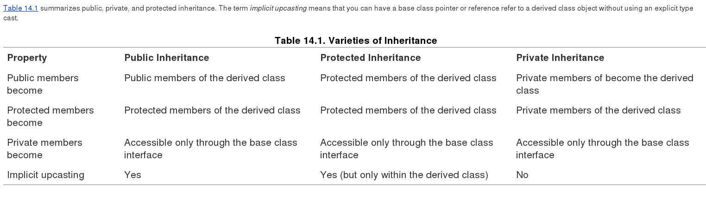
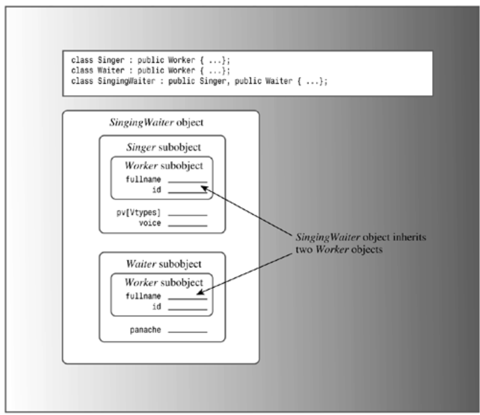
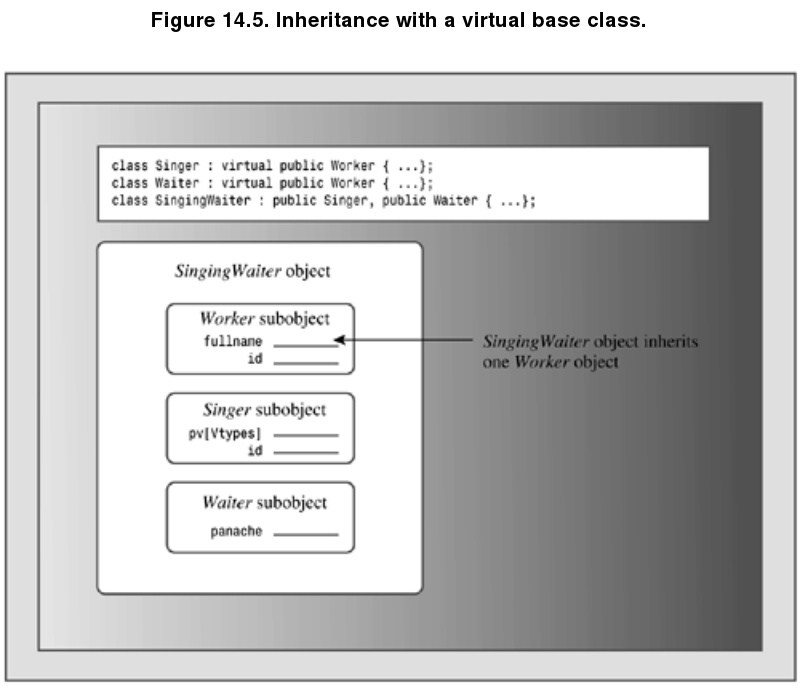

##Containment##

A student is not an array of quiz scores. What we have here is a **has-a** relationship. A student has a name, and a student has an array of quiz scores. The usual C++ technique for modeling **has-a** relationships is to use composition or **containment**; that is, to create a class composed of, or containing, members that are objects of another class. For example, we can begin a Student class declaration like this:

        class Student
        
        {
        
        private:
        
              String name;      // use a String object for name
        
              ArrayDb scores;   // use an ArrayDb object for scores
        
              ......
        
        };
        
- The compiler will select the **const version of operator** for use with **const ArrayDb objects** and use the other version for non-const ArrayDb objects.

-  when c++ initializes **member objects**, not inherited objects, it uses the **member names**, not the class names

- What happens if you don't use the initialization-list syntax? As with inherited components, 
  **C++ requires that all member objects be constructed before the rest of an object is constructed.**
  So if you **omit** the initialization list, C++ will use the **default constructors** defined for the member objects classes.
  
- When you have a member initializer list that initializes more than one item, the items are initialized in the order they **were declared**, not in the order in which they appear in the initializer list. For example, suppose we wrote a Student constructor this way
    
            Student(const char * str, const double * pd, int n)
               :scores(pd, n), name(str) {}

    The **name** member would still be initialized first because it is declared first in the class definition. The exact initialization order is not important for this example, but it would be important if the code used the value of one member as part of the initialization expression for a second member.
    
##Private Inheritance##

**C++ has a second means of implementing the has-a relationship—private inheritance.** With private inheritance, public and protected members of the base class become private members of the derived class. This means the methods of the base class do not become part of the public interface of the derived object. They can be used, however, inside the member functions of the derived class.

        class Student : private String, private ArrayDb
        
        {
        
            public:
            
               ......
        
        };
        
- Initializing Base Class Components

            Student(const char * str, const double * pd, int n)            
               :String(str), ArrayDb(pd, n) {}  // use class names for inheritance
               
- Use Base Class Methods

            double Student::Average() const
            {
                return ArrayDb::Average();
            }
            
    Omitting the **ArrayDb::** qualifier would have caused the compiler to interpret the Average() function call as Student::Average(), leading to a highly undesirable recursive function definition. **In short, the containment approach used object names to invoke a method, while private inheritance uses the class name and the scope resolution operator instead.**
    
    This technique of explicitly qualifying a function name with its class name doesn't work for **friend functions** because they don't belong to a class. However, you can use an explicit **type cast** to the base class to invoke the correct functions. For example, consider the following friend function definition:
    
            ostream & operator<<(ostream & os, const Student & stu)
            {    
                  os << "Scores for " << (const String &) stu << ":\n";   
                  os << (const ArrayDb &) stu;    
                  return os;   
            }

    The reference stu doesn't get converted automatically to a String or ArrayDb reference. The fundamental reason is this: **With private inheritance**, **a reference or pointer to a base class cannot be assigned a reference or pointer to a derived class without an explicit type cast.**
    
## Containment or Private Inheritance? ##

- Given that you can model a has-a relationship either with containment or with private inheritance, which should you use? **Most C++ programmers prefer containment.** First, it's easier to follow. When you look at the class declaration, you see explicitly named objects representing the contained classes, and your code can refer to these objects by name. Using inheritance makes the relationship appear more abstract. Second, inheritance can raise problems, particularly if a class inherits from more than one base class. You may have to deal with issues such as separate base classes having methods of the same name or of separate base classes sharing a common ancestor. All in all, you're less likely to run into trouble using containment. Also, containment allows you to include more than one subobject of the same class. If a class needs three String objects, you can declare three separate String members using the containment approach. But inheritance limits you to a single object. (It is difficult to tell objects apart when they all are nameless.)

- **However, private inheritance does offer features beyond those provided by containment.** Suppose, for example, that a class has protected members, which could either be data members or member functions. Such members are available to derived classes, but not to the world at large. If you include such a class in another class using composition, the new class is part of the world at large, not a derived class. Hence it can't **access protected members**. But using inheritance makes the new class a derived class, so it can access protected members.

- **Another situation** that calls for using private inheritance is if you want to **redefine virtual functions**. Again, this is a privilege accorded to a derived class but not to a containing class. With private inheritance, the redefined functions would be usable just within the class, not publicly

- **Summary**

    **In general, use containment to model a has-a relationship. Use private inheritance if the new class needs to access protected members in the original class or if it needs to redefine virtual functions.**

## Protected Inheritance ##

- Protected inheritance is a variation on private inheritance. It uses the keyword protected when listing a base class:

        class Student : protected String, protected ArrayDb {...};
        
    **With protected inheritance, public and protected members of a base class become protected members of the derived class.** As with private inheritance, the interface for the base class is available to the derived class, but not to the outside world. The main difference between private and protected inheritance occurs when you derive another class from the derived class.
    
- **With private inheritance**, this third-generation class doesn't get the internal use of the base class interface. That's because the public base class methods become private in the derived class, and private members and methods can't be directly accessed by the next level of derivation. **With protected inheritance**, public base methods become protected in the second generation and so are available internally to the next level of derivation.
    
       

##Redefining Access with using##

- Public members of a base class become protected or private when you use protected or private derivation. The last example showed how the derived class can **make a base class method available by having a derived class method use the base class method**:

            class Student : private String, private ArrayDb
            {
            public:
            
                using ArrayDb::Average;            
                ...
            };

- The using-declaration makes the ArrayDb::Average() method available as if it were a public Student method. That means you can drop the Student::Average() definition from studenti.cpp and still use Average() as before:

            cout << "average: " << ada[i].Average() << "\n";
        
- The difference is that now ArrayDb::Average() is called directly rather than through an intermediate call to Student::Average().

- Note that the using-declaration just uses the **member name—no parentheses, no function signatures, no return types**. For example, to make the ArrayDB operator method available to the Student class, you'd place the following **using-declaration** in the **public section of the Student class declaration**:

            using ArrayDb::operator[];
            
    **This would make both versions (const and non-const) available. The using-declaration approach works only for inheritance and not for containment.**
    
##Multiple Inheritance##

**Multiple inheritance can introduce new problems for the programmer. The two chief problems are inheriting different methods of the same name from two different base classes and inheriting multiple instances of a class via two or more related immediate base classes.**  

   
   

- 多态worker不能确定指向哪一个父类:

            SingingWaiter ed;
            
            Worker * pw = &ed;   // ambiguous
            
    
        
- Normally, such an assignment sets a base class pointer to the address of the base class object within the derived object. But ed contains two Worker objects, hence there are two addresses from which to choose. **You could specify which object by using a type cast(然而这个解决方案并不好)**:

            Worker * pw1 = (Waiter *) &ed;   // the Worker in Waiter
    
            Worker * pw2 = (Singer *) &ed;   // the Worker in Singer
            
###Virtual Base Class###

Virtual base classes allow an object derived from multiple bases that themselves share a common base to inherit just one object of that shared base class. For this example, you would make **Worker** a virtual base class to **Singer** and **Waiter** by using the keyword virtual in the class declarations (virtual and public can appear in either order):

        class Singer : virtual public Worker {...};
    
        class Waiter : public virtual Worker {...};
        
        class SingingWaiter: public Singer, public  Waiter {...};
        
Now a **SingingWaiter** object will contain a single copy of a **Worker** object. In essence, the inherited **Singer** and **Waiter** objects share a common Worker object instead of each bringing in its own copy (see Figure 14.5). Because **SingingWaiter** now contains but one Worker subobject, you can use polymorphism again.
        
   
   
   
#### New Constructor Rules ####

- This automatic passing of information doesn't work if **Worker** is a virtual base class. For example, consider the following possible constructor for the multiple inheritance example:

             SingingWaiter(const Worker & wk, int p = 0, int v = Singer::other)
                          : Waiter(wk,p), Singer(wk,v) {}  // flawed

- C++ **disables** the automatic passing of information through an intermediate class to a base class **if the base class is virtual**. Thus, the previous constructor will initialize the panache and voice members, but the information in the wk argument won't get to the Waiter subobject. However, the compiler must construct a base object component before constructing derived objects; in the previous case, it will use the default Worker constructor.

             SingingWaiter(const Worker & wk, int p = 0, int v = Singer::other)
                  : Worker(wk), Waiter(wk,p), Singer(wk,v) {}
                  
- **Caution** : If a class has an indirect virtual base class, a constructor for that class should explicitly invoke a constructor for the virtual base class unless all that is needed is the default constructor for the virtual base class.

#### Which Method? ####

Multiple inheritance can result in ambiguous function calls. For example, a **SingingWaiter** class could inherit two quite different **Show()** methods from a **Singer** class and a **Waiter** class.

        SingingWaiter newhire("Elise Hawks", 2005, 6, soprano);
        newhire.Show();  // ambiguous
                

- You can use the scope resolution operator to clairy what you mean(这不是好的解决方法).

            SingingWaiter newhire("Elise Hawks", 2005, 6, soprano);
            newhire.Singer::Show();  // use Singer version

- However, a better approach is to redefine Show() for SingingWaiter and to have it specify which Show() to use. For example, if you want a SingingWaiter object to use the Singer version.

            void SingingWaiter::Show()
            {
                Singer::Show();
                Singer::Show();
            }
            
    This displays a person's name and ID twice, for **Singer::Show()** and with **Waiter::Show()** both call **Worker::Show()**.
    
    **Define protected Data() method to solve it**:
    
            void Worker::Data() const
            {
                cout << "Name: " << fullname << "\n";
                cout << "Employee ID: " << id << "\n"; 
            }
            
            void Waiter::Data() const
            {
                cout << "Panache rating: " << panache << "\n";
            }
            
            void Singer::Data() const
            {
                cout << "Vocal range: " << pv[voice] << "\n";
            }
            
            void SingingWaiter::Data() const
            {
                Singer::Data();
                Waiter::Data();
            }
        
            void SingingWaiter::Show() const
            { 
                cout << "Category: singing waiter\n";
                Worker::Data();
                Data();
            }
            
#### Mixed Virtual and Nonvirtual Bases(难懂，可以先跳过) ####

Consider again the case of a derived class that inherits a base class by more than one route. If the base class is virtual, the derived class contains one subobject of the base class. If the base class is not virtual, the derived class contains multiple subobjects. What if there is a mixture? Suppose, for example, that class **B** is a virtual base class to classes **C** and **D** and a nonvirtual base class to classes **X** and **Y**. Furthermore, suppose class **M** is derived from **C**, **D**, **X**, and **Y**. In this case, class M contains one class B subobject for all the virtually derived ancestors (that is, classes C and D) and a separate class B subobject for each nonvirtual ancestor (that is, classes **X** and **Y**). So, all told, **it would contain three class B subobjects**. When a class inherits a particular base class through several virtual paths and several nonvirtual paths, the class has one base-class subobject to represent all the virtual paths and a separate base-class subobject to represent each nonvirtual path.

- Virtual Base Classes and Dominance

    Using virtual base classes alters how C++ resolves ambiguities. With nonvirtual base classes the rules are simple. If a class inherits two or more members (data or methods) of the same name from different classes, using that name without qualifying it with a class name is ambiguous. If virtual base classes are involved, however, such a use may or may not be ambiguous. In this case, if one name **dominates** all others, it can be used unambiguously without a qualifier.
    
    So how does one member name dominate another? **A name in a derived class dominates the same name in any ancestor class, direct or indirect**. For example, consider the following definitions:
    
            class B
            {
            
            public:
            
                  short q();
            
                  ...
            
            };
            
            class C : virtual public B
            
            {
            
            public:
            
                  long q();
            
                  int omb()
            
                  ...
            
            };
            
            class D : public C
            {
            
                  ...
            
            };
            
            class E : virtual public B
            
            {
            
            private:
            
                  int omb();
            
                  ...
            
            };
            
             
            class F:  public D, public E
            
            {
            
                 ...
            
            };
            
- Here the definition of q() in class C dominates the definition in class B because C is derived from B. Thus, methods in F can use q() to denote C::q(). On the other hand, neither definition of omb() dominates the other because neither C nor E is a base class to the other. Therefore, an attempt by F to use an unqualified omb() would be ambiguous.

- The virtual ambiguity rules pay no attention to access rules. That is, even though E::omb() is private and hence not directly accessible to class F, using omb() is ambiguous. Similarly, even if C::q() were private, it would dominate D::q(). In that case, you could call B::q() in class F, but an unqualified q() for that would refer to the inaccessible C::q().

#####Multiple Inheritance Synopsis###
The main change, and the reason for virtual base classes, is that a class that inherits from one or more instances of a virtual base class inherits just one base class object. Implementing this feature entails other requirements:

- A derived class with an indirect virtual base class should have its constructors invoke the indirect base class constructors directly, something which is illegal for indirect nonvirtual base classes.

- Name ambiguity is resolved by the dominance rule.

As you can see, multiple inheritance can introduce programming complexities. However, most of these complexities arise when a derived class inherits from the same base class by more than one route. **If you avoid that situation, about the only thing you need to watch for is qualifying inherited names when necessary.**

## Class Template ##

- C++'s class templates provide a better way to generate generic class declarations.

- Templates provide **parameterized** types, that is, the capability of passing a type name as an argument to a recipe for building a class or a function.

- C++'s Standard Template Library (STL), which Chapter 16 discusses in part, provides powerful and flexible template implementations of several container classes. This chapter will explore designs of a more elementary nature.

-  preface a template class with code of the following form:
        
            template <class Type>
            class Stack
            {      
                private:
                
                    enum {MAX = 10};    // constant specific to class
                
                    Type items[MAX];    // holds stack items
                
                    int top;            // index for top stack item
                
                public:
                
                    Stack();
                
                    bool isempty();
                
                    bool isfull();
                
                    bool push(const Type & item); // add item to stack
                
                    bool pop(Type & item);        // pop top into item
            };
            
    Using **class** here doesn't mean that **Type** must be a class; it just means that **Type** serves as a generic type specifier for which a real type will be substituted when the template is used.
    
            template <typename Type>  // newer choice
            
- Similarly, you can replace the class methods of the original class with template member functions. Each function heading will be prefaced with the same template announcement:

            bool Stack::push(const Item & item)
            {
            
                ...
            
            }
            
       becomes the following:
            
            
            template <class Type>                     // or template <typename Type>
            
            bool Stack<Type>::push(const Type & item)
            
            {
            
                ...
            
            }
            
            
- If you define a method within the class declaration (an inline definition), you can omit the template preface and the class qualifier.

- It's important to realize that these templates are not class and member function definitions. Rather, they are instructions to the C++ compiler about how to generate class and member function definitions. A particular actualization of a template, such as a stack class for handling **String** objects, is called an instantiation or specialization. Unless you have a compiler that has implemented the new **export** keyword, placing the template member functions in a separate implementation file won't work. Because the templates aren't functions, they can't be compiled separately. **Templates have to be used in conjunction with requests for particular instantiations of templates. The simplest way to make this work is to place all the template information in a header file and to include the header file in the file that will use the templates.**

            template <class Type>
            Stack<Type>::Stack()
            {
                top = 0;
            }

    If your compiler does implement the new **export** keyword, **you can place the template method definitions in a separate file providing you preface each definition with export**:
    
    
            export template <class Type>
            Stack<Type>::Stack()
            { 
                top = 0;
            }
            
            
- Let's begin with a simple array template that lets you specify an array size. One technique, which the last version of the Stack template used, is using a dynamic array within the class and a constructor argument to provide the number of elements. **Another approach is using a template argument to provide the size for a regular array**.  
 
            template <class T, int n>
            
            class ArrayTP
            
            {
            
                private:
                
                    T ar[n];
                
                public:  
                    ...
            }
            
- e keyword class (or, equivalently in this context, typename) identifies **T** as a type parameter, or **type argument**. The int identifies n as being an int type. This second kind of parameter, one which specifies a particular type instead of acting as a generic name for a type, is called a **non-type** or **expression argument**. Suppose you have the following declaration:

            ArrayTP<double, 12> eggweights;
            
    Expression arguments have some restrictions. An expression argument can be an integral type, an enumeration type, a reference, or a pointer. Thus, **double m** is ruled out, but **double & rm** and **double * pm** are allowed. Also, the template code can't alter the value of the argument or take its address. Thus, in the **ArrayTP** template, expressions such as n++ or &n would not be allowed. Also, when you instantiate a template, the value used for the expression argument should be a constant expression.
    
    This approach for sizing an array has one advantage over the constructor approach used in Stack. The constructor approach uses heap memory managed by new and delete, while the expression argument approach uses the memory stack maintained for automatic variables. This provides faster execution time, particularly if you have a lot of small arrays.
    
    The main drawback to the expression argument approach is that each array size generates its own template. That is, the declarations
    
            ArrayTP<double, 12> eggweights;
            ArrayTP(double, 13> donuts;         
    generate two separate class declarations. But the declarations
    
            Stack<int> eggs(12);
            Stack<int> dunkers(13);     
    generate just one class declaration, and the size information is passed to the constructor for that class
    
    **Another difference is that the constructor approach is more versatile because the array size is stored as a class member rather than being hard-coded into the definition.** This makes it possible, for example, to define assignment from an array of one size to an array of another size or to build a class that allows resizable arrays.
   
## Template Versatility ##

You can apply the same techniques to template classes as you do to regular classes. Template classes can serve as base classes, and they can be component classes. They can themselves be type arguments to other templates:

- class template:

            template <class T>
        
            class Array 
            {
            
                private:
                
                    T entry;
                
                    ...
            
            };
            

- Inheritance class template
    
            template <class Type>
            class GrowArray : public Array<Type> {...};  // inheritance
            
            
- class template as component
            
            template <class Tp>
            class Stack
            {
                   Array<Tp> ar;       // use an Array<> as a component
            
                  ...
            };
            
            ...
            
            Array < Stack<int> > asi;  // an array of stacks of int        
    In the last statement, you must separate the two > symbols by at least one whitespace character in order to avoid confusion with the >> operator.
    
- Using a Template Recursively

            ArrayTP< ArrayTP<int,5>, 10> twodee;    
            
- Using More Than One Type Parameter

            template <class T1, class T2>            
            class Pair
            {
                private:
                
                    T1 a;
                
                    T2 b;
                public:
                    T1 & first(const T1 & f);
                ...
            }
            
            template<class T1, class T2>
            T1 & Pair<T1,T2>::first(const T1 & f)
            {
                a = f;
                return a;
            }

- Default Type Template Parameters

            template <class T1, class T2 = int> class Topo {...};   
            
    This causes the compiler to use int for the type T2 if a value for T2 is omitted:
    
            Topo<double, double> m1; // T1 is double, T2 is double
        
            Topo<double> m2;         // T1 is double, T2 is int

                                 
## Template Specializations ##

- Implicit Instantiations

    The examples that you have seen so far used **implicit instantiations**. That is, they declare one or more objects indicating the desired type, and the compiler generates a specialized class definition using the recipe provided by the general template:

            ArrayTb<int, 100> stuff; // implicit instantiation                
        
    The compiler doesn't generate an implicit instantiation of the class until it needs an object:
    
            ArrayTb<double, 30> * pt;     // a pointer, no object needed yet
            pt = new ArrayTb<double, 30>; // now an object is needed
            
    The second statement causes the compiler to generate a class definition and also an object created according to that definition.
    
- Explicit Instantiations

    The compiler generates an explicit instantiation of a class declaration when you declare a class using the keyword **template** and indicating the desired type or types. The declaration should be in the same namespace as the template definition. For example, the declaration
    
           template class ArrayTb<String, 100>; // generate ArrayTB<String, 100> class
           
           
    declares ArrayTb<String, 100> to be a class. In this case the compiler generates the class definition, including method definitions, even though no object of the class has yet been created or mentioned. **Just as with the implicit instantiation, the general template is used as a guide to generate the specialization.**
    
- Explicit Specializations

            template <class T>
            class SortedArray
            
            {
            
                 ...// details omitted
            
            };
    
    Also, suppose the template uses the > operator to compare values. This works well for numbers. It will work if T represents a class type, too, provided that you've defined a T::operator>() method. But it won't work if T is a string represented by type char *. Actually, the template will work, but the strings will wind up sorted by address rather than alphabetically. What is needed is a class definition that uses strcmp() instead of >. In such a case, you can provide an explicit template specialization. This takes the form of a template defined for one specific type instead of for a general type. **When faced with the choice of a specialized template and a general template that both match an instantiation request, the compiler will use the specialized version.**
    
            template <> class Classname<specialized-type-name> { ... };
    
    Older compilers may only recognize the older form, which dispenses with the template <>:
    
            class Classname<specialized-type-name> { ... };
            
    To provide a **SortedArray** template specialized for the **char * type** using the new notation, you would use code like the following:
    
            template <> class SortedArray<char *>
            {
            
                 ...// details omitted
            
            };
            
    Here the implementation code would use **strcmp()** instead of **>** to compare array values. Now, requests for a **SortedArray** of **char *** will use this specialized definition instead of the more general template definition:
    
            SortedArray<int> scores;    // use general definition
            SortedArray<char *> dates;  // use specialized definition

## Partial Specializations ##

C++ also allows for **partial specializations**, which partially restrict the generality of a template. A partial specialization, for example, can provide a specific type for one of the type parameters

        // general template
        
        template <class T1, class T2> class Pair {...};
        
        // specialization with T2 set to int
        
        template <class T1> class Pair<T1, int> {...};
 
**The <> following the keyword template declares the type parameters that are still unspecialized.** So the second declaration specializes T2 to int but leaves T1 open. Note that specifying all the types leads to an empty bracket pair and a complete explicit specialization:       

        // specialization with T1 and T2 set to int
        
        template <> class Pair<int, int> {...};
        
The compiler uses the most specialized template if there is a choice:

        Pair<double, double> p1; // use general Pair template
        
        Pair<double, int> p2;    // use Pair<T1, int> partial specialization
        
        Pair<int, int> p3;       // use Pair<int, int> explicit specialization

Or you can partially specialize an existing template by providing a special version for pointe:

        template<class T>      // general version

        class Feeb { ... };
        
        template<class T*>    // pointer partial specialization
        
        class Feeb { ... };     // modified code
        
If you provide a non-pointer type, the compiler will use the general version; if you provide a pointer, the compiler will use the pointer specialization:
        
        Feeb<char> fb1;           // use general Feeb template, T is char

        Feeb<char *> fb2;         // use Feeb T* specialization, T is char
        
Without the partial specialization, the second declaration would have used the general template, interpreting **T** as type **char ***. With the partial specialization, it uses the specialized template, interpreting T as char. For example:

        // general template
        
        template <class T1, class T2, class T3> class Trio{...};
        
        // specialization with T3 set to T2
        
        template <class T1, class T2> class Trio<T1, T2, T2> {...};
        
        // specialization with T3 and T2 set to T1*
        
        template <class T1> class Trio<T1, T1*, T1*> {...};
 
Given these declarations, the compiler would make the following choices:
        
        Trio<int, short, char *> t1; // use general template
        
        Trio<int, short> t2; // use Trio<T1, T2, T2>
        
        Trio<char> t3; use Trio<T1, T1*, T1*>

## 由于考虑使用，接下来做简短总结：细节看character 14: Class Tempalte ##
## Member Templates ##

Another of the more recent additions to C++ template support is that a template can be a member of a structure, class, or template class. 

        // tempmemb.cpp -- template members
        #include <iostream>
        
        using namespace std;
         
        template <typename T>
        
        class beta
        
        {
        
        private:
        
            template <typename V>  // nested template class member
        
            class hold
        
            {
        
            private:
        
                V val;
        
            public:
        
                hold(V v  = 0) : val(v) {}
        
                void show() const { cout << val << endl; }
        
                V Value() const { return val; }
        
            };
        
            hold<T> q;           // template object
        
            hold<int> n;         // template object
        
        public:
        
            beta( T t, int i) : q(t), n(i) {}
        
            template<typename U>   // template method
        
            U blab(U u, T t) { return (n.Value() + q.Value()) * u / t; }
        
            void Show() const {q.show(); n.show();}
        
        };
        
        int main()
        
        {
        
            beta<double> guy(3.5, 3);
        
            guy.Show();
        
            cout << guy.blab(10, 2.3) << endl;
        
            cout << "Done\n";
        
            return 0; 
        
        }               

## Templates As Parameters ##

You've seen that a template can have type parameters, such as **typename T**, and **non-type** parameters, such as int n. **A template also can have a parameter that is itself a template**.

            template <typename T>
            
            class King {...}; 
            
            
            Crab<King> legs;
        
- The Crab declaration declares two objects:

            Thing<int> s1;
        
            Thing<double> s2;
        
- Code example

            // tempparm.cpp -- template template parameters
            
            #include <iostream>
            
            using namespace std;
            
            #include "stacktp.h"
            
            
            
            template <template <typename T> class Thing>
            
            class Crab
            
            {
            
            private:
            
                Thing<int> s1;       //使用Thing模板的int instantiation
            
                Thing<double> s2;    //使用Thing模板的double instantiation
            
            public:
            
                Crab() {};
            
                // assumes the thing class has push() and pop() members
            
                bool push(int a, double x) { return s1.push(a) && s2.push(x); }
            
                bool pop(int & a, double & x){ return s1.pop(a) && s2.pop(x); }
            
            };
            
            
## Template Classes and Friends ##

Template class declarations can have friends, too. We can classify friends of tempaltes into three categories:

- Nontemplate friends.

- Bound template friends, meaning the type of the firend is determined by the type of the class when a class is instantiated.

- Unbound template friedns, meaning that all specializations of the friend are firends to each specailization of the class.

#### Nontemplate Friend Functions to Template Classes ####

        template <class T>
        
        class HasFriend
        
        {
        
              friend void counts();     // friend to all HasFriend instantiations
        
              ...
        
        };
        
        // non-template friend to all HasFriend<T> classes
        void counts()
        
        {
        
            cout << "int count: " << HasFriend<int>::ct << endl;
        
            cout << "double count: " << HasFriend<double>::ct << endl;
        
        }
        

        
        friend void report(HasFriend &);   // possible?
        
**The answer is no**. The reason is that there is no such thing as a HasFriend object. There are only particular specializations, such as HasFriend<short>. To provide a template class argument, then, you have to indicate a specialization

        
        template <class T>
        
        class HasFriend
        
        {
        
            friend void report(HasFriend<T>&; // bound template friend
        
            ...
        
        };

Note that **report()** is not itself a template function; it just has a parameter that is a template. This means that you have to define explicit specializations for those friends you plan to use:

        void report(HasFriend<short> &) { ... };  // explicit specialization for short
        
        void report(HasFriend<int> &) { ... };    // explicit specialization for int
        
The HasFriend template has a static member ct. Note that this means that each particular specialization of the class has its own static member. The counts() method, which is a friend to all HasFriend specializations, reports the value of ct for two particular specializations: HasFriend<int> and HasFriend<double>. **The program also provides two report() functions, each of which is a friend to one particular HasFriend specialization.**

总结：感觉这种模式很不合理，需要手动为每一个模板的specialization创建一个friend函数(report函数)的定义,太low。

#### Bound Template Friend Functions to Template Classes ####

We can modify the last example by **making the friend functions templates themselves**. In particular, we'll set things up for bound template friends, so each specialization of a class gets a matching specialization for a friend. The technique is a bit more complex than for non- template friends and involves three steps.

- For the **first step**, declare each template function bfore the class definition.

            template <typename T> void counts();
            
            template <typename T> void report(T &);
            
- Next, **declare the templates again as friends inside the function**. These statements declare specializations based on the class template parameter type:  

            template <typename TT>
            
            class HasFriendT
            
            {
            
            ...
            
                friend void counts<TT>();
            
                friend void report<>(HasFriendT<TT> &);
            
            }; 
            
    The <> in the declarations identifies these as template specializations. In the case of report(), the <> can be left empty because the template type argument (HasFriendT<TT>) can be deduced from the function argument. You could, however, use report<HasFriendT<TT> >(HasFriendT<TT> &) instead. The counts() function, however, has no parameters, so you have to use the template argument syntax (<TT>) to indicate its specialization. Note, too, that TT is the parameter type for the HasFriendT class.         
    
- The third requirement the program must meet is to provide template definitions for the friends.

            // template friend functions definitions
            template <typename T>
            void counts()
            {
                cout << "template counts(): " << HasFriendT<T>::ct
            
                << endl;
            }

总结：该设计可以为模板的每一类specialization, 绑定创建一个对应类型的friend函数。大多数情况下已经适用，但是当friend函数需要访问同一模板的不同specialization时候，这个绑定依然不够灵活。
            
#### Unbound Template Friend Functions to Template Classes ####

The bound template friend functions were template specializations of a template declared outside of a class. An int class specialization got an int function specialization, and so on. By declaring a template inside a class, you can create unbound friend functions for which every function specialization is a friend to every class specialization. For unbound friends, the friend template type parameters are different from the template class type parameters:

            template <typename T>

            class ManyFriend
            
            {
            
            ...
            
                template <typename C, typename D> friend void show2(C &, D &);
            
            };
            
- shows an example using an unbound friend. In it, the function call **show2(hfi1, hfi2)** gets matched to the following specialization:

            void show2<ManyFriend<int> &, ManyFriend<int> &>

            (ManyFriend<int> & c, ManyFriend<int> & d);     
            
- Similarly, show2(hfd, hfi2) gets matched to this specialization:

            void show2<ManyFriend<double> &, ManyFriend<int> &>
                 (ManyFriend<double> & c, ManyFriend<int> & d);  
                 
    **It, too, is a friend to all ManyFriend specializations, and it uses its access to the item member of a ManyFriend<int> object and to the item member of a ManyFriend<double> object. **
    
总结：该设计将 模板specialization 和 friend函数 访问的specialization解除绑定，应该是最优设计了。

Instantiation(实例化) : 模板类(Template)到具体类(Specialization)的过程
Specialization(特例)  : 一个具体类 
    
## Summary ##
Chapter14的summary将containment, Private和Protected继承，MI(multiple Inheritance)，Template总结的非常好。有相关知识疑问的话可以详细看看。