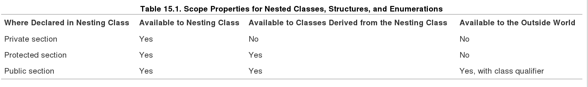
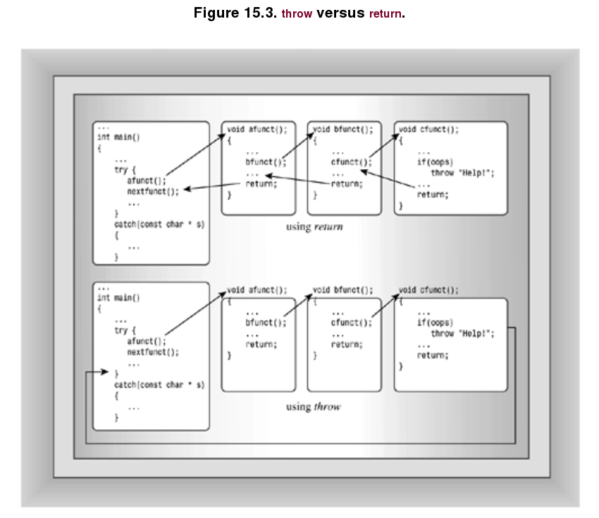

## Friends ##

A Class can defines which functions, member functions, or classes are firends; friendship cannot be imposed from the outside. Thus, although friends do grant outside access to a class's private portion, they don't realy violate the spirit of object-oriented programing. Instead, they provide more flexibility  to the public interface.

#### Friend Classes ####

- Example

    When might you want to make one class a friend to another? Let's look at an example. Suppose you must program a simple simulation of a **television** and a remote control. You decide to define a **Tv** class representing a television and a Remote class representing a remote control. Clearly, there should be some sort of relationship between these classes, but what kind? **A remote control is not a television and vice versa, so the is-a relationship of public inheritance doesn't apply**. **Nor is either a component of the other, so the has-a relationship of containment or of private or protected inheritance doesn't apply**. What is true is that a remote control can modify the state of a television, and this suggests making the **Remote class a friend to the Tv class**.
    

            class Tv
            
            {
            
            public:
            
                friend class Remote;   // Remote can access Tv private parts
                ...
            }
            
            
            class Remote
            {
            
            private:
            
                int mode;              // controls TV or VCR
            
            public:
            
                Remote(int m = Tv::TV) : mode(m) {}
            
                bool volup(Tv & t) { return t.volup();}
                void set_chan(Tv & t, int c) {t.channel = c;}
                ...
            }
            
            
#### Friend Member Functions ####

The only Remote method that accesses a private Tv member directly is Remote::set_chan(), so that's the only method that needs to be a friend.

        class Tv
        {
            friend void Remote::set_chan(Tv & t, int c);
            ...
        };
        
However, for the compiler to process this statement, it needs to have already seen the Remote definition. Otherwise, it won't know that Remote is a class and that set_chan() is a method of that class. That suggests putting the Remote definition above the Tv definition. But the fact that Remote methods mention Tv objects means that the Tv definition should come above the Remote definition. **Part of the way around the circular dependence is to use a forward declaration.** That means inserting the statement.

        class Tv;  // forward declaration
    
        class Remote { ... };
        
        class Tv { ... };
        
Could you use the following arrangement instead?

        class Remote;          // forward declaration
        
        class Tv { ... };
        
        class Remote { ... };
        
**The answer is no.** The reason, as mentioned earlier, is that when the compiler sees that a Remote method is declared as a friend in the Tv class declaration, the compiler needs to have already viewed the declaration of the Remote class in general and of the set_chan() method in particular.

Another difficulty remains.  **the Remote declaration contained inline code such as the following:**

        void onoff(Tv & t) { t.onoff();}
        
Because this calls a Tv method, the compiler needs to have seen the Tv class declaration at this point so that it knows what methods Tv has. But, as you've seen, that declaration necessarily follows the Remote declaration. **The solution to this problem is to restrict Remote to method declarations and to place the actual definitions after the Tv class. This leads to the following ordering**:

        class Tv;               // forward declaration
        
        class Remote { ... };     // Tv-using methods as prototypes only
        
        class Tv { ... };
        
        //put Remote method definitions here
        
The Remote prototypes look like this:

        void onoff(Tv & t);
        
All the compiler needs to know when inspecting this prototype is that Tv is a class, and the **forward declaration** supplies that information. By the time the compiler reaches the actual method definitions, it has already read the Tv class declaration and has the added information needed to compile those methods. By using the **inline keyword** in the method definitions, **you still can make the methods inline methods.** Listing 15.4 shows the revised header file.        
     
        class Tv;
        
        class Remote
        {
            private:
                ...
            public:
                ...
                void set_chan(Tv & t, int c);
        };
        
        
        class Tv
        {
            public:
                friend void Remote::set_chan(Tv & t, int c);
                ...
        };
        
        //Remote methods as inline functions
        inline void Remote::set_chan(Tv & t, int c) {t.chanel = c;}
        ...
        
By the way, making the entire Remote class a friend doesn't need a forward declaration **because the friend statement itself identifies Remote as a class**:

        friend class Remote;
        
#### Other Friendly Relationships ####

**Tv** will be a friend to **Remote** in addition to Remote being a friend to Tv. One point to keep in mind is that a Tv method that uses **a Remote object can be prototyped before the Remote class declaration but must be defined after the declaration** so that the compiler will have enough information to compile the method. The setup would look like this:

        class Tv
        {
        
            friend class Remote;
            
            public:
            
                void buzz(Remote & r);
            
                ...
        };
        
        class Remote
        {
        
        friend class Tv;
        
        public:
        
            void Bool volup(Tv & t) {  t.volup(); }
        
            ...
        
        };
        
        inline void Tv::buzz(Remote & r)
        {
        
           ...
        
        }
        
Because the Remote declaration follows the Tv declaration, **Remote::volup() can be defined in the class declaration. The Tv::buzz() method, however, has to be defined outside the Tv declaration so that the definition can follow the Remote declaration.** If you don't want buzz() to be inline, define it in a separate method definitions file.

这儿总结下：在使用类方法前，必须要先看到类方法的declaration, 因此inline函数定义在类中，很容易碰到找不到类方法声明的问题。因此将类函数定义与声明隔开，保证所有类函数定义都放在声明后面，能够避免碰到这种问题。（而且inline关键字可以让inline函数在类外声明）

#### Shared Friends ####

Another use for friends is when a function needs to access private data in two separate classes. Logically, such a function should be a member function of each class, but that's impossible. It could be a member of one class and a friend to the other, but sometimes it's more reasonable to make the function friends to both. Suppose, for example, that you have a **Probe** class representing some sort of programmable measuring device and an **Analyzer** class representing some sort of programmable analyzing device. Each has an internal clock, and you would like to be able to synchronize the two clocks. You could do something along the following lines:

        class Analyzer;  // forward declaration
        
        class Probe    
        {
        
            friend void sync(Analyzer & a, const Probe & p);  // sync a to p
        
            friend void sync(Probe & p, const Analyzer & a);  // sync p to a
        
            ...
        
        };
        
        class Analyzer
        {
        
            friend void sync(Analyzer & a, const Probe & p);  // sync a to p
        
            friend void sync(Probe & p, const Analyzer & a);  // sync p to a
        
            ...
        
        };
        
        // define the friend functions
        
        inline void sync(Analyzer & a, const Probe & p)        
        {
        
            ...
        
        }
        
        inline void sync(Probe & p, const Analyzer & a)
        
        {
        
            ...
        
        }        
        
The **forward declaration** enables the compiler to know that Analyzer is a type when it reaches the friend declarations in the Probe class declaration.

## Nested Classes ##

Nesting a class, on the other hand, does not create a class member. Instead, it defines a type that is known just locally to the class containing the nested class declaration.

The usual reasons for nesting a class are to **assist the implementation of another class and to avoid name conflicts.** The Queue class example (Chapter 12, "Classes and Dynamic Memory Allocation," Listing 12.8) provided a disguised case of nested classes by nesting a structure definition:

        class Queue
        {
        // class scope definitions
            // Node is a nested structure definition local to this class
            struct Node { Item item; struct Node * next;};
            ...
        };
        

struct没有构造函数，new对象时，没有初始化默认值的能力,改为nesting class后:

        class Queue
        {
        // class scope definitions
            // Node is a nested class definition local to this class
            // default Scope is 
            class Node        
            {
            public:
                Item item;
                Node * next;
                Node(const Item & i) : item(i), next(0) {  }
            };
            ...
        };

This constructor initializes the node's item member to i and sets the next pointer to 0, which is one way of writing the null pointer in C++. (Using NULL would require including a header file that defines NULL.) 

Suppose you wanted to define it in a methods file, instead

        Queue::Node::Node(const Item & i) : item(i), next(0) { }
        
        
### Nested Classes and Access ###

Where and how a nested class can be used depends upon both **scope** and **access control**.

#### Scope ####

- If the nested class is declared in a private section of a second class, it is known only to that second class. 

- If the nested class is declared in a protected section of a second class, it is visible to that class but invisible to the outside world. **However, in this case, a derived class would know about the nested class and could directly create objects of that type**.

-  If a nested class is declared in a public section of a second class, it is available to the second class, to classes derived from the second class, and, because it's public, to the outside world. However, because the nested class has class scope, it has to be used with a class qualifier in the outside world. For example, suppose you have this declaration:

        class Team
        {
        
        public:
        
              class Coach { ... };
        
              ...
        
        };
        
        Team::Coach forhire;  // create a Coach object outside the Team class
        
        

- Summarizes scope properties for nested classes, structure, and enumerations.

    
    
#### Access control ####

After a class is in scope, access control comes into play. The same rules govern access to a nested class that govern access to a regular class. Declaring the Node class in the Queue class declaration does not grant the Queue class any special access privileges to the Node class, nor does it grant the Node class any special access privileges to the Queue class. **Thus, a Queue class object can access only the public members of a Node object explicitly.**  **For that reason, the Queue example made all the members of the Node class public.** This violates the usual practice of making data members private, but the Node class is an internal implementation feature of the Queue class and is not visible to the outside world. That's because the Node class is declared in the private section of the Queue class. Thus, although Queue methods can access Node members directly, a client using the Queue class cannot do so.

### Nesting in a Template ###

You've seen that templates are a good choice for implementing container classes such as the Queue class. **You may be wondering if having a nested class poses any problems to converting the Queue class definition to a template. The answer is no.** Listing 15.5 shows how this conversion can be made. As is common for class templates, the header file includes the class template along with method function templates.

## Exceptions ##

Programs sometimes encounter runtime problems that prevent the program from continuing normally. For example, a program may try to open an unavailable file, or it may request more memory than is available, or it may encounter values it cannot abide. Usually, programmers try to anticipate such calamities. C++ exceptions provide a powerful and flexible tool for dealing with these situations. Exceptions were added to C++ recently, and not all compilers have implemented them yet.

One way to handle this is to have the function call the **abort()** function

        //error1.cpp -- use the abort() function
        
        #include <iostream>
        
        using namespace std;
        
        #include <cstdlib>
        
        double hmean(double a, double b);
        
        
        int main()
        
        {
        
            double x, y, z;
        
            cout << "Enter two numbers: ";
        
            while (cin >> x >> y)
        
            {
        
                z = hmean(x,y);
        
                cout << "Harmonic mean of " << x << " and " << y
        
                    << " is " << z << "\n";
        
                cout << "Enter next set of numbers <q to quit>: ";
        
            }
        
            cout << "Bye!\n";
        
            return 0;
        
        }
        
        
        double hmean(double a, double b)
        
        {
        
            if (a == -b)
        
            {
        
                cout << "untenable arguments to hmean()\n";
        
                abort();
        
            }
        
            return 2.0 * a * b / (a + b); 
        
        }
        
        Here's a sample run:
        
        
        Enter two numbers: 3 6
        
        Harmonic mean of 3 and 6 is 4
        
        Enter next set of numbers <q to quit>: 10 -10
        
        untenable arguments to hmean()
        
        abnormal program termination
        
Note that calling the **abort()** function from **hmean()** terminates the program directly without returning first to **main()**.

The program could avoid aborting by checking the values of x and y before calling the hmean() function. However, **it's not safe to rely upon a programmer to know (or care) enough to perform such a check**.

### The Exception Mechanism ###

Handling an exception has three components

- **Throwing an exception**

- **Catching an exception with a handler**

- **Using a try block**

            //error3.cpp
            
            #include <iostream>
            
            using namespace std;
            
            double hmean(double a, double b);
            
            
            
            int main()
            
            {
            
                double x, y, z;
            
            
            
                cout << "Enter two numbers: ";
            
                while (cin >> x >> y)
            
                {
            
                    try {                   // start of try block
            
                        z = hmean(x,y);
            
                    }                       // end of try block
            
                    catch (const char * s)  // start of exception handler
            
                    {
            
                        cout << s << "\n";
            
                        cout << "Enter a new pair of numbers: ";
            
                        continue;
            
                    }                       // end of handler
            
                    cout << "Harmonic mean of " << x << " and " << y
            
                        << " is " << z << "\n";
            
                    cout << "Enter next set of numbers <q to quit>: ";
            
                }
            
                cout << "Bye!\n";
            
                return 0;
            
            }
            
            
            
            double hmean(double a, double b)
            
            {
            
                if (a == -b)
            
                    throw "bad hmean() arguments: a = -b not allowed";
            
                return 2.0 * a * b / (a + b); 
            
            }
            
            Here's a sample run:
            
            
            Enter two numbers: 3 6
            
            Harmonic mean of 3 and 6 is 4
            
            Enter next set of numbers <q to quit>: 10 -10
            
            bad hmean() arguments: a = -b not allowed
            
            Enter a new pair of numbers: 1 19
            
            Harmonic mean of 1 and 19 is 1.9
            
            Enter next set of numbers <q to quit>: q
            
            Bye!
            
### Exception Versatility ###

- You can **qualify** a function definition with an exception specification to indicate which kinds of exceptions it throws.

    **double hmean(double a, double b) throw(const char *);**
    
    **double multi_err(double z) throw(const char *, double);** //comma-separated list of exception types
    
    **double simple(double z) throw();** // doesn't throw an exception

- A catch block can handle more than one source of exceptions.

### Multiple Try Blocks ###

You have many choices about setting up try blocks. For example, you could handle the two function calls individually, placing each within its own try block. That allows you to program a different response for the two possible exceptions

### Unwinding the Stack ###

- normally function calls

    First, let's look at how C++ normally handles function calls and returns. C++ typically handles function calls by placing information on a stack (Chapter 9, "Memory Models and Name spaces"). In particular, a program places the address of a calling function instruction (a return address) on the stack. When the called function completes, the program uses this address to determine where to continue with program execution. Also, the function call places any function arguments on the stack, where they are treated as automatic variables. If the called function creates any new automatic variables, they, too, are added to the stack. If a called function calls another function, its information is added to the stack, and so on. When a function terminates, program execution passes to the address stored when the function was called, and the top of the stack is freed. Thus a function normally returns to the function that called it, and so on, with each function liberating its automatic variables as it terminates. If an automatic variable is a class object, then the class destructor, if any, is called.
    
- throw exception

    Now suppose a function terminates via an exception throw instead of via a return call. Again, the program frees memory from the stack. But instead of stopping at the first return address on the stack, the program continues freeing the stack until it reaches a return address that resides in a try block (see Figure 15.3). Control then passes to the exception handlers at the end of the block rather than to the first statement following the function call. This is the process called `unwinding the stack`. One very important feature of the **throw mechanism** is that, just as with function returns, the class destructors are called for any automatic class objects on the stack. However, a function return just processes objects put on the stack by that function, while the throw statement processes objects put on the stack by the entire sequence of function calls between the try block and the throw. Without the unwinding-the-stack feature, a throw would leave destructors uncalled for automatic class objects placed on the stack by intermediate function calls.
    
    
    
### More Options ###

- To **catch any exception**, use the **ellipses** for the exception type:

        catch (...) { // statements }
    
- To **pass control to a containing try block**, use throw without a following exception:

        catch (const char * s)
        {
        
              cout << "Exception caught in inner loop.\n";
        
              throw;  // send to containing try block
        }
        
### Exceptions and Classes ###

**it's more useful to throw an exception that's an object.** The type of object will help identify the source of the exception. The earlier example with hmean() and qmean() had the problem that both went through the same type (char char *) of exception, making it cumbersome to set up catch blocks that discriminate between the two. **By using objects, you can design a different type object for each exception you wish to catch. And the object itself can carry the needful information.**

        class problem {...};
        
        ...
        
        void super() throw (problem &)
        
        {
        
            ...
        
            if (oh_no)
        
            {
        
                problem oops(); // construct object
        
                throw oops;     // throw it
        
            ...
        
        }
        
        ...
        
        try {
        
            super();
        
        }
        
        catch(problem & p)
        
        {
        
        ...
        
        }

Incidentally, while the throw-catch mechanism is much like function argument passing, there are a few differences. For example, **the compiler always creates a temporary copy when throwing an exception**, so in the preceding sample code, p would refer to a copy of oops rather than oops. That's a good thing, because oops no longer exists after super() terminates. Often it is simpler to combine construction with the throw:       

        throw problem();     // construct and throw type problem object
        
When exceptions refer to class processes, it's often useful if the exception type is defined as a nested class. Not only does this make the exception type indicate the class originating an exception, it helps prevent name conflicts.

        catch (ArrayDbE::BadIndex &) { ...}
        
### Exceptions and Inheritance ###

Inheritance interacts with exceptions in a couple of ways. **First, if a class has publicly nested exception classes, a derived class inherits those exception classes**. **Second, you can derive new exception classes from existing ones. We'll look at both these possibilities in the next example.**

This particular sequence of catch blocks has an interesting property—a catch block with a **BadIndex** reference can catch either a **BadIndex** exception or a **SonOfBad** exception. That's because a base class reference can refer to a derived object. However, a catch block with a **SonOfBad** reference can't catch a **BadIndex** object. That's because a derived object reference can't refer to a base class object without an explicit type cast. **This state of affairs suggests placing the SonOfBad catch block above the BadIndex catch block.** That way, the **SonOfBad** catch block will catch a **SonOfBad** exception while passing a **BadIndex** exception on to the next catch block. The program in Listing 15.17 illustrates this approach.

        class SonOfBad : public ArrayDbE::BadIndex
        {
            ...
        }
        
        
        try {
        
            LimitArE income(Years, FirstYear);
        
            ArrayDbE busywork(Years);
        
            ...
        
        }   // end of try block
        
        catch (LimitArE::SonOfBad & bi)   // 1st handler
        
        {
        
            ...
        
        }
        
        catch (ArrayDbE::BadIndex & bi)   // 2nd handler
        
        {
        
            ...
        }
        

**Tips: If you have an inheritance hierarchy of exception classes, arrange the order of the catch blocks so the most derived class exception is caught first and the base class exception is caught last.**

### The exception Class ###

Newer C++ compilers are incorporating exceptions into the language. For example, the exception header file (formerly **exception.h** or **except.h**) defines an **exception** class that C++ uses as a base class for other exception classes used to support the language. **Your code, too, can throw an exception object or use the exception class as a base class. One virtual member function is named what(), and it returns a string**, the nature of which is implementation-dependent. But if you derive a class, you then can choose what string you want returned. For example, you could replace the **BadIndex** declaration with one based on the **exception** class. Because the contents of the exception header file are part of the std namespace, you can make them available with a using directive:       
       
       
        #include <exception>
        
        using namespace std;
        
        class ArrayDbE
        
        {
        
        private:
        
            unsigned int size;  // number of array elements
        
        protected:
        
            double * arr;       // address of first element
        
        public:
        
            class OutOfBounds : public exception
        
            {
        
            public:
        
                OutOfBounds() : exception() {};
        
                const char * what() {return "Array limit out of bounds\n";}
        
            };
        
           ...
        
        };
        
try catch exception:

        catch (ArrayDbE::OutOfBounds & ob)   //  handler
        
        {
        
            cout << "ArrayDbE exception: "
        
                    << ob.what() << endl;
        
        }
        
By the way, instead of making all the exception class declarations available with a using directive, you could use the scope resolution operator:

        class OutOfBounds : public std::exception
        
        
### The bad_alloc Exception and new ###

C++ gives implementations two choices for handling memory allocation problems when using **new**. The first choice, and once the only choice, is to have **new** return the null pointer if it can't satisfy a memory request. The second choice is to have **new** throw a **bad_alloc** exception. The **new** header (formerly new.h) includes a declaration for the bad_alloc class, which is publicly derived from the **exception** class. **An implementation may offer just one choice or, perhaps by using a compiler switch or some other method, let you choose the approach you prefer**.

        // newexcp.cpp -- the bad_alloc exception
        
        #include <iostream>
        
        using namespace std;
        
        #include <new>
        
        #include <cstdlib>
        
        
        
        struct Big
        
        {
        
            double stuff[2000];
        
        };
        
        
        
        int main()
        
        {
        
            Big * pb;
        
            try {
        
                cout << "Trying to get a big block of memory:\n";
        
                pb = new Big[10000];
        
                cout << "Got past the new request:\n";
        
            }
        
            catch (bad_alloc & ba)
        
            {
        
                cout << "Caught the exception!\n";
        
                cout << ba.what() << endl;
        
                exit(1);
        
            }
        
            if (pb != 0)
        
            {
        
                pb[0].stuff[0] = 4;
        
                cout << pb[0].stuff[0] << endl;
        
            }
        
            else
        
                cout << "pb is null pointer\n";
        
            delete [] pb;
        
            return 0; 
        
        }

### When Exceptions Go Astray ###

After an exception has been thrown, it has two opportunities to cause problems.

####  unexpected exception ####
First, if it is thrown in a function having an exception specification, it has to match one of the types in the specification list. If it doesn't, the unmatched exception is branded an **unexpected exception**, and, by default, it causes the program to abort.

#### uncaught exception ####
If the exception passes this first hurdle (or avoids it because the function lacks an exception specification), it then has to be caught. If it isn't, which can happen if there is no containing try block or no matching catch block, the exception is branded an **uncaught exception**, and, by default, it causes the program to abort. 

#### princinple of uncaught exception ####

- 函数调用顺序

    调用terminate() => abort()中止程序
    
- 更改uncaught exception行为的关键函数原型:

        typedef void (*terminate_handler)();
        
        terminate_handler set_terminate(terminate_handler f) throw(); //最近一次设置生效
        
        void terminate();
    
- 通过更改terminate函数，来更改caught exception行为:

        #include <exception>
        using namespace std;
               
        void myQuit()
        {
        
            cout << "Terminating due to uncaught exception\n";
        
            exit(5);
        
        } 
        
        set_terminate(myQuit);
        
#### princinple of unexpected exception ####

- However, the behavior of the function you supply **set_unexpected()** is more regulated than that of a function for **set_terminate()**. In particular, the unexpected_handler function has the following choices:

    - It can end the program by calling terminate() (the default behavior), abort(), or exit().
    - It can throw an exception.

- 再次抛异常处理方式的结果， depends upon the exception thrown by the replacement unexpected_handler function and the original exception specification for the function that threw the unexpected type:

    - If the newly thrown exception matches the original exception specification, then the program proceeds normally from there; that is, it will look for a catch block matching the newly thrown exception. Basically, this approach replaces an exception of an unexpected type to an exception of an expected type.

    - If the newly thrown exception does not match the original exception specification and if the exception specification does not include the std::bad_exception type, the program calls terminate(). The bad_exception type derives from the exception type and is declared in the exception header file.
    
    - If the newly thrown exception does not match the original exception specification and if the original exception specification does include the std::bad_exception type, the unmatched exception is replaced with an exception of the std::bad_exception type. 

- 函数调用顺序

    调用unexpected() => terminate() => abort()中止程序
    
- 更改unexpected exception行为的关键函数原型:

        typedef void (*unexpected_handler)();
    
        unexpected_handler set_unexpected(unexpected_handler f) throw();
        
        void unexpected();
        
- 通过更改unexpected函数，来更改unexpected exception行为:

        #include <exception>
    
        using namespace std;
        
        
        void myUnexpected()
        {
        
            throw std::bad_exception();  //or just throw;
        
        }
        
        set_unexpected(myUnexpeced);
        
- Finally, include the **bad_exception** type in exception specifications and catch block sequences:

        double Argh(double, double) throw(exception &, bad_exception &);
        
        ...
        
        try {
        
            x = Argh(a, b);
        
        }
        
        catch(exception & ex)
        
        {
        
            ...
        
        }
        
        catch(bad_exception & ex) 
        
        {
        
            ...
        
        }

### Exception Cautions ###

From the preceding discussion of using exceptions, you might gather (and gather correctly) that exception handling should be designed into a program rather than tacked on. It has some disadvantages. For example, using exceptions adds to the size and subtracts from the speed of a program. Exception specifications don't work well with templates, because template functions might throw different kinds of exceptions depending upon the particular specialization used. Exceptions and dynamic memory allocation don't always work that well together.

### Finally ###

In short, while exception handling is extremely important for some projects, it does have costs in programming effort, program size, and program speed. Also, compiler exception support and user experience have not yet reached the mature level. So you might want to use this feature with moderation.    

## RTTI ##

RTTI is short for runtime type information. It's one of the more recent additions to C++ and isn't supported by many older implementations. Other implementations may have compiler settings for turning RTTI on and off. The intent of RTTI is to provide a standard way for a program to determine the type of object during runtime. Many class libraries have already provided ways to do so for their own class objects, but in the absence of built-in support in C++, each vendor's mechanism typically is incompatible with those of other vendors. Creating a language standard for RTTI should allow future libraries to be compatible with each other.

### What's It For? ###

Suppose you have a hierarchy of classes descended from a common base. You can set a base class pointer to point to an object of any of the classes in this hierarchy. Next, you call a function that, after processing some information, selects one of these classes, creates an object of that type, and returns its address, which gets assigned to a base class pointer. How can you tell what kind of object it points to?

### How Does It Work? ###

C++ has three components supporting RTTI:

- The **dynamic_cast** operator generates a pointer to a derived type from a pointer to a base type, if possible. Otherwise, the operator returns 0, the null pointer.
- The **typeid** operator returns a value identifying the exact type of an object.
- A **type_info** structure holds information about a particular type.

**You can use RTTI only with a class hierarchy having virtual functions.** The reason for this is that these are the only class hierarchies for which you should be assigning the addresses of derived objects to base class pointers.

### The dynamic_cast Operator ###

The **dynamic_cast** operator is intended to be the most heavily used RTTI component. It doesn't answer the question of what type of object a pointer points to. Instead, **it answers the question of whether you can safely assign the address of the object to a pointer of a particular type.** Let's see what that means. Suppose you have the following hierarchy:

        class Grand {  // has virtual methods} ;
    
        class Superb : public Grand {  ... } ;
        
        class Magnificent : public Superb {  ... } ;
        
Next, suppose you have the following pointers:

        Grand * pg = new Grand;

        Grand * ps = new Superb;
        
        Grand * pm = new Magnificent;        
        
Finally, consider the following type casts:

        Magnificent * p1 = (Magnificent *) pm;        // #1 safe

        Magnificent * p2 = (Magnificent *) pg;        // #2 not safe
        
        Superb * p3 = (Magnificent *) pm;             // #3 safe
        
First, however, let's look at the **dynamic_cast** syntax. The operator is used like this, where **pg** points to an object:

        Superb pm = dynamic_cast<Superb *>(pg);
        
This asks the question, **can the pointer pg be type cast safely (as described previously) to the type Superb *? If it can, the operator returns the address of the object. Otherwise it returns 0, the null pointer.**

**You can use dynamic_cast with references, too. The usage is slightly different; there is no reference value corresponding to the null-pointer type**, hence there's no special reference value that can be used to indicate failure. Instead, when goaded by an improper request, **dynamic_cast throws a type bad_cast exception**, which is derived from the exception class and defined in the typeinfo header file. Thus, the operator can be used as follows, where **rg** is a reference to a **Grand** object:

        #include <typeinfo> // for bad_cast
        
        ...
        
        try {
        
            Superb & rs = dynamic_cast<Superb &>(rg);
        
            ...
        
        }
        
        catch(bad_cast &){
        
            ...
        
        } ;
        
### The typeid Operator and type_info Class ###

** The typeid operator lets you determine if two objects are the same type. Somewhat like sizeof, it accepts two kinds of arguments: **

- The name of a class
- An expression that evaluates to an object

The **typeid** operator returns **a reference to a type_info object**, where **type_info** is a class defined in the **typeinfo** header file (formerly typeinfo.h). The **type_info** class overloads the == and != operators so that you can use these operators to compare types. For example, the expression

        typeid(Magnificent) == typeid(*pg)

If **pg** happens to be a **null** pointer, the program will throw a **bad_typeid** exception. This exception type is derived from the exception class and is declared in the **typeinfo** header file.

The implementation of the **type_info** class will vary among vendors, but it will include a **name() member** that returns an implementation-dependent string that typically would be the name of the class. For example, the statement

        cout << "Now processing type " << typeid(*pg).name() << ".\n";
            
### Misusing RTTI ###

RTTI has many vocal critics within the C++ community. They view RTTI as unnecessary, a potential source of program inefficiency, and as a possible contributor to bad programming practices. Without delving into the debate over RTTI, let's look at the sort of programming that you should avoid.

        Grand * pg;
        
        Superb * ps;
        
        for (int i = 0; i < 5; i++)
        
        {
        
            pg = GetOne();
        
            pg->Speak();
        
            if( ps = dynamic_cast<Superb *>(pg))
        
                 ps->Say();
        
        }

By using **typeid** and ignoring **dynamic_cast** and virtual functions, you can rewrite this code as follows:

        Grand * pg;
        
        Superb * ps;
        
        Magnificent * pm;
        
        for (int i = 0; i < 5; i++)
        
        {
        
            pg = GetOne();
        
            if (typeid(Magnificent) == typeid(*pg))
        
            {
        
                pm = (Magnificent *) pg;
        
                pm->Speak();
        
                pm->Say();
        
            }
        
            else if (typeid(Superb) == typeid(*pg))
        
            {
        
                ps = (Superb *) pg;
        
                ps->Speak();
        
                ps->Say();
        
            }
        
            else
        
                pg->Speak();
        
        }
        
Not only is this **uglier and longer than the original**, it has the serious flaw of naming each class explicitly. Suppose, for example, that you find it necessary to derive an Insufferable class from the **Magnificent** class. The new class redefines **Speak()** and **Say()**. With the versionthat uses **typeid** to test explicitly for each type, you would have to modify the for loop code, adding a new else if section. The original version, however, requires no changes at all. The

        pg->Speak();
        
statement works for all classes derived from **Grand**, and the

        if( ps = dynamic_cast<Superb *>(pg))
    
          ps->Say();
          
statement works for all classes derived from **Superb**.

**TIPS:If you find yourself using typeid in an extended series of if else statements, check to see whether you should have been using virtual functions and dynamic_cast.**

## Type Cast Operators ##

The **C cast operator**, in Bjarne Stroustrup's view, **is too lax**. For example, consider the
following:

        struct Data
        
        {
        
            double data[200];
        
        } ;
        
        
        
        struct Junk
        
        {
        
            int junk[100];
        
        } ;
        
        Data d = { 2.5e33, 3.5e-19, 20.2e32} ;
        
        char * pch = (char *) (&d);   // typecast #1 – convert to string
        
        char ch = char (&d);          // typecast #2 - convert address to a char
        
        Junk * pj = (Junk *) (&d);    // typecast #3 - convert to Junk pointer
        
Stroustrup's response to this laxity was to **add four type cast operators** that provide more discipline for the casting process:

        dynamic_cast
        
        const_cast
        
        static_cast
        
        reinterpret_cast
      
Instead of using a general type cast, you can select an operator suited to a particular purpose. **This documents the intended reason for the type cast and gives the compiler a chance to check that you did what you thought you did.**

### dynamic_cast < type-name > (expression) ###

The purpose of this operator is to allow upcasts within a class hierarchy (such type casts being safe because of the is-a relationship) and to disallow other casts.

        pl = dynamic_cast<Low *> ph;
        
assigns a **Low *** pointer to **pl** only if **Low** is an accessible base class (direct or indirect) to **High**. Otherwise, the statement assigns the null pointer to **pl**. 

### const_cast < type-name > (expression) ###

The **const_cast** operator is for making a type cast with the sole purpose of changing whether a value is **const** or **volatile** or not. 

该操作符的目的是 将const对象 转为 非const对象来操作，但不允许类型转换(编译器会检查), 并且如果对象一开始被声明为const，修改是不会成功，如下面对pb的修改不会成功。

        High bar;
        
        const High * pbar;
        
            ...
        
        High * pb = const_cast<High *> (pbar);    // valid
        
        Low * pl = const_cast<Low *> (pbar);      // invalid
        
The first type cast makes ***pb** a pointer that can be used to alter the value of the bar object; it removes the const label. The second type cast is invalid, because it also attempts to change the type from **High *** to **Low ***.

### static_cast < type-name > (expression) ###

It's valid only if **type_name** can be converted implicitly to the same type **expression** has, or vice versa. Otherwise, the cast is an error. Suppose **High** is a base class to **Low** and that **Pond** is an unrelated class. Then conversions from **High** to **Low** and **Low** to **High** are valid, but a conversion from **Low** to **Pond** is disallowed:

        High bar;
        
        Low blow;
        
        ...
        
        High * pb = static_cast<High *> (&blow);     // valid upcast
        
        Low * pl = static_cast<Low *> (&bar);        // valid downcast
        
        Pond * pmer = static_cast<Pond *> (&blow);   // invalid, Pond unrelated
        
### reinterpret_cast < type-name > (expression) ###

The **reinterpret_cast** operator is for inherently risky type-casts. It won't let you cast away **const**, but it will do other unsavory things. Sometimes a programmer has to do implementation-dependent, unsavory things, and using the **reinterpret_cast** operator makes it simpler to keep track of such acts. It has the same syntax as the other three:

        struct dat { short a; short b} ;
        
        long value = 0xA224B118;
        
        dat * pd = reinterpret_cast< dat *) (&value);
        
        cout << pd->a;   // display first 2 bytes of value

Typically, such casts would be used for low-level, implementation-dependent programming and would not be portable. For example, this code sample produces different output on an IBM-compatible than it does on a Macintosh because the two systems store the bytes in multibyte integer types in opposite orders.
        