## An Overview of C++ Input and Output ##

Most computer languages build input and output into the language itself（将输入和输入语句作为关键字）, 但是C和C++将实现留给了编辑器(compile implements), 在实际生产环境中，随着I/O实现稳定于一集合库，ANSI/IOS C++将其标准化，定义为实现I/O的标准库。

### Streams and Buffers ###

A c++ program views input or output as a stream of bytes. **A stream acts as intermediary between the program and the stream's source or destination.** This approach enables a C++ program to treat input from a keyboard in the same manner it treats input from a file;  a C++ program can process output in a manner independent of where the bytes are going.

Managing input, then, involves two stages:

- Associating a stream with an input to a program
- connecting the stream to a file

In other words, an input stream needs two connections, one at each end. The file-end connection provides a source for the stream, and the program-end connection dumps the stream outflow into the program. (The file-end connection can be a file, but it also can be a device, such as a keyboard.) Similarly, managing output involves connecting an output stream to the program and associating some output destination with the stream. It's like plumbing with bytes instead of water (see Figure 17.1).

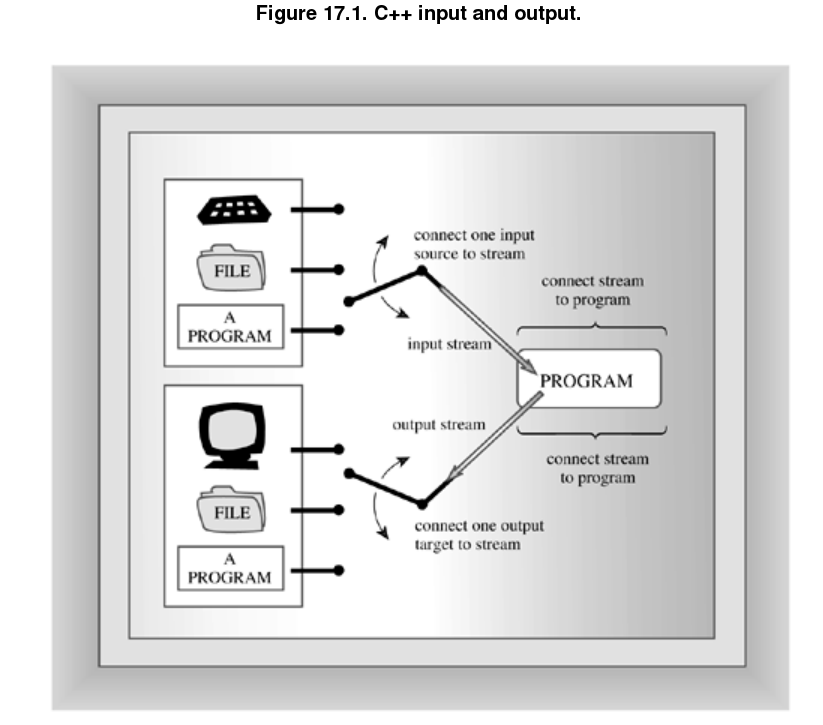

Usually, input and output can be handled more efficiently by using a buffer.

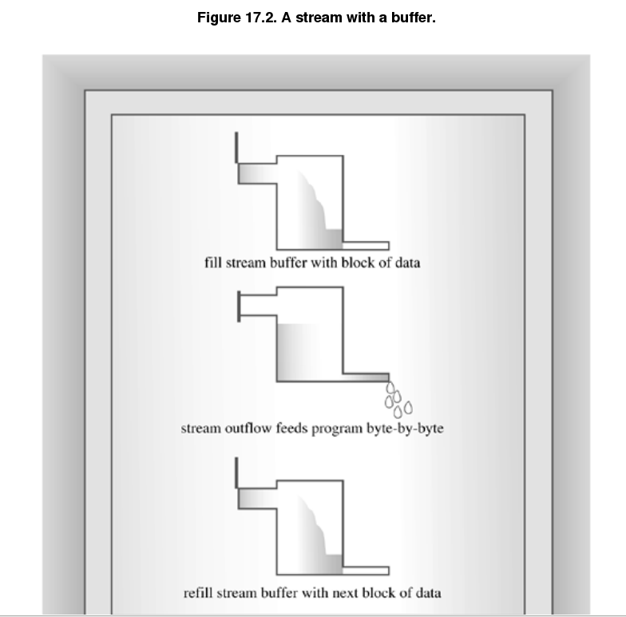

Keyboard input provides one character at a time, so in that case a program doesn't need a buffer to help match different data transfer rates. However, buffered keyboard input allows the user to back up and correct input before transmitting it to a program. A C++ program normally flushes the input buffer when you press <Enter>. That's why the examples in this book don't begin processing input until you press <Enter>. For output to the screen, a C++ program normally flushes the output buffer when you transmit a newline character. Depending upon the implementation, a program may flush input on other occasions, too, such as impending input. That is, when a program reaches an input statement, it flushes any output currently in the output buffer. C++ implementations that are consistent with ANSI C should behave in that manner.

### Streams, Buffers, and the iostream File ###

iostream中的类设计，实现了stream和buffer的管理:

- The **streambuf** class provides memory for a buffer along with class methods for filling the buffer, accesing buffer contents, flushing the buffer, and managing the buffer memory.

- The **ios_base** class represents general properties of a stream, such as whether it's open for reading and whether it's a binary or a text stream.

- The **ios** class is based on **ios_base** , and it includes a pointer member to a streambuf object.

- The **ostream** class derives from the **ios** class and provides input methods.

- The **istream** class also derives from the **ios** class and provides input methods.

- The **iostream** class is based on the iostream and ostream and thus inherit both input and output methods.

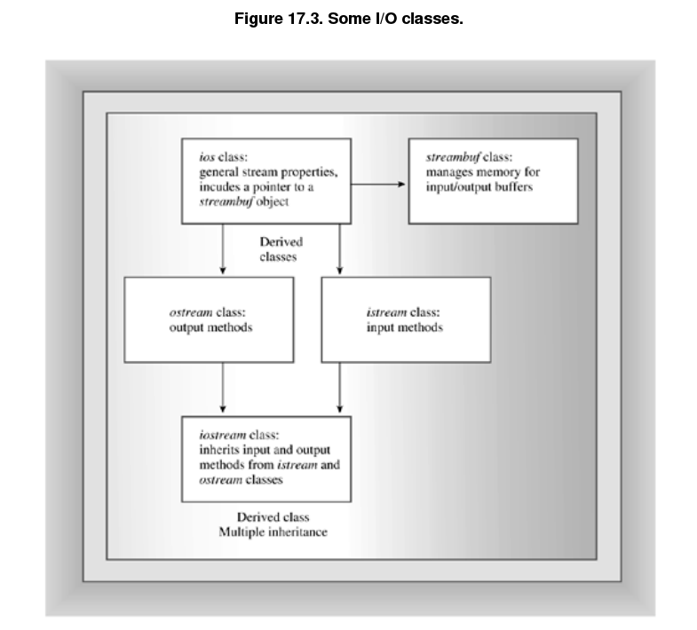

To use these facilities, you use objects of the appropriate classes. For example, use an ostream object such as **cout** to handle output. Creating such an object opens a stream, automatically creates a buffer, and associates it with the stream. It also makes the class member functions available to you.

### Redefining I/O ###

The ISO/ANSI C++ standard has revised I/O a couple of ways. First, there's the change from ostream.h to ostream, with ostream placing the classes in the std namespace. Second, the I/O classes have been rewritten. To be an international language, C++ had to be able to handle international character sets that require a 16-bit or wider character type. So the language added the wchar_t (or "wide") character type to the traditional 8-bit char (or "narrow") type. Each type needs its own I/O facilities. Rather than develop two separate sets of classes, the standards committee developed a template set of I/O classes, including `basic_istream<charT, traits<charT> >` and `basic_ostream<charT, traits<charT> >`. The `traits<charT> `template, in turn, is a template class defining particular traits for a character type, such as how to compare for equality and its EOF value. The standard provides **char** and **wchar_t** specializations of the I/O classes. For example, **istream and ostream are typedefs for char specializations**. Similarly, **wistream and wostream are wchar_t specializations**. For example, there is a wcout object for outputting wide character streams. The ostream header file contains these definitions.

Certain type-independent information that used to be kept in the **ios base** class has been moved to the new **ios_base** class. This includes the various formatting constants such as **ios::fixed**, which now is **ios_base::fixed**. Also, ios_base contains some options that weren't available in the old ios.

In some cases, the change in the filename corresponds with the change in class definitions. In Microsoft Visual C++ 6.0, for example, you can include iostream.h and get the old class definitions or include iostream and get the new class definitions. However, dual versions like this are not the general rule.

### Redefining I/O END ###

The C++ **iostream** class library takes care of many details for you. For example, including the iostream file in a program creates eight stream objects (**four for narrow characters stream and four for wide character streams**) automatically:

- The **cin** object corresponds to the standard input stream. By default, this stream is associated with the standard input device, **typically a keyboard**. The **wcin** object is similar, but works with the **wchar_t** type.

- The **cout** object By default, this stream is associated with the standard output device, **typically a monitor**. The **wcout** object is similar, but works with the **wchar_t** type.

- The **cerr** object corresponds to the standard error stream, which you can use for displaying error messages. By default, this stream is associated with the standard output device, **typically a monitor**, and the stream is unbuffered. This means that information is sent directly to the screen without waiting for a buffer to fill or for a newline character. **The wcerr object is similar, but works with the wchar_t type**.

- The **clog** object also corresponds to the standard error stream. By default, this stream is associated with the standard output device, **typically a monitor**, **and the stream is buffered. The wclog object is similar, but works with the wchar_t type**.

What does it mean to say an object represents a stream? Well, for example, when the iostream file declares a cout object for your program, that object will have data members holding information relating to output, such as the field widths to be used in displaying data, the number of places after the decimal to use, what number base to use for displaying integers, and the address of a streambuf object describing the buffer used to handle the output flow. A statement such as

        cout << "Bjarne free";
        
places the characters from the string **"Bjarne free"** into the buffer managed by **cout** via the pointed-to **streambuf** object. The **ostream** class defines the **operator<<()** function used in this statement, and the ostream class also supports the **cout** data members with a variety of other class methods, such as the ones this chapter discusses later. Furthermore, C++ sees to it that the output from the buffer is directed to the standard output, usually a monitor, provided by the operating system. In short, one end of a stream is connected to your program, the other end is connected to the standard output, and the **cout** object, with the help of a type **streambuf** object, manages the flow of bytes through the stream.

##Redirection##

The standard input and output streams normally connect to the keyboard and the screen. **But many operating systems, include Unix, Linux, and MS-DOS, support redirection**, a facility that lets you change the associations for the standard input and the standard output. 

But redirecting the standard output doesn't affect cerr or clog; thus, if you use one of these objects to print an error message, a program will display the error message on the screen even if the regular cout output is redirected elsewhere. For example, consider this code fragment:

        if (success)
        
            cout << "Here come the goodies!\n";
        
        else
        
        {
        
            cerr << "Something horrible has happened.\n";
        
            exit(1);
        
        }
        
## Output with cout ##

C++, we've said, considers output to be a stream of bytes. (Depending on the implementation and platform, these may be 16-bit or 32-bit bytes, but bytes nonetheless.) But many kinds of data in a program are organized into larger units than a single byte. An int type, for example, may be represented by a 16-bit or 32-bit binary value

That is, to display the number -2.34 on the screen, you should send the five characters -, 2, ., 3, and 4 to the screen, and not the internal 64-bit floating-point representation of that value. **Therefore, one of the most important tasks facing the ostream class is converting numeric types, such as int or float, into a stream of characters that represents the values in text form**. 

summarizing ostream methods used throughout the book and describing additional methods that provide a finer control over the appearance of the output.

### The Overloaded << Operator(终于知道这个操作符的正式名字了) ###

Most often, this book has used cout with the **<< operator**, also called the **insertion** operator:

        int clients = 22;
        
        cout << clients;
        
In C++, as in C, the default meaning for the << operator is the bitwise left-shift operator. But the ostream class redefines the << operator through overloading to output for the ostream class. In this guise, the << operator is called the insertion operator instead of the left-shift operator.

The insertion operator is overloaded to recognize **all the basic C++ types**:

- unsigned char

- signed char

- char

- short

- unsigned short

- int

- unsigned int

- long

- unsigned long

- float 

- double

- long double

**The ostream class provides a definition for the operator<<() function for each of the previous types**. 

for example:

        ostream & operator<<(int); 

The ostream class also defines insertion operator functions for the following **pointer types**:

- const signed char * 

- const unsigned char *

- const char *

- void *

The pointer can take the form of the name of an array of char or of an explicit **pointer-to-char** or of a quoted string.

        char name[20] = "Dudly Diddlemore";
        
        char * pn = "Violet D'Amore";
        
        cout << "Hello!";
        
        cout << name;
        
        cout << pn;
        
The methods use the terminating **null character** in the string to determine when to stop displaying characters.        

**C++ matches a pointer of any other type with type void *** and prints a numerical **representation of the address**. **If you want the address of the string, you have to type cast it to another type**.

        int eggs = 12;
        
        char * amount = "dozen";
        
        cout << &eggs;              // prints address of eggs variable
        
        cout << amount;             // prints the string "dozen"
        
        cout << (void *) amount;    // prints the address of the "dozen" string
        
### Output Concatenation ###

All the incarnations of the insertion operator are defined to return type **ostream &**. That is, the prototypes have this form:

        ostream & operator<<(type);
        
so

        cout << "We have " << count << " unhatched chickens.\n";
        
        
### The Other ostream Methods ###

Besides the various **operator<<()** functions, the ostream class provides the **put()** method for **displaying characters** and the **write()** method for **displaying strings**.

        ostream & put(char);
        
        cout.put('W');      // display the W character
        
        cout.put('I').put('t'); // displaying It with two put() calls
        
        cout.put(65);        // display the A character
        
        cout.put(66.3);      // display the B character

This behavior came in handy prior to Release 2.0 C++; at that time the language represented character constants with type **int** values. Thus, a statement such as

        cout << 'W';

would have interpreted **'W'** as an **int** value, and hence displayed it as the integer **87**, the ASCII value for the character. But the statement

        cout.put('W')

worked fine. Because current C++ represents **char** constants as type **char**, you now can use either method.

The implementation problem is that some compilers overload **put()** for three argument types: **char, unsigned char, and signed char.** This makes using **put()** with an int argument ambiguous, for an **int** could be converted to any one of those three types.

The **write()** method writes an entire string and has the following template prototype:

        basic_ostream<charT,traits>& write(const char_type* s, streamsize n);
        
The first argument to **write()** provides the address of the string to be displayed, and the second argument indicates **how many characters to display**. Using cout to invoke write() invokes the char specialization, so the return type is ostream &. 

The **write()** method can also be used with numeric data. It doesn't translate a number to the correct characters; instead, it transmits the bit representation as stored in memory. 

### Flushing the Output Buffer(cout buffer原理，挺重要的) ###

The output isn't sent to its destination immediately. Instead, it accumulates in the buffer until the buffer is full. Then the program `flushes` the buffer, sending the contents on and clearing the buffer for new data. Typically, a buffer is 512 bytes or an integral multiple thereof. Buffering is a great time-saver when the standard output is connected to a file on a hard disk. After all you don't want a program to access the hard disk 512 times to send 512 bytes. It's much more effective to collect 512 bytes in a buffer and write them to a hard disk in a single disk operation.

In the case of screen output, the program doesn't necessarily wait until the buffer is full. Sending a newline character to the buffer.

### Changing the Number Base Used for Display ###

The **ostream** class inherit from the **ios** class, which inherits from the **ios_base** class. The **ios_base** class stores information description the format state. For example, certain bits in one class member determine the **number base** used, while another member determine the **field width**. By using **manipulators**, you can control the number base used to display integers. By using ios_base member functions, you can control the field width and the number of places displayed to the right of the decimal. 

Let's see how to set the number base to be used in displaying integers. To control whether integers are displayed in base 10, base 16, base 8, you can use the **dec, hex, and oct manipulators**. For example, the function call

        dec(cout) hex(cout) oct(cout) 
        
Although the manipulators really are functions, you normally see them used this way:

        cout << hex;
        
The **ostream** class overloads the **<<** operator to make this usage equivalent to the function call hex(cout). illustrates using these manipulators. It shows the value of an integer.

        int width(): returns the current setting for field width.
        int width(int i) : sets the field width to i spaces and returns the previous field width value.
       
The width() method affects only the **next item displayed**, and the field width reverts to the default afterwards.

#### Fill Characters ####

By default, cout fills unused parts of a field with spaces. you can use the fill() member functions to change that. For example, the call:

        cout.fill('*')
    
#### Setting Floating-Point Display Precision ####

The precision means the number of digits displayed to the right of the decimal place. The precision default for C++, is 6.(Recall, however, that trailling zeros are dropped.)

        cout.precision(2)
    
Unlike the case with width(), but like the case for fill(), a new precision settings stays in effect until reset.

Note : default float-point notation, the precision field specifies the maximum number of meaningful digits to display in total counting both those before and those after the decimal point. Notice that is not a minumum, and therefore it does not pad the displayed number with tralling zeros if the number can be displayed with less digits than the precision.

#### Printing Trailing Zeros and Decimal Points ####

Certain forms of output, such as prices or numbers in columns, look better if trailing zeros are retained. 

However, the **ios_base** class provides a **setf() (for set flag)** function that controls several formatting features. The class also defines several constants that can be used as arguments to this function. For example:

        cout.setf(ios_base::showpoint); 
    
#### More About setf() ####

The **setf()** method controls several other formatting choices, so let's take a closer look at it. The **ios_base** class has a protected data member in which individual bits(called **flags** in the context) control different formatting aspects such as the number base or whether trailling zeros are displayed. Turning a flag on is called setting the flag (or bit) and means setting the bit to 1.

        fmtflags setf(fmtflags);
        
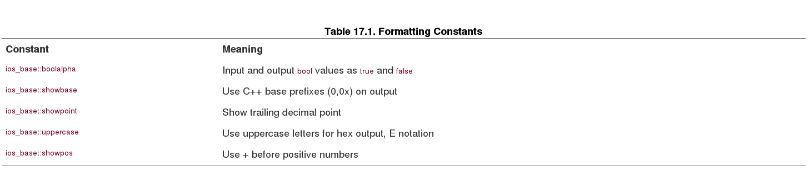 

        cout.setf(ios_base::hex, ios_base::basefield);
        
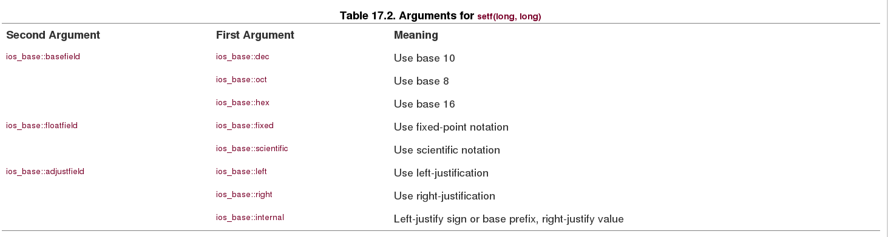

Under the Standard, both **fixed** and **scientific** notation have following two properties:

- Precision means the number of digits to the right of the decimal rather than the total number of digits.

- Trailing zeros are displayed.

        ios_base::fmtflags old = cout.setf(ios::left, ios::adjustfield);
        
        To restore the previous setting, do this:
        
        
        cout.setf(old, ios::adjustfield); 

The effects of calling setf() can be undone with **unsetf()**, which has the following prototype:

        void unsetf(fmtflags mask);
        
Here **mask** is a bit pattern. All bits set to 1 in **mask** cause the corresponse bits to be unset. That is, setf() sets bits to 1 and unsetf() sets bits back to 0. For example:

        cout.setf(ios_base::showpoint);   //show trailing decimal point
        cout.unsetf(ios_base::showpoint); //don't show trailing decimal point
        cout.setf(ios_base::boolalpha);   //display true, false
        cout.unsetf(ios_base::boolalpha); //display 1,0
        
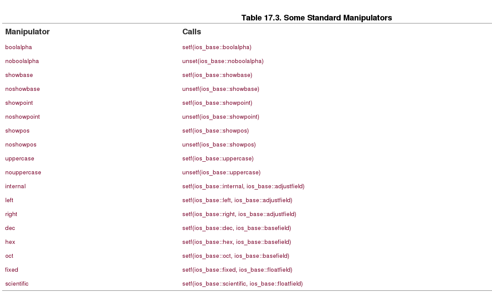

summarizes some of the differences **between older C++ formatting and the current state**. One moral of this table is that you shouldn't feel baffled if you run an example program you've seen somewhere and the output format doesn't match what is shown for the example.

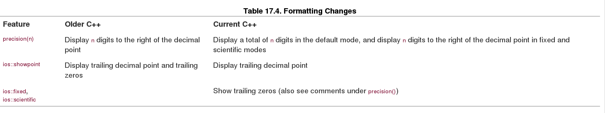

## Input with cin ##

Overloads the >> extraction operator to recognize the following basic types:

- signed char &
- unsigned char &
- char &
- short &
- unsigned short &
- int &
- unsigned int &
- long &
- unsigned long &
- float &
- double &
- long double &

A typical operator function has a prototype like the following:

        istream & operator>>(int &);
        
Incidentally, you can use the **hex,oct,and dec manipulators** with cin to specify that integer input is to be interpreted as hexadecimal, octal, or decimal format. For example, the statement.

        cin >> hex;
        
The istream class also overloads the >> extraction operator for character pointer types:

- signed char *
- char *
- unsinged char *

For this type of argument, the extraction operator reads the **next word** from input and places it at the indicated address, adding a null character to make a string. For example, suppose you have this code.

        cout << "Enter your first name:\n";
        
        char name[20];
        
        cin >> name;
        
The various versions of the extraction oeprator share a common way of looking at the input stream. They skip over white space(blanks, newlines, and tabs) until they encounter a nonwhite-space character. 

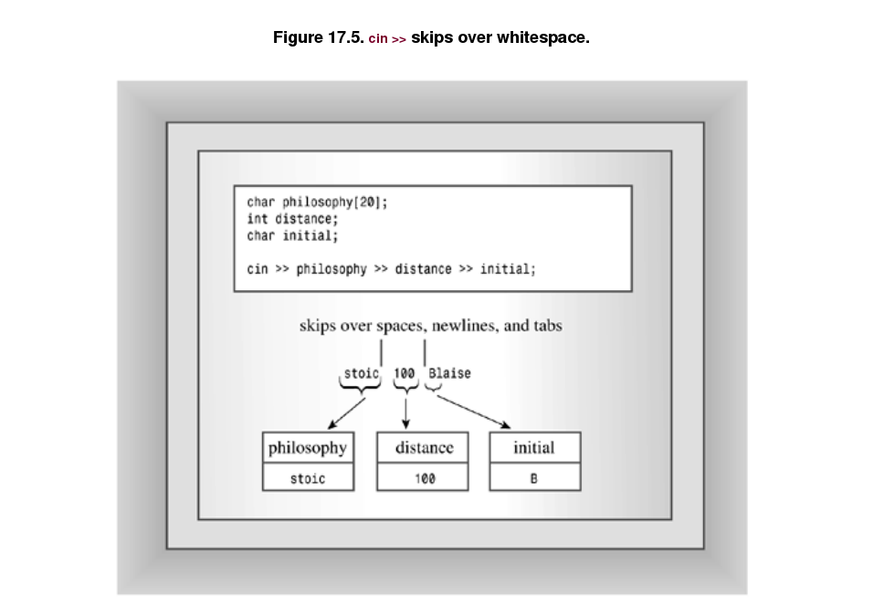

For example, consider the following code:

        int elevation;
        cin >> elevation;
        
suppose you type the following characters:

        -123Z

It can happen that input fail to meet a program's expectation. For example, suppose you entered Zcar instead of -123Z. In that case. the extraction operator leaves the value of elevation unchanged and returns the value zero. The **false** return value allows a program to check whether input meets the program requirements.

### Stream States ###

A **cin** or **cout** object contains a data member(inherited from the **ios_base** class) that describes the **stream_state**. A stream state(defined as type **iostate**, which, in turn, is a bitmask type) consists of the three ios_base elements: **eofbit, badbit, or failbit**. Each element is single bit that can be 1(set) or 0(cleared). 

when a **cin** operation reaches the end of a file. it sets the **eofbit**. when a **cin** operation fails to read the expected characters, as in the earlier example, it sets the **failbit**. I/O failures, such as trying to read a non-accessible file or trying to write-protected diskette, also can set **failbit** to 1. The **badbit** element is set when some undiagosed failure may have corrupted the stream. 

When all three of these state bits are set to 0, everything is fine. 

Programs can check the stream state and use that information to decide what to do next. Table 17.5 lists these bits along with some ios_base methods that report or alter the stream state. 
 
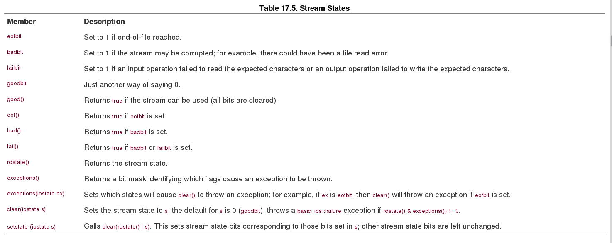

The difference between **clear() and setstate()**:

- clear() : uses the default argument of 0, which clears all three state bits(eofbit, badbit, and failbit). 
- clear(eofbit) :  makes the state equal to eofbit; that is, the eofbit is set and the other two state bits are cleared.
- setstate(eofbit) : sets eofbit without affecting the other bits. So if failbit were already set, it stays set.(The main purpose for setstate() is to provide a means for input and output functions to change the state).

#### I/O and Exceptions ####

Suppose,Say,an input function sets **eofbit**. By default, no exception is thrown. The programe can use the **exceptions()** method to control how exceptions are handle.

Changing the stream state involves either clear() or setstate(), which uses clear(). After changing the stream state, the **clear()** method compares the current stream state to the value returned by **exceptions()**. If a bit is set in the return value and the corresponding bit is set in current state, **clear()** throws an **ios_base::failure** exception. This would happen, for example, if both values had **badbit** set. It follows that if **exceptions()** returns goodbits, no exceptions are thrown. The **ios_base::failure** exception class derives from the std::exception class and thus has a **what()** method.

        cin.exceptions(badbit); //settings badbit causes exception to be thrown
        
        cin.exceptions(badbit | eofbit); //an exception being thrown if either badbit or eofbit subsequenly is set
        

        // cinexcp.cpp
        
        #include <iostream>
        
        #include <exception>
        
        using namespace std;
        
        
        
        int main()
        
        {
        
            // have failbit cause an exception to be thown
        
            cin.exceptions(ios_base::failbit);
        
            cout.precision(2);
        
            cout << showpoint << fixed;
        
            cout << "Enter numbers: ";
        
            double sum = 0.0;
        
            double input;
        
            try {
        
                while (cin >> input)
        
                {
        
                    sum += input;
        
                }
        
            } catch(ios_base::failure & bf)
        
            {
        
                cout << bf.what() << endl;
        
                cout << "O! the horror!\n";
        
            }
        
        
        
            cout << "Last value entered = " << input << "\n";
        
            cout << "Sum = " << sum << "\n";
        
            return 0; 
        
        }
        

### Stream State Effects ###

Setting a stream state bit has a very important consequence: **The stream is closed for further input or ouput until the bit is cleared.**

If you want a program to read further input after a stream state bit has been set, you have to reset the stream state to good. This can be done by calling the clear() method.

        while (cin >> input)
        
        {
        
            sum += input;
        
        }
        
        cout << "Last value entered = " << input << "\n";
        
        cout << "Sum = " << sum << "\n";
        
        if (cin.fail() && !cin.bad() ) // failed because of mismatched input
        
        {
        
        
        
              cin.clear();      // reset stream state
        
              while (!isspace(cin.get()))
        
                   continue;    // get rid of bad input
        
        }
        
        else // else bail out
        
        {
        
              cout << "I cannot go on!\n";
        
              exit(1);
        
        }
        
        cout << "Now enter a new number: ";
        
        cin >> input;  // will work now
        
        
### Other istream Class Methods ### 

- The get(char &) and get(void) methods provide single-character input that doesn't skip over whitespace.

- The get(char *, int, char) and getline(char *, int, char) functions read entire lines by default rather than single words.

### Single-Character Input ###

        int ct = 0;
        
        char ch;
        
        cin.get(ch);
        
        while (ch != '\n')
        
        {
        
            cout << ch;
        
            ct++;
        
            cin.get(ch);
        
        }
        
        cout << ct << '\n'; 
        
The get(char &) member function returns a reference to the **istream** object used to invoke it. This means you can concatenate other extractions following get(char &);

        char c1, c2, c3;
        cin.get(c1).get(c2) >> c3;
        
If **cin.get(char &)** encounters the end of a file, either real or simulated from the keyboard (<Ctrl>-<Z> for DOS, <Ctrl>-<D> at the beginning of a line for UNIX), it does not assign a value to its argument. This is quite right, for if the program has reached the end of the file, there is no value to be assigned. Furthermore, the method calls **setstate(failbit)**, **which causes cin to test as false**:

        char ch;
        
        while (cin.get(ch))
        
        {
        
             // process input
        
        }        
        
As long as there's valid input, the return value for cin.get(ch) is cin, which evaluates as true, so the loop continues. Upon reaching end-of-file, the return value evaluates as false, terminating the loop.

The **get(void)** member function also reads white space, but it uses its return value to communicate input to a program. So you would use it this way:

        int ct = 0;
        
        char ch;
        
        ch = cin.get();      // use return value
        
        while (ch != '\n')
        
        {
        
            cout << ch;
        
            ct++;
        
            ch = cin.get();
        
        }
        
        cout << ct << '\n';
        
### cin.get(ch) vs cin.get() ###

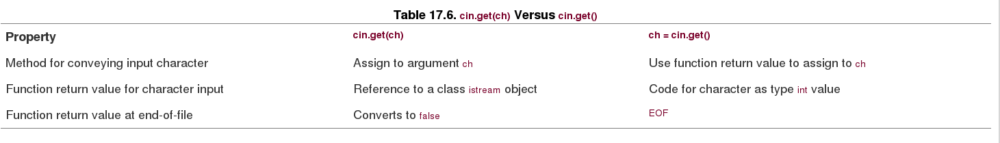

### String Input: getline(),get() and ignore() ###

        istream & get(char *, int, char = '\n');
        istream & getline(char *, int, char = '\n');
        
- first argument, is the address of the location to place the input string.
- The second argument is one greater than the maximum number of characters to be used.(The additional character leaves space for the terminating null character used in storing the input as a string).
- if you omit the third argument, each function reads up to the maximum characters or utils it encounters a newline character. 

for example:

        char line[50];
        
        cin.get(line, 50);
        
The chief difference between **get()** and **getline()** is that **get()** leaves the newline character in the input stream, making it the first character seen by the next input operation, while **getline()** extracts and discards the newline character from the input stream.

        cin.ignore(255, '\n');

reads and discards the next 255 characters or up through the first newline character, whichever comes first. The prototype provides defaults of 1 and EOF for the two arguments, and the function return type is istream &:

        istream & ignore(int = 1, int = EOF);

### Unexpected String Input ###

Now consider the **get(char *, int)** method. It tests the number of characters first, end-of-file second, and for the next character being a newline third. It does not set the failbit flag if it reads the maximum number of characters. You can use **peek()** (see the next section) to examine the next input character. If it's a newline, then get() must have read the entire line. If it's not a newline, then get() must have stopped before reaching the end. 

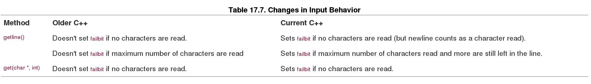

### Other istream Methods ###

Other **istream** methods  include **read()**,**peek()**,and **putback()**. The read() function reads a given number of bytes, store them in the specified location. 

        char gross[144];
        
        cin.read(gross, 144);
        
Unlike getline() and get(), **read() does not append a null character to input**, so it doesn't convert input to string form.

The **read()** method is not primarily intended for keyboard input. Instead, it most often is used in conjunction with the ostream write() function for file input and output.

The **gcount()** method returns the number of characters read by the last unformatted extraction method. That means characters read by a get(), getline(), ignore(), or read() method but not by the extraction operator (>>), which formats input to fit particular data types. For example, suppose you've just used cin.get(myarray, 80) to read a line into the myarray array and want to know how many characters were read. You could use the strlen() function to count the characters in the array, but it would be quicker to use cin.gcount() to report how many characters were just read from the input stream.

The **putback()** function inserts a character back in the input string. The inserted character then becomes the first character read by the next input statement. The putback() method takes one char argument, which is the character to be inserted, and it returns type istream &, which allows the call to be concatenated with other istream methods. **Using peek() is like using get() to read a character, then using putback() to place the character back in the input stream. However, putback() gives you the option of putting back a character different from the one just read**.

## File Input and Output ##

C++ defines serveral new classes in the **fstream(formely fstream.h)** header file, including an **ifstream** class for file input and **ofstream** class for file output. 

C++ also defines an **fstream** class for simultaneous file I/O. These classes are derived from the classes in the **iostream** header file, so objects of these new classes will be able to use the methods you've already leared.

### Simple File I/O ###

Suppose you want a program to write to a file. You must do the following:

- Create an ofstream object to manage the output stream.

        ofstream fout;

- Associate that object with a particular file.

        fout.open("cookies");//create an ofstream object named fout
        (or ofstream fout("cookies"))

- Use the obejct the same way you would use cout; the only difference is that ouput goes to the file instead of to the screen.

        fout << "Dull Data";

**Caution** : Opening a file for output in the default mode automatically truncates the file to zero size, in effect disposing of the prior contents.

The requirements for reading a file are much like those for writing to a file:

- Create an ifstream object to manage the input stream.

        ifstream fin; //create ifstream object called fin

- Associate that object with a partiuclar file.

        fin.open("jerryjar.dat");
        (or fin.open("jerryjar.dat")) 

- Use the object the same way you would use cin.

        char ch;
        fin >> ch;

        char buf[80];
        fin.getline(buf, 80);
        
Input, like output, **is buffered**, so creating an **ifstream** object like fin creates an **input buffer** which the fin object manages. As with output, **buffering moves data much faster than byte-by-byte transfer**.

The connections with a file are closed automatically when the input and output stream objects expire—for example, when the program terminates. Also, you can close a connection with a file explicitly by using the close() method:

        fout.close();    // close output connection to file
        
        fin.close();     // close input connection to file

重要：流连接关闭后，流对象可以继续使用

Closing such a connection does not eliminate the stream; it just disconnects it from the file. However, the stream management apparatus remains in place. For example, the fin object still exists along with the input buffer it manages. As you'll see later, you can reconnect the stream to the same file or to another file.

### Opening Multiple Files ###

The number of Files you can open simultaneously depends on the operaing systems, but typedically is on the order of 20;

### Command-Line Processing ###

C++ has a mechanism for letting a program access command-line arguments. Use the following alternative function heading for **main()**:

        int main(int argc, char * argv)
        
for example:

        wc report1 report2 report3
        
        Then argc would be 4, argv[0] would be wc, argv[1] would be report1
        
- Many DOS and Windows IDEs (integrated development environments) have an option for providing command-line arguments. Typically, you have to navigate through a series of menu choices leading to a box into which you can type the command-line arguments. The exact set of steps varies from vendor to vendor and from upgrade to upgrade, so check your documentation.
- DOS IDEs and many Windows IDEs can produce executable files that run under DOS or in a DOS window in the usual DOS command-line mode.
- Under Metrowerks CodeWarrior for the Macintosh, you can simulate command-line arguments by placing the following code in your program:

                ...
                
                #include <console.h> // for emulating command-line arguments
                
                int main(int argc, char * argv[])
                
                {
                
                    argc = ccommand(&argv); // yes, ccommand, not command
                
                    ...
                    
                    
                    
Compatibility Note;

Some implementations require using **fin.clear()** while others do not. It depends on whether associating a new file with the fstream object automatically resets the stream state or not.In does no harm to use **fin.clear()** even if is isn't needed.

### Stream Checking and is_open() ###

The C++ file stream classes inherit a stream-state member for the **ios_base** class. The file stream classes also inherit the ios_base methods that report about the stream state.  You can monitor conditions with these stream-state methods. For example, you can use the good() method to see that all the stream state bits are clear. However ,newer C++ implementations have a better way to check if a file has been opened-the **is_open()** method.

Caution:

In the past, the usual tests for successful opening of a file where the following:
    
        if(!fin.good()) //failed to open
        
        if(!fin)... //failed to open
        
**These test fail to detect one circumstance, which is attemping to open a file using a inapproriate file mode. The is_open() method catches this form of error.**

### File Modes ###

The file mode describes how a file is to used: read it, write to it, append it, and so on.When you assocaite a stream with a file, either by initializing a file stream object with a filename or by using the open() method, you can provide a second argument specifying the file mode:

The **ios_base** class defines an **openmode** type to represent the mode; like the **fmtflags** and **iostate** types, it is a **bitmask** type. 

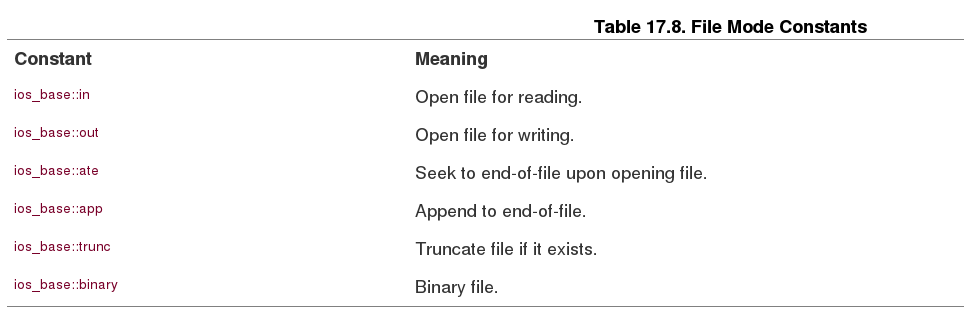

The **ifstream open()** method and constructor **use ios_base::in(open for reading)** as the default value for the mode argument.  while the **ofstream open()** method and constructor **use ios_base::out | ios_base::trunc** (open for writing and truncate the file) as the default. The fstream class doesn't provide a mode default, so you have to provide a mode explicitly when creating an object of that class.

writing to file and append : ofstream fout("bagels", ios_base::out | ios_base::app);

很重要的文件打开模式案例：
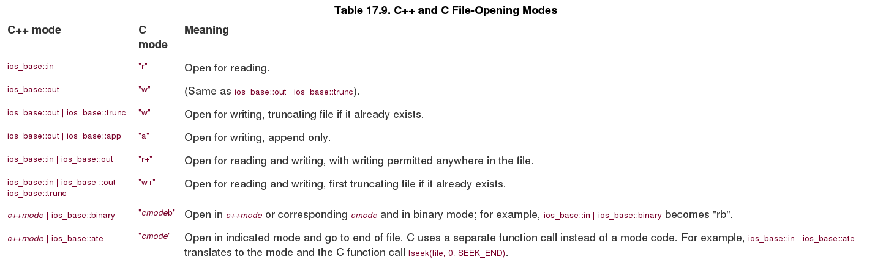

### Binary Files ###

When you store data in a file, you can store the data in text form or in binary format.

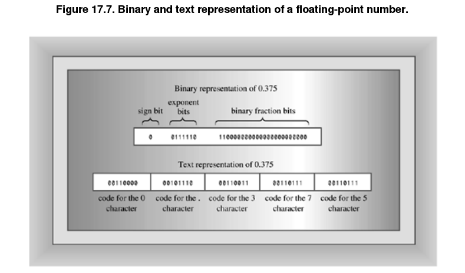

Each format has its advantages. The text format is easy to read. You can use an ordinary editor or word processor to read and edit a text file. You easily can transfer a text file from one computer system to another. The binary format is more accurate for numbers, because it stores the exact internal representation of a value. There are no conversion errors or round-off errors. Saving data in binary format can be faster because there is no conversion and because you may be able to save data in larger chunks. And the binary format usually takes less space, depending upon the nature of the data. Transferring to another system can be a problem, however, if the new system uses a different internal representation for values.

For example:

        struct planet
        
        {
        
            char name[20];       // name of planet
        
            double population;   // its population
        
            double g;            // its acceleration of gravity
        
        };
        
        planet pl;
        
To save the contents of the structure pl in text form, you can do this:

        ofstream fout("planets.dat", ios_base::app);
        
        fout << pl.name << " " << pl.population << " " << pl.g << "\n";

Note that you have to provide each structure member explicitly by using the membership operator, and you have to separate adjacent data for legibility. If the structure contained, say, 30 members, this could get tedious.

To save the same information in binary format, you can do this:

        ofstream fout("planets.dat", ios_base::app | ios_base::binary);
        
        fout.write( (char *) &pl, sizeof pl);

Some systems, such as DOS, support two file formats: text and binary. If you want to save data in binary form, you'd best use the binary file format. In C++ you do so by using the ios_base::binary constant in the file mode. If you want to know why you should do this on a DOS system, check the discussion in the following note on Binary Files and Text Files.

#### Binary Files and Text Files ####

Using a binary file mode causes a program to transfer data from memory to a file, or vice versa, without any hidden translation taking place. Such is not necessarily the case for the default text mode. For example, consider DOS text files. They represent a newline with a two-character combination: carriage return, linefeed. Macintosh text files represent a newline with a carriage return. Unix and Linux files represent a newline with a linefeed. C++, which grew up on Unix, also represents a newline with a linefeed. For portability, a DOS C++ program automatically translates the C++ newline to a carriage return, linefeed when writing to a text mode file; and a Macintosh C++ program translates the newline to a carriage return when writing to a file. When reading a text file, these programs convert the local newline back to the C++ form. The text format can cause problems with binary data, for a byte in the middle of a double value could have the same bit pattern as the ASCII code for the newline character. Also there are differences in how end-of-file is detected. So you should use the binary file mode when saving data in binary format. (Unix systems have just one file mode, so on them the binary mode is the same as the text mode.)

### Random Access ###

For our last example, let's look at random access. This means moving directly to any location in the file instead of moving through it sequentially. The random access approach is often used with database files. The **fstream** class derives from the **iostream** class, which, in turn, is based on both **istream** and **ostream** classes. so it inherits the methods of both.

The **fstream** class inherits two methods for this: **seekg()** moves the input pointer to a given file loaction, and **seekp()** moves the output pointer to a given file lcoation. (Actually, because the **fstream** class uses buffers for intermediate storage of data, the pointers point to locations in the buffer, not in the actual file.) 

Here are the **seekg()** prototypes:

        basic_istream<charT,traits> & seekg(off_type, ios_base::seekdir);
        basic_istream<charT,traits> & seekg(pos_type);
          
As you can see, they are templates. This chapter will use a template specialization for the char type. For the char specialization, the two prototypes are equivalent to the following:

        istream & seekg(streamoff, ios_base::seekdir);
        istream & seekg(streampos);
        
**The first prototype represents locating a file position measured, in bytes, as an offset from a file location specified by the second argument.** 

- ios_base::beg means measure the offset from the beginning of the file.
- ios_base::cur means measure the offset from the current position.
- ios_base::end means measure the offset from the end of file.

        fin.seekg(30, ios_base::beg);    // 30 bytes beyond the beginning
        
        fin.seekg(-1, ios_base::cur);    // back up one byte
        
        fin.seekg(0, ios_base::end);     // go to the end of the file

**The second prototype represents locating a file position measured in bytes from the beginning of a file.**

        fin.seekg(112);
        
        locates the file pointer at byte 112, which would be the 113th byte in the file. 
        

If you want to check the current position of a file pointer, you can use the **tellg()** method for input streams and the **tellp()** methods for output streams. 

### Real World Note:Working with temporary Files ###

How can you ensure that each file is assigned a unique name. Well, the **tmpnam()** standard function declared in **cstdio** has got you covered.

    char * tmpnam(char * pszName);
    
The **tmpnam()** function creates a temporary name and places it in the C-style string pointed to by pszNmae. The constants L_tmpnam and TMP_MAX, both defined in cstdio, limit the number characters in the filename and the maximum number of times **tmpnam()** can be called without generating a duplicate filename in the current directory.

## Incore Formating ##

The **iostream** family supports I/O between the program and a terminal. 

The **fstream** family uses the same interface to provide I/O between a program and a file.

The **sstream** family uses the same interface to provide I/O between a program and a string object.

The process of reading formated information from a string object or of writing formatted informaion to a string object is termed **incore formatting**.

The **sstream** header file defines an **ostringstream** class derived from the **ostream** class. 

        ostringstream outstr;
        
        double price = 55.00;
        
        char * ps = " for a copy of the draft C++ standard!";
        
        outstr.precision(2);
        
        outstr << fixed;
        
        outstr << "Pay only $" << price << ps << end;
        
The formatted text goes into a buffer, and the object uses dynamic memory allocation to expand the buffer size as needed. The ostringstream class has a member function, called str(), which returns a string object initialized to the buffer's contents:

        string mesg = outstr.str();    // returns string with formatted information
        
        
The **istringstream** class lets you use the istream family of methods to read data from an istringstream object, which can be initialized from a string object. Suppose facts is a string object. To create an istringstream object associated with this string, do the following:

        istringstream instr(facts);     // use facts to initialize stream. facts is a string
    
## What now? ##

The second stage is learning to use the language effectively.

Two common techniques are use-case analysis and CRC cards. In use-case analysis, the development team lists the common ways, or scenarios, in which they expect the final system to be used, identifying elements, actions, and responsibilities that suggest possible classes and class features. CRC (short for Class/Responsibilities/Collaborators) cards are a simple way to analyze such scenarios. The development team creates an index card for each class. On the card are the class name, class responsibilities, such as data represented and actions performed, and class collaborators, such as other classes with which the class must interact. Then the team can walk through a scenario, using the interface provided by the CRC cards. This can lead to suggesting new classes, shifts of responsibility, and so on.

On a larger scale are the systematic methods for working on entire projects. The most recent of these is the Unified Modeling Language, or UML. This is not a programming language; rather, it is a language for representing the analysis and design of a programming project. It was developed by Grady Booch, Jim Rumbaugh, and Ivar Jacobson, who had been the primary developers of three earlier modeling languages: the Booch Method, OMT (Object Modeling Technique), and OOSE (Object-Oriented Software Engineering), respectively. UML is the evolutionary successor of these three.

Information can be transferred between a buffer and a file using large chunks of data of the size most efficiently handled by devices like disk drives. 

And information can be transferred between a buffer and a program in a byte-by-byte flow that often is more convenient for the processing done in a program.

C++ programs that include the iostream file automatically open eight streams, managing them with eight objects. The **cin** object manages the standard input stream, which, by default, connects to the standard input device, typically a keyboard. The **cout** object manages the standard output stream, which, by default, connects to the standard output device, typically a monitor. The **cerr and clog** objects manage **unbuffered** and **buffered** streams connected to the standard error device, typically a monitor. These four objects have four wide character counterparts named **wcin, wcout, wcerr, and wclog**.

You can control how a program formats output by using ios_base class methods and by using manipulators (functions that can be concatenated with insertion) defined in the iostream and iomanip files. These methods and manipulators let you control the number base, the field width, the number of decimal places displayed, the system used to display floating-point values, and other elements.        
        
A text file stores all information in character form. For example, numeric values are converted to character representations. The usual insertion and extraction operators, along with **get()** and **getline()**, support this mode. A binary file stores all information using the same binary representation the computer uses internally. Binary files store data, particularly floating-point values, more accurately and compactly than text files, but they are less portable. The **read()** and **write()** methods support binary input and output.

The **seekg()** and **seekp()** functions provide C++ random access for files. These class methods let you position a file pointer relative to the beginning of a file, relative to the end, or relative to the current position. The tellg() and tellp() methods report the current file position.

