## String Class ##

### Constructing a String ###

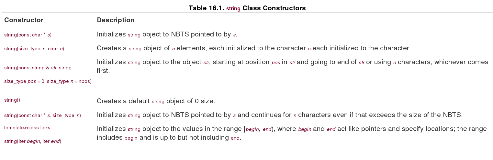

### string class input ###

For C-style strings, recall, you have three options:

        char info[100];
        
        cin >> info;             // read a word
        
        cin.getline(info, 100);  // read a line, discard \n
        
        cin.get(info, 100);      // read a line, leave \n in queue
 
As long as the input sequence is shorter than the maximum allowable number of characters for a string object, the operator>>(istream &, string &) function **automatically dimensions the string object** to fit the input string. The upshot is that you can use >> with string objects just as you do with C-style strings, but without worrying about overrunning the array size:   
    
        char fname[10];
        
        cin >> fname;      // could be a problem if input size > 9 characters
        
        string lname;
        
        cin >> lname;      // can read a very, very long word

To get the same syntax to work with a **string** object would require adding a new member function to the **istream** class, which would not be wise. Instead, the string library defines a non-member function **getline()** that takes an istream object as its first argument and a **string** object as its second argument. Thus, it's used as follows to read a line of input into a **string** object:

        cin.getline(fname, 10);
        
        string fullName;
        getline(cin, fullName);  
        //instead of cin.getline(fname, 10); and utomatically dimensions the string object
        

### Compare Strings ###

You can compare strings. All six relational operators are overloaded for **string** objects, Each relational operator is overloaded three ways so that you can compare a string object with another string object, compare a string object with a C-style string, and compare a C-style string with a string object:

        string snake1("cobra");
        
        string snake2("coral");
        
        char snake3[20] = "anaconda";
        
        if (snake1 < snake 2)           // operator<(const string &, const string &)
        
            ...
        
        if (snake1 == snake3)           // operator==(const string &, const char *)
        
            ...
        
        if (snake3 != snake2)           // operator!=(const char *, const string &)

You can determine the size of a string. Both the **size()** and **length()** member functions return the number of characters in a string:        

        if (snake1.length() == snake2.size())
            cout << "Both strings have the same length.\n"
            
Why two functions that do the same thing? The **length()** member comes from earlier versions of the string class, while **size()** was added for STL compatibility.

### String Search ###

You can search a string for a given substring or character in a variety of ways. Table 16.2 provides a short description of four variations of a **find()** method. Recall that **string::npos** is the maximum possible number of characters in a string, typically the largest **unsigned int** or **unsigned long** value.

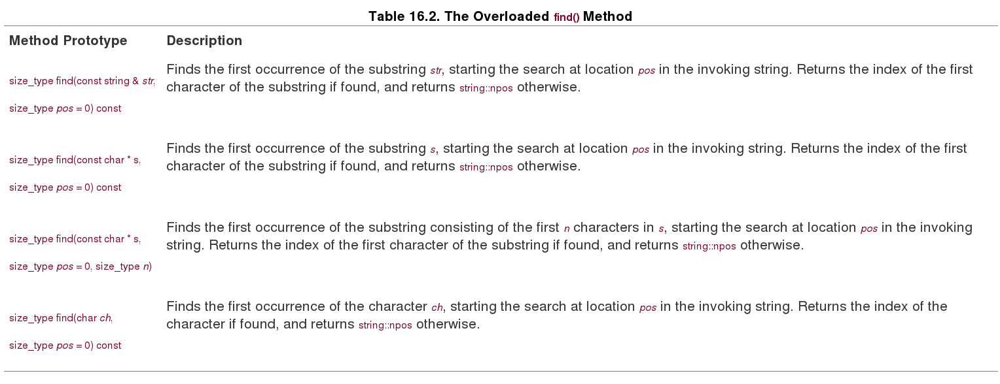

The library also provides the related methods **rfind(), find_first_of(), find_last_of(), find_first_not_of(), and find_last_not_of()**, each with the same set of overloaded function signatures as the find() method. The **rfind()** finds the last occurrence of a substring or character. The **find_first_of()** finds the first occurrence in the invoking string of any of the characters in the argument. For example, the statement:

        int where = snake1.find_first_of("hark");
        
would return the location of the **r** in **"cobra"** (i.e., the index 3) because that's the first occurrence of any of the letters in **"hark"** in **"cobra"**. The **find_last_of()** method works the same, except it finds the last occurrence. Thus, the statement:

        int where = snake1.last_first_of("hark");
        
would return the location of the **a** in **"cobra"**. The **find_first_not_of()** method finds the first character in the invoking string that is not a character in the argument. So

        int where = snake1.find_first_not_of("hark");
        
would return the location of the **c** in **"cobra"**, for c is not found in hark. We leave the description of **find_last_not_of()** as an exercise for the reader.

### String Compare ###

You can use the overloaded **==** operator to compare string objects. However, the case-sensitive nature in which the **==** operator performs its equality comparison can be a problem in some cases. Often, two strings need to be compared for equality without respect to their case. For example, a program may compare input from a user with a constant value, and the user may not use the same case. Consider the following sample:

        #include <string>       //  string object
        
        
        
        ...
        
        string strA;
        
        cin >> strA;  // assume user enters Maplesyrup
        
        string strB = "mapleSyrup";  // stored constand
        
        
        
        if( strA == strB )
        
        {
        
          cout << "The strings are equal.\n";
        
        }
        
        else
        
        {
        
          cout << "The strings are not equal.\n";
        
        }
        
Because 'M' is different from 'm' and 's' is different from 'S', the output is this:
    
        The strings are not equal.
        
What if your program needed to perform a case-insensitive comparison on strA and strB? Many C libraries provide a **stricmp()** or **_stricmp()** function that does a case-insensitive test. (However, this function isn't listed in the C standard, so it's not universally available.) By creating your own overloaded version of this function, you can cobble together a simple workaround

        #include <string.h>  // for stricmp() on many systems
        
        #include <string>    // string object
        
        
        
        string strA;
        
        cin >> strA;  // assume user enters Maplesyrup
        
        string strB = "mapleSyrup";  // stored constant
        
        inline bool stricmp( const std::string& strA,
        
                             const std::string& strB )  // overloaded function
        
        {
        
          return stricmp( strA.c_str(), strB.c_str() ) == 0;    // C function
        
        }
        
        
        
        bool bStringsAreEqual = stricmp( strA, strB );
       
### What Else ###

The string library supplies many other facilities. There are functions for erasing part or all of a string, for replacing part or all of one string with part or all of another string, for inserting material into a string or removing material from a string, for comparing part or all of one string with part or all of another string, and for extracting a substring from a string. There's a function for copying part of one string to another string, and a function for swapping the contents of two strings. Most of these functions are overloaded so that they can work with C-style **strings** as well as with string objects. **Appendix F** describes the string library function briefly.

This section has treated the string class as if it were based on the char type. In fact, as mentioned earlier, the string library really is based on a template class:

        template<class charT, class traits = char_traits<charT>,
        
                class Allocator = allocator<charT> >
        
        basic_string {...};
        
The class includes the following two **typedefs**:

        typedef basic_string<char> string;
        
        typedef basic_string<wchar_t> wstring;
        
This allows you to use strings based on the **wchar_t** as well as the char type. You even could develop some sort of character-like class and use the **basic_string** class template with it, providing your class met certain requirements. The **traits** class is a class that describes specific facts about the chosen character type, such as how to compare values. There are predefined specializations of the **char_traits** template for the **char** and wchar_t types, and these are the default values for traits. The **Allocator** class represents a class to manage memory allocation. There are predefined specializations of the **allocator** template for the **char** and **wchar_t** types, and these are the defaults. They use **new** and **delete** in the usual fashion, but you could reserve a chunk of memory and provide your own allocation methods.

## The auto_ptr Class ##

The **auto_ptr** class is a **template class** for managing the use of dynamic memory allocation. Let's take a look at what might be needed and how it can be accomplished. Consider the following function:

### memory leak example ###

        void remodel(string & str)
        
        {
        
            string * ps = new string(str);
        
            ...
        
            str = ps;
        
            return; //memory leak ps
        
        }
        
        void remodel(string & str)
        
        {
        
            string * ps = new string(str);
        
            ...
        
            if (weird_thing())
        
                throw exception(); //memory leak ps
        
            str = *ps;
        
            delete ps;
        
            return;
        
        }

        
### Using an auto_ptr ###

The **auto_ptr** template defines a pointer-like object intended to be assigned an address obtained (directly or indirectly) by **new**. When an **auto_ptr** object expires, its destructor uses **delete** to free the memory. Thus, if you assign an address returned by **new** to an **auto_ptr** object, **you don't have to remember to free the memory later; it will be freed automatically when the **auto_ptr** object expires**. Figure 16.2 illustrates the behavioral difference between an **auto_ptr** and a regular pointer.

   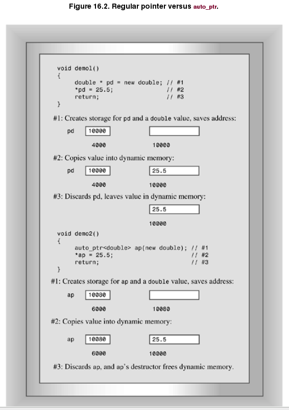
   
to convert the **remodel()** function, you would follow these three steps:

- Include the **memory** header file.

- Replace the **pointer-to-string** with **an auto_ptr** to **string**.

- Remove the **delete** statement.

Here's the function with those changes made:

        #include <memory>
    
        void remodel(string & str)
        
        {
        
            auto_ptr<string> ps (new string(str));
        
            ...
        
            if (weird_thing())
        
                throw exception();
        
            str = *ps;
        
            // delete ps;  NO LONGER NEEDED
        
            return;
        
        } 
        
Note that **auto_ptr** constructor is **explicit**, meaning there is no implicit type cast from a pointer to an **auto_ptr**:

        auto_ptr<double> pd;
        
        double *p_reg = new double;
        
        pd = p_reg;                   // not allowed (implicit conversion)
        
        pd = auto_ptr<double>(p_reg); // allowed (explicit conversion
        
        auto_ptr<double> pauto = pd;  // not allowed (implicit conversion)
        
        auto_ptr<double> pauto(pd);   // allowed (explicit conversion
        
The **auto_ptr** is not a panacea. For example, consider the following code:

        auto_ptr<int> pi(new int [200]);   // NO!
        
        string vacation("I wandered lonely as a cloud.");
        
        auto_ptr<string> pvac(&vacation);  // NO!
        
**Caution**: Use an **auto_ptr** object only for memory allocated by **new**, not for memory allocated by **new []** or by simply declaring a variable.

Now consider assignment:

        auto_ptr<string> ps (new string("I reigned lonely as a cloud."));
        
        auto_ptr<string> vocation;
        
        vocation = ps;

What should the assignment statement accomplish? If **ps** and **vocation** were ordinary pointers, the result would be two pointers pointing to the same **string** object. That is not acceptable here, for then the program would wind up attempting to delete the same object twice, once when **ps** expires, and once when **vocation** expires. There are ways to avoid this problem:

- Define the assignment operator so that it makes a deep copy. This results in two pointers pointing to two distinct objects. one of which is a copy of the other.

- Institute the concept of `ownership`, **with only one smart pointer allowed to own a particular object**. Only if the smart pointer owns the object will its constructor delete the object. Then have assignment transfer `ownership`. This is the strategy used for **auto_ptr**.

- Create an even smarter pointer that keeps track of how many smart pointers refer to a particular object. This is called `reference counting`. Assignment, for example, would increase the count by one, and the expiration of a pointer would decrease the count by one. Only when the final pointer expires would **delete** be invoked.

The same strategies, of course, would also be applied to the copy constructors.

Each approach has its uses. Here's a situation, for example, that may not work properly using **auto_ptr** objects:

        auto_ptr<string> films[5] =
        
        {
        
            auto_ptr<string> (new string("Fowl Balls")),
        
            auto_ptr<string> (new string("Duck Walks")),
        
            auto_ptr<string> (new string("Chicken Runs")),
        
            auto_ptr<string> (new string("Turkey Errors")),
        
            auto_ptr<string> (new string("Goose Eggs"))
        
        };
        
        auto_ptr<string> pwin(films[2]); //films[2] ownership给pwin, 自己被delete
        
        int i;
        
        cout << "The nominees for best avian baseball film are\n";
        
        for (i = 0; i < 5; i++)
        
            cout << *films[i] << endl;  //访问films[2]时，报Segmentation fault
        
        cout << "The winner is " << *pwin << "!\n";
        
The problem is that transferring ownership from **films[2]** to pwin may cause **films[2]** to no longer refer to the string. That is, after an **auto_ptr** object gives up ownership, it may no longer be usable. Whether it's usable or not is an implementation choice.

Smart Pointers Concept:

The C++ library **auto_ptr** is an example of a `smart pointer`. A smart pointer is a class designed so that objects of that class have pointer-like properties. For example, a smart pointer can store the address of memory allocated by **new** and can be dereferenced. Because a smart pointer is a class object, it can modify and augment the behavior of a simple pointer. For instance, a smart pointer can institute reference counting. This allows several objects to share a single representation of a value tracked by a smart pointer. When the number of objects using the value drops to zero, the smart pointer can then delete the value. Smart pointers can allow for more efficient use of memory and help prevent memory leaks, but they do require the user to become familiar with new programming techniques

## The Standard Template Library ##

### STL简介  ###

**Alex Stepanov and Meng Lee developed STL at Hewlett-Laboratories**, releasing the implementation in 1994. The ISO/ANSI C++ committee voted to incorporate it as a part of the C++ standard. The STL is not an example of object-oriented programming. Instead, it represents a different programming paradigm called generic programming. This makes STL interesting both in terms of what it does and in its approach. 

### STL主要内容 ###

The Standard Template Library, or STL, provides a collection of templates representing `containers`, `iterators`, `function objects`, and `algorithms`.

- A **container** is a unit, like an array, that can hold several values. STL containers are homogeneous, that is, they hold values all of the same kind.

- **Algorithms** are recipes for accomplishing particular tasks, such as sorting an array or finding a particular value in a list.

- **Iterators** are objects that let you move through a container much as pointers let you move through an array; they are generalizations of pointers.

- **Function objects** are objects that act like functions; they can be class objects or function pointers (which includes function names because a function name acts as a pointer).

The STL lets you construct a variety of containers, including arrays, queues, and lists, and lets you perform a variety of operations, including searching, sorting, and randomizing.

###The vector Template Class ###

#### Allocators Again ####

Like the string class, the various STL container templates take an optional template argument specifying what allocator object to use to manage memory. For example, the vector template begins like this:

        template <class T, class Allocator = allocator<T> >
        
            class vector {...
            
If you omit a value for this template argument, the container template uses the allocator<T>s by default. This class uses **new** and **delete** in the standard ways.

#### Things to Do to Your Vectors ####

All the STL containers provide certain basic methods, including **size()**, which returns the number of elements in a container, **swap()**, which exchanges the contents of two containers, **begin()**, which returns an **iterator** referring to the first element in a container, and **end()**, which returns an **iterator** representing `past-the-end(null)` for the container.

**What's an iterator**? It's a generalization of a pointer. In fact, it can be a pointer. Or it can be an object for which pointer-like operations such as dereferencing **(operator*())** and incrementing **(operator++())** have been defined. As you'll see later, generalizing pointers to iterators allows the STL to provide a uniform interface for a variety of container classes, including ones for which simple pointers wouldn't work. Each container class defines a suitable iterator. The type name for this iterator is a class scope **typedef** called iterator. For example, to declare an iterator for a type double specialization of vector, you would do this:

        vector<double>::iterator pd;  // pd an iterator

Suppose scores is a vector<double> object:

        vector<double> scores;
        
Then you can use the **iterator** pd do things like the following:

        pd = scores.begin();  // have pd point to the first element
        
        *pd = 22.3;           // dereference pd and assign value to first element
        
        ++pd;                 // make pd point to the next element
        
**As you can see, an iterator behaves like a pointer** 

        for (pd = scores.begin(); pd != scores.end(); pd++)
        
            cout << *pd << endl;;
            
All containers have the methods just discussed. The vector template class also has some methods that only some STL containers have. One handy method, called **push_back()** adds an element to the end of a vector. While doing so, it attends to memory management so that the vector size increases to accommodate added members. This means you can write code like the following:

        vector<double> scores;  // create an empty vector
        
        double temp;
        
        while (cin >> temp && temp >= 0)
        
            scores.push_back(temp);
        
        cout << "You entered " << scores.size() << " scores.\n";
        
        
The first iterator refers to the beginning of the range, and the second iterator is one beyond the end of the range. For example:

        scores.erase(scores.begin(), scores.begin() + 2);
        
An **insert()** method complements **erase()**. It takes three iterator arguments. The first gives the position ahead of which new elements are to be inserted. The second and third iterator parameters define the range to be inserted. This range typically is part of another object. For example, the code

        vector<int> old;
        
        vector<int> new;
        
        ...
        
        old.insert(old.begin(), new.begin() + 1, new.end());
        

### More Things to Do to Your Vectors ###

There are many things programmers commonly do with arrays, such as search them, sort them, randomize the order, and so on. Does the vector template class have methods for these common operations? **No! The STL takes a broader view, defining `non-member` functions for these operations**. Thus, instead of defining a separate **find()** member function for each container class, it defines a single find() non-member function that can be used for all container classes. This design philosophy saves a lot of duplicate work. For example, suppose you had 8 container classes and 10 operations to support. If each class had its own member function, you'd need 8*10 or 80 separate member function definitions. But with the STL approach, you'd need just 10 separate non-member function definitions. And if you defined a new container class, providing you followed the proper guidelines, it, too, could use the existing 10 non-member functions to find, sort, and so on.

-  for_each() : can be used with any container class. It takes three arguments. The first two are iterators defining a range in the container, and the last is a pointer to a function.
    
            vector<Review>::iterator pr;
            
            for (pr = books.begin(); pr != books.end(); pr++)
            
                ShowReview(*pr);
            
            with the following:
            
            
            for_each(books.begin(), books.end(), ShowReview);

- random_shuffle() : takes two iterators specifying a range and rearranges the elements in that range in random order. Unlike for_each, which works with any container class, this function requires that the container class allow random access, which the vector class does.

            random_shuffle(books.begin(), books.end());
            
- sort() :  too, requires that the container support random access. It comes in two versions. The first version takes two iterators defining a range, and it sorts that range using the **< operator** defined for the type element stored in the container. For example:

            vector<int> coolstuff;
            
            ...
            
            sort(coolstuff.begin(), coolstuff.end());
            

    < operator:
    
            bool operator<(const Review & r1, const Review & r2)
            {
            
                if (r1.title < r2.title)
            
                    return true;
            
                else if (r1.title == r2.title && r1.rating < r2.rating)
            
                    return true;
            
                else
            
                    return false;
            }
            
    Then you can use the second form of sort(). It takes three arguments.  The return value should be convertible to bool, with false meaning the two arguments are in the wrong order. Here's an example of such a function:
    
            bool WorseThan(const Review & r1, const Review & r2)
            {
            
                if (r1.rating < r2.rating)
            
                    return true;
            
                else
            
                    return false;
            
            }
            
            sort(books.begin(), books.end(), WorseThan);
            
## Generic Programming ##

Now that you have some experience using the STL, let's look at the underlying philosophy. The STL is an example of generic programming. **Object-oriented programming concentrates on the data aspect of programming, while generic programming concentrates on algorithms. The main things the two approaches have in common are abstraction and the creation of reusable code, but the philosophies are quite different.**

A goal of generic programming is to write code that is independent of data types. Templates are the C++ tools for doing generic programs. Templates, of course, let you define a function or class in terms of a generic type. The STL goes further by providing a generic representation of algorithms. Templates make this possible, but not without the added element of careful and conscious design. **To see how this mixture of templates and design works, let's see why iterators are needed.**

### Why Iteratros? ###

Understanding iterators is perhaps **the key** to understanding the STL. **Just as templates make the algorithms independent of the type of data stored, iterators make the algorithms independent of the type of container used.** Thus, they are an essential component of the STL's generic approach.

The goal of generic programming would be to have a single find function that would work with arrays or linked lists or any other container type. That is, not only should the function be independent of the data type stored in the container, it should be independent of the data structure of the container itself. Templates provide a generic representation for the data type stored in a container. What's needed is a generic representation of the process of moving through the values in a container. **The iterator is that generalized representation.**

What properties should an iterator have in order to implement a **find** function? Here's a short list:

- You should be able to dereference an iterator in order to access the value to which it refers. That is, if p is an iterator, *p should be defined.

- You should be able to assign one iterator to another. That is, if p and q are iterators, the expression p = q should be defined.

- You should be able to compare one iterator to another for equality. That is, if p and q are iterators, the expressions p == q and p != q should be defined.

- You should be able to move an iterator through all the elements of a container. This can be satisfied by defining ++p and p++ for an iterator p.

#### padding knowlege: ####

To distinguish between the prefix and postfix versions of the ++ operator, C++ adopted the convention of letting **operator++()** be the prefix version and **operator++(int)** be the postsuffix version; the argument is never used, hence needn't be given a name.

#### 数组find算法演化成Iterator方式 ####

通过数组定义

double * find_ar(double * ar, int n, const double & val)
{

    for (int i = 0; i < n; i++)

        if (ar[i] == val)

            return &ar[i];

    return 0;
}

演化成iterator方式

typedef double * iterator;

iterator find_arr(iterator ar, int n, const double & val)
{

    for(int i = 0; i < n; ar++)
        if(*ar == val)
            return ar;
        return 0;
}

#### 链表find算法演化程Iterator方式 ####

        struct Node
        {
        
            double item;
        
            Node * p_next;
        
        };
        
        Node* find_ll(Node * head, const double & val)
        {
        
            Node * start;
        
            for (start = head; start!= 0; start = start->next)
        
                if (start->item == val)
        
                    return start;
        
            return 0;
        
        };
        
演化成iterator方式

        struct Node
        {
        
            double item;
        
            Node * p_next;
        
        };
        
        class iterator
        {
        
            Node * pt;
        
        public:
        
            iterator() : pt(0) {}
        
            iterator (Node * pn) : pt(pn) {}
        
            double operator*() { return pt->item;}
        
            iterator& operator++()     // for ++it
            {
        
                pt = pt->next;
        
                return *this;
        
            }
        
            iterator operator++(int)  // for it++
            {
        
                iterator tmp = *this;
        
                pt = pt->next;
        
                return tmp;
        
            }
        
        // ... operator==(), operator!=(), etc. 
        
        };
        
        iterator find_ll(iterator head, const double & val)
        
        {
        
            iterator start;
        
            for (start = head; start!= 0; ++start)
        
                if (*start == val)
        
                    return start;
        
            return 0;
        
        }

最后可以观察到，不同的container最后都使用了相同风格的iterator find算法，最终实现了算法(都使用了one-past-the-end)不依赖container.

The STL follows the approach just outlined. First, each container class (**vector**, **list**, **deque**, and so on) defines an iterator type appropriate to the class. For one class, the iterator might be a pointer; for another, it might be an object. Whatever the implementation, the iterator will provide the needed operations, such as * and ++. (Some classes may need more operations than others.) Next, each container class will have a past-the-end marker, which is the value assigned to an iterator when it has been incremented one past the last value in the container. Have **begin()** and **end()** methods that return iterators to the first element in a container and to the past-the-end position. Have the **++** operation take an iterator from the first element to past-the-end, visiting every container element en route.

####Vector example####

        vector<double>::iterator pr;
        
        for (pr = scores.begin(); pr != scores.end(); pr++)
        
            cout << *pr << endl;
        
####List example####

        list<double>::iterator pr;
        
        for (pr = scores.begin(); pr != scores.end(); pr++)
        
            cout << *pr << endl;
            
Actually, as a matter of style, it's better to avoid using the iterators directly; instead, if possible, use an STL function, such as **for_each()**, that takes care of the details for you.

### Kinds of Iterators ###

The STL defines five kinds of iterators and describes its algorithms in terms of which kinds of iterators it needs. The **five kinds** are the `input` iterator, `output` iterator, `forward` iterator, `bidirectional` iterator, and `random` access iterator. For example, the find() prototype looks like this:

        template<class InputIterator, class T>
        InputIterator find(InputIterator first, InputIterator last, const T& value);
        
This tells you that this algorithm requires an input iterator:

        template<class RandomAccessIterator>
        void sort(RandomAccessIterator first, RandomAccessIterator last);
        
tells you that the sort algorithm requires a random access iterator.

All five kinds of iterators can be dereferenced (that is, the * operator is defined for them) and can be compared for equality (using the == operator, possibly overloaded) and inequality (using the != operator, possibly overloaded.) If two iterators test as equal, then dereferencing one should produce the same value as dereferencing the second. That is, if:

        iter1 == iter2
        
is true, then the following also is true:

        *iter1 == *iter2
        
Of course these properties hold true for built-in operators and pointers, so these requirements are guides for what you must do when overloading these operators for an iterator class. Now let's look at other iterator properties

#### Input Iterator ####

**The term "input" is used from the viewpoint of a program.** information going from the container to the program is considered input, just as information from a keyboard to the program is considered input. So an input iterator is one that can be used by a program to read values from a container. In particular, dereferencing an input iterator must allow a program to read a value from a container, but it needn't allow a program to alter that value. So algorithms that require an input iterator are algorithms that don't change values held in a container.

An input iterator has to allow you to access all the values in a container. It does so by supporting the ++ operator, both in prefix and suffix form. If you set an input operator to the first element in a container and increment it until reaching past-the-end, it will point to every container item once en route. Incidentally, there is no guarantee that traversing a container a second time with an input iterator will move through the values in the same order. Also, after an input iterator has been incremented, there is no guarantee that its prior value can still be dereferenced. Any algorithm based on an input iterator, then, should be a single-pass algorithm that doesn't rely upon iterator values from a previous pass or upon earlier iterator values from the same pass.

**Note that an input iterator is a one-way iterator; it can increment, but it can't back up.**

#### Output Iterator ####

**Here the term "output" indicates that the iterator is used for transferring information from a program to a container.** The output iterator is similar to the input iterator, except that dereferencing is guaranteed to allow a program to alter a container value, **but not to read it.**
If the ability to write without reading seems strange, keep in mind that property also applies to output sent to your display; `cout` can modify the stream of characters sent to the display, but it can't read what's on the screen. The STL is general enough that its containers can represent output devices, so you can run into the same situation with containers. Also, if an algorithm modifies the contents of a container (for example, by generating new values to be stored) without reading the contents, there's no reason to require that it use an iterator that can read the contents.

**In short, you can use an input iterator for single-pass, read-only algorithms and an output operator for single-pass, write-only algorithms.**

#### Forward Iterator ####

Like the input and output iterators, the forward iterator uses only the ++ operators for navigating through a container. So it can only go forward through a container one element at a time. However, unlike input and output iterators, it always goes through a sequence of values in the same order. **Also, after you increment a forward iterator, you still can dereference the prior iterator value, if you've saved it, and get the same value. These properties make multiple-pass algorithms possible.**

A forward iterator can allow you to both read and modify data, or it can allow you just to read it:

int * pirw;       // read-write iterator

const int * pir;  // read-only iterator

#### Bidirectional Iterator ####

Suppose you have an algorithm that needs to be able to traverse a container in both directions? For example, a reverse function could swap the first and last elements, increment the pointer to the first element, decrement the pointer to a second element, and repeat the process. **A bidirectional iterator has all the features of a forward iterator and adds support for the two decrement operators (prefix and postfix).**

#### Random Access Iterator ####

Some algorithms, such as sort and binary search, require the ability to jump directly to an arbitrary element of a container. This is termed random access and requires a random access iterator. It has all the features of a bidirectional iterator, plus it adds operations (like pointer addition) supporting random access and relational operators for ordering the elements. Table 16.3 lists the operations a random access iterator has beyond those of the bidirectional iterator. In this table, `X` represents a random iterator type, `T` represents the type pointed to, `a` and `b` are iterator values, `n` is an integer, and `r` is random iterator variable or reference.

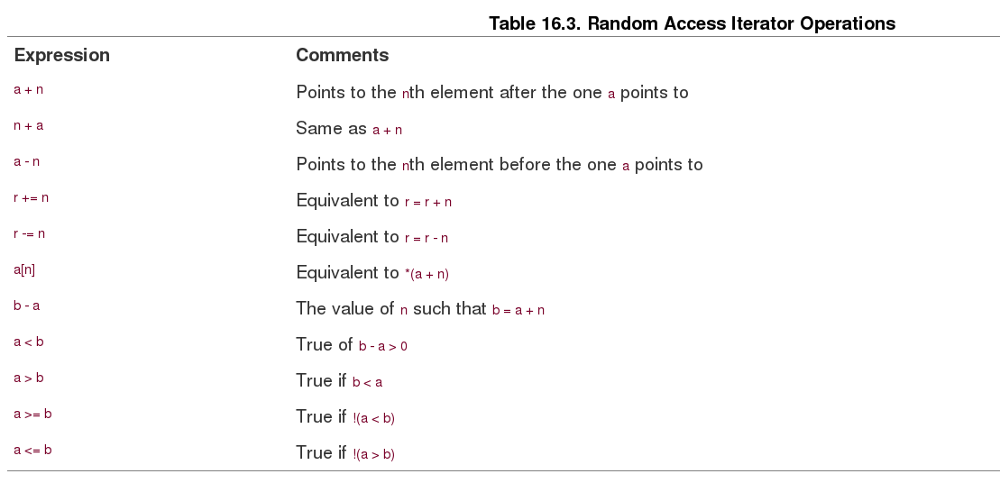

Expressions like a + n are valid only if both a and a + n lie within the range of the container (including past-the-end).

#### Iterator Hierarchy ####

You probably noticed that the iterator kinds form a hierarchy. A forward iterator has all the capabilities of an input iterator and of an output iterator plus its own capabilities. A bidirectional iterator has all the capabilities of a forward iterator plus its own capabilities. And a random access iterator has all the capabilities of a forward iterator plus its own capabilities. Table 16.4 summarizes the main iterator capabilities. In it, i is an iterator, n is an integer.

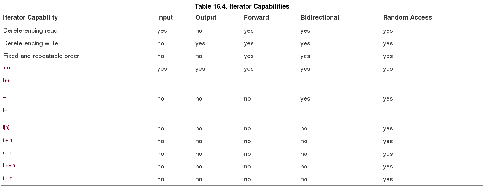

An algorithm written in terms of a particular kind of iterator can use that kind of iterator or any other iterator that has the required capabilities. So a container with, say, a random access iterator can use an algorithm written for an input iterator.

Why all these different kinds of iterators? The idea is to write an algorithm using the iterator with the fewest requirements possible, allowing it to be used with the largest range of containers. Thus, the **find()** function, by using a lowly input iterator, can be used with any container containing readable values. The **sort()** function, however, by requiring a random access iterator, can be used just with containers that support that kind of iterator.

Note that the various iterator kinds are not defined types; rather, they are conceptual characterizations. As mentioned earlier, each container class defines a class scope **typedef** name called **iterator**. So the **vector<int>** class has iterators of type **vector<int>::iterator**. But the documentation for this class would tell you that vector iterators are random access iterators. That, in turn, allows you to use algorithms based upon any iterator type because a random access iterator has all the iterator capabilities. Similarly, a **list<int>** class has iterators of type **list<int>::iterator**. The STL implements a doubly linked list, so it uses a bidirectional iterator. Thus, it can't use algorithms based on random access iterators, but it can use algorithms based on less demanding iterators.

## Concepts, Refinements, and Models ##

An STL algorithm works with any iterator implementation that meets its requirements. STL literature uses the word concept to describe a set of requirements. Thus, there is an input iterator concept, a forward iterator concept, and so on. By the way, if you do need iterators for, say, a container class you're designing, the STL does include iterator templates for the standard varieties.

Concepts can have an inheritance-like relationship. For example, a bidirectional iterator inherits the capabilities of a forward iterator. However, you can't apply the C++ inheritance mechanism to iterators. For example, you might implement a forward iterator as a class and a bidirectional iterator as a regular pointer. So, in terms of the C++ language, this particular bidirectional iterator, being a built-in type, couldn't be derived from a class. Conceptually, however, it does inherit. Some STL literature uses the term refinement to indicate this conceptual inheritance. Thus, a bidirectional iterator is a refinement of the forward iterator concept.

A particular implementation of a concept is termed a model. Thus, an ordinary pointer-to-int is a model of the concept random access iterator. It's also a model of forward iterator, for it satisfies all the requirements of that concept.

#### The Pointer As Iterator ####

**Iterators are generations of pointers, and a pointer stastifies all the iterator reqiurements**. Iterators form the interface for the STL algorithms, and pointers are iterators. so STL algorithms can use pointers to operate upon non-STL containers.

        const int SIZE = 100;
        
        double Receipts[SIZE];
        
        sort(Receipts, Receipts + SIZE);
        

#### copy(), ostream_iterator, and istream_iterator ####

        int casts[10] = {6, 7, 2, 9 ,4 , 11, 8, 7, 10, 5};
        
        vector<int> dice[10];
        
        copy(casts, casts + 10, dice.begin());   // copy array to vector
        
Now suppose you wanted to copy information to the display. **You could use copy() providing there was an iterator representing the output stream.** The STL provides such an iterator with the ostream_iterator template. Using STL terminology, this template is a model of the output iterator concept. It is also an example of an adapter, a class or function that converts some other interface to an interface used by the STL. You can create an iterator of this kind by including the iterator (**formerly iterator.h**) header file and making a declaration:

        #include <iterator>
        
        ...
        
        ostream_iterator<int, char> out_iter(cout, " ");
        

You could use the iterator like this:

        *out_iter++ = 15;   // works like cout << 15 << " ";
        
        copy(dice.begin(), dice.end(), out_iter);    // copy vector to output stream
        

Similarly, the **iterator** header file defines an **istream_iterator** template for adapting **istream** input to the iterator interface. It is a model of input iterator. You can use two **istream_iterator** objects to define an input range for copy():

        copy(istream_iterator<int, char>(cin),
    
        istream_iterator<int, char>(), dice.begin());
        
Like **ostream_iterator, istream_iterator** uses two template arguments. The first indicates the data type to be read, and the second indicates the character type used by the input stream. Using a constructor argument of cin means to use the input stream managed by cin. Omitting the constructor argument indicates input failure, so the previous code means to read from the input stream until end-of-file, type mismatch, or some other input failure.

#### Other Useful Iterators ####

The iterator header file provides some other special-purpose predefined iterator types in addition to **ostream_iterator** and **istream_iterator**. They are **reverse_iterator, back_insert_iterator, front_insert_iterator, and insert_iterator**.

Now suppose you want to print the contents in reverse order. (Perhaps you are performing time-reversal studies.) There are several approaches that don't work, but rather than wallow in them, let's go to one that does. The vector class has a member function called **rbegin()** that returns a **reverse_iterator** pointing to past-the-end and a member **rend()** that returns a **reverse_iterator** pointing to the first element. **Because incrementing a reverse_iterator makes it decrement**, you can use the statement:

        copy(dice.rbegin(), dice.rend(), out_iter); // display in reverse order
        
#### Remember ####

Both **rbegin()** and **end()** return the same value (past-the-end), but as a different type (**reverse_iterator** versus **iterator**). Similarly, both **rend()** and **begin()** return the same value (an iterator to the first element), but as a different type.

That is, **copy()** does not automatically adjust the size of the destination to fit the information sent to it. Listing 16.7 took care of that situation by declaring dice to have 10 elements, but suppose you don't know in advance how big dice should be? Or suppose you want to add elements to dice rather than overwrite existing ones?

The three insert iterators solve these problems by converting the copying process to an insertion process. Insertion adds new elements without overwriting existing data and uses automatic memory allocation to ensure the new information fits. A **back_insert_iterator** inserts items at the end of the container, while a **front_insert_iterator** inserts items at the front. Finally, the **insert_iterator** inserts items in front of the location specified as an argument to the **insert_iterator** constructor. All three are models of the output container concept.

These iterators take the container type as a template argument and the actual container identifier as a constructor argument. That is, to create a back insertion iterator for a vector<int> container called dice, you do this:

        back_insert_iterator<vector<int> > back_iter(dice);
        
Declaring a front insertion iterator has the same form. An insertion iterator declaration has an additional constructor argument to identify the insertion location:

        insert_iterator<vector<int> > insert_iter(dice, dice.begin());
        
        
## Kinds of Containers ##

The STL has both **container concepts** and **container types**.  **The concepts categorize the types**.（container概念 归类 container类型）

- Concept : The concept are general categories with names like container, associative cotnainer, and so on. 

- Types : The container type are templates you can use to create specific container objects. The elven container type are deque,list,queue,priority_queue,stack,vector,map,multimap,set,and bitset.

### The Container Concept ###

the container concept lays down a set of requirements that all STL container classes must satisfy.

A container is an object that stores other objects, which are all of a single type. The stored objects may be objects in the OOP sense, or they may be values of built-in types. Data stored in a container are owned by the container. That means when a container expires, so do the data stored in the container. (However, if the data are pointers, the pointed-to data does not necessarily expire.)

You can't store just any kind of object in a container. In particular, the type has to be copy `constructable` and assignable`. Basic types satisfy these requirements as do class types unless the class definition makes one or both of the copy constructor and the assignment operator private or protected.

All containers do provide certain features and operations. Table 16.5 summarizes several of these common features. In the table, **X** represents a container type, such as **vector**, **T** represents the type of object stored in the container, **a** and **b** represent values of type **X**, and **u** represents an identifier of type **X**.

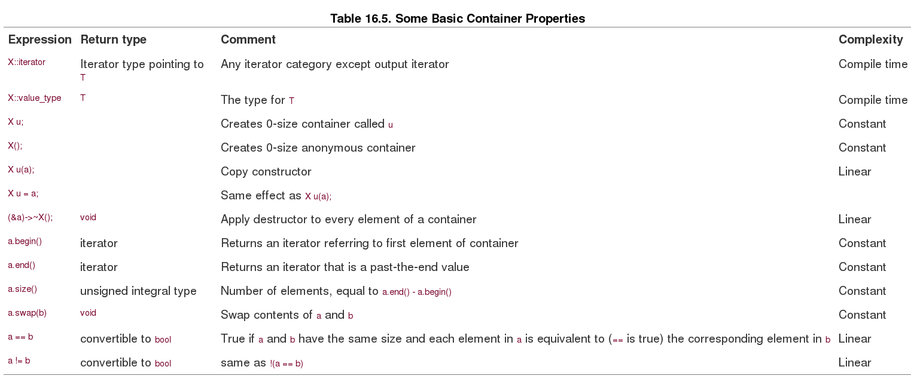

上面是所有container的基本属性, 基于基本属性的redefine实现各个container type, 其中compelxity是指操作的时间复杂度

- compile time : 操作被实现在编译时间，不需要在运行时间
- constant time : 在运行时操作，但执行时间不依赖元素的的数量
- linear time : 在运行时操作，但执行时间依赖元素的数量

### Sequecnes ###

The `Sequence` is an important refinement, for **six** of the STL container types(deque, list, queue, priority_queue, stack, and vector) are **sequences**. 

NOTE: a queue allows elements to be added at the rear end and removed from the front. A **double-ended** queue, represenetd by queue, allows addition and removal at both ends. 

The `sequence` concpet adds the requirement that the iterator be at least a **forward iterator**. This,in turn,guarantees the elements are arranged in a definite order that doesn't change from one cycle of iteration to the next. 

with the addition of **t** representing a value of type **T**, that is, the type of value stored in the container, of **n**, an **inetger**, and of **p**,**q**,**i** and **j**, representing iterators.
    
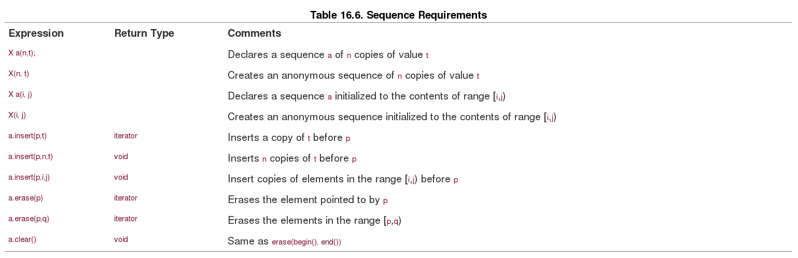

Because the **deque, list, queue, and vector** template classes all are models of the sequence concept, **In addition** there are **operations** that are avaliable to some of these five models.

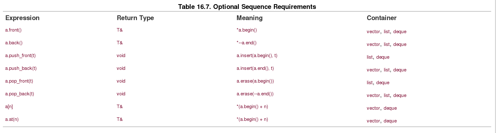

Note: 

- The difference is that **a.at(n)** does bounds checking and throws an **out_of_range** if n is outside the valid range for the container. 

- Next, you might wonder why that **push_front** is defined for **list and deque and not vector**.这是因为设计问题，vector的设计实现push_front需要linear time的时间复杂度，而deque和list只需要constant time的时间复杂度。   

### Let's take a closer look at the six sequence container types(非常重要) ###

#### vector (is declared in the vector header file): 基于数组实现的类 ####

In bref, vector is a class representation of an array. The class provides automatic memory management that allows the size of a **vector** object to vary dynamically, growing and shrinking as elements are added or removed. It provides random access to elements. **Elements can be added to or removed from the end in constant time, but insertion and removal from the beignning and the middle are linear-time operation. **

In addition to being a sequence, a vector also is a model of the **reversible container** concept. This adds two more class methods: **rbegin() returns an iterator to the first element of the reversed sequence, and rend() returns a past-the-end iterator for the reversed sequence.**

        for_each(dice.begin(), dice.end(), Show);    // display in order
        
        cout << endl;
        
        for_each(dice.rbegin(), dice.rend(), Show);  // display in reversed order
        
        cout << endl;
        
The **iterator** returned by the two methods is of a class scope type **reverse_iterator**. Incrementing such an iterator, recall, causes it to move through a reversible container in reverse order.

The **vector** template class is the **simplest of the sequence types** and is considered the type that should be used by default unless the program requirements are better satisfied by the particular virtues of the other types.

#### deque (is declared in the deque header file): 双末端队列  ####

it's a lot like a **vector**, supporting random access. **The main difference is that inserting and removing items from the beginning of a deque object are constant-time operation instead of linear-time operations the way they are for vector**. so if most operations **take place at the beignning and ends** of a sequence, consider using a **deque** data structure.

The goal of constant-time insertion and removal at both ends of a **deque** make the design of a **deque** more complex than that of a **vector**. Thus, while both offer random access to elements and linear-time insertion and removal from the middle of sequence, the **vector** should allow faster execution of these operation.

#### list (is declared in the list header file): 双链表，除了第一个和最后一个，都互相链接 ####

**The crucial difference between list and vector is that list provides for constant-time insertion and removal of elements at any location in the list**. Thus, **vector** emphasizes rapid access via random access, while a **list** emphasizes rapid insertion and remvoal of elements.

Like vector, list is a **reversible container**, Unlike vector, list does not support array notation and random access. Unlike a vector iterator, **a list iterator remains pointing to the same element even after items are inserted into or removed from a container.** Let's clarify this statement. Suppose you have an iterator pointing to the fifth element of a vector container. Then suppose you insert an element at the beginning of the container. All the other elements have to be moved to make room, so after the insertion, the fifth element now contains the value that used to be in the fourth element. Thus, the iterator points to the same location but different data. Inserting a new element into a list, however, doesn't move the existing elements; it just alters the link information. An iterator pointing to a certain item still points to the same item, but it may be linked to different items than before.

The **list** template class has some **list-oriented member functions** in addition to those that come with sequences and reversible containers. The **Alloc** template parameter is one you normally don't have to worry about because it **has a default value**.

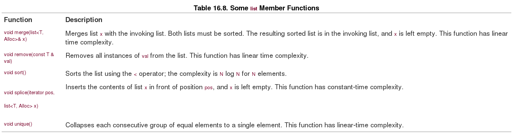

Program Notes:

- The main difference between insert() and splice() is that insert() inserts a **copy** of the original range into the destination, while splice() moves the original range into the destination. Thus, after the contents of one are spliced to three, one is **left empty**. (The splice() method has additional prototypes for moving single elements and a range of elements.) The splice() method leaves iterators valid. That is, if you set a particular iterator to point to an element in one, that iterator would still point to the same element after splice() relocated it in three.

- Notice that unique() only reduces **adjacent** equal values to a single value. After the program executes three.unique(), three still contains two 4s and two 6s that weren't adjacent. But applying sort() and then unique() does limit each value to a single appearance.

- There is a non-member sort() function (Listing 16.6), but it requires random access iterators. Because the trade-off for rapid insertion was giving up random access, **you can't use the non-member sort() with a list. Therefore, the class includes a member version that works within the restrictions of the class.**

The list Toolbox

The **list** methods form a handy toolbox. Suppose, for example, that you have two mailing lists to organize. You could sort each list, **merge** them, and then use **unique()** to remove multiple entries.

The **sort(), merge(), and unique()** methods also each have a version accepting an additional argument to specify an **alternative function to be used for comparing elements**. Similarly, the **remove()** method has a version with an additional argument specifying a function used to determine whether or not an element is removed. These arguments are examples of predicate functions, a topic to which we'll return later.

下面的大多数类，都是基于上面的基础类装饰而成

#### queue ####

The **queue** template class(declared in the queue(foremly **queue.h** header file)) is an adapter class. Recall that the **ostream_iterator** template is an adapter that allows an output stream to use the iterator interface. Similarly, the **queue** template allows an underlying class(**deque**, by default) to exihibit the typical queue interface. 
 
The **queue** template is more restrictive than **deque**. Not only doesn't it permit random access to elements of a queue, the queue class doesn't even allow you to iterate through a queue. Instead, it limits you to the basic operations that define a queue. You can add an element to the rear of queue, remove an element from the front of a queue, view the values of the front and rear elements, check the number of elements, and test to see if the queue is empty. Table 16.9 lists these operations.

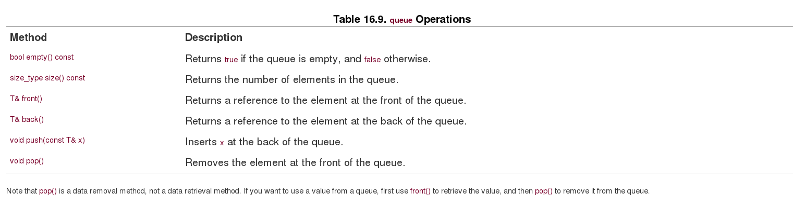

#### priority_queue ####

The **priority_queue** template class (also declared in the **queue** header file) is another adapter class. It supports the same operation as **queue**, **The main difference is that the largest item gets moved to the front of the queue**. (Life is not always fair, and neither are queues.) An internal difference is that the default underlying class is **vector**. You can alter the comparison used to determine what gets to the head of the queue by providing an optional constructor argument:  

        priority_queue<int> pq1;                // default version
        
        priority_queue<int> pq2(greater<int>);  // use greater<int> to order
        
        The greater<>() function is a predefined function object discussed later in this chapter.
        
#### stack ####

Like queue, stack (declared in the **stack** -- foremly stack.h -- header file) is gives an underlying class(**vector**, by default) the typical stack interface.

The **stack** template is more restrictive than **vector**. Not only doesn't it permit random access to elements of a stack, the **stack** class doesn't even allow you to iterate through a stack. . Instead, it limits you to the basic operations that define a stack. You can push a value onto the top of a stack, pop an element from the top of a stack, view the value at the top of the stack, check the number of elements, and test to see if the stack is empty.

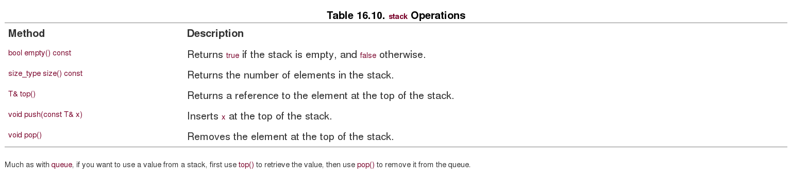

### Associative Containers ###

The **associative container** is another refinement of the container concept. An associative container associates a value with a **key** and uses the key to find the **value**. For example, the values could be structure representing employee information, such as name, address, office number, home and work phone, health plan, and the key could be a unique employee number. To fetch the employee information, a program would use the key to locate the employee structure. Recall that for a container **X**, in general, the expression **X::value_type** indicates the type of value stored in the container. For an associative container, the expression **X::key_type** indicates the type used for the key.

The strength of an associative container is that it provides rapid access to its elements. Like a sequence, an associative container allows you to insert new elements; however, you can't specify a particular location for the inserted elements. The reason is that an associative container usually has a particular algorithm for determining where to place data so that it can retrieve information quickly.

The **STL provides four associative containers: set, multiset, map, and multimap**. The first two types are defined in the **set** header file (formerly separately in set.h and multiset.h), and the second two types are defined in the **map** header file (formerly separately in map.h and multimap.h).

The simplest of the bunch is **set**; the **value** type is the same as the **key** type, and the keys are **unique**, meaning there is no more than one instance of a key in a set. Indeed, for **set**, the value is the key. **The multiset type is like the set type except that it can have more than one value with the same key**. For example, if the key and value type are int, a multiset object could hold, say **1,2,2,2,3,5,7,7**. 

For the **map** type, the value type is different from the **key** type, and the keys are unique, with only one value per key. **The multimap type is similar to map, except one key can be associated with multiple values.**

#### set ####

The STL set models several concepts. It is an **associative set**, it is **reversible**, it is **sorted**, and the **keys are unique**, so it can hold no more than one of any given value. Like vector and list, set uses a template parameter to provide the type stored:

        set<string> A;  // a set of string objects
        
Consider the following code:

        const int N = 6;

        string s1[N] = {"buffoon", "thinkers", "for", "heavy", "can", "for"};
        
        set<string> A(s1, s1 + N);       // initialize set A using a range from array
        
        ostream_iterator<string, char> out(cout, " ");
        
        copy(A.begin(), A.end(), out);
        
The output for this code fragment illustrates that keys are unique (the string "for" appears twice in the array but once in the set) and that the set is sorted:

        buffoon can for heavy thinkers
        
The **union** , **intersection**, and **difference** of set:

        set_union(A.begin(), A.end(), B.begin(), B.end(),
        
                   ostream_iterator<string, char> out(cout, " "));

Suppose you want to place the result into a set **C** instead of displaying it. Then you would want the last argument to be an iterator into **C**. The obvious choice is **C.begin()**, but it doesn't work for two reasons. The first reason is that associative sets treat **keys as constant values**, so the iterator returned by C.begin() is a constant iterator and can't be used as an **output iterator**. The second reason **not to use C.begin() directly is that set_union(), like copy(), overwrites existing data in a container** and requires the container to have sufficient space to hold the new information. C, being empty, does not satisfy that requirement. But the **insert_iterator** template discussed earlier solves both problems. Earlier you saw that it converts copying to insertion. Also, it models the output iterator concept, so you can use it to write to a container. So you can construct an anonymous **insert_iterator** to copy information to C. The constructor, recall, takes the name of the container and an iterator as arguments:

        set_union(A.begin(), A.end(), B.begin(), B.end(),

           insert_iterator<set<string> >(C, C.begin()));
           
The **set_intersection()** and **set_difference()** functions find the set intersection and set difference of two sets, and they have the same interface as **set_union()**.

Because sorting determines where additions to a set go, the class has insertion methods that just specify the material to be inserted without specifying a position. If A and B are sets of strings, for example, you can do this:

        string s("tennis");
        
        A.insert(s);                    // insert a value
        
        B.insert(A.begin(), A.end());   // insert a range
        
               
#### multimap ####

Like **set**, **multimap** is a **reversible**, **sorted**, associative container. However, the key type is different from the value type, and a multimap object can have more than one value associated with a particular key.

The basic **multimap** declaration specifies the **key** type and the type of **value** stored as template arguments. For example, the following declaration creates a **multimap** object using int as the key type and string as the type of value stored:

        multimap<int,string> codes;
        
An optional **third template** argument can be used to indicate a comparison function or object to be used to order the key. By default, the **less<>** template (discussed later) is used with the key type as its parameter. Older implementations may require this template parameter explicitly.

To keep information together, the actual value type combines the key type and the data type into a single pair. To do this, **the STL uses a pair<class T, class U> template class for storing two kinds of values in a single object.** If keytype is the key type and datatype is the type of the stored data, then the value type is pair<const keytype, datatype>. For example, the value type for the codes object declared earlier is pair<const int, string>.

Suppose, for example, you wanted to store city names using the area code as a key. This happens to fit the codes declaration, which uses an int for a key and a string as a data type. One approach is to create a pair and then insert it:

        pair<const int, string> item(213, "Los Angeles");
    
        codes.insert(item);
        
Or you can create an anonymous pair object and insert it in a single statement:

        codes.insert(pair<const int, string> (213, "Los Angeles"));
        
Because items are sorted by key, there's no need to identify an insertion location.

Given a **pair** object, you can access the two components by using the **first** and **second** members:

        pair<const int, string> item(213, "Los Angeles");
        
        cout << item.first << ' ' << item.second << endl;
        
What about getting information about a multimap object? 

- The **count()** member function takes a key as its argument and returns the number of items having that key.

- There are **lower_bound()** and **upper_bound()** member functions that take a key and work as they did for **set**. 

- There's an **equal_range()** member function that takes a key as its argument and returns iterators representing the range matching that key. 

In order to return two values, the method packages them into a **pair** object, this time with both template arguments being the iterator type. For example, the following would print a list of cities in the **codes** object with area code 718:

        pair<multimap<KeyType, string>::iterator,
        
             multimap<KeyType, string>::iterator> range
        
                                 = codes.equal_range(718);
        
        cout << "Cities with area code 718:\n";
        
        for (it = range.first; it != range.second; ++it)
        
            cout <<  (*it).second    << endl;
            
            
## Function Objects(aka Functors) ##    

Many STL algorithms use **function objects**, also known as **functors**. **A functor is any object that can be used with () in the manner fo a function. This includes normal function names, pointers to functions, and class objects for which the () operator is overloaded, that is, classes for which the peculiar-looking function operator()() is defined.** For example:        

        class Linear
        
        {
        
        private:
        
            double slope;
        
            double y0;
        
        public:
        
            Linear(double _sl = 1, double _y = 0)
        
                : slope(_sl), y0(_y) {}
        
            double operator()(double x) {return y0 + slope * x; }
        
        };

The **overloaded()** operator then allows you to use Linear objects like functions:

        Linear f1;
        
        Linear f2(2.5, 10.0);
        
        double y1 = f1(12.5);   // rhs is f1.operator()(12.5)
        
        double y2 = f2(0.4);
        
Remember the **for_each** function? It applied a specified function to each member of a range:

        for_each(book.begin(),books.end(), ShowReview);
        
In general, the third argument could be a functor, not just a regular function.  Actually, this raises a question. How do you declare the third argument? You can't declare it as a function pointer, for a function pointer specifies the argument type. Because a container can contain about any type, you don't know in advance what particular argument type should be used. The STL solves that problem by using templates. The **for_each** prototype looks like this:

        template<class InputIterator, class Function>
        
        Function for_each(InputIterator first, InputIterator last, Function f);

The ShowReview() prototype was this:

        void ShowReview(const Review &);
        
This makes the identifier **ShowReview** have the type **void (*)(const Review &)**, so that is the type assigned to the **template argument Function**. With a different function call, the Function argument could represent a class type having an overloaded () operator. Ultimately, the **for_each()** code will have an expression using f(...). In the ShowReview() example, f is a pointer to a function, and f(...) invokes the function. If the final for_each() argument is an object, then f(...) becomes the object invoking its overloaded () operator.

### Functor Concepts ###

Just as the STL defines concepts for containers and iterators, it defines functor concepts:

- A **generator** is a functor that can be called with no arguments.

- A **unary function** is a functor that can be called with one argument.

- A **Binary function** is a functor that can be called with two argument.

For example, the functor supplied to **for_each()** should be a **unary** function because it is applied to one container element at a time.

- A unary function that returns a bool value is a **predicate**.

- A binary function that returns a bool value is a **binary predicate**.

sort示例

        bool WorseThan(const Review & r1, const Review & r2);//binary predicate
        
        ...
        
        sort(books.begin(), books.end(), WorseThan);
       
list模板remove_if示例 
        bool tooBig(int n){ return n > 100; } //predicate

        list<int> scores;
        
        ...
        
        scores.remove_if(tooBig);
        
当你需要在predicate tooBig追加一个临界参数，而不是写死为100的时候，这个时候可以通过tooBig类来充当functor,非常灵活.

        Template<class T>
        
        class TooBig
        
        {
        
        private:
        
            T cutoff;
        
        public:
        
            TooBig(const T & t) : cutoff(t) {}
        
            bool operator()(const T & v) { return v > cutoff; }
        
        };
        
        TooBig<int> f100(100);
        
        list<int> froobies;
        
        list<int> scores;
        
        ...
        
        froobies.remove_if(f100);               // use a named function object
        
        scores.remove_if(TooBig<int>(200));     // construct a function object
        
### Predefined Functors ###

**The STL defines serveral elementary function objects**. They perform actions such as adding two values, comparing two values for equality, and so on. They are provided to help support STL functions
that take functions as arguments. For example, consider the **transform()**function.It has two versions. The first version takes four arguments. The first two are iterators specifying a range in a container. (By now you must be familiar with that approach.) The third is an iterator specifying where to copy the result. **The final is a functor which is applied to each element in the range to produce each new element in the result.** For example, consider the following:

        const int LIM = 5;
        
        double arr1[LIM] = {36, 39, 42, 45, 48};
        
        vector<double> gr8(arr1, arr1 + LIM);
        
        ostream_iterator<double, char> out(cout, " ");
        
        transform(gr8.begin(), gr8.end(), out, sqrt);
        
        
The **second version** uses a function that takes two arguments, applying it to one element from each of two ranges. It takes an additional argument, which comes third in order, identifying the start of the second range. For example, if **m8** were a second vector<double> object and if mean(double, double) returned the mean of two values, the following would output the **average of each pair of values from gr8 and m8**:

        transform(gr8.begin(), gr8.end(), m8.begin(), out, mean);
        
for example:

        double add(double x, double y) { return x + y; } 
        transform(gr8.begin(), gr8.end(), m8.begin(), out, add);
       
But then you'd have to define a separate function for each type. It would be better to define a template, except you don't have to, because the STL already has. The **functional (formerly function.h)** header defines several template class function objects including one called **plus<>()**.

        #include <functional>
        
        ...
        
        plus<double> add;  // create a plus<double> object
        
        double y = add(2.2, 3.4); // using plus<double>::operator()()
        
But it makes it easy to provide a function object as an argument:

        transform(gr8.begin(), gr8.end(), m8.begin(), out, plus<double>() );
        

**The STL provides function object equivalents** for all the built-in **arithmetic**, **relational**, and **logical operators**. Table 16.11 shows the names for these functor equivalents. They can be used with the C++ **built-in types** or with any user-defined type that **overloads the corresponding**. operator.

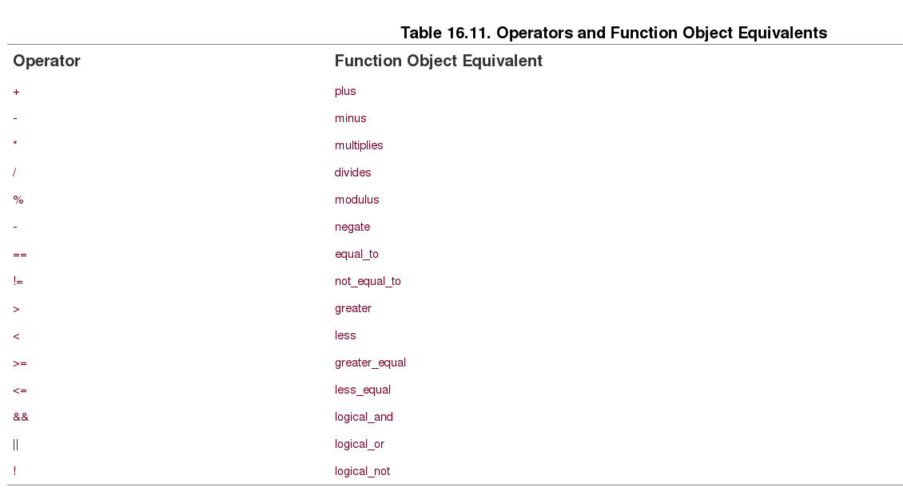

### Adapter Functors and Function Adapter ###

The predefined functors of Table 16.11 are all `adaptable(可以适配的)`. Actually, the STL has five related concepts: **the adaptable generator**, the **adaptable unary function**, **the adaptable binary function**, **the adaptable predicate**, and **the adaptable binary predicate**.

What makes a functor object adaptable is that it carries **typedef** members identifying its **argument types and return type**. The members are called **result_type**, **first_argument_type**, and **second_argument_type**, For example, the return type of a plus<int>::result_type object is identifield as plus<int>::result_type, and this would be typedef for int.

The significance of a **function object** being **adaptable** is that it then can be used by function adapter objects which assume the existence of these typedef members. For example, a function with an argument that is an adaptable functor can use the **result_type** member to declare a variable that matches the function's return type.

Indeed, the STL provides **function adapter classes** that use these facilities. For example, suppose you want to multiply each element of the vector gr8 by 2.5. That calls for using the transform() version with a unary function argument, like the

        transform(gr8.begin(), gr8.end(), out, sqrt);
        
example shown earlier. The multiplies() functor can do the multiplication, but it's a binary function. So you need a function adapter that converts a functor with two arguments to one with one argument. The TooBig2 example earlier showed one way, but the STL has automated the process with the **binder1st** and **binder2nd** classes, which convert adaptable binary functions to adaptable unary functions.

binder1st将两个参数的函数，转为一个参数的函数，且第二个参数转为常量
binder2nd将两个参数的函数，转为一个参数的函数，且第一个参数转为常量

        binder1st(f2, val) f1;
        bind1st(multiplies<double>(), 2.5)
        
Thus, the solution to multiplying every element in **gr8** by **2.5** and displaying the results is
this:

        transform(gr8.begin(), gr8.end(), out,
                bind1st(multiplies<double>(), 2.5));
                

## Algorithms ##
The STL contains many non-member functions for working with containers. You've seen a few of them already: **sort()**, **copy()**, **find()**, **for_each()**, **random_shuffle()**, **set_union()**, **set_intersection()**, **set_differenece()**, and **transform()**. **You've probaly noticed they feature the same overall design,  using iterators to identify data ranges to be processed and to identify where results are to go. Some also take a function object argument to be used as part of the data processing.(这一句对STL的算法特征，总结的比较到位)**

There are two main generic components to the algorithm function designs.

 - First, they use **templates** to provide generic types. 
 - Second, they use iterators to provide a generic representation for accessing data in a container. 
 
Thus, the copy() function can work with a container holding type double values in an array, with a container holding string values in a linked list, or with a container storing user-defined objects in a tree structure, such as used by set. Because pointers are a special case of iterators, STL functions such as copy() can be used with ordinary arrays.

**The uniform container design allows there to be meaningful relations between containers of different kinds.** For example, you can use **copy()** to copy values from an **ordinary array** to a **vector** object, from a vector object to a list object, and from a list object to a set object. You can use == to compare different kinds of containers, for example, deque and vector. This is possible because the overloaded == operator for containers uses iterators to compare contents, so a deque object and a vector object test as equal if they have the same content in the same order.

### Algorithm Groups ###

The STL divides the algorithm library into four group:

- Non-modifying sequence operations

    Non-modifying sequence operations operate on each element in a range. These operations leave a container unchanged. For example, find() and for_each() belong to this category.

- Mutating sequence operation

    Mutating sequence operations also operate on each element in a range. As the name suggests, however, they can change the contents of a container. The change could be in values or in the order in which the values are stored. For example, transform(), random_shuffle(), and copy() fall into this category.

- Sorting and related operation

    Sorting and related operations include several sorting functions (including sort()) and a variety of other functions, including the set operations.

- Generalized numeric operations

    The numeric operations include functions to sum the contents of a range, calculate the inner product of two containers, calculate partial sums, and calculate adjacent differences. Typically, these are operations characteristic of arrays, so vector is the container most likely to be used with them.

The first three groups are described in the **algorithm (formerly algo.h) header file**, while the fourth group, being specifically oriented towards numeric data, gets its own header file, called **numeric**. (Formerly, they, too, were in **algol.h**.)

### General Properties(非常好的使用案例，包含了temlpate,iterator,predicate的使用场景) ###

As you've seen again and again, **STL functions work with iterators and iterator ranges**. The function prototype indicates the assumptions made about the iterators. For example, the **copy()** function has this prototype:

        template<class InputIterator, class OutputIterator>
        
        OutputIterator copy(InputIterator first, InputIterator last, OutputIterator result);
        
In-place version replace:

        template<class ForwardIterator, class T>
        
        void replace(ForwardIterator first, ForwardIterator last,
                      const T& old_value, const T& new_value);
                      
copy version replace:

        template<class InputIterator, class OutputIterator, class T>
        
        OutputIterator replace_copy(InputIterator first, InputIterator last,

            OutputIterator result, const T& old_value, const T& new_value);
            
        The convention for copying algorithms is that they return an iterator pointing to the location one past that last value copied.
        
condition version replace:

        template<class ForwardIterator, class Predicate class T>
        
        void replace_if(ForwardIterator first, ForwardIterator last,
        
                      Predicate pred, const T& new_value);
                      
A predicate, recall, is the name of a unary function returning a **bool** value. There's also a version called **replace_copy_if()**. You probably can figure out what it does and what its prototype is like.
 
### The STL and the string Class ###

the **string** class, although not part of the STL, is designed with the STL in mind. For example, it has begin(), end(), rbegin(), and rend() members. Thus, it can use the STL interface.

The next_permutation():

- The next_permutation() algorithm transforms the contents of a range to the next permutation; in the case of a string, the permutations are arranged in increasing alphabetical order. The algorithm returns true if it succeeds and false if the range already is in the final sequence. 

### Functions Versus Container Methods (functino和method重要的比较)###

Sometimes you have a choice between using an STL method and an STL function. Usually, **the method is the better choice**. 

- First, it should be better optimized for a particular container.
- Second, it can use a template class's memory management facilities and resize a container when needed.

Suppose, for example, that you have a list of numbers and you want to remove all instances of a certain value, say 4, from the list. If la is a **list<int>** object, you can use the list **remove()** method:

        la.remove(4);  // remove all 4s from the list 
        
After this method call, all elements with the value 4 are removed from the list, and the list is automatically resized

There also is an STL algorithm called **remove()** (see Appendix G). Instead of being invoked by an object, it takes range arguments. So, if **lb** is a **list<int>** object, a call to the function could look like this:

        remove(lb.begin(), lb.end(), 4);
        
However, because this remove() is not a member, **it can't adjust the size of the list**. Instead, it makes sure all the non-removed items are at the beginning of the list, and it returns an iterator to the new past-the-end value. You then can use this iterator to fix the list size. For example, you can use the list erase() method to remove a range describing the part of the list that no longer is needed. Listing 16.14 shows how this process works.

        example output:
        
        Here's the output:
        
        
        Original list contents:
        
            4 5 4 2 2 3 4 8 1 4
        
        After using the remove() method:
        
        la: 5 2 2 3 8 1
        
        After using the remove() function:
        
        lb: 5 2 2 3 8 1 4 8 1 4
        
        After using the erase() method:
        
        lb: 5 2 2 3 8 1
        
Although the methods are usually better suited, the non-method functions are more general. As you've seen, you can use them on arrays and string objects as well as STL containers, and you can use them with mixed container types, for example, saving data from a vector container in a list or a set.

### Using the STL (对三大容器,vector,set,map的联动使用) ###

一个对输入word计数案例：

- vector接收输入word:

        vector<string> words;
        
        string input;
        
        while (cin >> input && input != "quit")
        
            words.push_back(input);
            
- set对输入word大小写忽略和去重，获取word key:

        set<string> wordset;
        
        transform(words.begin(), words.end(),
        
            insert_iterator<set<string> > (wordset, wordset.begin()), ToLower);
            
        string & ToLower(string & st)
        {
        
            transform(st.begin(), st.end(), st.begin(), tolower);
        
            return st;
        
        }
        
- map保存对word key的计数

        map<string, int> wordmap;
        
        set<string>::iterator  si;
        
        for (si = wordset.begin(); si != wordset.end(); si++)
        
            wordmap.insert(pair<string, int>(*si, count(words.begin(),
        
            words.end(), *si)));

**The map class has an interesting feature—you can use array notation with keys serving as indices to access the stored values.(靠近脚本语言的特征)** For example, wordmap["the"] would represent the value associated with the key "the", which in this case is the number of occurrences of the string "the". Because the wordset container holds all the keys used by wordmap, you can use the following code as an alternative and more attractive way of storing results:

        for (si = wordset.begin(); si != wordset.end(); si++)
        
            wordmap[*si] = count(words.begin(), words.end(), *si);
            
## Other Libraries ##
 
C++ provides some other class libraries that are more specialized than the examples covered in this chapter. The complex header file provides a complex class template for complex numbers, with specializations for float, long, and long double. The class provides standard complex number operations along with standard functions that can be used with complex numbers.

The valarray header file provides a valarray template class. This class template is designed to represent numeric arrays and provides support for a variety of numeric array operations, such as adding the contents of one array to another, applying math functions to each element of an array, and applying linear algebra operations to arrays.

