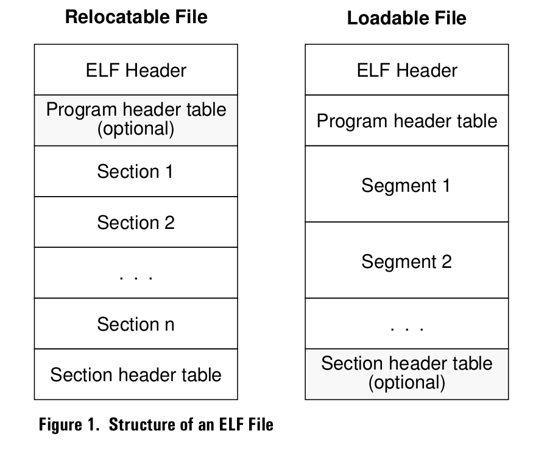
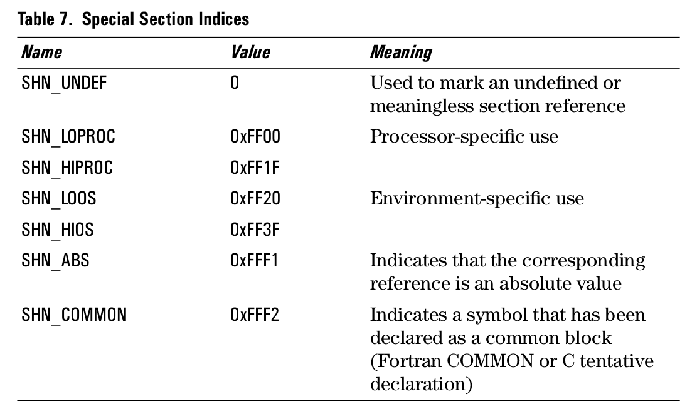

## An ELF object file consistents of the following parts: ##

- File header, which must appear at the beginning of the file.
- Section table, required for reloacatable files, and optional for loadable files.
- Program headers, required for loadable files and optional for relocatable files. This table describes the loadable segments and other data structures required for loading a program or dynamically-linked library in  preparation for execution.
- Contents of the sections or segments, including loadable data, relocations, and string and symbol tables.

        arm-linux-readelf -a hello_world.o > hello_world.elf
        arm-linux-objdump -D -h hello_world.o > hello_world.txt 
  

      

## Sections ##

Sections contain all the information in an ELF file, except for the ELF header, program header table, and section header table. **Sections are identified by an index into the section header table**.

#### Section indices ####

- Section index 0, and indices in the range 0xFF00-0xFFFF are reserved for special purpose. Table 7 lists   
 the special section indices that are defined.
 

- The first entry in the section header table(with an index of 0) is reserved, and must contain all zeros.

