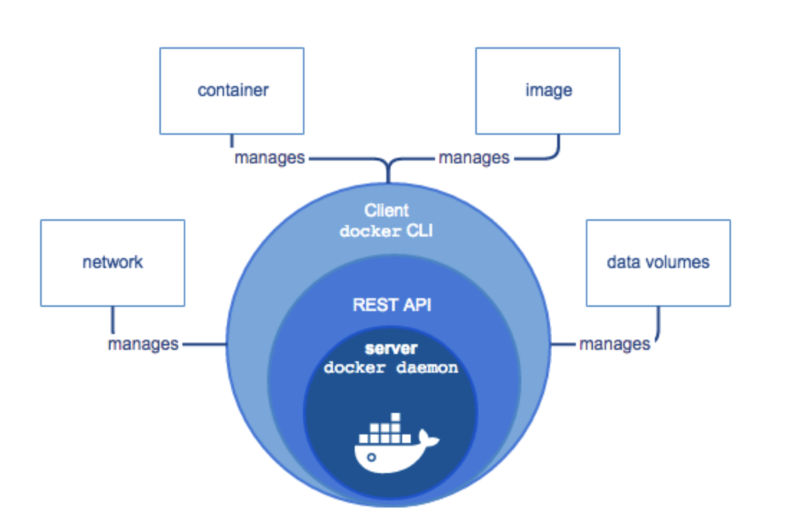
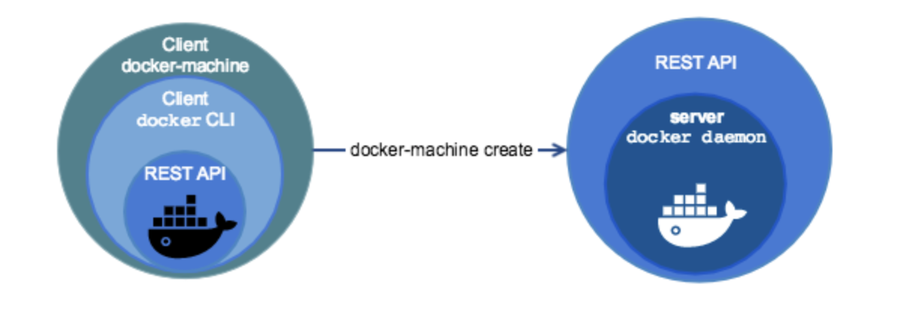

# CI : Docker-machine and Jenkins

[Docker官方网站产品手册包含各操作系统的Docker安装，以及docker-machine的安装](https://docs.docker.com/ee/)

## Docker

- Containerization is increasingly popular because containers are:

		- Flexible : Even the most complex applications can be containered.
		- Lightweight : Containers leverage and share the host kernel.
		- Interchangeable : You can deploy updates and upgrades on-the-fly.
		- Portable : You can locally, deploy to the cloud, and run anywhere.
		- Scalable : You can increase and automatically distribute container replicas.
		- Stackable : You can stack services vertically and on-the fly.

- docker engine

	`Docker Engine` is client-server application with these major components:
	
		- A server which is a type of long-running program called a daemon process(the dockerd command).
		- A REST API which specifies interfaces that programs can use to talk to the daemon and instruct it what to do.
		- A command line interface(CLI) client(the docker command).

	
	
### Docker Jenkins安装

- 在线安装

		docker pull damoncheng/jenkins:blueocean-timer
		
- 离线安装

		docker save damoncheng/jenkins:blueocean-timer > jenkins-blueocean-timer.tar
		docker load < jenkins-blueocean-timer.tar
		
### Docker Jenkins运行

		docker service create --user root --name jenkins_master \
		--mount type=bind,source=/tmp,destination=/tmp \
		--mount type=bind,source=/var/run/docker.sock,destination=/var/run/docker.sock \
		--mount type=bind,source=/Users/jenkins/jenkins_home,destination=/Users/jenkins/jenkins_home \
		--constraint 'node.role==manager' --restart-condition='on-failure' \
		-e JAVA_OPTS='-Duser.timezone=Hongkong -Dhudson.util.ProcessTree.disable=true' \
		-e JENKINS_SLAVE_AGENT_PORT=36093 \
		-e JENKINS_HOME=/Users/jenkins/jenkins_home \
		--network jenkins_master_net \
		--publish 36093:50000 --publish 8080:8080 \
		damoncheng/jenkins:blueocean-timer

## Docker-machine

Mac 和 Windows 安装后自带 docker-machine ， Linux需要按照docker产品手册手动安装

- overview

	Docker Machine is a tool that lets you install Docker Engine on virtual hosts, and manage the hosts with docker-machine commands. You can use Machine to create Docker hosts on your local Mac or Windows box, on your company network, in your data center, or on cloud providers like Azure, AWS, or Digital Ocean.

		You can use Docker Machine to:

			- Install and run Docker on Mac or Windows
			- Provision and manage multiple remote Docker hosts
			- Provision Swarm clusters

		Docker machine two broad use cases:
		
			- I have an older desktop system and want to run Docker on Mac or Windows
			- I want to provision Docker hosts on remote systems.

		docker-machine virtual host 默认用户名和密码：
		
			- 用户名：docker
			- 密码：  tcuser

- Docker Engine 和 Docker Machine 的不同

	Docker Machine is a tool for provisioning and managing your Dockerized hosts(hosts with Docker Engine on them). 
	
	Docker Machine has its own command line client and the Docker Engine client, `docker`.
	
	You can use Machine to install Docker Engine on one or more virtual systems. These virtual systems can be local (as when you use Machine to install and run Docker Engine in VirtualBox on Mac or Windows) or remote (as when you use Machine to provision Dockerized hosts on cloud providers). The Dockerized hosts themselves can be thought of, and are sometimes referred to as, managed “machines”.

- docker-machine 常用命令		

	- 创建machine

			docker-machine create --driver virtualbox defaut

	- 查看指定machine环境变量以及如何激活连接machine的环境变量：
		
			docker-machine env machine-name
			
	- 退出machine连接环境
	
			eval $(docker-machine env -u)

	- 登陆docker machine
	
			docker-machine ssh machine-name

- docker-machine 环境

		虚拟机 /mnt/sda1 的存储较大，可以作为业务存储来使用

## Jenkins配置

通过`lauched method`的`Launch slave agents via SSH`方式以及docker-machine的内置用户名和密码，Jenkins master连接Jenkins slave.
	
通过`Credentials`的`SSH Username with private key`, jenkins拉取git代码

- Jenkins Credentials配置

	- 通过ssh-keygen制造连接目标机器的密钥, 在`~/.ssh`目录下会生成一对公私钥
	
			ssh-keygen #按提示回车到底
		
	- 将`~/.ssh/id_rsa.pub`的公钥追加到`目标机器`的`～/.ssh/authroized_keys`
	
	- 将`~/.ssh/id_rsa`的私钥复制到Jenkins Credentials=》`SSH Username with private key`的`Private Key`里面

- 新建Jenkins pipeline

	- 配置`Poll SCM`, 每分钟检测git变化
	
			* * * * *
			
	- Pipeline章节配置
	
			Repository URL : ssh://root@ip/path
			Credentials : 上一章节的credential
			
			Script Path : Jenkinsfile
			
- 新建Jenkins node

		Usage ： Use this node as much as possible
		
		Launched method : Launch salve agents via SSH
		
		Host : ip
		
		Credentials : docker credential
		

## 总结

基于上面的步骤，一个基于docker-machine的本地ci系统就成功搭建了。还有一些深层次的细节，在后面逐步完善到文档中。	
		
			
