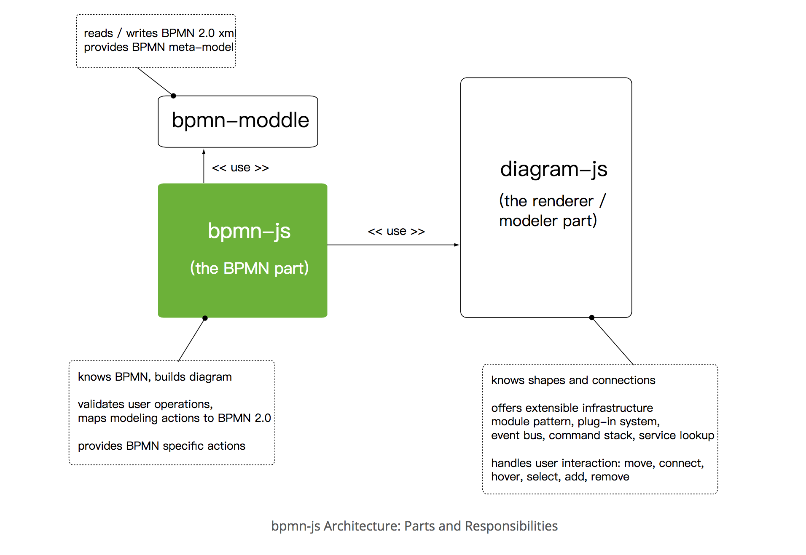
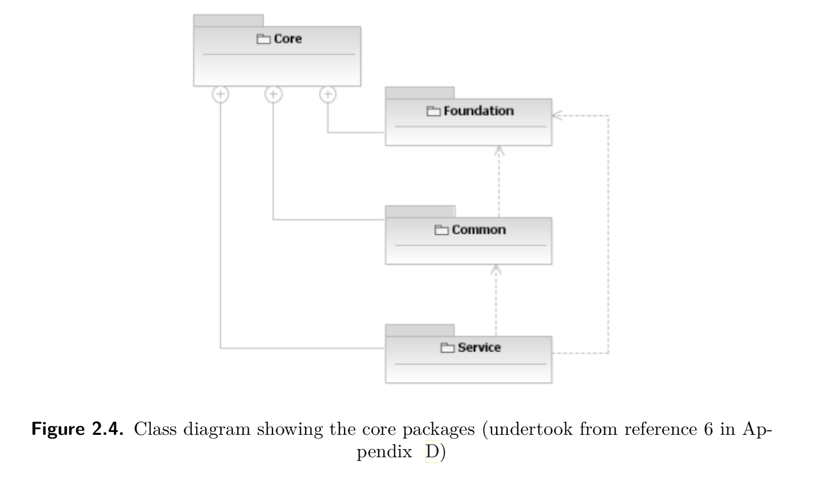
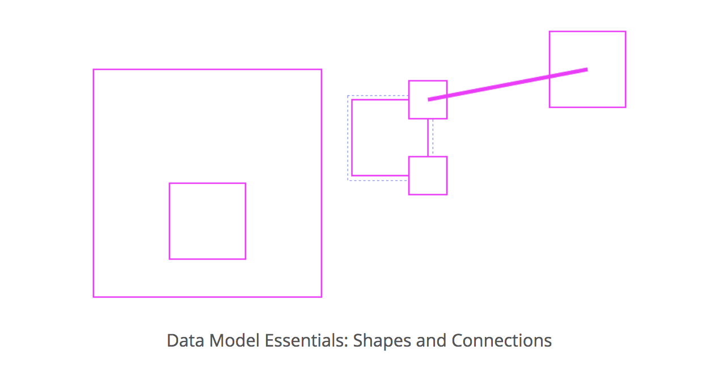

#业务流程(business process)的定义

- 业务流程管理是一门科学，可以分为：设计（designing）， 建模（modeling），执行（execution）,分析(analyzing)，优化（optimization）。这门科学最重要的环节是建模(modeling)环节，

- 引用一个曾经的计算机科学家的话来定义业务流程
	
	Michael Hammer, a former professor of computer science at the Massachusetts Institute of Technology, in his seminal work gave such a definition of a business process: "A collection of activities that takes one or more kinds of input and creates an output that is of value to the customer. A business process has a goal and is affected by events occurring in the external world or in other processes“

#BPMN.js 架构

## bpmn核心库

### diagram-js

diagram-js 负责绘画`形状`和`连接`, 提供和图形元素交互的方式，比如 overlays: 用来丰富viewers的呈现。更高级的使用案例有：context pad， palette 和 facilities like redo/undo.

### bpmn-mopddle

bpmn-moddle 知道关于BPMN2.0 meta-model 标准定义。它提供读和写 BPMN2.0 schema-compliant XML文档，并访问BPMN相关信息的方法。

## bpmn核心结构

Thereby, the backwards compatibility is not modified. The core of BPMN includes three sub packages: 

- the foundation package
	
	基础包包含两个元素，用于diagram modeling 和 abstract syntax modeling.
	
	- **Definitions** is the element, which contains all other elements in the diagram. It defines the namespaces and the the scope of visibility for all the elements contained.
	- **Import** element is used to reference an external BPMN element from another Defi-nitions element or non-BPMN element.
		
- the service package

 

-  the common package

## bpmn核心服务

diagram-js核心内置许多基本服务:

### Canvas

提供API 增加 或者 移除 图形元素(graphical element)， 处理元素生命周期(life cycle) 并 提供APIs zoom和scroll。

### EventBus

基于`fire`和`forget`策略提供全局交流渠道，可以订阅各种敢兴趣的事件。事件总线帮助我们分离 关注点 和 模块化功能。 以至于新的特征能够很容易的hook到存在的行为.

### ElementFactory

创建bpmn`形状`和`连接`的工厂，其基于diagram-js的内部数据模型(inner data model)。

### ElementRegistry

知道所有被增加到diagram的元素，提供APIs 通过 id 检索元素(elements)和他们的图形呈现(graphical representation)。

### GraphicsFactory

负责创建 `形状`或者`连接` 的图形呈现。 实际的 呈现形式 由renderers定义。the `DefaultRenderer` inside the `draw module`.

## 数据模型(data model)

Under the hood, diagram-js implements a simple data model consisting of shapes and connections.

	a shape has a parent, a list of children as well as a list of incoming and outgoing connections.
	
	a connection has a parent as well as a source and target, pointing to a shape.
	
ElementRegistry负责通过`数据模型`创建`形状`和`连接`. during modeling, element relationships will be updated according to `user operations` by the `Modeling Service`. 

## Auxiliary Services

Aside from the data model and its core services, diagram-js provides a rich toolbox of additional helpers.

- CommandStack - responsible for redo and undo during modeling.
- ContextPad - provides contextual actions around an element.
- Overlays - provides APIs for attaching additional information to diagram elements.
- Modeling - provides APIs for updating elements on the canvas (moving, deleting)
- Palette

