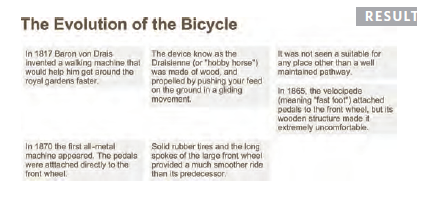

## HEML ##
### Structure ###

- HTML pages are text documents.

- HTML uses tags(characters that sit inside angled brackets) to give the information they surround special meaning.

- Tags are often refered to as elements

- Tags usually come in pairs. The opening tag denotes the start of a piece of content.the closing tag denotes the end.

- opening tags can carry arrtibutes, which tell us more about the content of that element.

- Attributes require a name and a value

- **Empty element:** there is no closing tag.

- To learn HTML you need to know what tags are available for you to use, what they do, and where they can go.

### Text ###

- HTML elements are used to describe the structure of the page(e.g. headings, subheadings, paragraphs)

- They also provide semantic information(e.g. where emphasis should be placed, the definition of any acronyms used, when given text is a quotation)

### Lists ###

- There are three types of HTML lists: ordered, unordered, and definition.

- Ordered lists use numbers

- unordered lists use bullets.

- Definition lists are used to define terminology

- **Lists can be nested inside one another**

### Links ###

- Links are created using the `<a>` elmement.

- The `<a>` element uses the **href** attribute to indicate the page you are linking to.

- If you are linking to a page within your own site, it is best to use relative links rather than qualified URLs.

- You can create links to open email programs with an email address in the "to" field.

- you can use the id attribute to target elements within a page that can be linked to.

### Images ###

- **stock images :**there are images you pay to use

		www.istockphoto.com
		www.gettyimages.com
		www.veer.com
		www.sxc.hu
		www.fotolia.com

- There are three examples that image placement with paragraph.

	- before a paragraph

	- inside the start of a paragraph

	- in the middle of a paragraph

- browser show HTML elements in one of two ways:

	- Block elements always appear on a new line. example elements include the `<h1>` and `
`

	- Inline elements sit within a block level element and do not start on a new line. example elements include the `<b>`, `<em>`, and `` elements.

### Table ###

- The **`<table>`** element is used to add table to a web page.

- A table is drawn out row by row. Each row is created with the `<tr>` element.

- Inside each row there are a number of cells represented by the `<td>` element(or `<th>` if it is a header).

- You can make cells of a table span more than one row or column using the **rowspan** and **colspan** attributes.

- For long tables you can split the table into a `<thead>`, `<tbody>`,  and `<tfoot>`.

### Form ###

- There are several tyoes of form controls that you can use to collect information from visitors to your website.

	- ADDING TEXT
	
			Text input
			Password input
			Text area 

	- MAKING CHOICES

			Radio Buttons
			CheckBoxes
			Drop-down boxes

	- SUBMITTING FORMS

			Submit Buttons
			Image Buttons

	- UPLOADING FILES

			File upload

- form controls live inside a `<form>` element. This element should always carry the **action** attribute and will usually have a **method** and **id** attribute too.

	- action

		its value is the URL for the page on the server that will receive the informatoin in the form when it is submitted.

	- method

		Forms can be sent using one of two methods: **get or post**

		- **get method(default)**
			
			the values from the form are added to the end of the URL specified in the action attribute.

		- **post method**

			the values are sent in what are known as HTTP headers.

	- Whenever you want to collect information from visitors you will need a form, which lives inside a `<form>` element.

	- Information from a form is sent in name/value pairs.

	- each form control is given a name, and the text the user types in or the values of the options they select are sent to the server.

	- HTML5 introduces new form elements which make it easier for visitors to fill in forms.

### Extra Markup ###

- DOCTYPES tells browser which version of html you are using.

- you can add comemnts to your code between the `<!--` and `-->` markers.

- The id and class attributes allow you identify particular element.

- The `
` and `` elements allow you group block-level and inline elements together.

- `<iframe>` cut window into your web pages through which other pages can be displayed. 

- The `<meta>` tag allows you to supply all kind of information about your web page.

- Escape character are used to include special characters in your pages such as `<`, `>`.

### FLASH,VIDEO & Audio ###

- Flash allows you to add animations, video and audio to the web.

- Flash is not supported on iPhone or iPad.

- HTML5 inroduces new <video> and <audio> elements for adding video and audio to web pages, but these are onlu supported in the latest browsers.

- Browsers that support the HTML5 elements do not all supported the same video and audio formats, so you need to supply your files in different formats to ensure that everyone can see/hear them.

- 一个考虑了跨浏览器和，兼容性的实例

		<!DOCTYPE html>
		<html>
		<head>
			<title>Flash, Video and Audio</title>
			
			
		</head>
		<body>
			<video poster="images/puppy.jpg" width="400"
					height="320" controls="controls">
				<source src="video/puppy.mp4" type='video/mp4;
					codecs="avc1.42E01E, mp4a.40.2"' />
				<source src="video/puppy.webm" type='video/webm;
					codecs="vp8, vorbis"' />
				

					
You cannot see this video of a puppy playing
					in the snow because this browser does not
					support our video formats.

				

			</video>
		</body>
		</html>	

## CSS ##

### Introducing CSS ###

- CSS Associates style rules with html elements

		p {
			font-family : Arial;
		}

	- CSS works by associating **rules** with HTML elemnts. These rules govern how the content of specified elements should be displayed. A CSS rule contains tow parts: a **selector** and a **declaration**.

	- Selectors indicate which element the rule apples to. he same rule apply to more than one element if you speparate the element names with commas. 

	- Declarations indicate how the elements referered to in the selector should be styled. **Declarations are split into two parts (a property and a value), and are separated by acolon.**

- Use `<link>` element to indicate where the CSS file is located.

- selector

	<table>

	<thead>
	  <tr>
		<th>Selector</th>
		<th>Example</th>
	  </tr>
	</thead>
		<tr>
			<td>Universal selector</td>
			<td>* {}</td>	
		</tr>
		<tr>
			<td>type selector</td>
			<td>h1, h2, h3 {}</td>	
		</tr>
		<tr>
			<td>Class Selector</td>
			<td>
				.note {}
				 
				p.note {}
			</td>
		</tr>
		<tr>
			<td>ID Selector</td>
			<td>
				#introduction
			</td>
		</tr>
		<tr>
			<td>Child Selector</td>
			<td>
				li>a {}
			</td>
		</tr>
		<tr>
			<td>Descendant Selector</td>
			<td>
				p a {}
			</td>
		</tr>
		<tr>
			<td>Adjacent Slibling selector</td>
			<td>
				h1+p {}
				 
				Targets the first p element
				after any h1 element (but not
				other p elements)
			</td>
		</tr>
		 <tr>
			<td>General Slibling Selector</td>
			<td>
				h1~p {}
				If you had two p elements that
				are siblings of an h1 element,
				this rule would apply to both
			</td>
		</tr>
	</table>

- CSS Rules Cascade

	<table>
		<thead>
			<tr>
				<th>cascade rule</th>
				<th>cascade description</th>
			</tr>
			<tr>
				<td>Last Rule</td>
				<td>
					if two selector are identical,
					the latter of the two will take precedence.
				</td>
			</tr>
			<tr>
				<td>Specificity</td>
				<td>
					if one selctor rule is more specific that the others,
					the specific one take precedence.
				</td>
			</tr>
			<tr>
				<td>Important</td>
				<td>
					you can add !important after any property value to indicate that it shoule be considered more imporant than other rules
					that apply to the same element. 
				</td>
			</tr>
		</thead>
		<tbody>
		</tbody>
	</table>

- inheritance

	- the font-family and color property in `<body>` element will be inherited by most child elements. 

	- background-color and border property are not inherited by child elements. 

	- force child property inherit parent by using 'inherited' for the value of the property.

- cross browser support test website:

		BrowserCam.com
		BrowserLab.Adobe.com
		BrowserShots.org
		CrossBrowserTesting.com

- Check css bug website

		PositionIsEverything.net
		QuirksMode.org

- Summary

	- CSS treats each HTML element as if it appears inside its own box and uses rules to indicate how that element should look.

	- Rules are made up of selectors(that specify the elements the rule applies to) and declarations(that indicate what these elements should look like)

	- Different types of selectors allow you to target your rules at different elements.

	- Declarations are made up of two parts: the properties of the element that you want to change, and the values of those properties. For example, the font-family property sets the choices of font, and the value arial specifies Arial as the preferred typeface.

	- CSS rules usually appear in a separate document, although they may appear within an HTML page.

### Color ###

- The **color** property allow you to specify the color of text inside an element. you can specify any color in CSS in one of three ways:

	- REG VALUES

		These express colors in terms of how much red, green and blue are used to make it up. for example: rgb(100, 100, 90) 

	- HEX CODES 

		These are six-digit codes that represent the amount of red, green and blue in a color. preceded by a pound or hash # sign. For example: #ee3e80

	- COLOR NAMES

		There are 147 predefined color names that are recognized by brower. For example: DarkCyan

- CSS comments : /*---- comment ----*/

- **background-color** : CSS treats each HTML element as if it appears in a box, and the background-color property sets the color of the background for that box.

	- if you do not specify a background color, then background color is transparent. 

	- we have also used the padding property to seperate the text from the edge of the boxes. This make it easier to read.
	

- Every color on a computer screen is created by mixing amounts of red, green, and blue. To find the color you want, you can use a color picker.

- HUE, SATURATION, BRIGHTNESS

	- Hue 
		
		Hue is near to the colloquial idea of the color. Technically speaking however, a color can also have saturation and brightneses as well as hue.

	- SATURATION
	
		Saturation refers to the amount of gray in a color. At maximum saturation, there would be no gray in the color. At minimum saturation, the color would be mostly gray.

	- BRIGHTNESS
	
		Brightness(or "value") refers to how much black is in a color. At maximum brightness, there would be no black in the color. At minimum brightness, the color would be very dark.

- When picking foreground and background colors, it is important to ensure that there is enough contrast for the text to be legible.

	- Text is harder to read when there is low contrast between background and foreground colors.

	- Text is easier to read when there is higher contrast between background and forground colors.

		if you want people to read a lot of text on your page, however, then too much contrast can make it harder to read, too. 

	- for long spans of text, reducing the contrast a little bit improves readability. 

		you can reduce contrast by using dark gray text on white background or an off-white text on a dark background.

- opacity, rgba

	-  CSS3 introduces the **opacity** property which allows you to specify the opacity of an element an any of its child elements.
	
	- The CSS3 **rgba** property allows you to specify a color, just like you would with an RGB value, but adds a fourth value to indicate **opacity**. 

- HSL colors

	- CSS3 indroduces an entirely new and intuitive way to specify colors using hue, saturation, and lightness values. 

	- HUE

		Hue is the colloquial idea of color. In HSL colors, hue is often represented as a color circle where the angle represents the color, although it may also be shown as a slider with values from 0 to 360.

	- SATURATION

		Saturation is the amount of gray in a color. Saturatoin is represented as a percentage. 100% is full saturation and 0% is a shade of gray.

	- Lightness

		Lightness is the amount of white(lightness) or black(darkness) in a color. Lightness is represented as a percentage. 0% lightness is black, 100% lightness is white, and 50% lightness is normal. Lightness is sometimes refered to as luminosity.

	- Please note that lightness is a different concept to brightness. Graphic design software(such as Photoshop and GIMP) have color pickers that use hue, saturation, and brightness - but brightness only adds black, wheraeas lightness offers both white and black.

- HSL & HSLA

		body {
			background-color : #C8C8C8;
			background-color : hsl(0, 0%, 78%);
		}
		p {
			background-color : #ffffff;
			background-color : hsla(0, 100%, 100%, 0.5);
		}

	- This provides a fallback because if there are two rules that apply to the same element in CSS, the latter of the two always takes priority. This means that if browser understatnds HSL and HSLA colors, it will use that rule; and if it does not; it will use the first ruls.

- Summary

	- Color not only brings you site to life, but also helps convey the mood and evokes reactions.

	- There are three ways to specify colors in CSS: RGB values, hex codes, and color names.

	- Color pickers can help you find the color you want.

	- It is important to ensure that htere is enough constrast between any text and the background color(otherwise people will not be able to read your content).

	- CSS3 has indroduced an extra value for RGB colors to indicate opacity. It is known as RGBA.

	- CSS3 also allows you to specify colors as HSL values, with an optional opacity value. it is known as HSLA.

### Text ###

- Designers suggest pages usually look better if they use no more than three typefaces on a page.

- `font-family` 规定字体

		font-family : Georgia, serif;

- `font-size` 设定字体大小

		font-size : 16px; /*this is default font size*/

- `@font-face` 增加新的字体

		@font-face {
			font-family : 'ChunkFiveRegular';
			src : url('fonts/Chunkfive.eot');
		}

		h1,h2 {
			font-family : ChunkFiveRegular, Georgia, serif;
		}

- `font-weight` 设置字体权重

		font-weight : bold; /* normal bold */

- `font-style` 设置字体风格

		font-style : italic; /* normal italic oblique */

- `text-transform` 改变文本大小写

		text-transform : uppercase; /* uppercase lowercase capitalize */

- `letter-spacing` 增加字符之间的间隙

		letter-spacing : 1.2em;
		
- `word-spacing` 增加单词之间的间隙

		word-spacing : 1em;

- `text-decoration` 对文本进行装饰

		text-decoratoin : underline; /* none, underline, overline, line-trough, blink */

- `line-height` 设定行之间的空间距离

		line-height : 1.4em;

- `text-align` 控制文本的排列

		text-align : left; /* left, right, center, **justify** */

- `vertical-align` 控制inline元素相对于文本的位置
	
	it is not intended to allow you to vertically align text in the middle of block level elements such as `
` and `
` 

	it is more commonly used with inline elements such as ``, `<em>`, `<strong>`

		vertical-align : text-top;
		/* baseline, sub, super, top, text-top, middle, bottom, text-bottom */

- `text-indent` 控制文本首行缩进像素

		text-indent : 20px;
		text-indent : -9999px; 从窗口移除字体，这在只呈现背景色的元素中非常有用、

- `text-shadow` 创建文字阴影

		text-shadow : 1px 1px 0px #000000;

		* The first argument indicates how far to the left or right the shadow should fall.
		* The second argument indicates  how far to the top or bottom the shadow should fall.
		* The third argument is optional and specified the amount of blur that be applied to the drop shadow.
		* The forth argument is the color of the drop shadow

- Pseudo-elements:

	- you specify the pseudo-element at the end of the selector, and then specify the delarations as you would normally for any other element. 

	- `:first-letter` : 所选文本的第一个字符
		
			p.intro:first-letter {
				font-size : 200%;
			}

	- `:first-line` : 所选文本的第一行

			p.intro:first-line {
				font-weight : bold;
			}

- Pseudo-class:

	- `:links` : This allow you to set styles for links that have not yet been visited.

			a:links {
				color : deeppink;
				text-decoration : none;
			}

	- `:visited` : This allow you to set styles for 	links that have been clicked on.

			a:visited {
				color : black;
			}

	- `:hover` : This allow you to set styles for links when you hover it.
	
			a:hover {
				color : blue;
			}

	- `:active` : This allow you to set styles for links when you click it.

			a:active {
				color : darkcyan;
			}

	- There three pseudo-class that allow you to change the appearance 	of elements when a user is interacting with them.

			`:hover`, `:active`, `:focus`

- open source font website address

		www.fontsquirrel.com
		www.fontex.org
		www.openfontlibrary.org

		www.google.com/webfonts

- commercial font website address

		www.typekit.com
		www.kernest.com
		www.fontspring.com

- Attribute selectors

	<table>
		<thead>
			<tr>
				<td>Selector</td>
				<td>Meaning</td>
				<td>Example</td>
			</tr>
		</thead>
		<tbody>
			<tr>
				<td>EXISTENCE</td>
				<td>
					[] : Matches a specified attribute(whatever its value)
				</td>
				<td>
					p[class] : Target any p element with an attribute called class
				</td>
			</tr>
			<tr>
				<td>EQUALITY</td>
				<td>
					[=] : Matches a specified attribute with an specified value.
				</td>
				<td>
					p[class="dog"] : Target any p element with an attribute called class whose value is "dog"
				</td>
			</tr>
			<tr>
				<td>SPACE</td>
				<td>
					[~=] : Matches a specified attribute whose value appears in a space-separated list of words.
				</td>
				<td>
					p[class~="dog"] : Target any p element with an attribute called class whose value is a list of space-separated words, one of which is "dog".
				</td>
			</tr>
			<tr>
				<td>PREFIX</td>
				<td>
					[^=] : Matches a specified attribute whose value begins with a specific string.
				</td>
				<td>
					p[attr^="d"] : Target any p element with an attribute whose value begin with the letter "d".
				</td>
			</tr>
			<tr>
				<td>SUBSTRING</td>
				<td>
					[*=] : Matches a specified attribute whose value contains a specific string.
				</td>
				<td>
					p[attr*="do"] : Target any p element with an attribute whose value contains the letters "do".
				</td>
			</tr>
			<tr>
				<td>SUFFIX</td>
				<td>
					[$=] : Matches a specified attribute whose value end with an specific string.
				</td>
				<td>
					p[attr$="g"] : Target any p element with an attribute whose value ends with the letter "g".
				</td>
			</tr>
		</tbody>
	</table>

- Summary

	- There are properties to control the choice of font, size, weight, and spacing.

	- There is limited choice of fonts that you can assume most people will have installed.

	- If you want a wider range of typefaces there are several options, but you need to have the right licence to use them.

	- you can control the space between lines of text, individual letters, and words. Text can also be aligned to the left, right, center, or justified, it can also be indented.

	- You can use pseudo-classes to change the style of an element when a user hovers over or clicks on text, or when they have visited a link.

### Boxes ###

- By default a box is sized just bit enough to hold its contents. 

- To set your own dimensions for a box you can use the **height** and **width** properties.

- The most popular ways to specify the size of a box are to use **Pixes, percentage, or em**.

	- The pixes accurately control box size.

	- The percentage set size of box is relative to the size of the browser window. if the box is encased within another box, it is a percentage of the size of the containing box.

	- The ems set size of box is based on the size of text within it.

- Designers have recently started to use percentages and ems more for measurements as they try to create designs that are **flexible across devices which have different-sized screen**.

- LIMITING WIDTH

	- `min-width` : specify the smallest size a box can be displayed at when the browser window is narrow.(make sure text do not appear too narrow)

	- `max-width` : specify the the maximum width a box can stretch to when browser window is wide.(make sure text do not appear too wide)

- LIMITING HEIGHT

	- `min-height` 

	- `max-height`

	- If the box is not bit enough to hold the content, and the content expands outside the box, it can look very messay. To control what happens when there is not enough spaces for the content of a box. you can use the **overflow** property.

- The **overflow** property tells the browser what to do if the content contained within a box is larger than the box itself. 

	- hidden

	- scroll

- Every box has three available properties that can be adjustied to control its appearance.

	- border

		- `border-style` : 设置边框风格
		
				- solid : a single solid line
				- dotted : a series of square dots
				- dashed : a series of short lines
				- double : two solid lines
				- groove : appears to be carved into the page
				- ridge : appears to stick out from the page
				- inset : appears embedded 	into the page
				- outset : looks like it is coming out of the screen
				- hidden/none : no border is shown
				

		- 设定指定方向边框风格

				- border-top-style
	
				- border-left-style
	
				- border-right-style
	
				- border-bottom-style

		- `border-width` : 设置边框宽度，必须和border-style配合使用，不然不会生效

				- thin
				- medium
				- thick
				- 2px
				- 1px 2px 2px 2px

		- 设置指定方向边框宽度

				- border-top-width
				- border-left-width
				- border-right-width
				- border-bottom-width

		- `border-color` : 设置边框颜色

				- #0088dd
				- #0088d1 #0088d2 #0088d3 #0088d4
				- darkcyan deeplink darkcyan deeplink

		- 设置制定方向边框颜色

				- border-top-color
				- border-left-color
				- border-right-color
				- border-bottom-color

		- `border` : 设置边框宽度，风格，颜色(shorthand attribute)

				- 3px dotted #0088dd

	- margin : 边框之间的spaces

		- 设置制定方向的边框距离

				- margin-top
				- margin-right
				- margin-left
				- margin-top

	- padding : 内容和边框之间spaces

		- 内填充使得文本呈现更加清晰
	
		- 设置指定方向的内填充
		
				- padding-top
				- padding-right
				- padding-bottom
				- padding-left

		- padding属性不被子元素inherited.

- If you specify a width for a box, then the borders, margin, and padding are added to its width and height.

	- the padding and the marging properties are very helpful in adding space between various items on the page.

	- when `border-width` is not zero, If the bottom margin of any box touches the top margin of another, the browser will render it differently than you might expect. It will only show the larger of the two margin. if both margins are the same size, it will show one.

- Centering Content

	- If you want to center a box on the page(or center it inside the element that it sits in), you can set the **margin-left** and **margin-right** to auto.

	- In order to center a box on the page, you need set a **width** for the box(otherwise it will take up the full width of the page).

- Change inline/block

	- **display** property
	
		- inline : This causes a block-level element to act like an inline element.
	
	 	- block : This causes an inline element to act like a block-level element.

		- inline-block : This causes a block-level element to flow like an inline element, while retaining other feature of a block-level element.

		- none : This hide an element from the page. In this case, the element act as though it is not on page at all.

	- if you use **display** property, it is important to note that inline boxes are not supported to create block-level elements.

- Hiddeing box

	- **visibility** property

		- This property allows you to hide boxes from users, but it leaves a space where the element would have been.		

		- hidden : This hides the element

		- visible : This shows the element

- CSS3 feature property

	- `border-image` : applies an image to the border of any box. it takes a background image and slices it into nine pices.

	- `box-shadow` : allow you add a drop shadow around a box.

	- `border-radius` : create rounded corners on any box

			- 统一设定
				border-radius : 10px;
				-moz-border-radius : 10px;
				-webkit-border-raius : 10px;

			- 各个角落分别设定
				border-radius:5px, 10px, 5px, 10px

			- 通过横向，纵向长度方式设定(方便控制显示)
				border-raius: 10px 10px

			- 圆滑指定角落

				- border-top-right-radius
				- border-bottom-right-radius
				- border-top-left-radius
				- border-bottom-left-radius

- Summary

	- **CSS treats each HTML element as if it has its own box**
	- you can use css to control the dimensions of the box
	- you can also control the **borders, margin and padding** for each box with CSS.
	- It is possible to hide elements using the **display and visibility** properties.
	- Block-level boxes can be made into inline boxes, and inline boxes can be made into block-level boxes.
	- Legibility can be improved by controlling the width of boxes containing text and the leading.

### Lists, Tables, and Forms ###

- Lists

	- `list-style-type` property allows you to control the shape or style of a bullet point(also known as a marker)

			* unordered lists
				none (没有)
				disc（实心圆）
                circle (空心圆)
                square（实心方块）

			* ordered lists
				decimal (1 2 3)
				decimal-leading-zero (01 02 03)
				lower-alpha (a b c)
				upper-alpha (A B C)
				lower-roman (i ii iii)
				upper-roman (I II III)

			ol {
				list-style-type : lower-roman;
			}

			<ol>
				<li>Life</li>
				<li>Nature</li>
				<li>Love</li>
				<li>Time and Eternity</li>
				<li>The Single Hound</li>
			</ol>

	- `list-style-image` property allow you specify an image to act as a bullet point.
				
			ul {
				list-style-image : url('images/star.png');
			}

			<ul>
				<li>Ophelia</li>
				<li>To Music</li>
				<li>Vowels</li>
			</ul>

	- `list-style-position` property indicates whether the maker should appear on the inside or outside of the box containing the main points.

			- outside(default) : The maker sits to the left of the block of text.

			- inside : The maker sits inside the box of text(which is indented).

	- `list-style` property allows you to express the makers' style, image and position properties in any order.

			ul {
				list-style : inside circle;
				width : 300px;
			}

- Tables

	 - 结合前面知识的实例
	 
			body {
				font-family : Arial, Verdana, sans-serif;
				color : #111111;
			} 
			table {
				width : 600px;
			}
			th, td {
				padding : 7px 10px 10px 10px;
			}
			th {
				text-transform : uppercase;
				letter-spacing : 0.1em;
				font-size : 90%;
				border-bottom : 2px solid #111111;
				border-top : 1px solid #999;
				text-align : left;
			}
			tr.even {
				background-color : #efefef;
			}
			tr:hover {
				background-color : #c3e6e5;
			}
			.money {
				text-align : right;
			}

	- **Here are some tips for styling tables to ensure they are clean and easy to follow:**

		- GIVE CELLS PADDING
		
			if the text in a table cell either touches a border(or another cell). it becomes much harder to read. Adding padding helps improve readability.

		- DISTINGUISH HEADINGS

			Putting all table headings in bold(the default style for the `<th>` element) make them easier to read. You can also make headings uppercase and then either add background color or an underline to clearly distinguish them for content.

		- SHADE ALTERNATE ROWS

			shading every other row can help users follow along the lines. Use a stable distinction from the normal color of the rows to keep the table looking clean.

 		- ALIGN NUMBALS

			You can use the text-align property to align the content of any column that contains numbers to the right, so that large numbers are clearly distinguished from smaller ones.

	- If you have empty cells in your table, then you can use the `empty-cells` property to specify whether or not their borders should be shown.

			empty-cells :
				show: This show the borders of any empty cells.
				
				hide: This hides the borders of any empty cells.
				
				inherit: If you have one table nested inside another, 
				the inherit value instructs the table cells to obey the 
				rules of the containing table.

	- GPAS BETWEEN CELLS

		- border-spacing

			The **border-spacing** property allows you to control the distance between adjacent cells. By default, browsers often leave a small gap between each table cell. so if you want to increase or decrease this space then the border-spacing property allows you to control the gap.

		- border-collapse

			**collapse** : Borders are collpased into a single border where possible. (border-spacing will be ignored and cells pushed together, and empty-cells properties will be ignore)

			**separate** : Borders are detached from each other. (border-spacing and empty-cells will be obeyed).

- Styling Forms

	- It's most common to style:

		- Text inputs and areas
		- Submit buttons
		- Labels on forms, to get the form controls to align nicely.

	- Styling Text Input:

		- font-size : set font size
		- color : set text color
		- background-color : set background color
		- border : add a border
		- border-radius : create rounded corners
		- :foucs : change the background color of the text input when it is being used. 
		- :hover : change the backgrond color of the text input when it is being over.
		- background-image : add a background image to box.

	- Styling Submit Buttons:

		- color : set text color
		- text-shadow : can give a 3D look to the text in browsers that support this property.
		- border-bottom : set bottom border, make the bottom border of the button slightly thicker.
		- background-color : can make the submit button stand out from other items around it.
		- :hover : change the  appearance of button when the user hovers over it.

	- Styling FIELDSETS & LEGENDS
	
		- Fieldsets are particularly helpful in determining the edges of a form. In 	a long form they can help group together relatived information within it.

		- The legend is used to indicate what information is required in the fieldset.

	- 给一个对齐form内控件的解决方案

		- 所有记录的title和control放在div中，保证每条记录单独行显示。
		- 将所有title固定宽度，box向左浮动，text向右对其。
		- 所有title的box，padding-right文本，保持title与控件的距离。

	- `cursor` property : the cursor property allows you to control the type of mlouse cursor that should be displayed to users.

			auto
			crossshair
			default
			pointer
			move
			text
			wait
			help
			url("cursor.gif")

			for	example :
			
			a {
				cursor : move;
			}

- Summary

	- In addition to the CSS properties covered in other charaper which work with the contents of all elements, there are serval others that are specifically used to control the appearance of lists, tables, and forms.
	
	- List maksers can be given different appearances using the `list-style-type` and `list-style` image properties.
	
	- Table cells can have different borders and spacing in different browsers, but there are properties you can use to control them and make them more consistent.
	
	- Forms are easier to use if the form controls are vertically aligned using CSS.
	
	- Forms benefit from styles that make them feel more interactive. 

### Layout ###

- Key concepts in positioning elements

	- Building blocks

		CSS treats each HTML element as if it is in its own box. This box will either be a block-level box or an inline box.

		- Block-Level Elements : start on a new line.

				Example include : <h1> 
 <ul> <li> 

		- Inline Elements : flow in between surrounding text.

				Example include :  <b> <i>

	- Containing Elements

		If one block-level element sits inside another block-level element then the outer box is known as the containing or parent element.

	- Controlling the position of elements

		`position` property specify the positioning scheme.

			- normal flow(static positioning)
				Every block-level element appears on a new line,
			causing each item to appear lower down the page than 
			previous one. Even if you specify the width of the boxes
			and there is space for two elements to sit side-by-side,
			they will not appear next to each other. This is default
			behaviour(unless you tell the browser to do someting else)

				Note : top right bottom left属性设定无效.
				(top, right bottom left用来设置box和box之间外边距边界的距离)

			- relative positioning
				This moves an element from the position it would be in 
			normal flow, shifting it to the top, right, bottom, or left 
			of where it would have been placed. This does not affect the
			position of surrouding elements; they stay in the position 
			they would be in normal flow.

				Note : 其本身不脱离文档流，通过top right bottom left属性来设置元素相对
				于当前位置进行移动，且不影响其他元素。

			- absolute positioning
				This positions the element in relative to its containing element. 
			it is taken out of normal flow, meaning that is does not affect the 
			position of any surrounding elements(as they simply ignore the space 
			it would have taken up). absolutely positioned elements move as users
			scroll up and down the page. 

				Note : 其脱离文档流， 固定位置相对于第一个非static 父元素固定， 
				如果没有，就相对于body元素。通过top right bottom left属性
				来设置相对位置。

			- fixed positioning 

				This is a form of absolute positioning that positions the element
			that positions the element in relation to the browser window, as 
			opposed to the containing element.  Elements with fixed positioning 
			do not affect the position of surrounding elements and they do not 
			move when the user scrolls up or down the page.

				Note : 其脱离文档流，固定位置相对于浏览器窗口。 
				通过top right bottom left属性来设置相对位置。
				(right:0px and bottom: 0px;将固定到窗口右下角)

			- floating elements

				Floating an element allows you to take that element out of normal 
				flow and position it to the far left or right of a containing 
				box. The floated element becomes block-level element around which 
				other content can flow.

				Anything else that sits inside the containing element will flow 
				around the element that is floated.

				a lot of layouts place boxes next to each other. The float 
				property is commonly used to achieve this.

				Note : 因为box高度的不同，box浮动严格遵守指定方向浮动，
				当宽度和高度有冗余的时候，会出现预期之外的情况:

		

				上图中第四张图没有按照预期下移，这个时候需要通过clear属性解决

	- When you move element from normal flow, boxes can overlap. The **Z-index** property allows you to control which box appears on top.
		
			- when you use relative, fixed, or absolute positioning.  
			boxes can overlap, the elements that appear later in the 
			HTML code sit on top of those that are easier in the page.

			- the higher the number the closer that element is to the front.

	- `clear` property allows you to say that no element (within the same containing element) should touch the left or right-hand sides of a box. it can take following values:

			- left : The left-hand side of the box should not touch any other 
			elements appearing in the same containg element.

			- right : The right-hand side of the box will not touch elements 
			appearing in the same contanining element.

			- both : Neither the left nor right-hand sides of the box will touch
			elements appearing in the same contaning element.

			- none : Elements can touch either side.

	
	- If a containing element only contains floated elements, some browsers will treat it as if it is zero pixels tall.

		solution one: add an element to contaning element and add property `clear:both` to this element.

		solution two : add an property `overflow:auto;` to containg element.

- Because screen size and display resolutions vary so much, web designers often try to create pages of around **960-1000 pixels** wide(since most users will be able to see designs this wide on their screens).

- 受屏幕大小关系，一个网页不能全部展示，但是其展示的TOP部分，一定要具有吸引力，让用户隐藏区域的冲动。

- Fixed Width Layouts

	Fixed width layout designs do not change size as the user increases or decreases the size of their browser window. Measurements tend to be given in pixels.

	- Advantages
	
			**Pixel values are accurate
			at controlling size and
			positioning of elements.
			
			** The designer has far greater
			control over the appearance
			and position of items on the
			page than with liquid layouts.
			
			** You can control the lengths
			of lines of text regardless of
			the size of the user's window.
			
			** The size of an image will
			always remain the same
			relative to the rest of the
			page.
	
	- Disadvantages

			**You can end up with big gaps
			around the edge of a page.
			
			** If the user's screen is a much
			higher resolution than the
			designer's screen, the page
			can look smaller and text can
			be harder to read.
			
			** If a user increases font sizes,
			text might not fit into the
			allotted spaces.
			
			** The design works best on
			devices that have a site or
			resolution similar to that of
			desktop or laptop computers.
			
			** The page will often take up
			more vertical space than a
			liquid layout with the same
			content.

- Liquid Layout

	Liquid layout designs stretch and contract as the user increases or decreases the size of their browser window. they tend to user **percentage**.

	- Advantages

			** Pages expand to fill the entire
			browser window so there are
			no spaces around the page
			on a large screen.
			
			** If the user has a small
			window, the page can
			contract to fit it without the
			user having to scroll to the
			side.
			
			** The design is tolerant of
			users setting font sizes larger
			than the designer intended
			(because the page can
			stretch).

	- Disadvantages

			** If you do not control the
			width of sections of the page
			then the design can look very
			different than you intended,
			with unexpected gaps around
			certain elements or items
			squashed together.
			
			** If the user has a wide
			window, lines of text can
			become very long, which
			makes them harder to read.
			
			** If the user has a very narrow
			window, words may be
			squashed and you can end up
			with few words on each line.
			
			** If a fixed width item (such as
			an image) is in a box that is
			too small to hold it (because
			the user has made the
			window smaller) the image
			can overflow over the text.

- Layout Grid

	Composition in any visual art(such as design, painting, or photograph) is the placement or arrangement of visual elements - how they are organized on a page, many designers use a grid structure to help them position items on a page, and the same is true for web designer.

		- While a grid might seem like a restriction, in actual fact it:

			* Creates a continuity between different pages which may use 
			 different designs.

			* Helps users predict where to find information on various pages.
			
			* Makes it easier to add new content to the site in a consistent way.
			
			* Helps people collaborate on the design of a site in a consistent way.
		

	- There are serveral grid frameworks out there, but this book introduce the **www.960.gs**

			there are serval other grid-based CSS frameworks available online.

			blueprintcss.org
			lessframework.com
			developer.yahoo.com/yui/
			grids

- There are two ways to add multiple style sheets to a page:

	first way : Your HTML page can link to one style sheet and that stylesheet can use the **`@import`** rult to import other style sheets.

		@import("table.css")

		if a stylesheet uses the @import rule, it should appear before the other rules

	second way : In the HTML you can use a separate `<link>` element for each style sheet.

		<link rel="stylesheet" type="text/css" href="css/site.css" />

		
- Summary

	- `
` elements are often used as contaning elements to group together sections of a page.

	- browsers display pages in normal flow unless you specify relative, absolute, or fixed positioning.

	- The **float** property moves content to the left or right of the page and can be used to create multi-column layouts.(Floated items require a define width)

	- Pages can be fixed width or liquid(stretchy) layouts.

	- Designers keep pages within 960-1000 piexls wide, and indicate what the site is about within the top 600 pixels(to demonstrate its relavance without scrolling)

	- Grids help create professional and flexible designs.

	- CSS Frameworks provide rules for common tasks.

	- You can include multiple CSS files in one page.

### Images ###

- you can use `height` and `width` property control size of image.

			**Specifying images size helps pages to load more smoothly. 
		because the HTML and CSS code will often load before the images,
		and telling the browser how much space to leave for an image allow
		it to render the of the rest of the page without waiting for the 
		image to download.**

- a lots of sites use the same sized image across man of their pages.

- aligning image to use CSS

	1. The float property is added to the class that was created to represent the size of the image.

	2. New classes are created with names such as align-left or align-right to align the images to the left or right of the page. These class names are used in addition to classes that indicate the size of the image.

- It is also common to add a margin to the imgae to ensure that the text does not touch their edges.

- Centering images using CSS

	By default, images are inline elements. This means that they flow within the sourrounding text. in order to center an image. it should be turned into a block-level element using `display` property with a value of block.

	After turned into block-level element, two common ways to horizontally center an image.

		1. On the containing element, 
		   you can use text-align property with a value of center.

		2. On the image itself, 
		   you can use the use the margin property and set the values 
		   of the left and right margins to auto.

- Background IMAGES

	The **background-image** property allows you to place an image behind any HTML element. This could be the entire page or just part of the page. By default, a background image will repeat to fill the entire box.

		body {
			background-image: url("images/pattern.gif");
		}

		p {
			background-image: url("images/pattern.gif");
		}

	**background images are often the last thing on the page to load(which can make a website seem slow to load). as with any images you use online. if the size of the file is large it will take longer to download.**

- REPEATING IMAGES

	- `background-repeat` property:	

		* repeat 

			the background image is repeated both horizontally and vertically(the default way it is shown if the background-repeat property isn't used)

		* repeat-x

			the image is repeated horizontally only (as shown in the first example on the left)

		* repeat-y

			the image is repeated vertically only.

		* no-repeat 

			the image is only show once.

	- `background-attachment` property:

		specify whether a background image should stay in one position or move as the user scrolls up and down the page. it can have one of two values:

			fixed:
				The background image stays in the same position on the page.
		
			scroll:
				The background image moves up and down as the user scrolls up 
			and down the page.
		
- Background Position

	When an image is not being repeated, you can use the **background-position** property to specify where in the browser window the background image should be placed.

	The property usually has a pair of values. The first represents the horizontal positon and the second represents the vertical.

			- top left
			- left center
			- left bottom
			- center top
			- center center
			- center bottom
			- right top
			- right center
			- right bottom

		you can also use a pair of pixels or percentages. 
		(0px 0px = top left and %0 %0 = top left)

- Shorthand `background`

	background proprety acts like a shorthand for all of the other background properties you have just seen. and also the background-color property.

	- Properties order

		1. background-color
		2. background-image
		3. background-repeat
		4. background-attachment
		5. background-position

- Image Rollovers & Sprites

	Using CSS, it is possible to create a link or button that changes to a second style when a user moves their mouse over it(known as a rollover) and a third style when they click on it.

	可以通过设置不同背景图片的风格来实现上述呈现

	When a single image is used for serveral different parts of an interface, it is known as **sprite** you can add the log and other interface element, as well as buttons to the image.

	**The advantage of using sprites is that the web browser only needs
	to request one image rather than many images, which can make
	the web page load faster**

		<a class="button" id="add-to-basket">
			Add to basket</a>
		<a class="button" id="framing-options">
			Framing options</a>

		a.button {
			height: 36px;
			background-image: url("images/button-sprite.jpg");
			text-indent: -9999px;
			display: inline-block;}
		a#add-to-basket {
			width: 174px;
			background-position: 0px 0px;}
		a#framing-options {
			width: 210px;
			background-position: -175px 0px;}
		a#add-to-basket:hover {
			background-position: 0px -40px;}
		a#framing-options:hover {
			background-position: -175px -40px;}
		a#add-to-basket:active {
			background-position: 0px -80px;}
		a#framing-options:active {
			background-position: -175px -80px;}

- CSS3

	- CSS3 is going to introduce the ability to specify a **gradient** for the background of a box. The gradient is created using the background-image property and, at the time of writing, different browsers required a different syntax.

			#gradient {
			/* fallback color */
			background-color: #66cccc;
			/* fallback image */
			background-image: url(images/fallback-image.png);
			/* Firefox 3.6+ */
			background-image: -moz-linear-gradient(#336666,
			#66cccc);
			/* Safari 4+, Chrome 1+ */
			background-image: -webkit-gradient(linear, 0% 0%,
			0% 100%, from(#66cccc), to(#336666));
			/* Safari 5.1+, Chrome 10+ */
			background-image: -webkit-linear-gradient(#336666,
			#66cccc);
			/* Opera 11.10+ */
			background-image: -o-linear-gradient(#336666,
			#66cccc);
			height: 150px;
			width: 300px;}

	- Contrast of background images

		If you want overlay text to a background image, the image must be low contrast in order for the text to be legible.

		

- a repeating background image is sometimes refered to as **wallpaper**.

- Summary

	- You can specify the dimensions of images using CSS.This is very helpful when you use the same sized images on serveral pages of your site.

	- Images can be aligned both horizontally and vertically using CSS.

	- you can use a background image behind the box created by any element on a page. 
	
	- Background images can appear just once or repeated across the background of the box. 

	- You can create image rollover effects by moving the background position of an image.

	- To reduce the number of images your browser has to load, you can create image **sprites**.

### HTML5 Layout ###

- Traditional HTML Layouts

	For a long time, web page authors used `
` elements to group together related elements on the page(such as the elements that form a header, an article, footer or siderbar). Author used class or id attributes to indicate the role of the `
` element in the structure of the page.

	

- New HTML5 Layout Elements

	HTML5 introduces a new set of elements that allow you to divide up the parts of a page. The names of these elements indicate the kind of content you will find in them. They are still subject to change, but that has to stopped many web page author using them aready.

- Headers & Footers : `<header> & <footer>`

	 The `<header>` and `<footer>` elements can be used for:

	- The main header or footer that appears at the top or bottom of every page on the site.
	- A header or footer for an individual `<article>` or `<section>` within the page.

			<header>
				<h1>Yoko's Kitchen</h1>
				<nav>
					<ul>
					<li><a href="" class="current">home</a></li>
					<li><a href="">classes</a></li>
					<li><a href="">catering</a></li>
					<li><a href="">about</a></li>
					<li><a href="">contact</a></li>
					</ul>
				</nav>
			</header>

			<footer>
				&copy; 2011 Yoko's Kitchen
			</footer>

- Navigation : `<nav>`

	The `<nav>` element is used to contain the major navigational blocks on the site such as the primary site navigation.

		<nav>
		<ul>
			<li><a href="" class="current">home</a></li>
			<li><a href="">classes</a></li>
			<li><a href="">catering</a></li>
			<li><a href="">about</a></li>
			<li><a href="">contact</a></li>
		</ul>
		</nav>

- Articles : `<articles>`

	The `<articles>` element acts as a container for any section of a page that could stand alone and potentially be syndicated.

		<article>
		<figure>
			
			<figcaption>Bok Choi</figcaption>
		</figure>
		<hgroup>
			<h2>Japanese Vegetarian</h2>
			<h3>Five week course in London</h3>
		</hgroup>
		
A five week introduction to traditional
			Japanese vegetarian meals, teaching you a
			selection of rice and noodle dishes.

		</article>
		<article>
		<figure>
			
			<figcaption>Teriyaki Sauce</figcaption>
		</figure>
		<hgroup>
			<h2>Sauces Masterclass</h2>
			<h3>One day workshop</h3>
		</hgroup>
		
An intensive one-day course looking at how to
			create the most delicious sauces for use in a
			range of Japanese cookery.

		</article>

- Aside : `<aside>`

	The `<aside>` element has two purposes, depending on whether it is inside an `<article>` element or not.

		- When the <aside> element is used inside an <article> element, 
		  it should contain information that is related to the article but not 
		  essential to its overall meaning.For example, a
		  pullquote or glossary might be considered as an aside to the
		  article it relates to.

		- When the <aside> element is used outside of an <article>
		element, it acts as a container for content that is related to
		the entire page. For example, it might contain links to other
		sections of the site, a list of recent posts, a search box, or
		recent tweets by the author.

		<aside>
			<section class="popular-recipes">
				<h2>Popular Recipes</h2>
				<a href="">Yakitori (grilled chicken)</a>
				<a href="">Tsukune (minced chicken patties)</a>
				<a href="">Okonomiyaki (savory pancakes)</a>
				<a href="">Mizutaki (chicken stew)</a>
			</section>
			<section class="contact-details">
				<h2>Contact</h2>
				
Yoko's Kitchen 
				27 Redchurch Street 
				Shoreditch 
				London E2 7DP

			</section>
		</aside>

- Sections : `<section>`

	The `<section>` element groups related content together, and typically each section would have its own heading.

	- The `<section>` element should not be used as a wrapper for	
	the entire page (unless the page only contains one distinct
	piece of content). If you want a containing element for the entire
	page, that job is still best left to the `
` element.

			<section class="popular-recipes">
				<h2>Popular Recipes</h2>
				<a href="">Yakitori (grilled chicken)</a>
				<a href="">Tsukune (minced chicken patties)</a>
				<a href="">Okonomiyaki (savory pancakes)</a>
				<a href="">Mizutaki (chicken stew)</a>
			</section>
			<section class="contact-details">
				<h2>Contact</h2>
				
Yoko's Kitchen 
				27 Redchurch Street 
				Shoreditch 
				London E2 7DP

			</section>

- Heading Group: `<hgroup>`

	The purpose of the `<hgroup>` element is to group together a set of one or more `<h1>` through `<h6>` elements so that they are treated as one single heading.

		For example, the <hgroup> element could be used to contain
		both a title inside an <h2> element and a subtitle within an
		<h3> element

		<hgroup>
			<h2>Japanese Vegetarian</h2>
			<h3>Five week course in London</h3>
		</hgroup>

- Figures : `<figure> <figcaption>`

	It can be used to contain any content that is referenced from the main flow of an article (not just images).

	The <figure> element should also contain a <figcaption> element which provides a text decription for the content of the <figure> element

		<figure>
			
			<figcaption>Bok Choi</figcaption>
		</figure>

- Sectioning Elements : `
`

	It may seem strange to follow these new elements by revisiting the 
 element again. (After all, the new elements are often going to be used in its place.)

	However, the 
 element will remain an important way to group together related elements, because you should not be using these new elements that you
	have just met for purposes other than those explicitly stated.

		

		<header>
			<h1>Yoko's Kitchen</h1>
			<nav>
			<!-- nav content here -->
			</nav>
		</header>
		<section class="courses">
			<!-- section content here -->
		</section>
		<aside>
			<!-- aside content here -->
		</aside>
		<footer>
			<!-- footer content here -->
		</footer>
		
<!-- .wrapper -->

- Linking around Block-level Elements

	HTML5 allows web page authors to place an `<a>` element around a block level element that contains child elements. This allows you to turn an entire block into a link. 

	This is not a new element in HTML5, but it was not seen as correct usage of the `<a>` element in easier versions of HTML.

		<a href="introduction.html">
			<article>
				<figure>
					
					<figcaption>Bok Choi</figcaption>
				</figure>
				<hgroup>
					<h2>Japanese Vegetarian</h2>
					<h3>Five week course in London</h3>
				</hgroup>
				
A five week introduction to traditional
					Japanese vegetarian meals, teaching you a
					selection of rice and noodle dishes.

			</article>
		</a>

- Helping Older Browsers Understand

	Older browsers that do not know the new HTML5 elements will automatically treat them as inline elements. Therefore, to help older browsers, you should
	include the line of CSS on the left which states which new elements should be rendered as block-level elements.

	Also, IE9 was the first version of Internet Explorer to allow CSS rules to be associated with these new HTML5 layout elements. In order to style these elements using earlier versions of IE, you need to use a simple JavaScript known as the HTML5 shiv or HTML5 shim.

		header, section, footer, aside, nav, article, figure
		{
		display: block;}

		<!--[if lt IE 9]>
		
		<![endif]-->

- Summary

	- The new HTML5 elements indicate the purpose of different parts of a web page and help to describe its structure.

	- The new elements provie clearer code (compared with using multiple `
` elements)

	- older browers that do not understand HTML5 elements need to be told which elements are block-level elements.

	- To make HTML5 elements work in Internal Explore 8 (and older versions of IE), extra JavaScript is needed, which is available free from Gooble.

### Process & Design ###

- Who is the site for

- why people visit your website

- What your visitors are trying to achieve

- What information your visitors need

- How often people will visit your set

	here are some questions to help you decide how often to update your website content:

		GOODS / Services:

			* How often do the same people return to purchase from you?
			* How often is your stock updated to your service changed.

		Information:

			* How often is the subject updated?
			* What percentage of your visitors would return for regular updates 
			  on the subject. compared with those who will just need the 
			  information once.

- Site Map 

 	Now that you know what needs to appear on your site, you can start to organize the information into sections or pages.

	The aim is to create a diagram of the pages that will be used to structure the site. This is known as a **site map** and it will show how those pages can be grouped.

	To help you decide what information should go on each page, you can use a technique called **card sorting**.

		This involves placing each piece of information that a visitor might 
		need to kown on a separate piece of paper and then organizing the related
		information into group.

		Each group relates to a page and, on larger sites, pages can in turn can 
		be grouped together to create different sections of the website.

		The groups of information are then turned into the diagram that is known 
		as the site map.  

	

- WireFrames

	A wireframe is a simple sketch of the key information that needs to go on each page of a site. It shows the hierachy of the information and how much sapce it might require.

		A log of designers will take the elements that need to appear on each 
		page and start by creating wireframes. This involves sketching or shading 
		areas where each element of the page will go(such as the logo, primary 
		navigaton, headlings and main bodies of text, user login etc).

		By creating a wireframe you can ensure that all of the information that 
		needs to be on a page is included.

		you should not include the color scheme, font choices, backgrounds or 
		images for the website in the wireframe. It should foucs on what 
		information needs to be on each page and create a visual hierachy to 
		indicate the most importance parts of each page.

		The wireframes make design easier because you know what information needs 
		to appear on which page before considering how the page should look.
		It can be very helpful to show the wireframes of a site to a client. 
		before showing them a design. It enables the client to ensure the site 
		has all the functions and information it needs to offer.

		If you just present a site design to a client, it is common for them
		to focus on how the site looks, which means they may not raise issues
		about its function after the site has been built.

	There are online wireframe tools such as those at:

		http://gomockingbird.com
		http://lovelycharts.com

	

- Getting your message across using design

	The primary aim of any kind of visual design is to communicate. **Organizing and prioritizing** information on a page helps users understand its importance and what order to read it in.

	- Content

		Web pages often have a lot of information to communicate. For example, the pages of online newspaper will have information that does not appear on every page of the print equivalent:

			●● A masthead or logo
			●● Links to navigate the site
			●● Links to related content and
			   other popular articles
			●● Login or membership options
			●● Ability for users to comment
			●● Copyright information
			●● Links to privacy policies,
			   terms and conditions,
			   advertising information, RSS
			   feeds, subscription options

	- Prioritizing

		If everything on a page appeared in the same style, it would be much harder to understand. (Key message would not stand out.)

	- Organizing

		Grouping together related content into blocks or chucks makes the page look simper(and easier to understand)

- Most web Users do not read entire pages. Rather, they skim to find information. You can see contrast to create a visual hierarchy that gets across your key message and helps users find what they are looking for.

	- Size

		Larger elements will grap users' attention first. For this reason it is a good idea to make headlings and key points relatively large.

	- Color 

		Foreground and background color can draw attention to key messages. Brighter secions tend to draw users' attension first.

	- Style

		An element may be the same size and color as surrounding content but have a different syle applied to it to make it stand out.

- Visual hierarchy refers to the order in which your eyes perceive what they see, it is created by adding visual contrast between the items being displayed. Items with higher contrast are recognized and processed first.

	Images create a high visual contrast and often attract the eye first. they can be used to draw attension to specify message within the page. The right image can succincly reveal more than entire page of text.

- Grouping and Similarity

	When making sense of a design, we tend to organize visual elements into groups. Grouping related pieces of information together can make a design easier to comprehend. Here are some ways this can be achieved.

	

- Designing nvaigation

	Site navigaton not only helps people find where they want to go. but also helps them understand what your site is about and how it is organized. 
	Good navigation tends to **follow these principles**...

	- Concise 

		Idealy, the navigation should be quick and easy to read. It is a good iead to try to limit the number of options in a menu to no more than eight links. These can link to section homepages which in turn link to other pages.

	- Clear

		Users should be able to predict the kind of information that they will find on the page before clicking on the link. Where possible, choose single descriptive words for each link rather than phrase.

	- Selective

		The primary navigation should only reflect the sections or content of the site. Functions like logins or search, and legal information like terms and conditions and so on are best placed elsewhere on the page.

	- Context

		Good navigation provides context, It lets the user know where they are in the website at the moment. Using a different color or some kind of visual marker to indicate the current page is a good way to do this.

	- Interactive

		Each link should be big enough to click on it and the appearance of the link should change when the user hovers over each item or clicks on it. it should also be visually distinct from other content on the page.

	- Consistent

		The more pages a site contains, the larger the number of navigation items there will be. Although secondary navigation will change from page to page. It is best to keep the primary navigaton exactly the same.

		

- Summary

	- It's important to understand who your target audience is, why they would come to your site, what information they want to find and when they likey to return.

	- Site maps allow you to plan the structure of a site.

	- Wireframes alow you organize the information that will need to go on each page.

	- Design is about communication, Visual hierachy hepls visitors understand what you are trying to tell them.

	- You can differentiate between pieces of information using size, color, and style. 

	- You can use grouping and similarity to help simplify the information you present.

### Practice Information ###

- Search Engine Optimization(SEO)

	Seo is a huge topic and serveral books have been written on the subject. The following pages will help you understand the key concepts so you can improve your website's visibility on search engines.

	- The Basics

		Search engine optimization(or SEO) is the practice of trying to help your site appear nearer the top of search engine results when people look for the topics that your website covers.

		At the heart of SEO is the idea of working out which terms people are likely to enter into a search engine to find your site and then using these terms in the right places on your site to increase the chances that search engine will show a link to your site in their results.

		In order to determine who comes first in the search results, search engines do not only look at what appears on your site. They also consider how many sites link to you(and how relavant those links are). For this reason, **SEO is often split into two areas : on-page techniques and off-page techniques**.

	- On-page Techniques

		On-page Thechniques are the methods you can use on your web pages to improve theire rating in search engines.

		The main component of this is looking at keywords that people are likely to enter into a search engine if they wanted to find your site. and then including these in the text and HTML code for your site in order to help the search engines know that your site covers these topics.

		**Search engines rely very heavily on the text that is in your pages so it is important that the terms people are going to search for are in text.**There are seven essential places where you want keywords to appear.

		Ensuring that any images have appropriate text in the value of their alt attribute also helps search engines understand the content of images.

	- off-page techniques

		Getting other sites to link to you is just as important as on-page technique. **Search engines help determine how to rank your site by looking at the number of other sites that link to yours.**

		There are particulaly interested in sites whose content is related to yours. For example, If you were running a website that sold fish bait, then a link from a hairdresser is not likely to be considered as relevant as one from an angling community.

		Search engines also look at the words between the opening `<a>` tag and and  closing `</a>` tag in the link. If the text in the link contains keywords(rather than just click here or your website address) it may be considered more relevant.

		The words that appear in links to your should also appear in the text of the page that the site links to.

- On-page SEO

	In every page of your website **there are seven key places** where keywords(the words people might search on to find your site)  can appear in order to improve its findability.	

	1. Page Title
	
	2. URL / WEB ADDRESS

	3. Headings

		If the keywords are in a heading <hn> element then a search engine will know that this page is all about that subject and give it greater weight than other text.

	4. Text

		Where possible, it helps to repeat the keywords in the main body of the text at least 2-3 times. Do not, however, over-use these terms, because the text must be easy for a human to read.

	5. Link Text

	6. Image Alt Text

	7. Page Descriptions

		The description also lives inside the `<head>` element and is specified using `<meta>` tag. 

- How to identify keywords and phrases

	Determing which kewords to use on your site can be one of the hardest tasks when you start to think about SEO. Here are six steps that will help you identify the right keywords and phrase for your site.

	/*go to book */

- analytics : learning about your visitors

	As soon as people start comming to your site, you can start analyzing how they found it. **what they were looking at and at what point they are leaving. One of the best tools for doing this is a free service offered by Google called Google Analytics.**

	/*go to book */

- How many peoples are coming to your site?

	The overview page gives you a snapshot of the key information you are likely to want to know. In particular, it tells you how many people are comming to your site.

- What are your visitors looking at?

- Where are your visitors coming from?

- Domain names & Hosting

- Ftp & Third party tools

- Summary

	- Search engine optimization helps visitors find your sites when using search engine.

	- Analytics tools such Google Analysis allow you to see how many people visit your site. how they find it, and what they do when they get there.

	- To put your site on the web, you will need to obtain a domain name and web hosting.

	- FTP programes allow you transfer files from your local computer to your web server.

	- Many companies provide platforms for blogging, email newsletters, e-commerce and other popular website tool.(to save you writing them from scratch).

