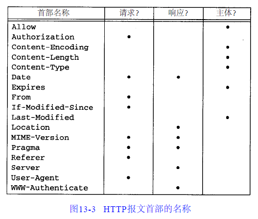
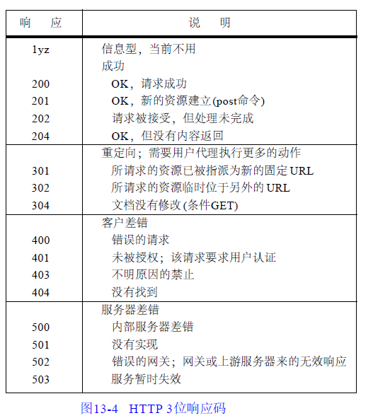

### TCP IP卷三中基于HTTP/1.0来介绍 ###

### 报文的有两种类型：请求和响应 ###

- HTTP/1.0 请求的格式是：

		request-line
		headers(0或有多个)
		<blank line>
		body(只对POST请求有效)

	- request-line的格式是：

			request request-URI HTTP版本号
	
			支持以下三种请求：
			
			1)GET请求，返回request-URI所指出的任意信息
			2)HEAD请求，类似于GET请求，但服务器程序只返回指定文档的首部信息，而不包含实际的文档内容。 该请求通常被用来测试超文本链接的正确性，可访问性和最近的修改
			3)POST请求用来发送电子邮件, 新闻或发送能由交互用户填写的表格。这是唯一需要在请求中发送body的请求。使用POST请求时需要在报文首部Content-Length字段中指出body的长度。

- HTTP/1.0 响应的格式是:

		status-line
		headers(0个或有多个)
		<blank line>
		body

		- status-line的格式是：

			HTTP版本号 response-code response-phrase

### 首部字段 ###

- HTTP/1.0的请求和响应报文的首部均可包含可变数量的字段。

- 用一个空行将所有首部字段与报文主体分隔开来。

- **一个首部字段由字段名和随后的冒号，一个空格和字段值组成，字段名不区分大小写。**

- **报文头分为三类：一类用户请求，一类用于响应，还有一类描述主体**

- 有一些报文头（例如：Date）既可用于请求又可用于响应。

- 描述主体的报文头可以出现在POST请求和所有响应报文中。

- HTTP17种不同的headers

### 响应代码 ###

- 通过三位数字的响应代码的第一位，可以将HTTP分成5类

- 使用这种三位的响应代码并不是任意的选择。我们将看到NTTP及其他的Internet应用如FTP，SMTP也可以使用这些类型的响应代码。

### 服务器关闭连接的三种方式 ###

- 在这里我们实际上提到了当前定义的三种服务器结束响应的方法。最好的办法
是使用Content-Length报文首部，其次是服务器发送一个带有boundary = 属性的Content-Type报文首部([Rose 1993]的6 . 1 . 1节中给出了怎样使用这种属性的例子，但是并非所有的客户程序都支持这种特性)。最差的选择(但最广泛运用的)便是服务器关闭连接。

