#准备

## VIM工具

- PlantumlOpen

	Open previewer webpage in browser, and watch current buffer

- PlantumlStart

	Like PlantumlOpen, but won't open in browser
	
- PlantumlStop

	Stop watch buffer
	
- PlantumlSave [filepath] [format]

	Export uml diagram to file path
	Available formats
	
		png, svg, eps, pdf, vdx, xmi, scxml, html, txt, utxt, latex
		
Example:

	:e diagram.puml
	
	:PlantumlSave
	:PlantumlSave diagram.png
	:PlantumlSave diagram.svg
	
## VISIO STUDIO CODE

	打开VSCode
	⌘(command) + shift + X打开扩展，搜索PlantUML
	选择星最多的，一般就第一个	
	
	alt + D右侧即可渲染出UML图

	完成后的绘图，可以导出多种格式，也是通过 Ctrl + Shift + P，打开命令面板，找到 Export Current Diagram 命令，导出。

# 序列图

## 简单示例

你可以用 -> 来绘制参与者之间传递的消息，而不必显式地声明参与者。 
你也可以使用 --> 绘制一个虚线箭头。
另外，你还能用 <- 和 <--，这不影响绘图，但可以提高可读性。注意:仅适用于时序图，对于其它示意 图，规则是不同的。

	@startuml
	用户 -> 认证中心: 登录操作
	认证中心 -> 缓存: 存放(key=token+ip,value=token)token
	用户 <- 认证中心 : 认证成功返回token
	用户 -> 认证中心: 下次访问头部携带token认证
	认证中心 <- 缓存: key=token+ip获取token
	其他服务 <- 认证中心: 存在且校验成功则跳转到用户请求的其他服务 其他服务 -> 用户: 信息
	@enduml
		
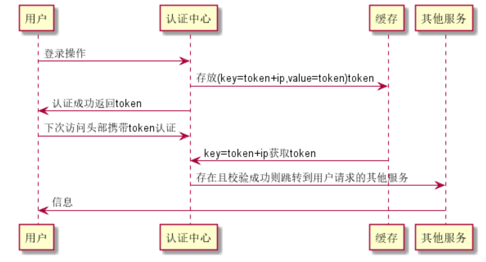	

## 声明参与者

- 关键字 participant 用于改变参与者的先后顺序。

	你也可以使用其它关键字来声明参与者:
	
	- actor
	- boundary
	- control
	- entity
	- database
	- collections
	
	
	示例:
	
		@startuml
		actor Foo1
		boundary Foo2
		control Foo3
		entity Foo4
		database Foo5
		collections Foo6
		
		Foo1 -> Foo2 : To boundary
		Foo1 -> Foo3 : To control
		Foo1 -> Foo4 : To entity
		Foo1 -> Foo5 : To database
		Foo1 -> Foo6 : To collections
		@enduml
	
	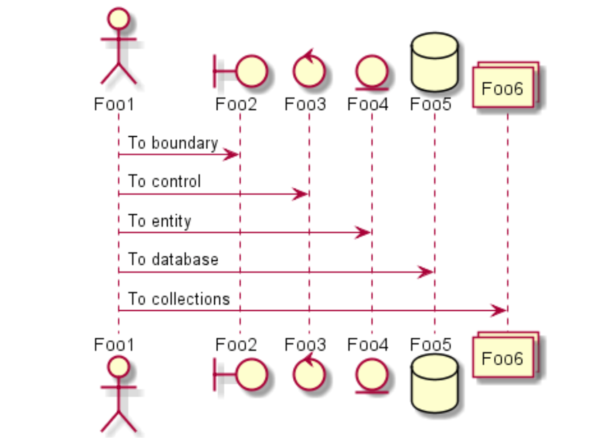

- 关键字 as 用于重命名参与者

	你可以使用 RGB 值或者颜色名修改 actor 或参与者的背景颜色。
	
	
		@startuml
		
		actor Blob #red
		'the only difference between actor 
		'and participant is the drawing
		participant Alice
		participant "I have a really\nlong name" as L #99FF99
		/'
		You can also declare:
		    participant L as "I have a really\nlong name" #99FF99
		'/
		Alice->Blob: Authentication Request
		Blob->Alice: Authentication Response
		Blob->L: Log transaction
		
		@enduml
		
	

- 您可以使用关键字 order 自定义顺序来打印参与者。

		@startuml
		participant Last order 30
		participant Middle order 20
		participant First order 10
		@enduml
		
	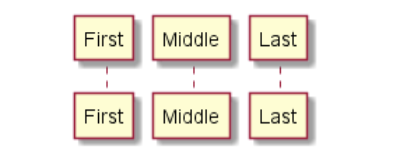

## 在参与者中使用非字母符号

你可以使用引号定义参与者，还可以用关键字 as 给参与者定义别名。
	
	@startuml
	Alice -> "Bob()" : Hello
	"Bob()" -> "This is very\nlong" as Long ' You can also declare:
	' "Bob()" -> Long as "This is very\nlong" Long --> "Bob()" : ok
	@enduml
	
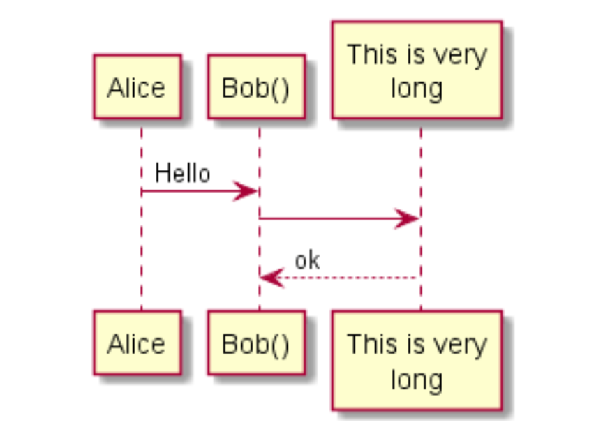

## 给自己发消息

参与者可以给自己发信息，
消息文字可以用来换行。

	@startuml
	Alice->Alice: This is a signal to self.\nIt also demonstrates\nmultiline \ntext @enduml
	
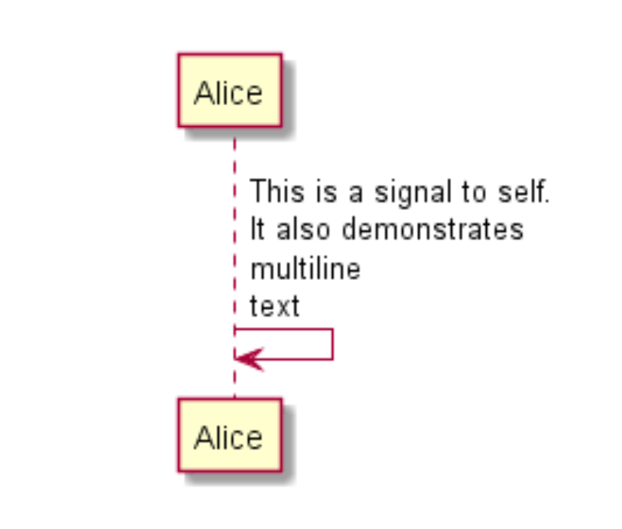

## Text alignment

将回应文本消息放到箭头下方

	@startuml
	skinparam responseMessageBelowArrow true Bob -> Alice : hello
	Alice -> Bob : ok
	@enduml

## 修改箭头样式

修改箭头样式的方式有以下几种:

- 表示一条丢失的消息:末尾加x
- 让箭头只有上半部分或者下半部分:将 < 和 > 替换成 \ 或者 /
- 细箭头:将箭头标记写两次(如>>或//)
- 虚线箭头:用--替代-
- 箭头末尾加圈:->o
- 双向箭头:<->

		@startuml
		Bob ->x Alice 
		Bob -> Alice 
		Bob ->> Alice 
		Bob -\ Alice 
		Bob \\- Alice 
		Bob //-- Alice
		Bob ->o Alice 
		Bob o\\-- Alice
		Bob <-> Alice 
		Bob <->o Alice 
		@enduml
		
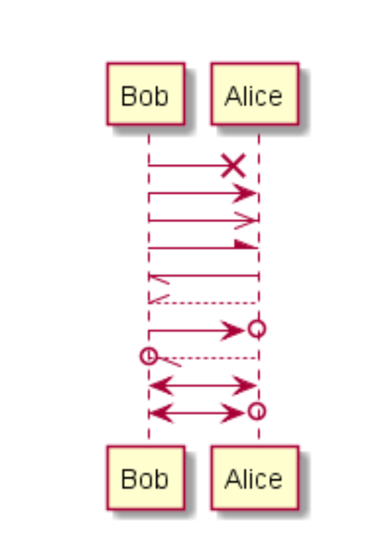

## 修改箭头颜色

你可以用以下记号修改箭头的颜色:

	@startuml
	Bob -[#red]> Alice : hello
	Alice -[#0000FF]->Bob : ok
	@enduml
	
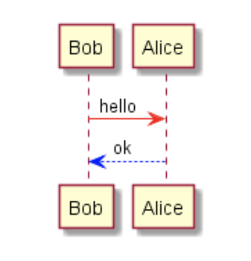

## 对消息序列编号

关键字 autonumber 用于自动对消息编号。

	@startuml
	autonumber
	Bob -> Alice : Authentication Request 
	Bob <- Alice : Authentication Response 
	@enduml
	
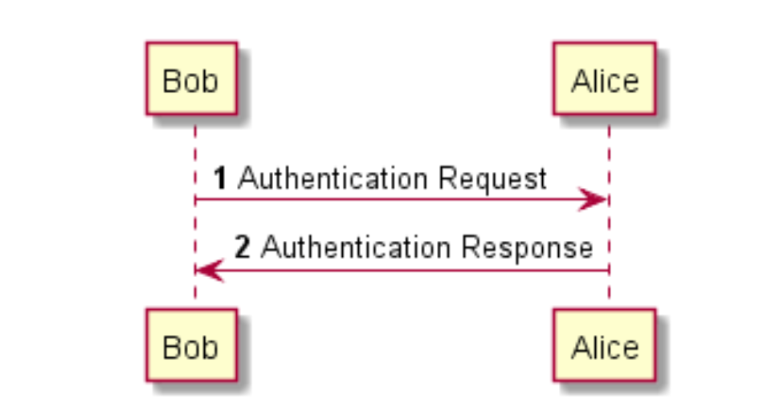

语句 autonumber //start// 用于指定编号的初始值，而 autonumber //start// //increment// 可以 同时指定编号的初始值和每次增加的值。

	@startuml
	autonumber
	Bob -> Alice : Authentication Request 
	Bob <- Alice : Authentication Response
	autonumber 15
	Bob -> Alice : Another authentication Request
	Bob <- Alice : Another authentication Response
	autonumber 40 10
	Bob -> Alice : Yet another authentication Request 
	Bob <- Alice : Yet another authentication Response
	@enduml
	
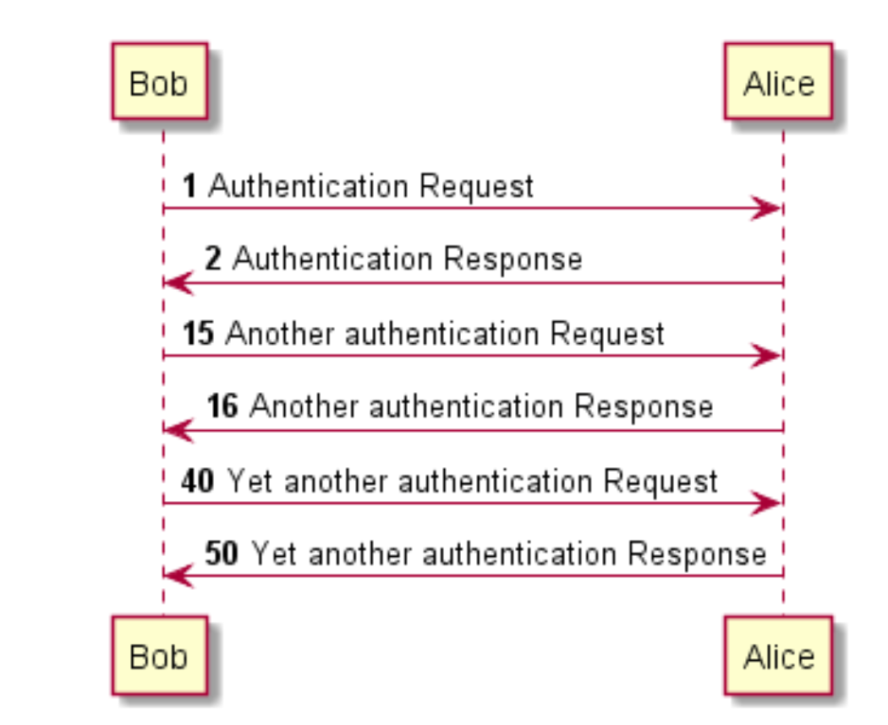

你可以在双引号内指定编号的格式

格式是由 Java 的 DecimalFormat 类实现的:(0 表示数字;# 也表示数字，但默认为 0)。 你也可以用 HTML 标签来制定格式。

	@startuml
	autonumber "<b>[000]"
	Bob -> Alice : Authentication Request 
	Bob <- Alice : Authentication Response
	
	autonumber 15 "<b>(<u>##</u>)"
	Bob -> Alice : Another authentication Request 
	Bob <- Alice : Another authentication Response
	
	autonumber 40 10 "<b>Message 0 " 
	Bob -> Alice : Yet another authentication Request 
	Bob <- Alice : Yet another authentication Response
	@enduml

你还可以用语句 autonumber stop 和 autonumber resume //increment// //format// 来表示暂停或
继续使用自动编号。

	@startuml
	autonumber 10 10 "<b>[000]"
	Bob -> Alice : Authentication Request 
	Bob <- Alice : Authentication Response
	
	autonumber stop
	Bob -> Alice : dummy
	
	autonumber resume "<b>Message 0 " 
	Bob -> Alice : Yet another authentication Request
	Bob <- Alice : Yet another authentication Response
	
	autonumber stop
	Bob -> Alice : dummy
	
	autonumber resume 1 "<b>Message 0 " 
	Bob -> Alice : Yet another authentication Request 
	Bob <- Alice : Yet another authentication Response 
	@enduml
	

## 页面标题, 页眉, 页脚	

使用 title 关键词增加标题 
使用 header 关键词增加页眉 
使用 footer 关键词增加页脚

	@startuml
	header Page Header
	footer Page %page% of %lastpage%
	title Example Title
	Alice -> Bob : message 1 Alice -> Bob : message 2
	@enduml

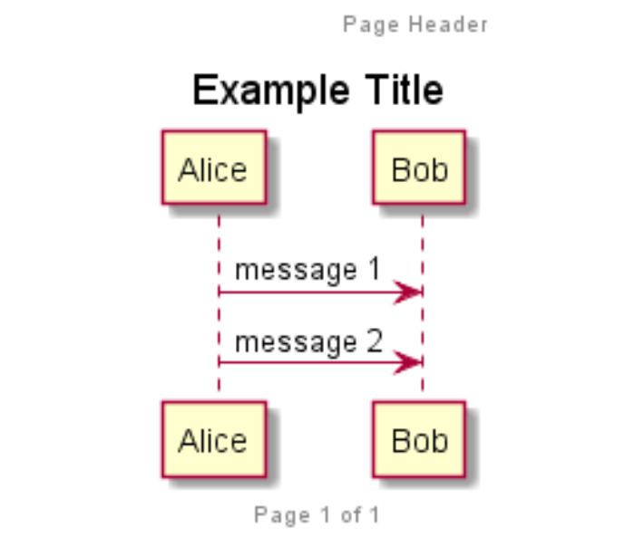

## 组合消息

我们可以通过以下关键词将组合消息:

- alt/else
- opt
- loop
- par
- break
- critical
- group, 后面紧跟着消息内容

可以在标头 (header) 添加需要显示的文字 (group 除外)。 
关键词 end 用来结束分组。
注意，分组可以嵌套使用。

	@startuml group
	Alice -> Bob: Authentication Request
	
	alt successful case
	
	    Bob -> Alice: Authentication Accepted
	
	else some kind of failure
	
	    Bob -> Alice: Authentication Failure
	    group My own label
	    Alice -> Log: Log attack start
	        loop 1000 times
	            Alice -> Bob: DNS Attack
	        end
	    end
	end
	@enduml

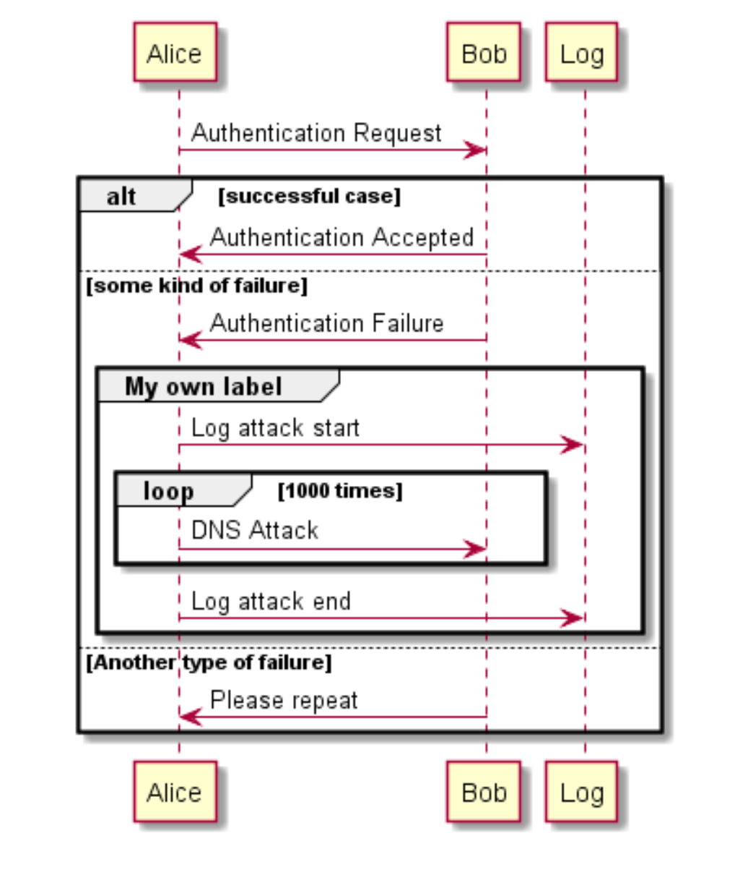

## 给消息添加注释

我们可以通过在消息后面添加 note left 或者 note right 关键词来给消息添加注释。 你也可以通过使用 end note 来添加多行注释。

	@startuml comment
	
	Alice->Bob : hello
	note left: this is a first note
	
	Bob->Alice : ok
	note right: this is another note
	
	Bob->Bob : I am thinking
	note left
	a note
	can also be defined
	on several lines
	end note
	
	@enduml

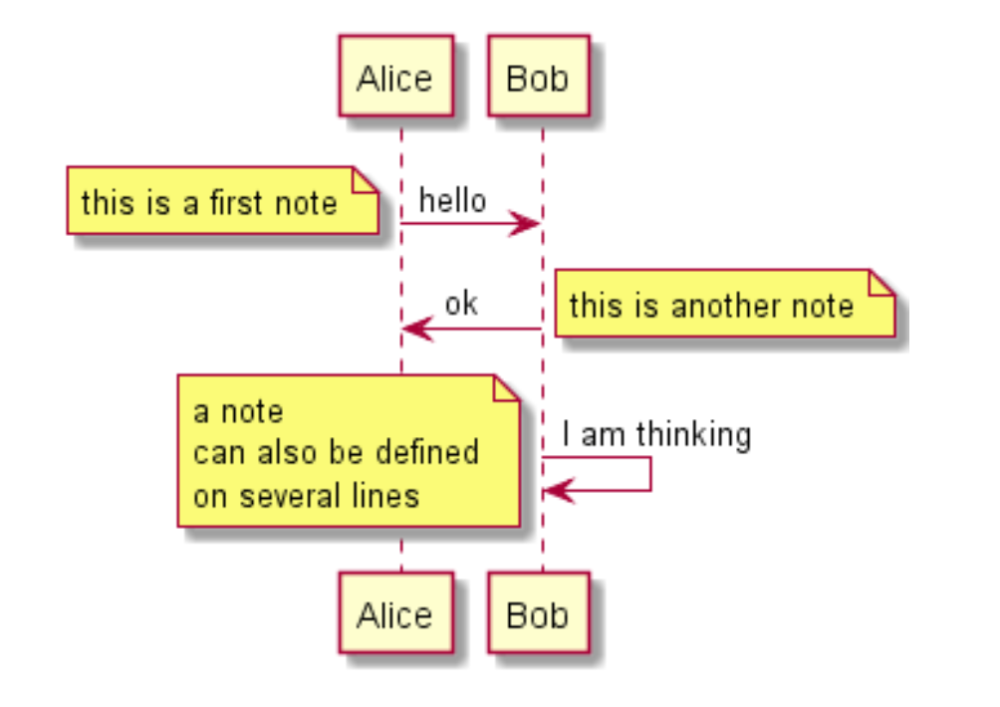

## 其他的注释

可以使用 note left of，note right of 或 note over 在节点 (participant) 的相对位置放置注释。 还可以通过修改背景色来高亮显示注释。

以及使用关键字 end note 来添加多行注释。

	@startuml otherComment
	
	participant Alice
	participant Bob
	note left of Alice #aqua
	This is displayed
	left of Alice
	end note
	
	note right of Alice: This is displayed right of Alice
	
	note over Alice: This is displayed over Alice
	
	note over Alice, Bob #FFAAAA: This is diaplayed\n over Bob and Alice.
	
	note over Bob, Alice
	This is yet another
	example of
	a long note
	end note
	
	@enduml
	
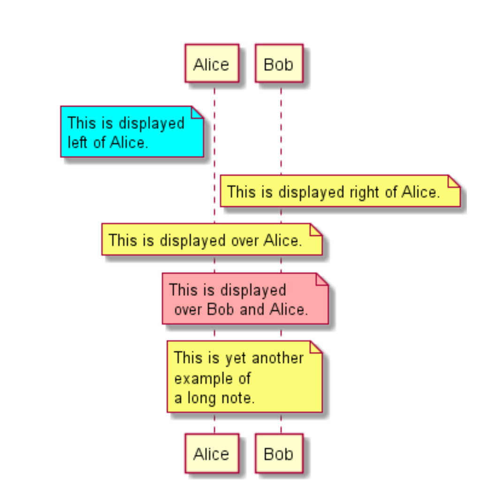

## 改变注释的形状

你可以使用 hnote 和 rnote 这两个关键字来修改备注框的形状。

	@startuml shap_comment
	
	caller -> server : conRed
	hnote over caller : idle
	caller <- server : conConf
	rnote over server
	  "r" as rectangle
	  "h" as hexagon
	endrnote
	
	@enduml
	
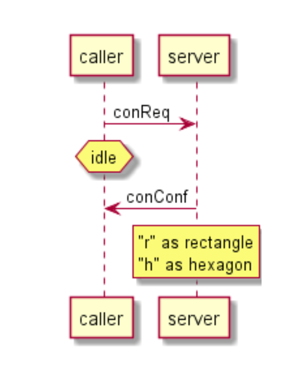

## Creole 和 HTML

可以使用 creole 格式。

	@startuml creole_html
	
	participant Alice
	participant "The **Famous** Bob" as Bob
	
	Alice -> Bob : hello --threre--
	... Some ~~long delay~~ ....
	Bob -> Alice : ok
	
	note left
	    This is **bold**
	    This is //italics//
	    This is ""monospaced""
	    This is --stroked--
	    This is __underlined__
	    This is ~~waved~~
	endnote
	
	Alice -> Bob : A //well formatted// message
	note right of Alice
	    This is <back:cadetblue><size:18>dispalyed</size></back>
	    __left of__ Alice.
	end note
	note left of Bob
	    <u:red>This</u> is <color #118888>displayed</color>
	    **<color purple>left of</color> <s:red>Alice</strike> Bob**.
	end note
	note over Alice, Bob
	    <w:#FF33FF>This is hosted</w> by 
	end note
	@enduml
	
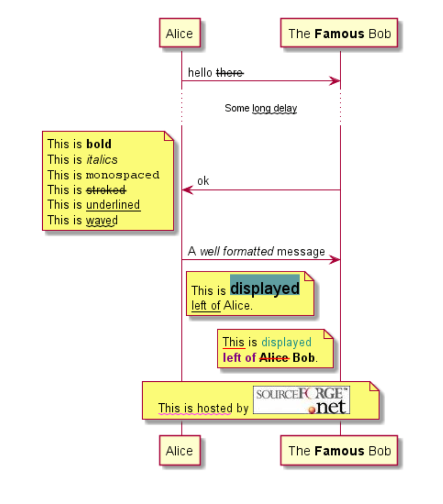
	
## 分隔符

你可以通过使用 == 关键词来将你的图表分割多个步骤。

	@startuml separate_char
	
	== Initialization ==
	
	Alice -> Bob : Authentication Request
	
	Bob --> Alice : Authentication Response
	
	== Repetition ==
	
	Alice -> Bob : Another authentication Request
	Alice <-- Bob : another authentication Response
	
	@enduml

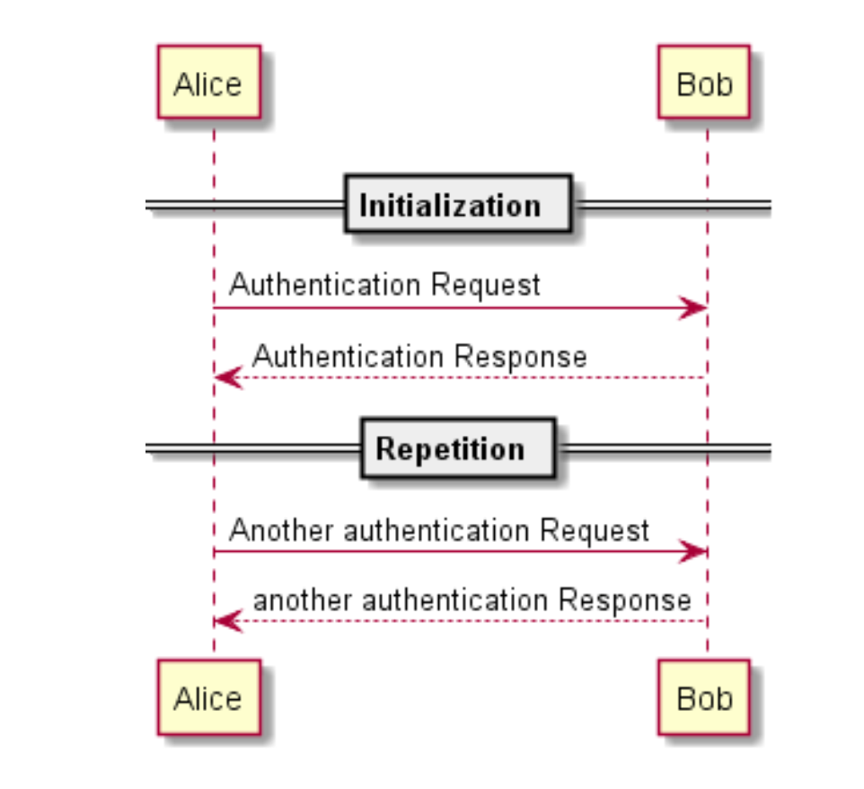

## 引用

你可以在图中通过使用 ref over 关键词来实现引用

	@startuml ref
	participant Alice
	actor Bob
	
	ref over Alice, Bob : init
	Alice -> Bob : hello
	
	ref over Bob
	    This can be on
	    serveral lines
	end ref
	
	@enduml
	
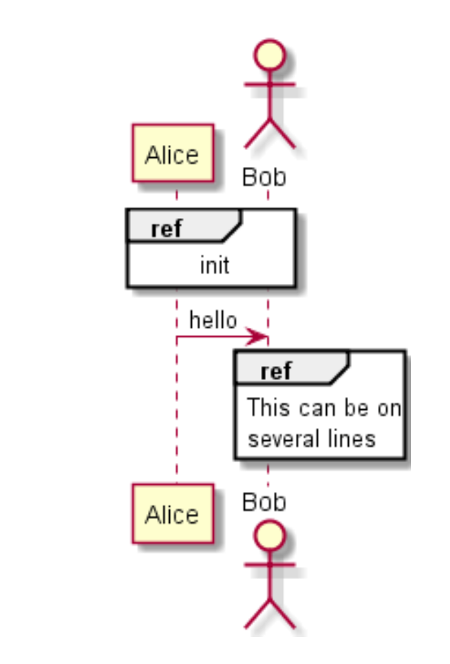

## 延迟

你可以使用... 来表示延迟，并且还可以给延迟添加注释。

	@startuml deplay
	
	Alice -> Bob : Authentication Request
	...
	Bob --> Alice : Authentication Response
	...5 minutes later...
	Bob --> Alice : Bye!
	
	@enduml
	
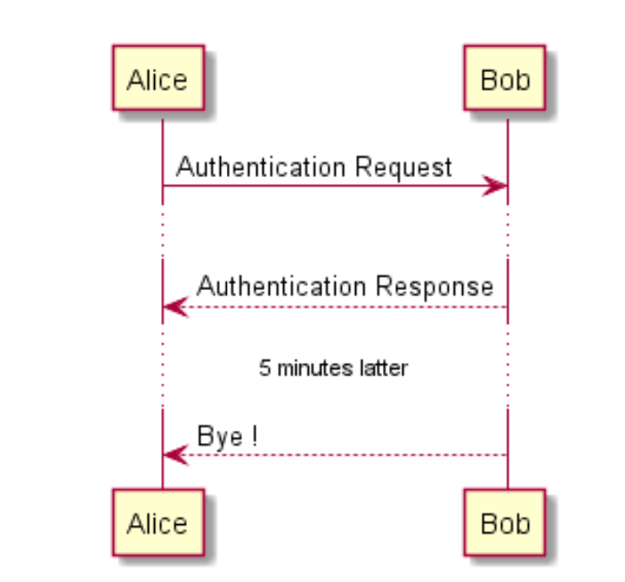
	
## Text wrapping
	
To break long messages, you can manually add in your text.

Another option is to use maxMessageSize setting:

	@startuml text_wrap
	
	skinparam maxMessageSize 50
	
	participant a
	participant b
	
	a -> b :this\nis\nmanually\ndone
	a -> b :this is a very long message on several words
	
	@enduml	
	
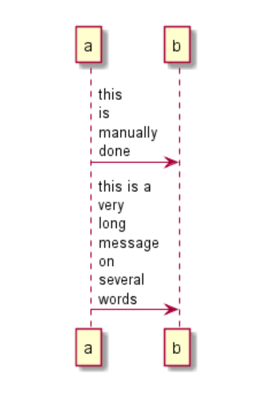

## 空间 

你可以使用 ||| 来增加空间。
还可以使用数字指定增加的像素的数量。

	@startuml space
	
	Alice -> Bob : message 1
	Bob -> Alice : ok
	|||
	Alice -> Bob : message 2
	Bob --> Alice : ok
	||45||
	Alice -> Bob : message 3
	Bob --> Alice : ok
	
	@enduml	
	
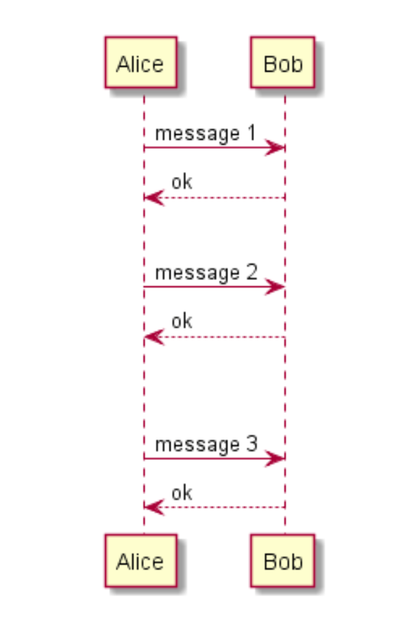	

## 生命线的激活与撤销

关键字 activate 和 deactivate 用来表示参与者的生命活动。
一旦参与者被激活，它的生命线就会显示出来。

activate 和 deactivate 适用于以上情形。
destroy 表示一个参与者的生命线的终结。

	@startuml life
	participant User
	
	User -> A: DoWork
	activate A
	
	A -> B: << createRequest >>
	activate B
	
	B -> C: DoWork
	activate C
	C --> B: WorkDone
	destroy C
	
	B --> A: RequestCreated
	deactivate B
	
	A -> User: Done
	deactivate A
	@enduml
	
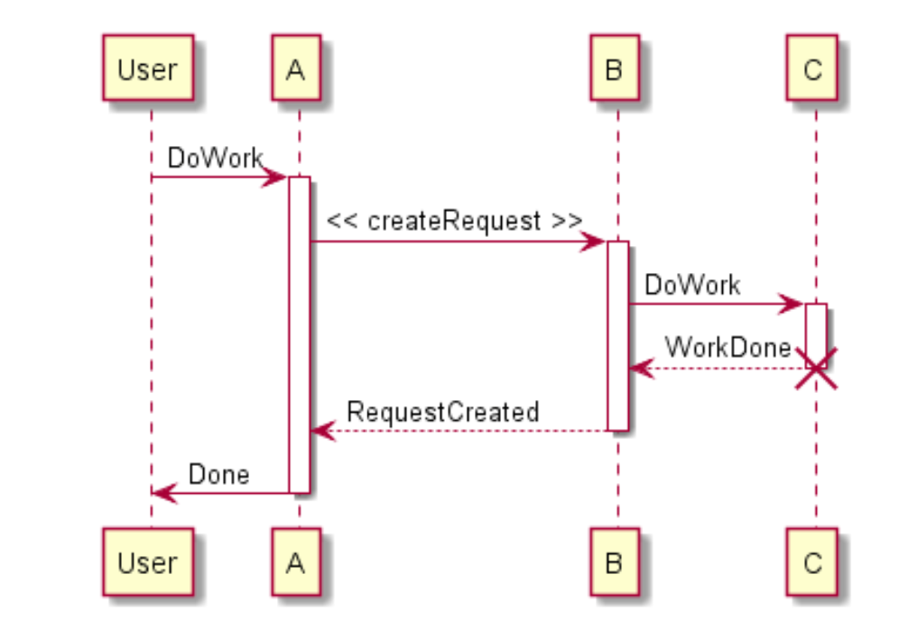
	
还可以使用嵌套的生命线，并且运行给生命线添加颜色。

	@startuml life_new
	
	participant User
	
	User -> A : DoWork
	activate A #FFBBBB
	
	A -> A : Internal call
	activate A #DarkSalmon
	
	A -> B : << createRequest >>
	activate B
	
	B --> A : RequestCreated
	deactivate B
	deactivate A
	
	A -> User : Done
	deactivate A
	
	@enduml	
	
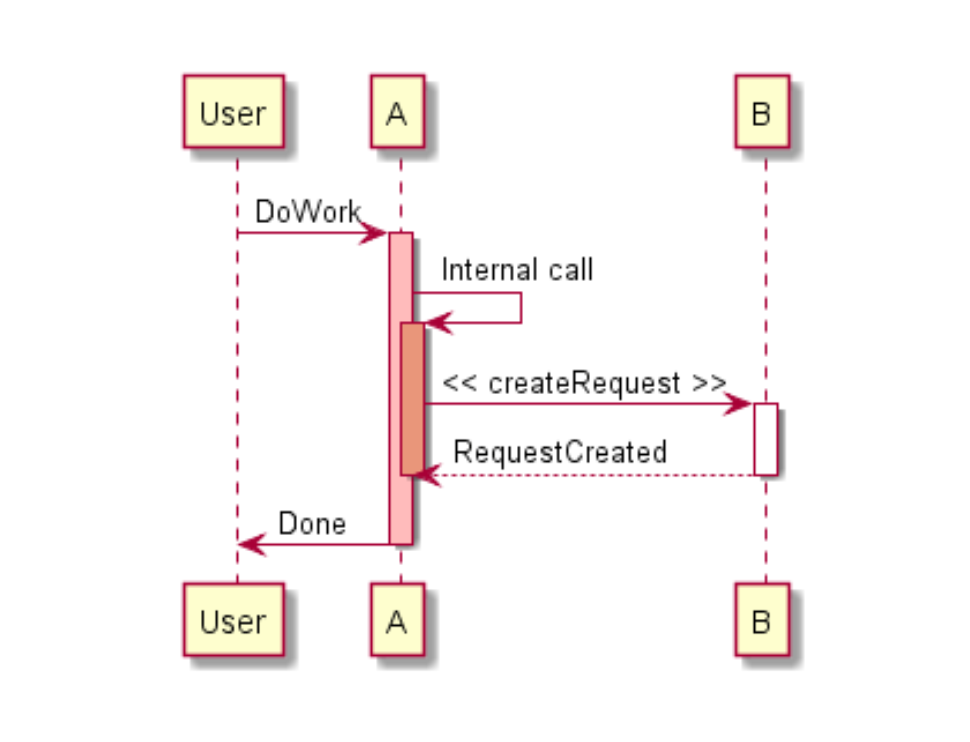

## Return

A new command return for generating a return message with optional text label. The point returned to is the point that cause the most recently activated life-line. The syntax is simply return label where label, if provided, can be any string acceptable on conventional messages.
	
	@startuml return
	
	Bob -> Alice : hello
	activate Alice
	
	Alice -> Alice : some action
	
	return bye
	
	@enduml
	
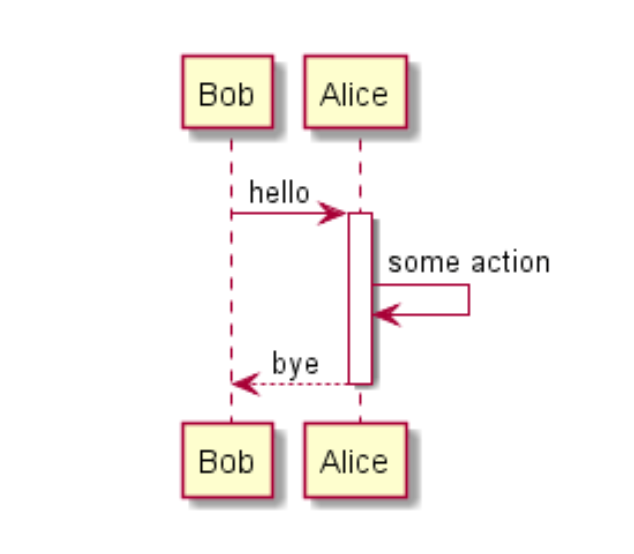

## 创建参与者

你可以把关键字 create 放在第一次接收到消息之前，以强调本次消息实际上是在创建新的对象。

	@startuml create_participant
	
	Bob -> Alice : hello
	
	create Other
	Alice -> Other : new
	
	create control String 
	Alice -> String
	note right : You can also put notes!
	
	Alice --> Bob : ok
	
	@enduml
	
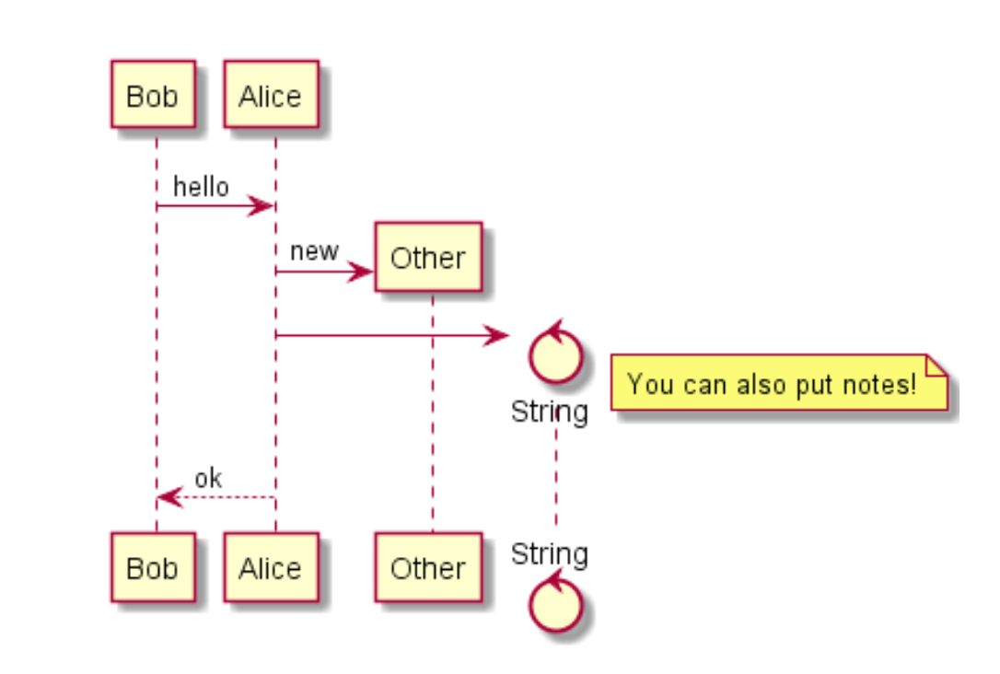

## Shortcut syntax for activation, deactivation, creation

Immediately after specifying the target participant, the following syntax can be used:

- ++ Activate the target (optionally a #color may follow this)
- -- Deactivate the source
- ** Create an instance of the target
- !! Destroy an instance of the target

		@startuml shortup
		
		alice -> bob ++ : hello
		
		bob -> bob ++ : self call
		
		bob -> bib ++ #005500 : hello
		
		bob -> george ** : create
		
		return done 
		return rc 
		
		bob -> george !! : delete 
		return success
		
		@enduml
	
## 进入和发出消息

如果只想关注部分图示，你可以使用进入和发出箭头。
使用方括号 [和] 表示图示的左、右两侧。

	@startuml message 
	
	[->A : DoWork
	
	activate A
	
	A -> A : Internal call
	activate A
	
	A ->] : << createRequest >>
	
	A <--] : RequestCreated
	deactivate A
	
	[<- A : Done
	
	deactivate A
	
	@enduml	
	
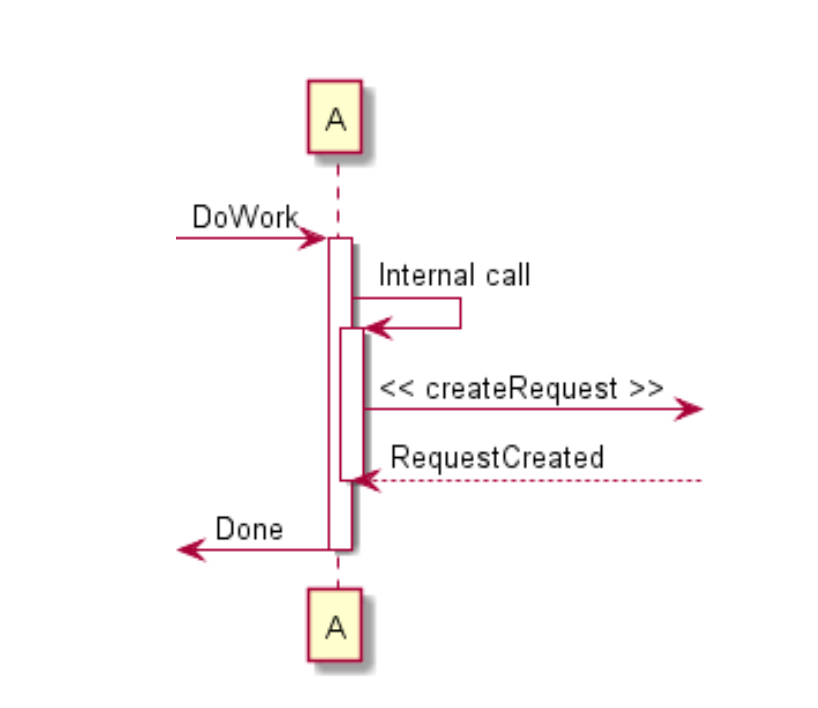

## Anchors and Duration

With teoz usage it is possible to add anchors to the diagram and use the anchors to specify duration time.

	@startuml anchors
	!pragma teoz true
	
	{start} Alice -> Bob : start doing things during duration 
	Bob -> Max : something
	Max -> Bob : something else
	{end} Bob -> Alice : finish
	{start} <-> {end} : some time 
	@enduml	
	
## 构造类型和圈点

可以使用 << 和 >> 给参与者添加构造类型。
在构造类型中，你可以使用 (X,color) 格式的语法添加一个圆圈圈起来的字符。
	
	@startuml populate
	
	participant "Famous Bob" as Bob << Generated >>
	participant Alice << (C,#ADD1B2) Testable >>
	
	Bob->Alice: First message
	
	@enduml	
	
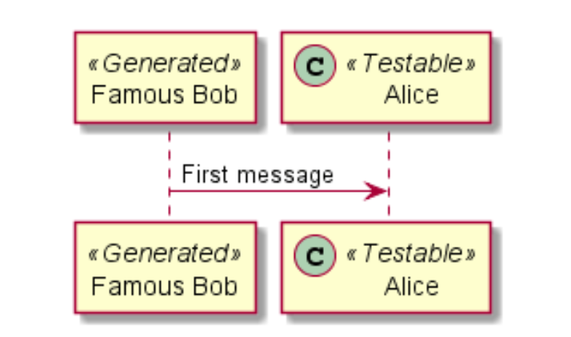

## 更多标题信息

你可以在标题中使用 creole 格式。

	@startuml
	
	title __Simple__ **communication** example
	
	Alice -> Bob: Authentication Request
	
	Bob -> Alice: Authentication Response
	
	@enduml
	
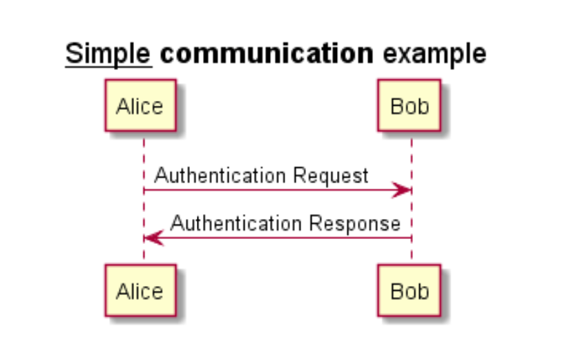

还可以使用关键字 title 和 end title 定义多行标题。

	@startuml new_line
	
	title
	    <u>Simple</u> communication example
	    on <i>several</i> lines and using html
	    This is hosted by 
	end title
	
	Alice -> Bob : Authentication Request
	Bob -> Alice : Authentication Response
	
	@enduml	
	
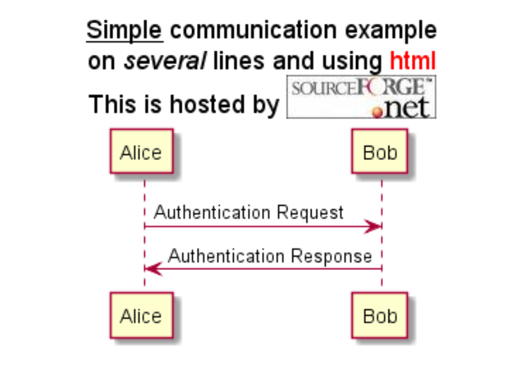

## 包裹参与者

可以使用 box 和 end box 画一个盒子将参与者包裹起来。
还可以在 box 关键字之后添加标题或者背景颜色。

	@startuml box
	
	box "Internal Service" #LightBlue
	participant Bob
	participant Alice
	end box
	participant Other
	
	Bob -> Alice : hello
	Alice -> Other : hello
	
	@enduml

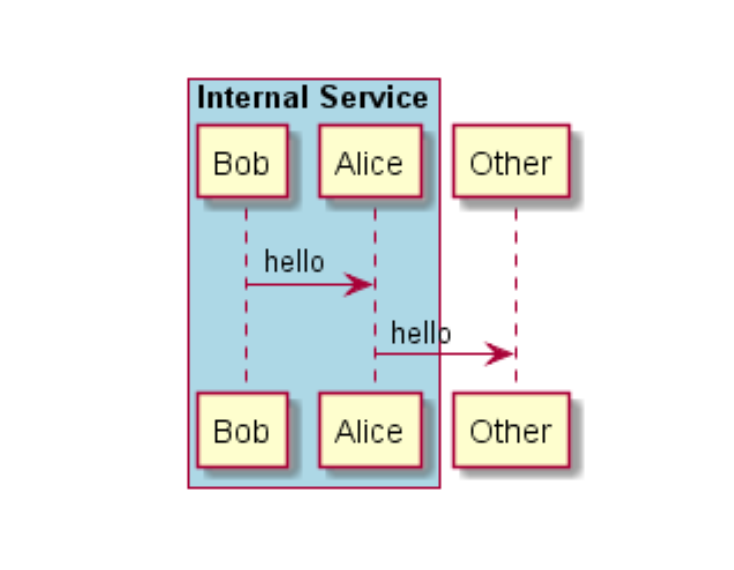

## 移除脚注

使用 hide footbox 关键字移除脚注。

	@startuml footbox
	
	hide footbox
	title Footer removed
	
	Alice -> Bob : Authentication Request
	Bob -> Alice : Authentication Response
	
	@enduml

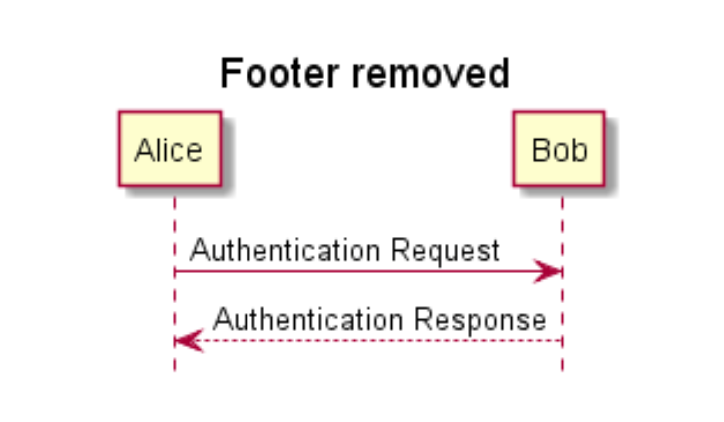

## 外观参数 (skinparam)

## 填充区设置

