软件方法下

# 建模和UML

利润 = 需求 - 设计

本书中的“需求”和“设计”两个术语有两种用途。一种用于表达建模得到的结果，例如“需求和设计不是一一对应的”;另一种用于表达建模的工作流，即需求工作流和设计工作流，例如“我正在做需求”。**希望下面的话能帮助理解:为了得到需求，需要做的建模工作流有业务建模和需求，为了得到设计，需要做的建模工作流有分析和设计。**

### 建模工作流

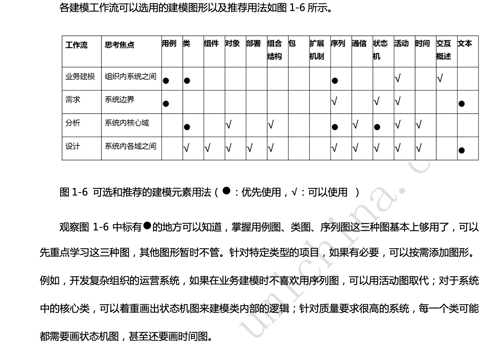

### 模型作为源代码

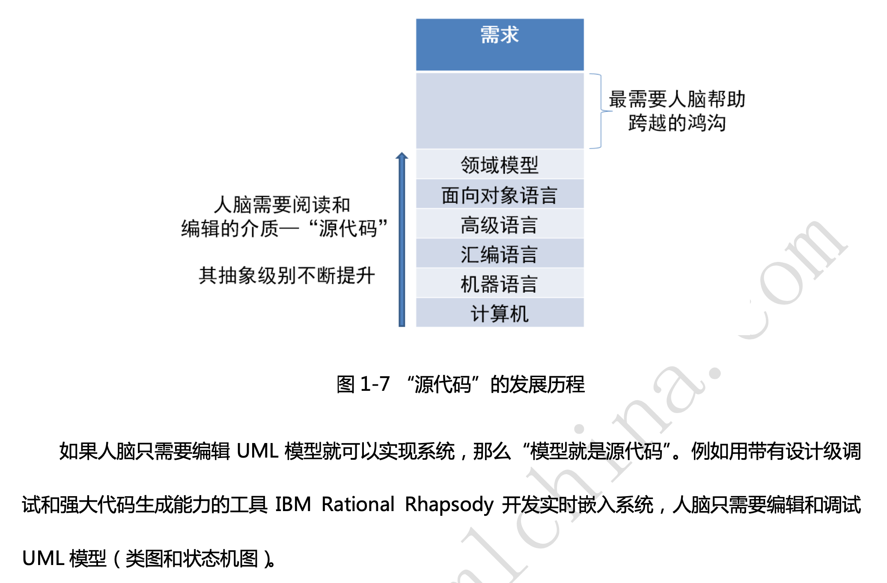

### 模型符号的意义

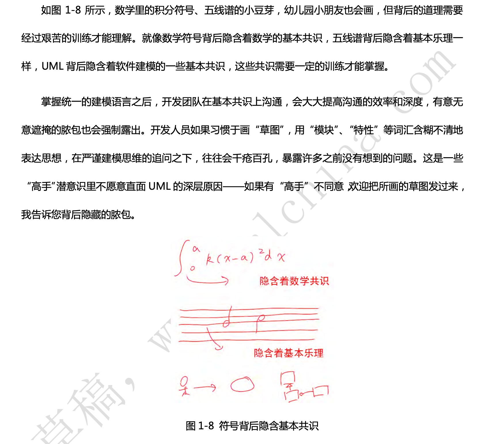

如果缺乏清晰、共享的愿景，开发人员就会兴高采烈地在错误的方向上狂奔，做得越多，浪费越 多。很多年前一位技术总监的话让我印象深刻:

	“知道这两个(和愿景相关度最大的)功能实现难度太大做不下去，在我看来这个项目已经没有价值，但是开发人员还乐在其中，觉得还有其他功能可以做。”

# 业务建模 - 愿景

## 什么是愿景(Vision)

爆炸法:

- 如果投资人在你身上绑了炸弹，命令你在几分钟之内把当前研究的系统推销出去，而且只能找一 个人推销。假设这个炸弹还能感应脑电波，推销完毕后,如果炸弹感应到被推销的人对这个系统不感兴 趣，就会爆炸。这种情况下，为了最大可能地保住自己的性命，你会选择向谁推销，推销时选择说什 么话?这个问题的答案就是老大和愿景。

- (很多人可能会第一时间想到向自己的父亲或母亲推销，但是，父母会买单是对你的性命感兴趣， 未必对你推销的系统感兴趣，炸弹依然会爆炸!)

- 如果上面的场景还不足以刺激你思考，可以用加强版:如果投资人在你和你的情敌身上绑了炸弹， 命令你们几分钟时间内把当前研究的系统推销出去，谁得到的感兴趣的脑电波强，谁就活下来。

愿景属于业务建模工作流的一部分。为了突出愿景的重要性，本书把它单独列为一章。

如果缺乏清晰、共享的愿景，开发人员就会兴高采烈地在错误的方向上狂奔，做得越多，浪费越多。很多年前一位技术总监的话让我印象深刻。

一份愿景中，改进目标可以是一个，也可以是多个。改进目标应该是可以度量的。我把愿景相关 的概念画成类图，如图2-12 所示。

	“知道这两个(和愿景相关度最大的)功能实现难度太大做不下去，在我看来这个项目已经没有 价值，
	但是开发人员还乐在其中，觉得还有其他功能可以做。”
	
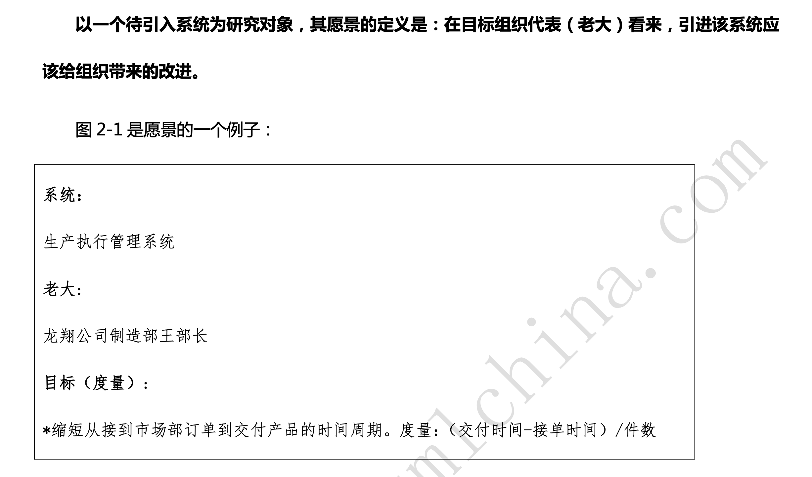

**通俗一点说，一个东西的愿景就是:东西最应该卖给谁，对他有什么好处?这么简单的问题，回答起来未必容易。开发人员介绍自己的系统时，洋洋洒洒说一大堆系统有哪些功能，采用什么技术平 台、架构等等，但被问到“为什么要做这个系统”时，可能就会瞠目结舌**。如果开发人员的思维停留 在“可以工作的软件”(来自“敏捷宣言”)而不是追求“可以卖的软件”，他甚至会纳闷为什么要思考愿景这个东西!

##【步骤】定位目标组织和老大

**目标组织 : 待引入系统将改进其流程的组织。它可以是一个机构，也可以是一个人群。**

平时开发人员口中所说的“客户”，实际上就是目标组织，但本书不采用“客户”这个词，因为“客户”暗含着“和我(开发人员)所在的不是一个组织”的意思。目标组织可以是开发人员所在的组织， 就像医生可以给自己和同事看病一样。采用“目标组织”这个词，更关注“患者是谁”，而不是“患者和医生是什么关系”。

**老大 : 目标组织的代表。**

老大是一个具体的人，是系统最优先照顾其利益的那个人，相当于某部戏最重要的观众，如果他 不满意，其他人满意也没用了。

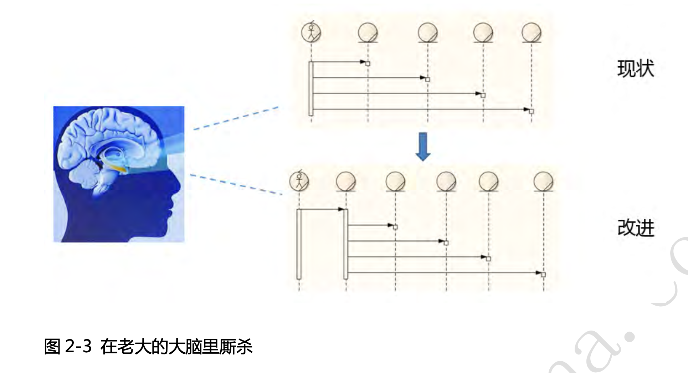

做这些深刻的思考并不容易。很多需求人员是从程序员转型而来，习惯于从实现者的视角看问题， 而不是老大的视角。

我把定位目标组织和老大所要做的工作列在图 2-4 中，分为三种情况来考虑。需求人员在定位过程中要善于具体化，把产品当成项目来做。

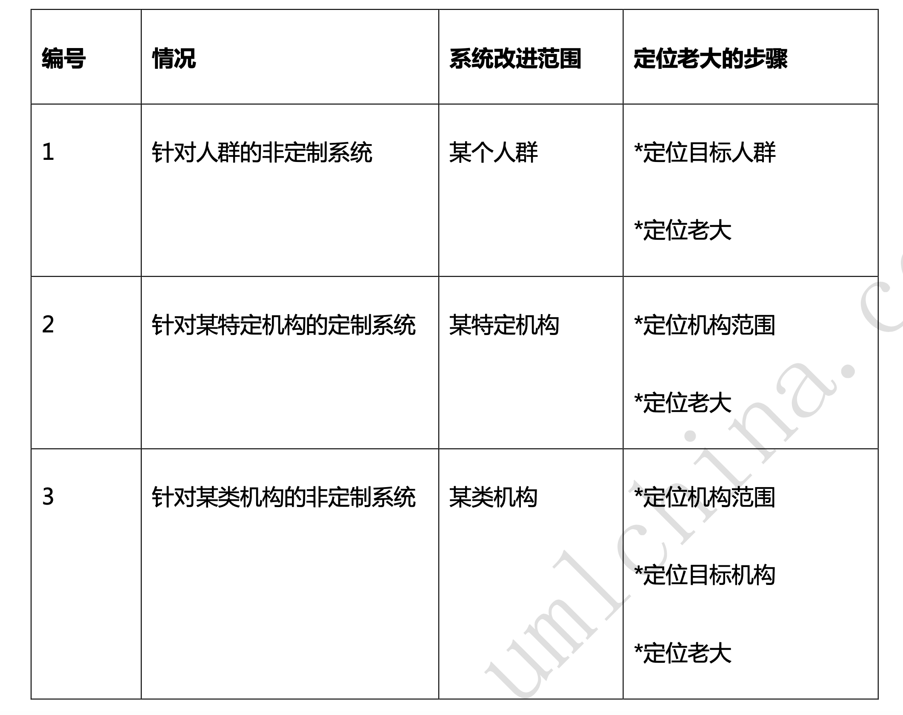

* “定制系统”即平时所说的“项目”，“非定制系统”即平时所说的“产品”。

### 定位情况 1-定位目标人群和老大

严格的做法可以画出类图，对类的每个属性以及所关联类的每个属性展开比较，找出最“像”的属
性值集合。

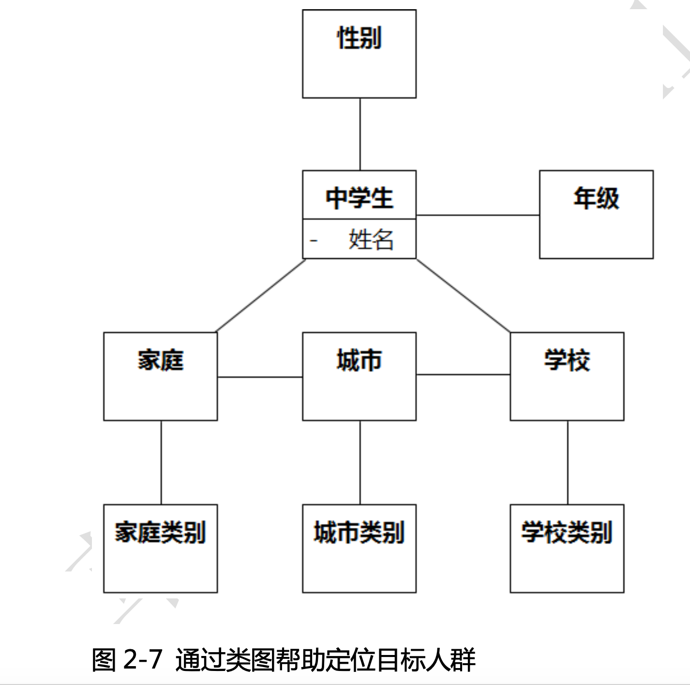

#### 常见错误

- 从功能加上“人群”二字得到目标人群

	不要用功能概括的词，一定要精准定位人群。如果问目标客户是什么人，直接回答来吃饭的人或肚子饿的人没有任何增值作用， 不能帮助餐馆做出更好卖的菜品。要离开“吃饭”这个功能来定位，例如定位为政府公务员、IT 公司 程序员、工地民工等等。这三种不同的目标人群，带来的餐馆风格是不一样的。政府公务员可能去×× 会馆，适合 IT 公司程序员的是××湘菜馆，工地民工到××大排档。

- 吃窝边草

	要精确定位人群和人群老大，不要随便找一个熟悉的对象，没有说服力。

- 虚构老大

	深入第一线调研至关重要
	
### 定位情况 2-定位机构范围和老大

在定位机构范围和老大的时候，思维是逐步逼近的。最开始机构中的某个涉众(可能不是老大) 提到要做一个什么系统，还提供了一些模糊的目标，建模人员根据这些素材推敲到机构范围，再定位 老大，揣摩老大的愿景，再从愿景来判断之前的范围是否要调整。如果范围变化，老大可能也要再做 调整......循环往复，逐步逼近。

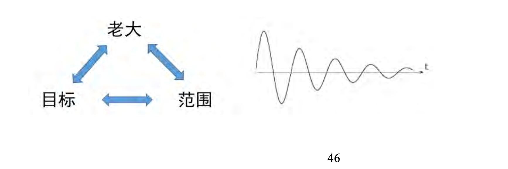

#### 常见错误

- 目标机构的IT主管是老大

	IT主管不是老大，因为系统要改进的不是目标机构 IT 部门的流程，而是业务部门的流程。所以， 老大应该是业务部门主管或机构负责人，视系统改进波及的范围而定。

	以看病做类比。患者病情比较严重或者患者不便交流的时候，和医生频繁打交道的可能是患者的 家属，但切不可因此把患者家属架上手术台。
	
- 机构之上的大领导是老大

	大领导作为老大，也不符合我们之前提到的“爆炸法”。例如，向国家领导人推销所开发的系统， 如果成功了，当然回报最大，问题是推销时能向国家领导人说什么呢?说“提高了拣货效率”?国家 领导人关心的是国家层面上的 “GDP”、“通胀率”、“就业率”等指标，所以推销词只能说“可以 为 GDP 做贡献”，而这句推销词适合上百万种产品，国家领导人能从这么多“为 GDP 做贡献”的候 选者中挑中你的系统的概率微乎其微!
	
- 谁出钱谁是老大

	改进的资金有各种各样的来源，但不能说谁出钱最多谁就是老大，还是要选择要改进的机构作为 研究组织，其负责人是老大。出钱的各方可以作为老大下面的各种涉众，他们的利益也是要考虑的

	还是以看病做类比。患者治病的钱可能是自己出，也可能是家属出，政府出，同房病友捐赠，甚 至由医院免单。不管怎样，上手术台的还是患者。
	
- 把其他涉众当作老大

	既然这里提到了“其他涉众”，那就多说几句。愿景只关注了老大的目标，不代表不考虑其他人的目标了，只是现在先放下，后面再考虑。其他人的目标叫做涉众利益。愿景实际上就是系统最重要涉众的利益。
	
	涉众，指受到系统影响的各种人。拿拍电影做类比，需求像电影剧本，涉众像电影观众。剧本只 有一份，观众却是多种多样，不同观众的欣赏角度和口味不同。鲁迅说过:一部红楼梦，经学家看见 《易》，道学家看见淫，才子看见缠绵，革命家看见排满，流言家看见宫闱秘事。
	
	软件系统也是如此。以本章开头举的生产执行管理系统为例，老大制造部王部长关注的是“缩短 从接到市场部订单到交付产品的时间周期”，车间工人更关心“我这个岗位的工作量会不会增加”，库 管员可能担心“以后不好搞手脚”。

### 定位情况 3-定位目标机构

第 3 种情况，系统是为某一类机构服务。那么，除了第 2 种情况中要做的工作之外，还需要插入 一步:定位目标机构。定位目标机构的思考方法和定位目标人群的思考方法是一样的。

要做一个电子病历产品卖给医院，说“客户是医院”肯定不够。医院也一样越来越细分，有大型 三甲医院，也有二级医院、中心卫生院甚至社区卫生服务中心......还有根据性别细分的男子医院、女子 医院，根据人体器官细分的口腔医院、肝病医院、肛肠医院......还不要忘了国外的医院，美国的 JHH、 Mayo、乌干达的@%&，孟加拉的&¥#......通过类图比较属性值，慢慢缩小范围，最终定位具体的医 院，例如“大兴中医院”。

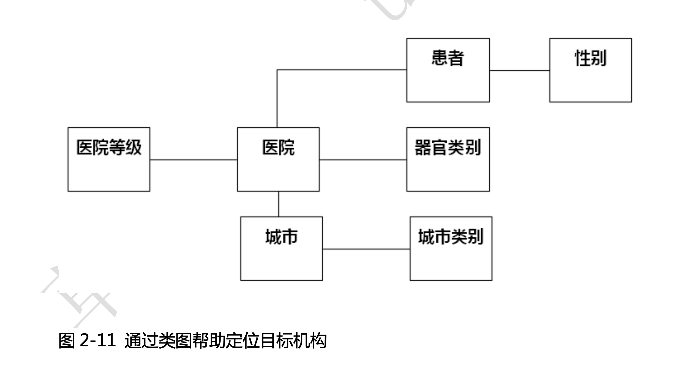

### 其他一些要点

- 建模人员还有一个偷懒的庇护所适用于上面列举的各种情况——老大就是我们开发团队的领导 (总经理、研发总监或部门经理等)，因为领导让我做什么我就做什么。

- “投币法”可以帮助需求人员排除开发者自身的影响，不仅有助于找老大，也有助于在后面的需 求工作中排除设计的干扰。

	为了锁死人类的软件技术，三体人派出智子[刘 2006]监控所有软件开发人员的行为，一旦发现某人有编制软件的行为，将在该人的大脑中产生长达十分钟的电击信号，让其痛不欲生。为了使将来的奴隶——人类的生活不至于倒退，三体人在地球上安放了很多软件开发机。只要对着开发机说清楚软 件的功能和性能并投币，开发机将生成所需软件并部署好。
	
#### 人群和机构，谁是战场?

要开发一个系统挑战新浪微博，或者思考新浪微博应该提供什么新功能，研究的目标组织应该怎么选?很多人在不知不觉中会把新浪公司作为研究组织，但这意义不大，因为研究新浪公司的内部流 程对思考系统的需求没有太多价值。正确的做法是把目标人群——明星大 V 人群作为研究组织，然后 从里面挑出最像明星大V的明星大V作为老大，例如苍井老师。
	
当然，如果要改进的是新浪公司内部的运营工作，把新浪公司作为研究对象是合理的。总之，关 键战场在哪里，就把它作为研究的对象。

**一般来说，公司初始阶段，关键是要把客户从竞争对手那里抢过来，强调“出奇”，这时定位的战场可能是目标人群;公司发展到成熟期，就要开始练内功，强调“守正”， 这时定位的战场可能是公司内部。**
	
#### 人群和人群，谁是战场?

还是以上面的新浪微博作为例子。运用“投币法”，我们知道苍井老师只关心这个系统的功能和性能能否高效地帮她向粉丝散播魅力，不关心这个系统是路上捡到的，还是新浪、搜狐甚至是外星人开发的。把运营的公司隐去后，系统连接的两端都是人群，这时问题就更微妙一些:哪个人群是战场?

更为稀缺的人群的头脑应优先选为战场。新浪微博能够击败其他微博，很大部分原因是攻克了明 星大V人群的大脑(可能是用金钱)，让他们在新浪开微博，粉丝也就闻风而至了。

这里可能会有建模人员说，战场在哪里弄那么清楚干什么，我全面开花不行吗?好吧，您牛，令 尊是李刚，要全面开花，那也得告诉我进攻的第一炮打向哪里吧!许多建模人员的老爸不是李刚，却 有“如果我爸是李刚”的思想和做派，这是很可悲的。

##【步骤】提炼改进目标

一份愿景中，改进目标可以是一个，也可以是多个。改进目标应该是可以度量的。我把愿景相关 的概念画成类图，如图 2-12 所示。

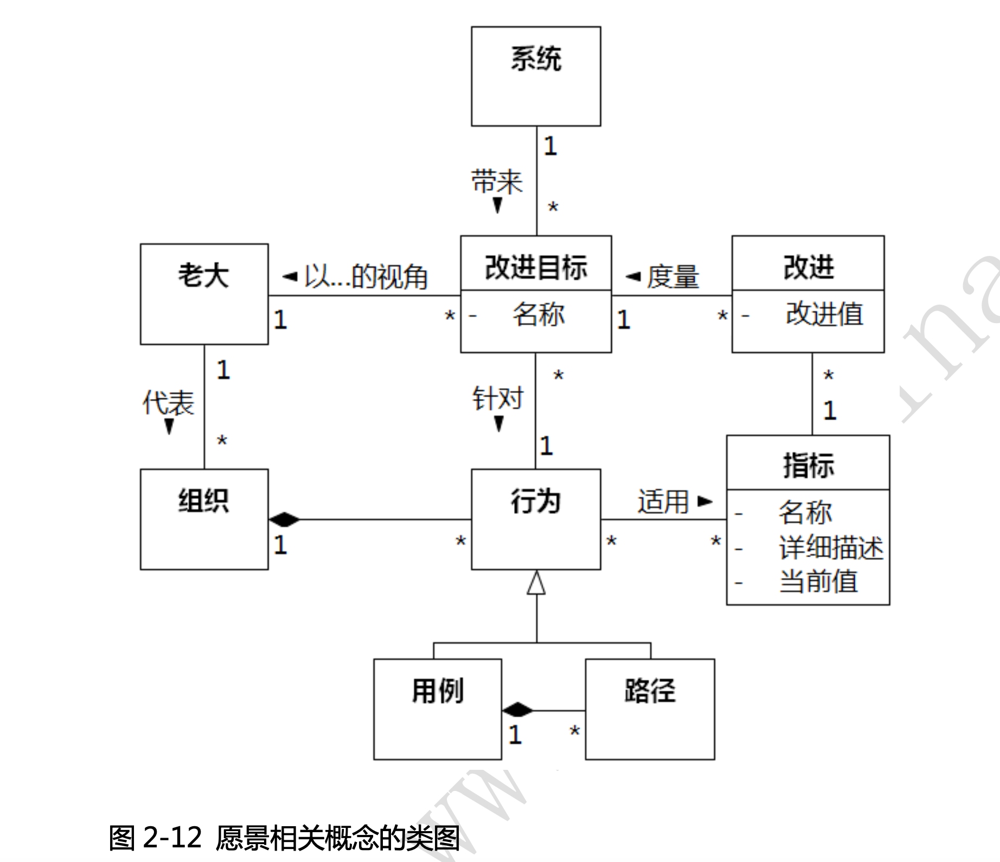
	
### 改进目标不是系统功能需求

改进目标是“系统改善组织行为的指标”而不是“系统能做某事(系统的功能)”。请比较图 2-13 左右两列的内容。

<table>
<thead>
	<th>像目标的表述</th>
	<th>不像目标的表述</th>
</thead>
<tbody>
	<tr>
		<td>提高回访订单转化率</td>
		<td>建立一个 CRM 系统</td>
	</tr>
	<tr>
		<td>减少每张处理订单需要的人力</td>
		<td>提供自助下单功能</td>
	</tr>
	<tr>
		<td>缩短评估贷款风险的周期</td>
		<td>能够对贷款申请作风险评估</td>
	</tr>
</tbody>
</table>

改进目标和系统功能是多对多的:一个改进目标可能会带来系统的多个功能，一个系统功能可能 覆盖了多个改进目标。

思考度量指标，可以用以下方法:

**针对形容词来思考符合这个形容词和不符合这个形容词的情况**。例如，目标里有个形容词“规范”， 我们可以问:目前怎么个不规范，请举一个最头痛的例子?如果改进之后，老大觉得规范多了，那是 什么样的情况?通过这样追问，得到“规范”的度量是“格式不合格的报表所占的比例”。类似的度量还有:

- 方便——完成一张订单的平均操作次数
- 高效——从受理到发证的时间周期

**从初步设想的解决方案倒推**。可以这样思考:如果没有这个解决方案，涉众要付出什么代价?例 如，初步的解决方案是做一个手机上审批费用申请的 app，可以反过来问“如果没有这个 app，可能 会怎样?”，“领导不在办公室时不方便审批”，那么度量指标可能是“平均审批周期/领导不在办公 室的时间”。最终的解决方案未必是手机 app，要是能打个响指，空中飘来一朵云，领导在云上划拉 两下就行，谁耐烦带个手机弄得鼓鼓囊囊的呢?

**借鉴机构的 KPI(关键绩效指标)**。很多机构都归纳了自己的 KPI，所研究系统可能就是改进其中 的一部分，借鉴过来就可以。

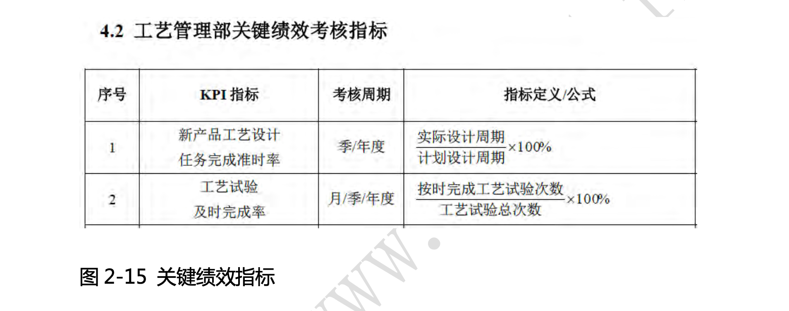

### 改进目标不是系统的质量需求

改进目标针对的是组织某个行为的指标，而不是系统行为的指标。要从组织的视角去看系统对于组织的意义。**如图 2-16，系统的一项质量需求可能是“从接收到请求到回应的时间应在2秒之内”， 这是对系统行为的度量。愿景的改进目标需要思考在组织的视角之下这条质量需求的意义，可能还是 “缩短申请的平均审批周期”，如图 2-17 所示。**

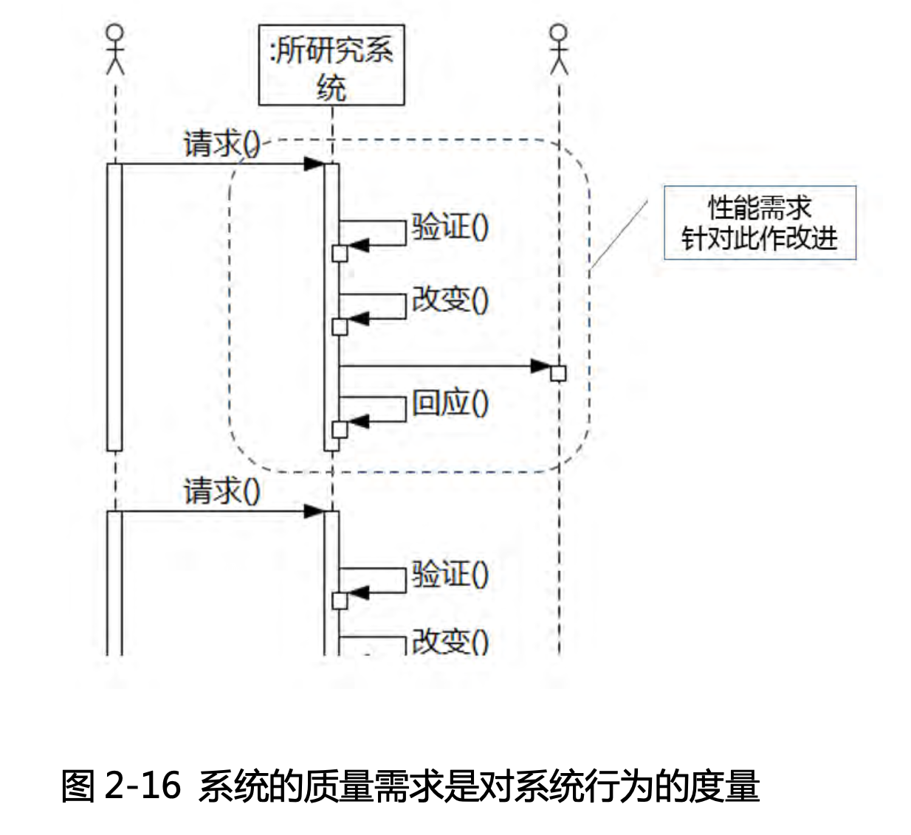

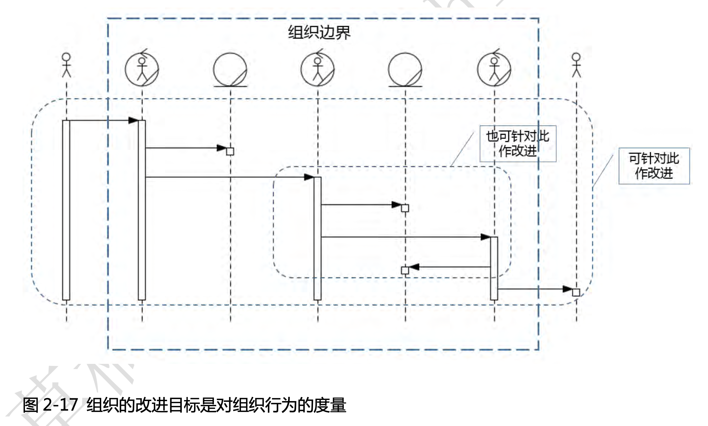

### 改进是系统带来的

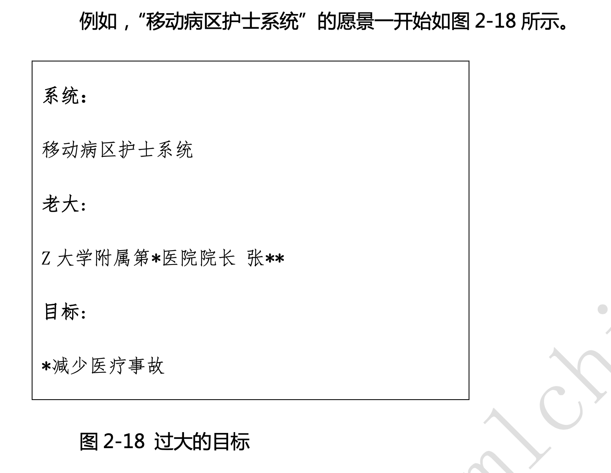

“减少医疗事故”这个目标过大了，适用于各种各样的改进(包括更换另一种品牌的手术器械)， 没有 “移动病区护士系统”特有的味道。改为图 2-19 的内容更合适。

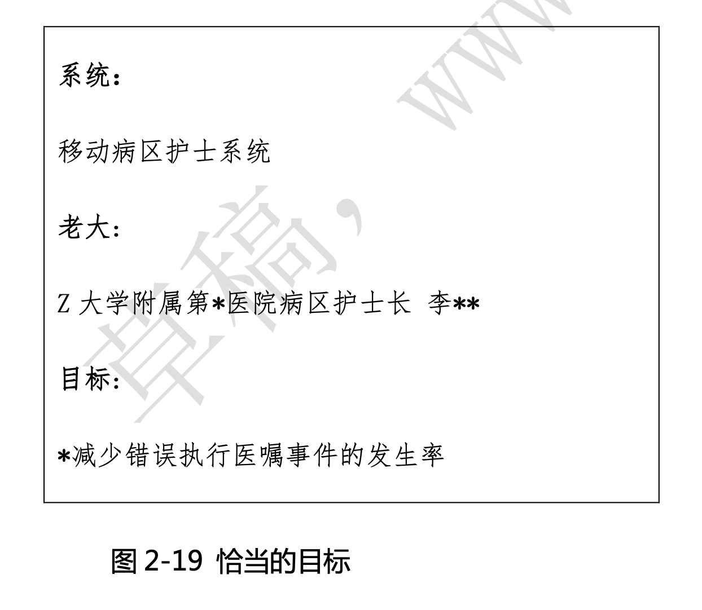

如何定位系统能带来的恰如其分的改进目标，**可以使用管理学中的“鱼骨图”来帮忙**，如图 2-20。

UML 中没有鱼骨图，可以用类图代替，如图 2-21。

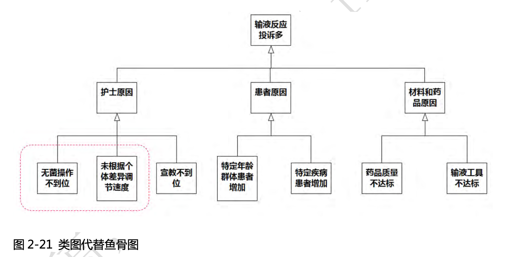

### 改进目标应来自老大的视角

改进目标描述的是系统给目标组织带来的改进，应该从老大和目标组织的视角来定义。不过在实 践中，需求人员会觉得要揣摩老大的目标太难，不知不觉就把它改成开发团队的目标。这种“目标” 通常如下:

	一年以内，网站的会员达到一千万。 

	系统的市场占有率达到 40%。
	
这种不费吹灰之力得到的“目标”没有意义——你想会员达到一千万就能一千万吗?需求人员要 动脑筋思考，系统必须在哪些地方给目标组织带来竞争对手所无法达到的改进，例如:

	“YP 网”的目标:男屌丝发起约会的平均成功率达到 30%以上。
	
这样，目标组织(上面这句话就是男屌丝人群)才会乐意引进这个系统。

### 多个目标之间的权衡

如果愿景里只表述了一个改进指标，那么可以缺省地认为其他指标是不变的。不过，有的时候老 大的改进可能会有多个目标(当然也带来了多个指标)，而且目标之间还有可能会产生冲突。这时，需 要对目标排序，揣摩出老大首要关心的目标。

例如，一个给地产经纪计算佣金的系统，老大要求在尽可能短的时间内计算出佣金，同时计算要 准确，每一步的操作过程事后可以追究。这几个目标是有冲突的，要“准确”，要“每一步可以追究”， “快”就要受到影响。经过揣摩，发现老大最看重的是“准确”。在计算规则不断变化的情况下，也不 能出任何计算错误，否则导致分配不公，影响到经纪的工作积极性。了解了这一点，就会意识到最开 始设想的解决方案是有偏差的，这个系统的实现不需要精美的图形界面，甚至用脚本都可以，但是规 则的调整要灵活，而且不能出错。

# 业务建模 - 业务用例图

## 软件是组织的零件

有了愿景，我们知道老大对他所代表的组织的现状的某些指标不满意。接下来就可以研究组织， 弄清楚到底是组织的哪些环节造成了这些指标比较差，这就是业务建模(Business Modeling)的主要内容。

-  含糊的“业务”

	“业务”这个词在软件开发团队中使用很频繁,例如“我是一名业务架构师”、“我们要了解业 务”等等，但是往往说话的人未必真的理解话中的“业务”具体指什么。
	
	有时候“业务”指“核心域知识”。开发人员假装谦虚“我是做技术的，业务不太懂唉”，就是 这个意思。甚至有的开发人员在潜意识里是这样划分的:我懂且我感兴趣→技术;我懂但不感兴趣→ 业务;我不懂但感兴趣→高科技;我不懂且不感兴趣→忽悠。
	
	有时候“业务”指“组织级别的知识”。例如，“业务建模”、“业务用例”、“业务流程”说的就 是组织级别的知识。
	
- 业务建模工作流

	我们从内外两个视角来研究组织。从外部看，组织是一些价值的集合，我们 可以用业务用例图表示;从内部看，组织是一些系统的集合，我们可以用业务序列图来表示。
	
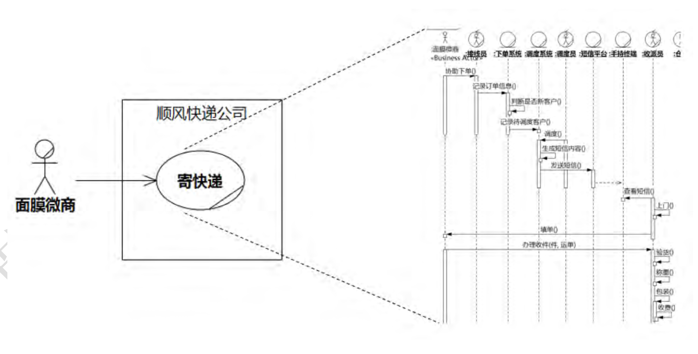

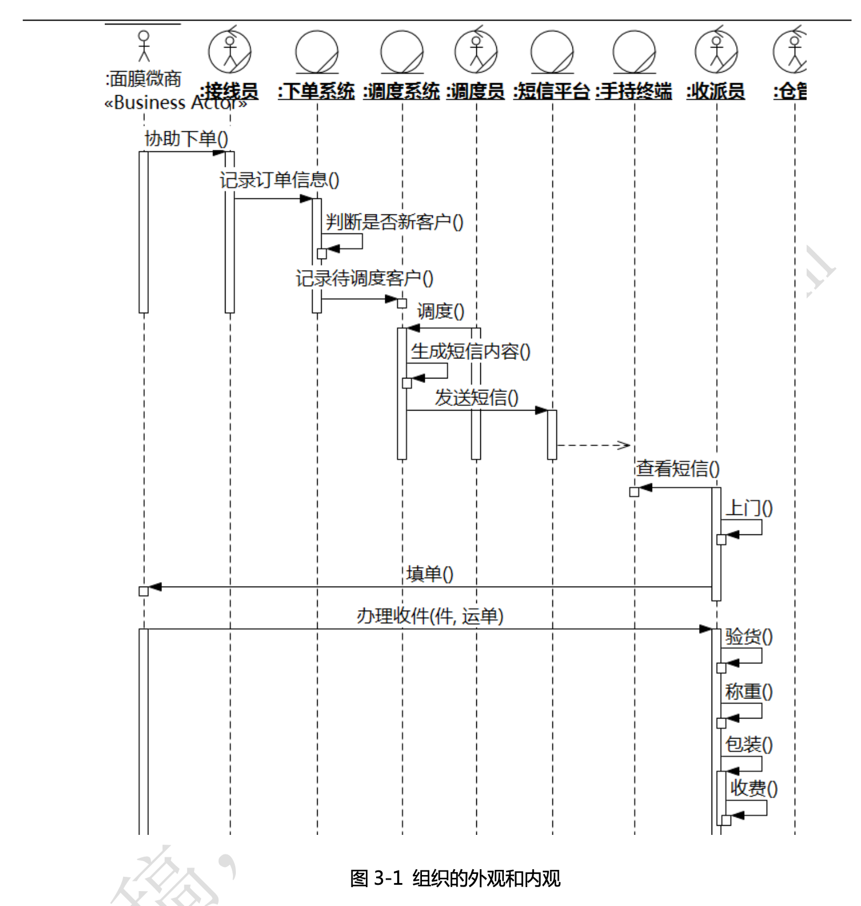

##【步骤】识别业务执行者

### 业务执行者(Business Actor)

以某组织为研究对象，在组织之外和组织交互的其他组织(人群或机构)就是该组织的执行者。 因为研究对象是一个组织，所以叫业务执行者。

以一家商业银行为研究对象，观察在它边界之外和它打交道的人群或机构，可以看到储户来存钱，企业来贷款，人民银行要对它作监管......这些就是该商业银行的执行者。如图 3-2 所示。

### 业务工人和业务实体

组织内的人称为业务工人(Business Worker)，例如某商业银行里面的营业员。业务执行者和业 务工人的区别是:一个在组织外面，一个在组织里面;一个是组织不可替换的服务对象，一个是组织 可以替换的零件

**业务工人是可以被替换的人脑零件，它可能会被其他业务工人替换，但更有可能被业务实体(Business Entity)替换**。业务实体是组织中的非人智能系统，例如银行的 ATM、点钞机、营业系统。

有了点钞机，营业员只需要把整叠钞票放进点钞机过一下，点钞机会负责验钞和计数。也就是说， 验钞和计数的逻辑从人脑转移到了点钞机的“大脑”，如图 3-3 所示。营业员轻松了，或者说，银行也 就不需要那么多有经验的营业员了。许多信息化程度很高的领域，绝大多数领域逻辑目前已经运行在 业务实体中，业务工人主要负责输入信息。银行所属的金融领域就是如此。

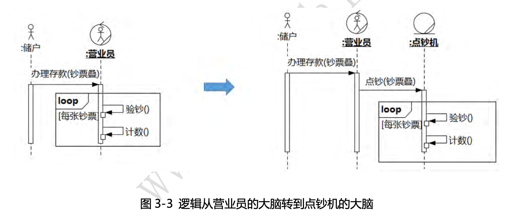

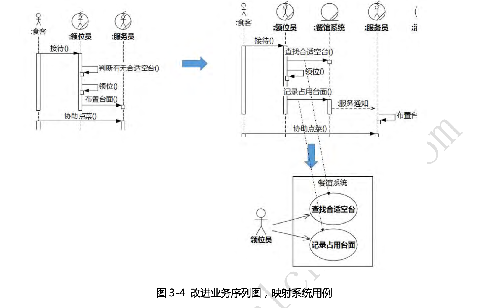

### 识别业务执行者

把观察的焦点对准组织的边界，看看边界外有哪些人群或机构会和它交互，交互的姿态可以是主动的，也可以是被动的;交互的形式可以是面对面，也可以是发邮件、发微信......这些外部人群或机构 就是所研究组织的执行者。

这里要注意的是，作为观察者的建模人员本身是一个人脑系统，所以在观察组织边界时，直觉上 观察到的不是组织之间的交互，而是组织派出的系统之间的交互，但是一定要把它理解成组织之间的 交互，因为谈论业务执行者时，研究对象是组织，所以外部对应物——业务执行者也应该是组织。

	二维生命观察三维宇宙，三维生命观察四维宇宙，同样难度很大。
	
例如，以某国税局为研究对象，可以观察到企业财务人员到国税局报税，但是业务执行者不是企 业财务人员，而是企业。也许某个时期，企业财务人员和国税局窗口人员交互;后来，企业财务人员 和国税系统交互;再后来，企业系统和国税系统交互。不管观察到哪两个系统交互，从组织的抽象级 别，都应该理解为企业和国税局这两个机构之间的交互，如图 3-5。

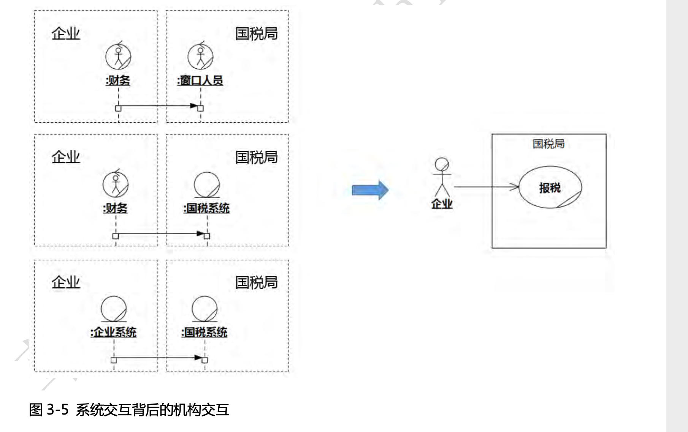

同一个机构内部也是如此。如果以一个部门为研究对象，即使观察到的是两个员工之间的交互， 也应该找到现象背后的部门之间的交互，如图 3-6 所示。

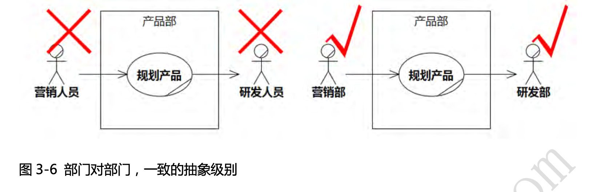

有的时候，个人的背后不是机构而是人群。如图 3-7 所示，参与“组织晚会”用例时，员工并不 代表他所在的部门，只是作为员工人群的一份子。

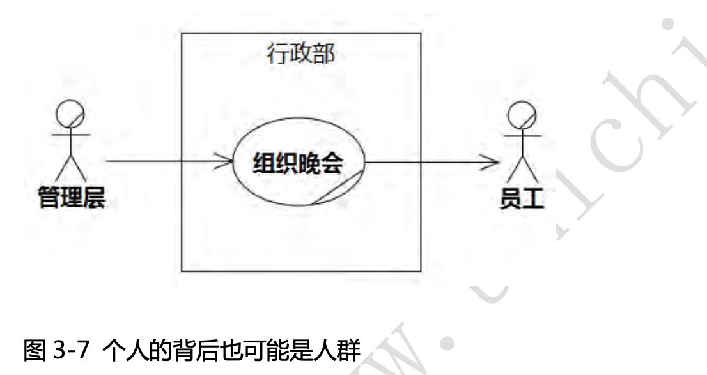

如果您之前阅读过一些用例相关的书籍或文章，可能知道“系统定时发生”的事件有时会提炼成 “时间”这个外系统作为主执行者的系统用例。不过，如果研究对象是一个组织，“时间”作为组织的 执行者是不合适的，应该把时间看作某个外部组织派来的一个接口系统，参见图 3-8 的水文站定期上 报监测数据的例子。

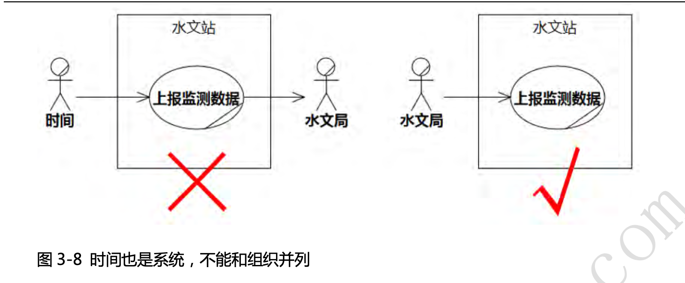

**在图 3-6 和 3-7 中，有箭头从执行者指向用例，也有箭头从用例指向执行者。前一种执行者称为 用例的主执行者，后一种执行者称为用例的辅助执行者。** 例如，图 3-6 右侧可以这样解读:营销部找 产品部帮忙规划产品，产品部仅靠自己的力量不足以完成，需要找研发部帮忙。或者这样解读:营销 部向产品部“购买”服务，产品部向研发部“购买”服务。

##【步骤】识别业务用例

业务用例指业务执行者希望通过和所研究组织交互获得的价值。以上面提到的某商业银行为例， 储户和银行打交道的目的可能有存款、取款、转账，所以银行针对储户的用例如下:

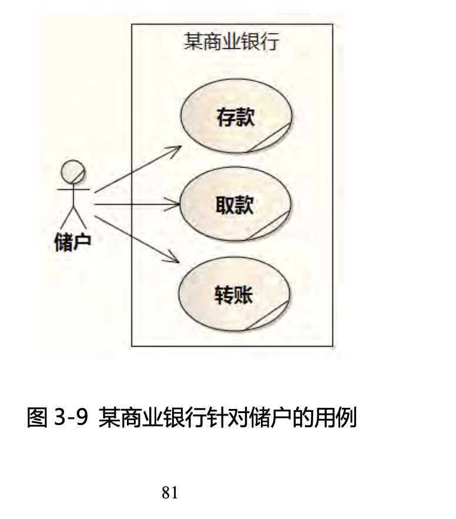

从图 3-9 中可以看到，和业务执行者一样，业务用例上有个斜杠，表示这是组织的用例。如果工具不提供这个图标，处理方法参照业务执行者。

如果穿越回三百年前，图 3-9 依然适用。业务用例代表组织的本质价值，很难变化，变化的是业 务用例的实现——业务流程。三百年前，银行要实现“储户→存款”的用例，需要许多人脑系统(业 务工人)一起协作，现在则变成了少数人脑系统(业务工人)和许多电脑系统(业务实体)之间的协 作。

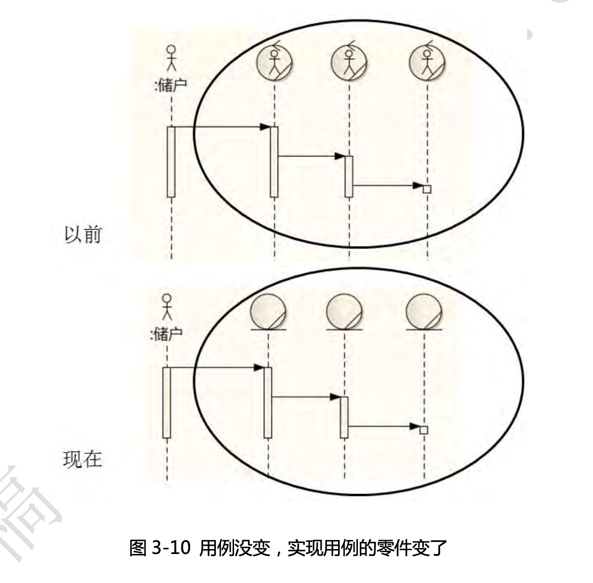

业务用例刷新了业务流程的概念。**我们把业务流程看作是业务用例的实现**，将其组织在业务用例的下面。组织内部之所以有业务流程，是因为要实现业务用例。**组织里发生的一切都是为了给业务执行者提供价值**。

这样的思路对改进业务流程有非常大的帮助:先归纳出组织对外提供什么价值，再思考如何更好地优化组织内部流程来实现这些价值，如图3-11。

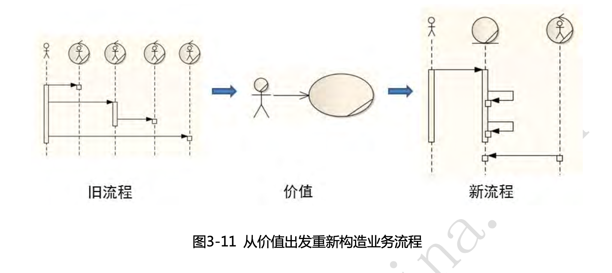

### 正确理解价值

用好用例，关键在于理解“价值”。价值是**期望和承诺的平衡点、买卖的平衡点。**

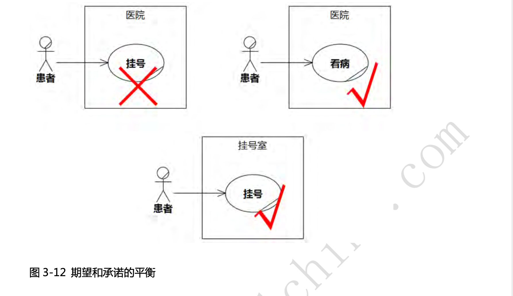

**业务用例是组织对组织的服务，相对于系统为系统提供的服务(系统用例)来说，所需要的时间是比较长的**，不能把用例实现过程中的某个交互片段当成用例。如图 3-13 所示，企业和工商局打交道 变更地址的过程中，可能要发生多次交互，但是用例只有一个。

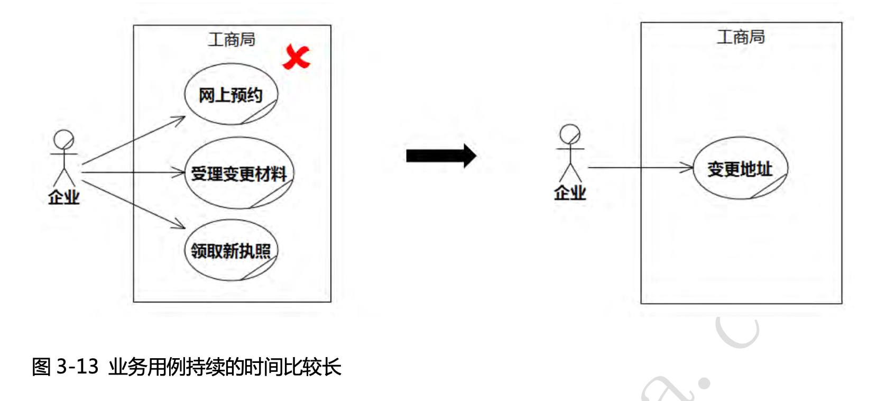

**系统用例的持续时间比较短，如图 3-14 所示。一个典型的执行者使用系统做了某事，达到了某个结果，然后离开系统去做别的事情，如果离开时他心里认为得到目前的结果已经不算白做，就可以把 做某事作为一个系统用例。**有一些词汇带有浓浓的“系统”味道，例如新增、查看、录入、查询、修 改、配置......带有这些词汇的用例，很可能不是组织提供的价值，而是某系统提供的价值。

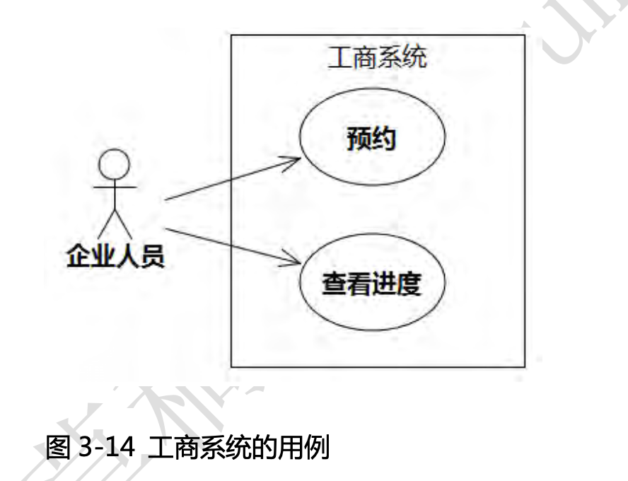

可能有这样的组织，例如“**情报所”，它对外提供的价值就是提供一些信息。即使如此，业务 用例名字最好也不要用“查询**”这样软件味道十足的名字，可以写成“了解**”。

### 边界框问题

讨论“是不是用例”、“有哪些用例”的时候，必须先说清楚研究对象，否则讨论没有意义。画用例图时，能加上边界框尽量加上。

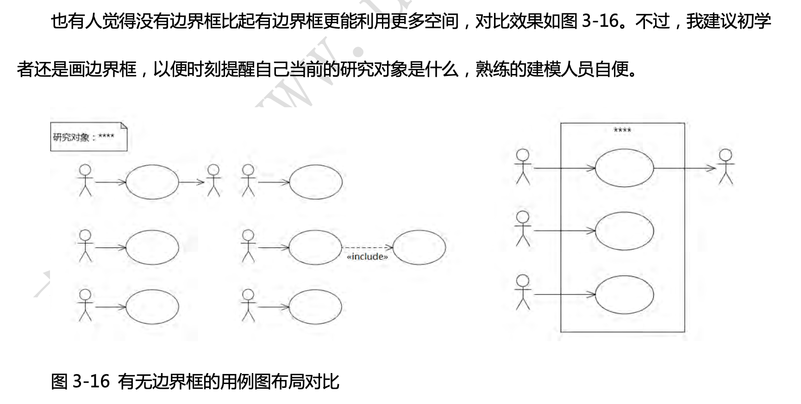

### 识别业务用例的思路和常犯错误

识别业务用例有两条思路:一条是从业务执行者开始，思考业务执行者和组织交互的目的;另一条是通过观察组织的内部活动，一直问为什么，向外推导出组织外部的某个业务执行者. 第一条路线 是主要的，第二条路线用于补漏。如图 3-17。

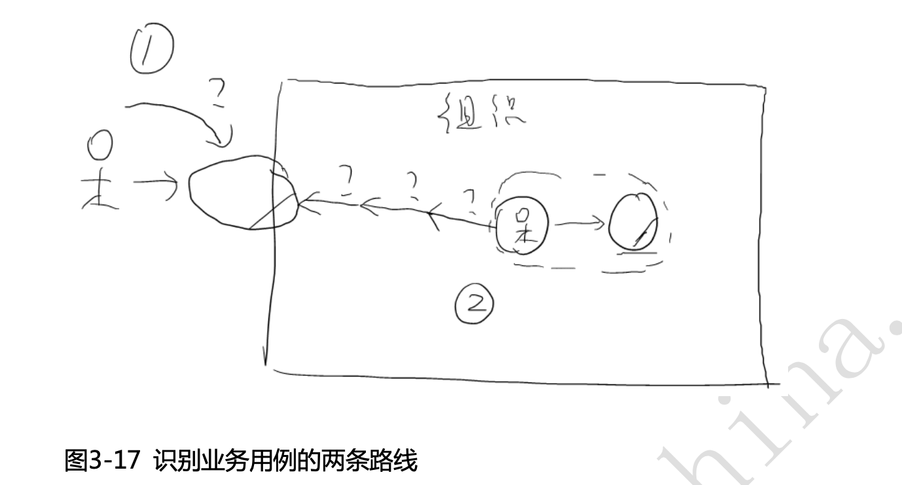

#### 错误一:把业务工人的行为当作业务用例。

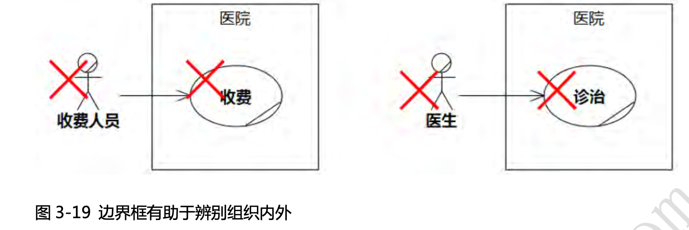

这里反映了建模人员常见的一个问题: **分不清问题和问题的解决方案。**

#### 错误二:业务用例随待引入系统伸缩。

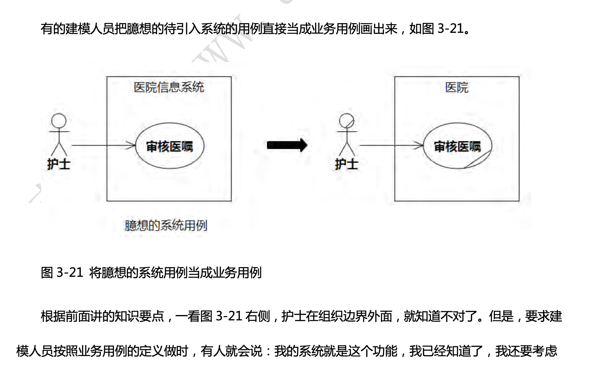

好了，现在建模人员知道护士在所研究组织边界里面，不能作为业务执行者了，但是又有可能还 是受待引入系统的影响，导致组织的价值随着所引入系统的价值大小伸缩，如图 3-22。

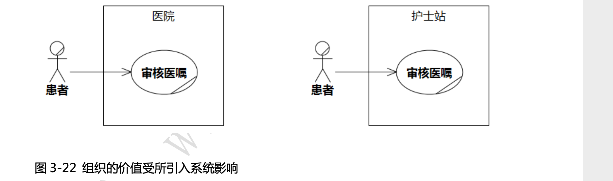

错误三:把害怕漏掉的扩展路径片段提升为业务用例

当前关注的改进点有时是在基本路径中，有时是在扩展路径中，都不应该影响业务用例图。如果 有较大把握判断和愿景相关的片段的位置，直接在用例下面画该片段即可，如图 3-26。否则先画基本 路径，再画扩展路径，画了一大堆才轮到待改进的片段，时间没有花在刀刃上。

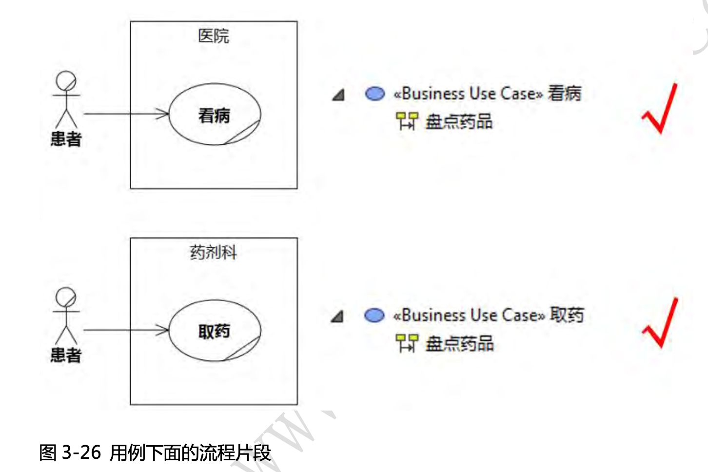

#### 错误四:管理型业务用例

还有一种错误是从“药师盘点药品”推导出背后的好处，然后画成“管理型业务用例”，如图 3-27。

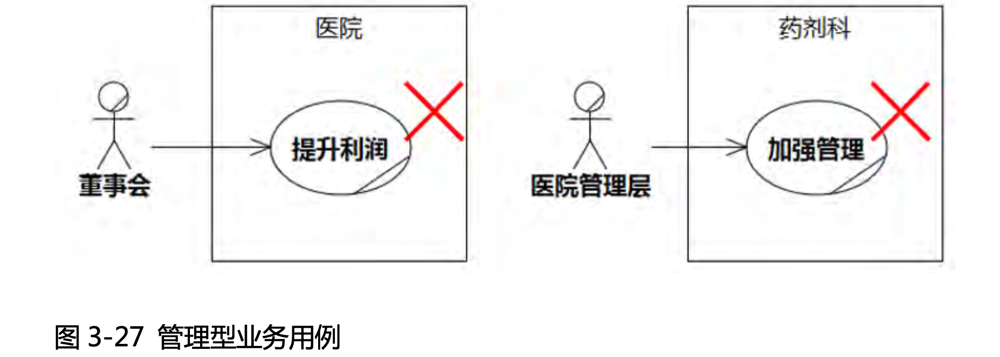

这样的“业务用例”不可取。它没有特定组织的味道，哪家营利机构不是为了赚钱?另外，也很 容易和愿景、涉众利益混在一起，发展下去，就会有“顾客→希望东西更便宜”之类的“用例”。

# 业务建模 - 业务序列图

上一章我们得到了待改进组织的业务用例图，本章我们将讨论业务建模中最繁重的工作——**描述业务用例的实现，即业务流程**，然后改进它，推导出待引入系统的用例。

## 描述业务流程的手段

### 文本

文本的缺点是不够生动，所以在描述业务流程时很少使用文本的方式。**不过，描述系统用例(即 系统需求)的流程时，文本是常用的，因为此时更注重精确**，而且还要表达业务规则、性能等目前尚 未被 UML 标准覆盖的内容。

### 活动图

用 UML 图形描述业务流程有两种选择:活动图和序列图。

活动图的前身流程图，应该是在建模人员中使用频率最高的图形了。流程图最早出现于 1921 年 [Gilbreth 1921]，用于机械工程领域。在 Goldstine 和 von Neumann 将其引入计算机领域之后，流 程图变得流行起来，主要用于在编写文本源代码之前表达跳转逻辑。不过，随着编程语言表达能力也 越来越强，针对简单的分支或循环逻辑画图在很多情况下已经变得没有必要。

活动图在流程图的基础上添加了分区(Partition，即 UML1.x 中的泳道)、分叉(Fork)、结合(Join) 等元素，UML2.x 进一步增加了 Petri 网的元素，表达能力更加丰富。

如果活动图用来表示组织内部的业务流程，那就是业务流程图。上面的报销业务流程用活动图可 以表示如图 4-1。

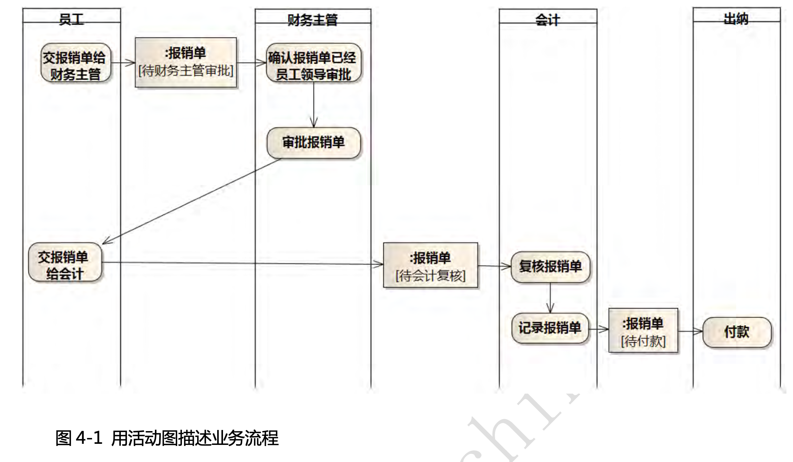

### 序列图

UML2.x 序列图的符号标识来自 ITU(国际电信联盟)制定的消息序列图(MSC)标准[ITU-T Z.120]。 Ivar Jacobson 在“The Object Advantage”一书[Jacobson 1995]中将序列图用于描述业务流程， 把业务流程看作是一系列业务对象之间为了完成业务用例而进行的协作。1997 年 Ivar Jacobson 又出 版了“Software Reuse”[Jacobson 1997]，在书中改用 UML 做了相关描述。

上面的报销业务流程用序列图可以表示如下:

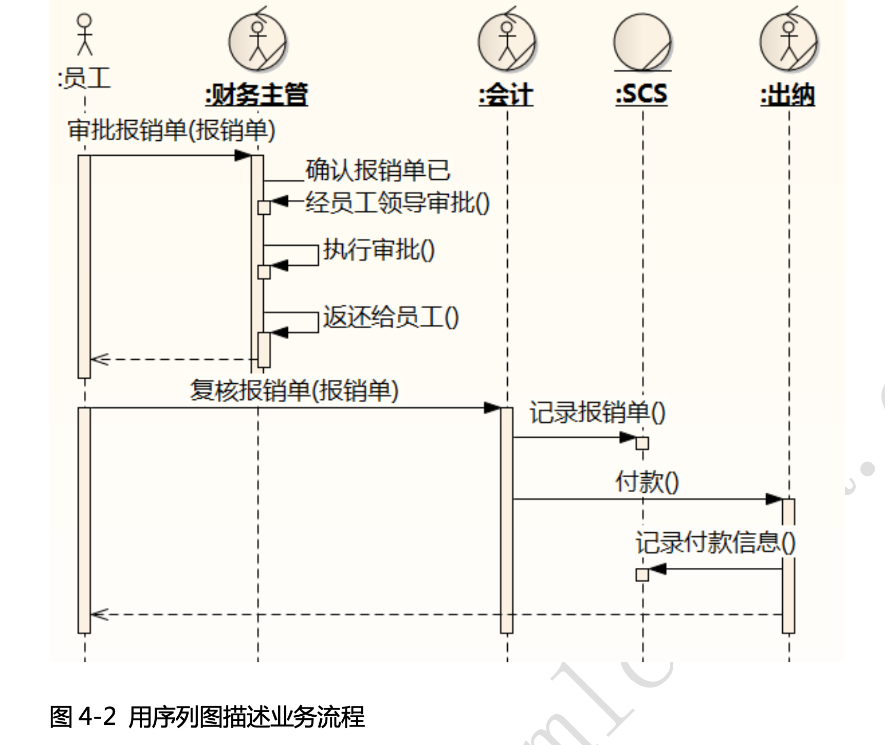

### 序列图和活动图比较

本书所授方法采用序列图来描述业务流程。做出这个选择基于以下几点理由:

- 活动图只关注人，序列图把人当作系统。

使用活动图描述业务流程时，建模人员往往只注意人或部门的活动，忽略了非人智能系统的责任。 上一章已经提到，现在的业务流程中已经有很多领域逻辑是封装在业务实体而不是业务工人中。如果 忽略非人智能系统，很多重要信息就丢掉了。

- 活动图表示动作，序列图强迫思考动作背后的目的。

图 4-4 不但表达了非人系统的责任，同时也清晰地揭示出来营业员这个岗位对外暴露的责任是:
受理申请，这也是市民对于营业员的期望。期望和承诺是用例和对象技术的关键思想。使用序列图来做业务建模，“对象协作以完成用例”的思想就可以统一地贯彻业务建模和系统建模的始终。

- 活动图“灵活”，序列图不“灵活”。

不少人认为活动图胜过序列图的地方是它灵活，但这种灵活是一把双刃剑。活动图很灵活，它的 控制流箭头可以指向任何地方，就像编码原始时代的 Goto 语句，所以活动图很容易画。不过，“很容 易画”的活动图，也比较容易掩盖建模人员对业务流程认识不足或者业务流程本身存在缺陷的事实。

**序列图通过 alt、loop 等结构化控制片断来描述业务流程，强迫建模人员用这种方式思考，如图 4-6**。对于现状确实乱七八糟的流程，描述起来相对要困难，甚至需要按照场景分开画很多张序列图来 表达，但这也揭示了业务流程的糟糕现状。

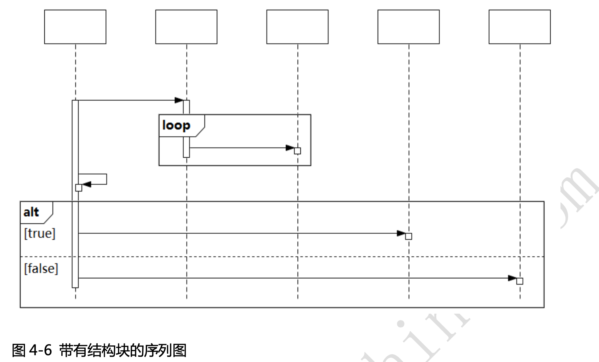

本书选择用序列图来做业务建模，最主要原因还是理由(1)——把人脑系统和电脑系统平等看待。

## 业务序列图要点

### 消息代表责任分配而不是数据流动

我给图 4-2 的业务序列图加了一些注解，如图 4-8 所示。

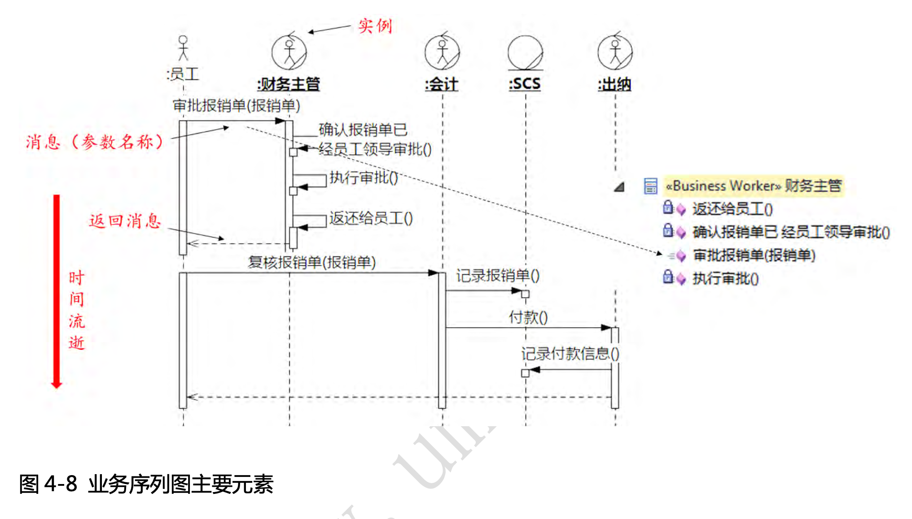

序列图最重要的要点是消息的含义。**A 指向 B 的消息，代表“A 请求 B 做某事”，或者“A 调用 B 做某事的服务”，做某事是 B 的一个责任。** 例如，图 4-8 中，指向财务主管的消息“审批报销单”映射了财务主管的“审批报销单”责任。注意，消息名称中不用带“请求”二字，消息箭头已经有请求的意思。

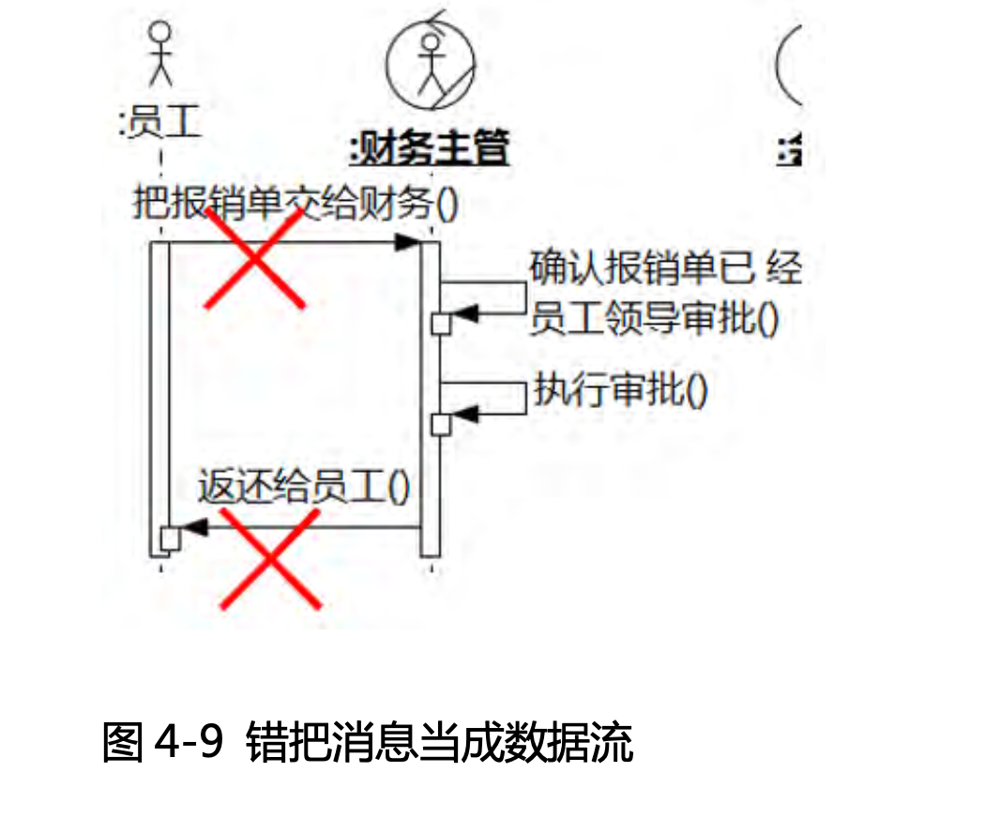

### 抽象级别是系统之间的协作

业务建模的研究对象是组织，出现在业务序列图生命线上的对象，其最小颗粒是系统，包括人和非人系统。如果建模人员不把这一点时刻记在心中，打哪指哪，抽象级别随着兴之所至跳跃，就会使 业务序列图中混入不该有的内容。

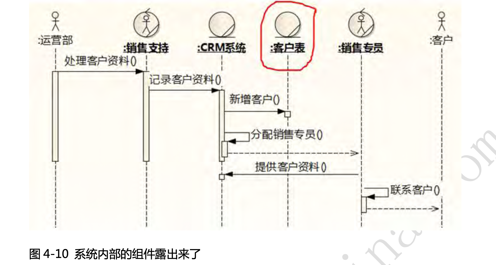

另外一种抽象级别跳跃错误如图 4-11。要表达销售支持使用 CRM 系统记录客户资料，只需要在 销售支持和 CRM 系统之间画一条消息“记录客户资料”就够了，这是这两个系统之间协作的目的。不 过建模人员刚好想到记录客户资料的过程会有多次交互，于是把这些交互步骤画了出来。

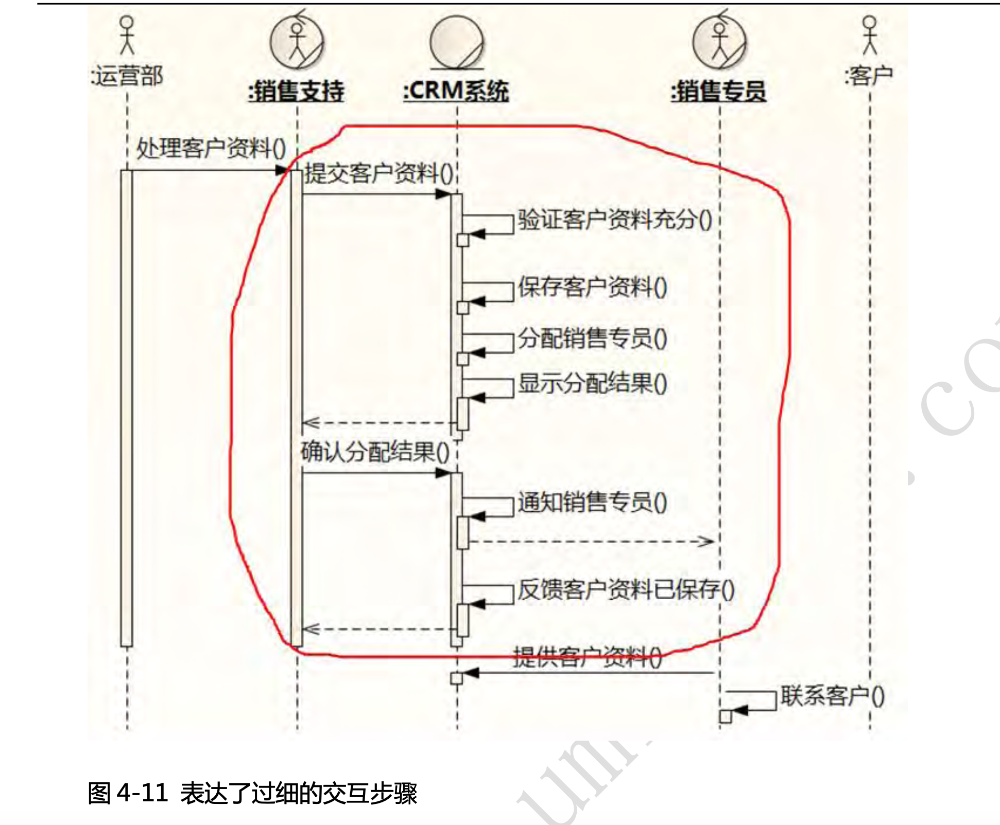

**上面说的两种错误是把需求和分析的工作流的工作带入了业务建模**。图 4-10 中提到的系统内部的 组件，应该在分析和设计工作流中描述;图 4-11 中提到的交互步骤，应该在需求工作流中描述。

还有一种抽象级别错误是:业务序列图的内容和业务用例图差不多。如图 4-13

最后要提到的抽象级别错误是:把不具备任何智能的物体放到了业务序列图的生命线上。如图 4-14

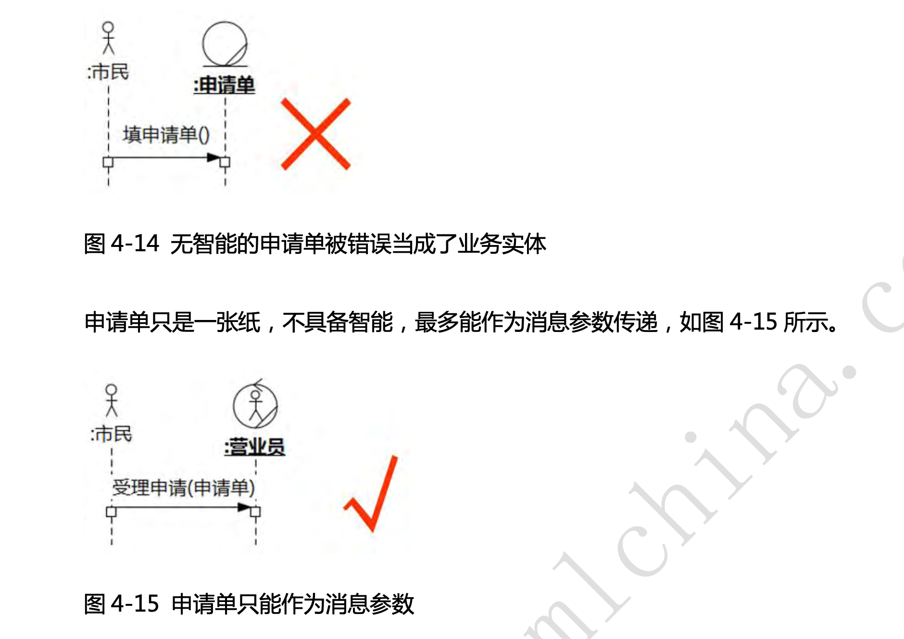

可能有的读者纳闷，我怎么记得看过的书里经常有序列图上出现订单、申请单对象?那是分析序 列图。我们用对象的思想去构思我们所开发的系统的内部结构和行为，就得到了订单、申请单等假想 的有生命的对象。如图 4-16:

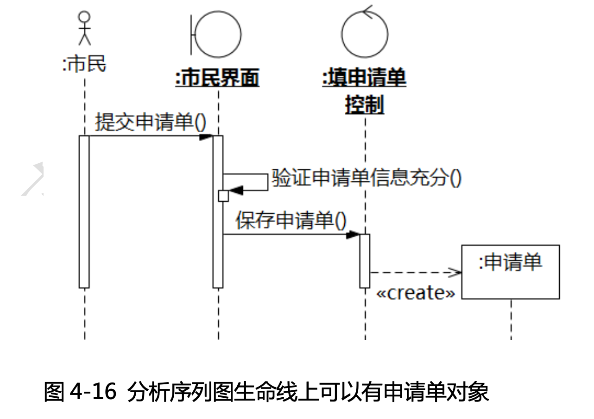

### 只画核心域相关的系统

核心域/非核心域的概念，在后面的工作流中还会不断提到，此处先不详细讨论。有时很难判断也 没关系，您想过这个问题，就已经比没想过要好了!可以先画出来，然后如果发现它跟改进无关，再 把它删掉。如图 4-17 先画出 Word，后来发现工作人员不管用 Word 还是用 WPS 制作文档，都不影 响采购流程的改进结果，再把它删掉。

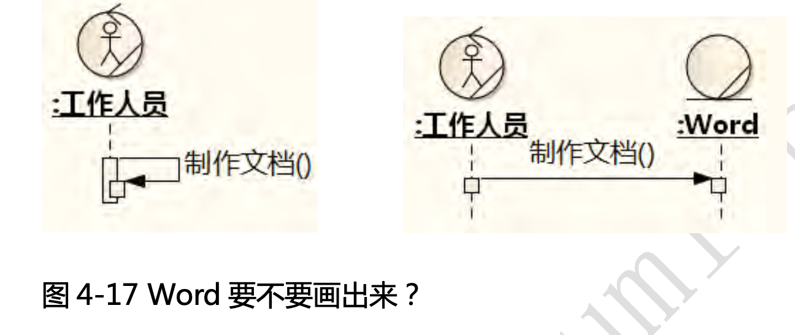

### 把时间看作特殊的业务实体

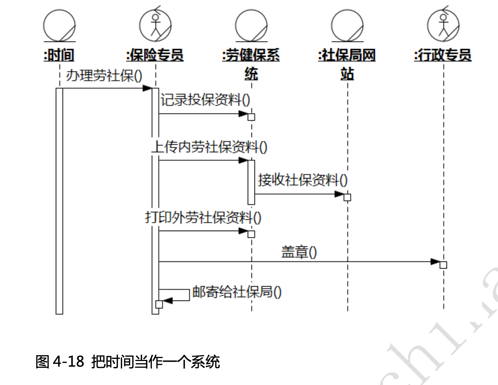

### 为业务对象分配合适的责任

分配给业务对象的责任必须是该对象有能力承担的

再对比一下图 4-22 和 4-23 中分别用算盘和计算器计算时的责任分工。严格来说，算盘不是智能 系统，但为了比较，暂且把它放到生命线上。

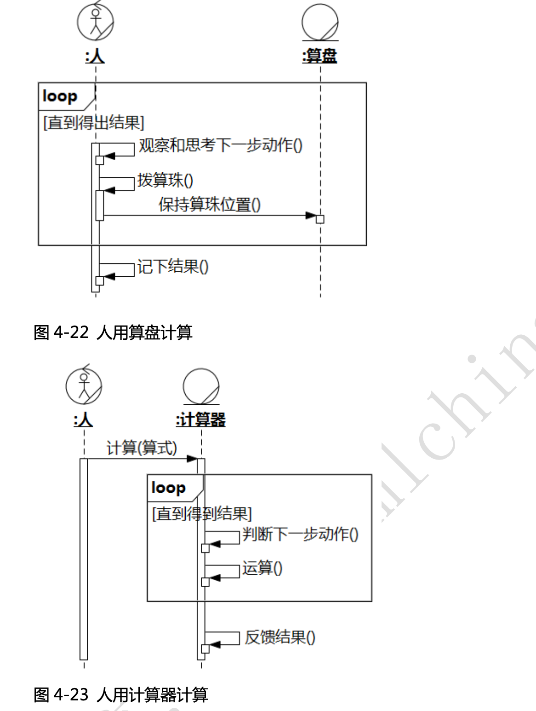

##【步骤】现状业务序列图

假如现在目标组织的业务流程发生，您亲临现场，把观察到的场景如实绘制成业务序列图，就得 到了现状业务序列图。

这里最重要的要点就是“如实”。尽力描绘出真实的现状，接下来在此基础上改进，才有可能得 到最符合现状需要的改进方案。在凭空想象的“现状”上改进，得到的必定是假的改进方案、假的系 统需求。

黑格尔有一句经常被误解为“存在即合理”的名言——“凡是合乎理性的东西都是现实的;凡是 现实的东西都是合乎理性的。”[黑 1820]现状之所以存在，必定有其存在的原因，毕竟大家都不傻! 一定要在尊重现实背后的理性的前提下再去改变，贸然改变很可能得不到好结果。
鲁迅曾经长叹“即使搬动一张桌子，改装一个火炉，几乎也要血;”[鲁 1927]，但是从另一个角 度想一想，桌子为什么摆在那里?火炉为什么是这个样子?

### 错误:把想象中的改进当成现状

现状真的就是现状的意思，意思绝不含糊.

### 错误:把“现状”误解为“纯手工”

真正的现状就是图中最下一行的场景。而把“现状”误解为“纯手工”，说的就是把 2000 年的情 况当成现状。

### 错误:把“现状”误解为“本开发团队未参与之前”

### 错误:把“现状”误解为“规范”

### 错误:“我是创新，没有现状!”

###  错误:“我做产品，没有现状!

## 【案例和工具操作】现状业务序列图

根据愿景“减少助理在组织公开课时的工作量”，初步判断最值得改进的流程片段是发布公开课 通知的片段，如图 4-25 所示。

## 【步骤】改进业务序列图

得到现状业务序列图后，接下来就要思考信息化可以给现状带来什么样的改进。信息化给人类的 工作和生活带来的改进，常见的模式有以下几种

### 改进模式一:物流变成信息流

和信息的光电运输比起来，用其他手段运输的物的流转速度就显得太慢了，而且运输成本会随着 距离的增加而明显增加。如果同类物的不同实例之间可以相互取代，那么可以提炼物中包含的部分或 全部有价值的信息，在需要发生物流的地方，改为通过软件系统交换信息，需要物的时候再将信息变 成物，这样可以大大增加流转速度和降低流转成本。如图 4-38 所示:

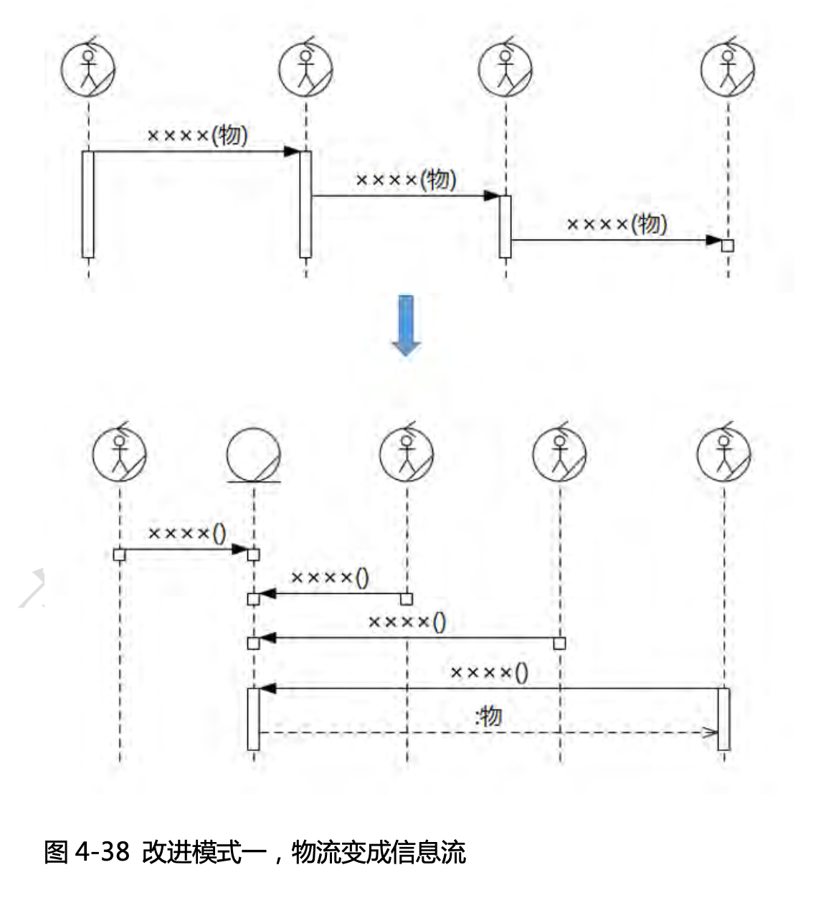

例如，市民要了解新闻，可以去报摊买报纸看，但这会产生各种物流，如果把报纸中包含的有价 值信息提炼出来，通过软件系统传送，各种物流就消失了。如图 4-39 所示

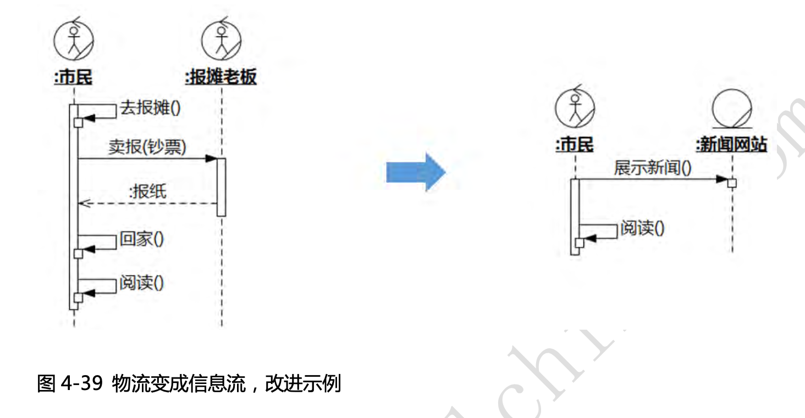

### 改进模式二:改善信息流转

软件系统越来越多，而各个软件系统之间沟通不畅，导致一个人为了达到某个目的可能需要和多个软件系统打交道，如果把各软件系统之间的协调工作改为由一个软件系统来完成，人只需要和单个软件系统打交道，信息的流转就改进了。如图 4-40 所示。

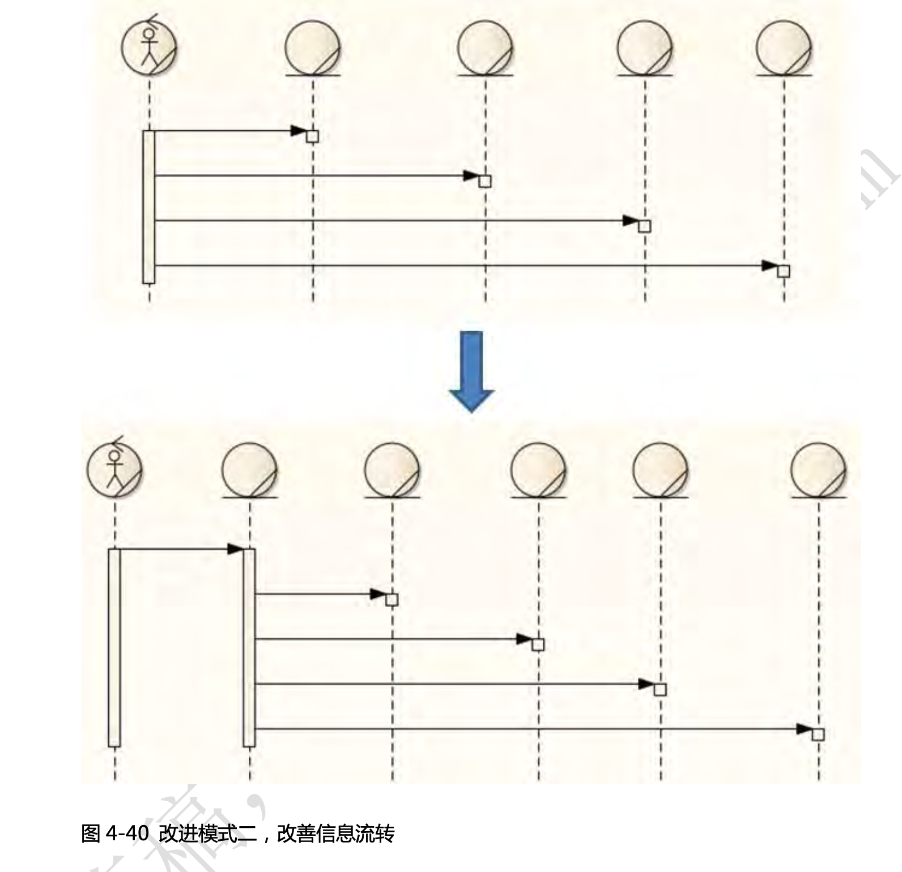

调度科为了出一份报表，不得不在多个业务实体之间疲于奔命(虽然可能只是鼠标在 奔)，在中间插入新系统之后，工作量减少了很多。如图 4-42 所示。

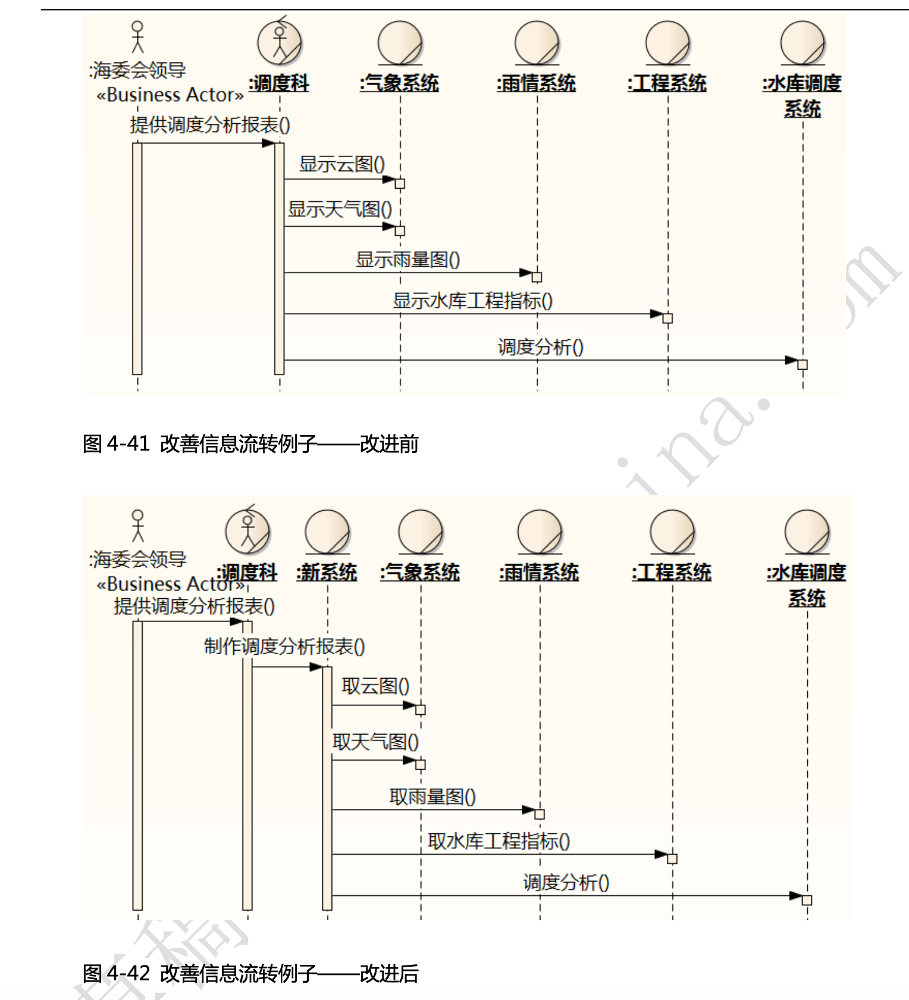

### 改进模式三:封装领域逻辑

在业务流程中，有很多步骤是由人脑来判断和计算的，领域逻辑封装在人脑中。相对于计算机， 人脑存在成本高、状态不稳定、会徇私舞弊等问题。如果能够提炼人脑中封装的领域逻辑，改为封装 到软件系统中，用软件系统代替人脑，业务流程就得到了改进。

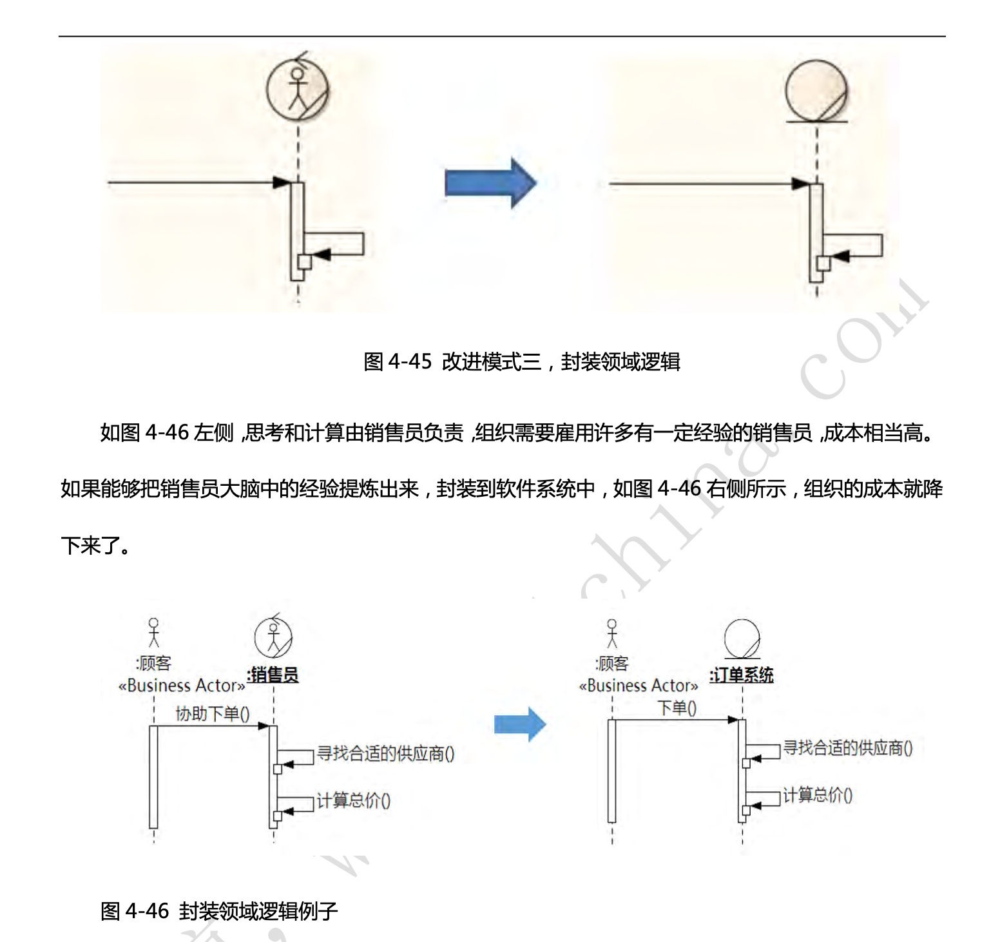

目前面向大众的互联网(及移动互联网)系统如微信、Facebook、Twitter，完成的大多是改进一 和改进二，系统内部封装的逻辑不复杂。经常可以看到这样的场面:稍有新意的互联网系统刚面世， 很快就出现几十上百个功能几乎一模一样的模仿者，这些模仿者中有的甚至是几个大学生凑一凑就开发出来的。谁成谁败，决胜点根本不是系统本身的功能，而是谁能早点多点拿到投资来购买内容和大 做宣传，风险投资人也声称“投资是投人不是投产品本身”

### 阿布思考法

张三断了一只手，一开始很痛苦，只剩下一只手以后的日子怎么过啊!过了些天，痛苦就慢慢淡 了，因为他看了不少新闻，里面有车祸死人、火灾死人甚至躲猫猫死人，心里一比较就觉得自己很幸 运，又开始快快乐乐地生活了。

人会调节自己适应现实，这是好事。如果没有这种自我调节的能力，人会一直沉溺在痛苦之中。 不过，这种能力确实是捕获和探索需求的一个大障碍。例如，张三刚使用某个软件时痛苦不堪，谁做 的软件，简直就是狗屎!用了一个月，他不但适应了这摊狗屎，还安慰自己，现在这个不景气的时节，有份工作做就不错了，人家想要来受这份累还没机会呢!这个时候如果需求人员去找他调研改进，他已经把痛苦忘得一干二净，麻木了，习惯了，而需求人员还以为形势一片大好呢!

如果面对痛苦的是一位有钱或有权的人，结果会不一样。让我们把这位有钱有权的人叫做“阿布”。 阿布借用了中国人对俄罗斯大富豪罗曼·阿布拉莫维奇(Roman Abramovich)的称呼。2003 年，罗 曼·阿布拉莫维奇收购英格兰球会切尔西，招来教练穆里尼奥，改变了英超的格局，从此阿布广为人知。

阿布如果断了一只手，他不会像普通人一样善罢甘休。阿布会想:能不能移植一只手?如果肢体 移植技术成熟，阿布拍出 500 万美元，会有“志愿者”乐意把自己的手奉上。如果肢体移植的技术还 不成熟，阿布会投资成立一家肢体移植研究中心，招揽优秀医学专家来研究肢体再生和移植技术。再 不济，阿布还可以找精密仪器专家帮他定制一只电子手。

在软件开发团队中，当有人提出新的想法时，经常会被马上否定“这太难了，这做不了”，最终 得到一个平庸的、毫无竞争力的系统。学会像阿布一样思考，有助于克服普通人因资源受限而不敢展 开想象的思维障碍。阿布思考法分两步:

- 假设有充足的资源去解决问题，得到一个完美的方案;
- 用手上现有的资源去山寨这个完美方案。

阿布思考法中的山寨未必要模仿得多像，99%是山寨，1%也是山寨。最简单的山寨就是意淫了， 过去皇上后宫佳丽三千，今天单身程序员硬盘里也有东瀛佳丽三千。

## 第5章 需求 之 系统用例图

让我们把思考的边界从组织缩小到要研究的系统。有了业务建模的铺垫，系统的用例图呼之欲出， 但是我们还是要先来了解一下系统执行者和系统用例的要点，再看看如何从业务序列图映射出系统用例图。

执行者和用例的概念在业务建模的章节已经出现过。现在要研究的执行者和用例，与业务建模时研究的执行者和用例相比，不同之处是研究对象，之前研究组织，现在研究系统。

### 系统执行者要点

**系统执行者的定义:在所研究系统外，与该系统发生功能性交互的其他系统。**

封装了自身的数据和行为，能独立对外提供服务的东西才能称为系统。不了解这一点，建模人员 很容易把“添加一些功能”当作“研发新系统”

如图 5-1 所示，系统对外提供了某些服务，这些服 务被分为 A 和 B 两组，但不能说有 A 和 B 两个系统。这个错误其实就是“从需求直接映射设计”的错 误，如果没有很好理解第 1 章所阐述的“需求和设计的区别”，建模人员很容易犯这样的错误。

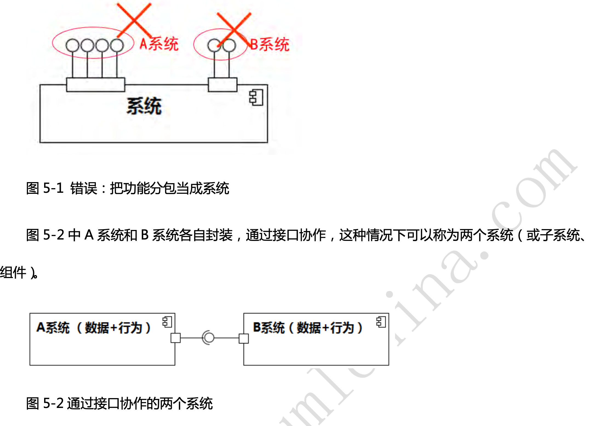

### 系统边界是责任的边界

系统执行者不是所研究系统的一部分，是该系统边界外的另一个系统。**这里的系统边界不是物理的边界，而是责任的边界**。

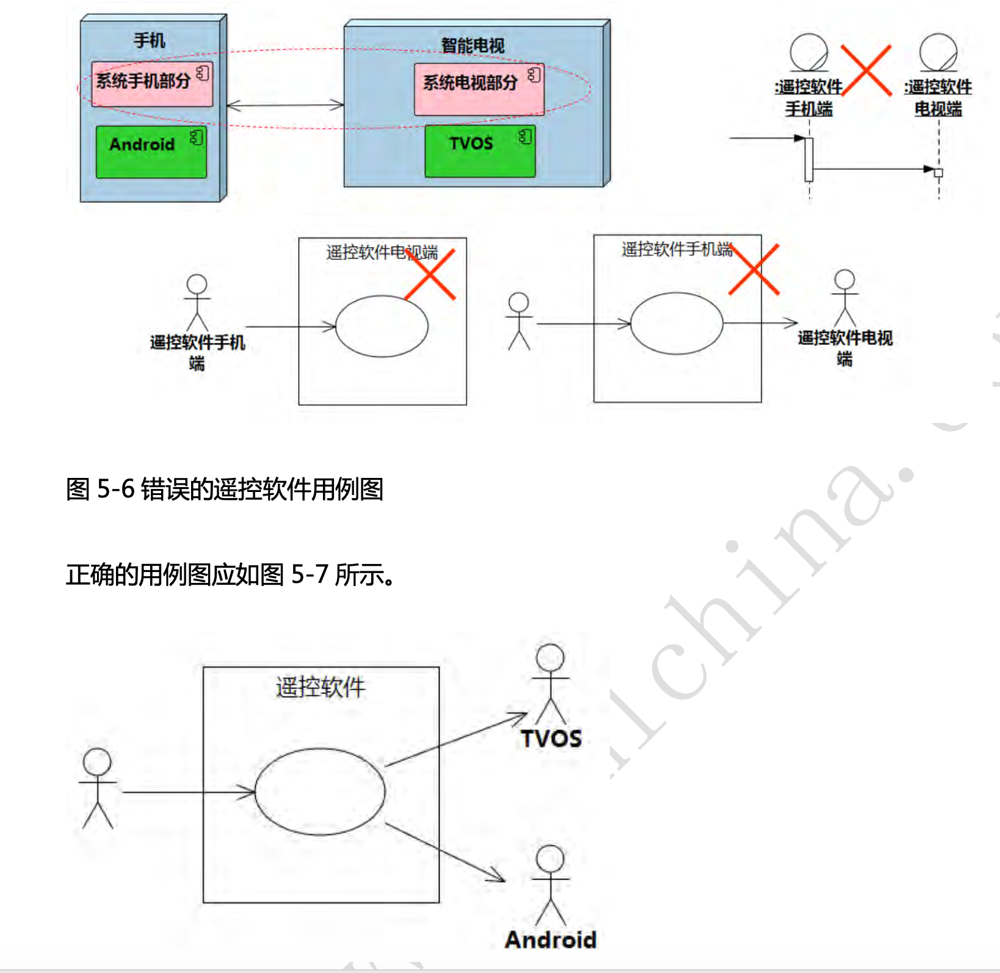

### 系统执行者和系统有交互

**外系统必须和系统有交互，否则不能算是系统的执行者。**

如图5-8，一名旅客来到火车站售票窗口，告诉售票员目的地和车次，售票员使用售票系统帮助旅 客购买火车票。这个场景中，和火车票售票系统交互的是售票员，他是售票系统的执行者，旅客不是。 有的建模人员碰到类似问题时会情不自禁地把旅客当作执行者，因为他觉得售票员是在执行旅客的指 令(也许旅客又是执行其配偶的指令)，或者觉得旅客比售票员重要，如果不把旅客当作执行者的话旅 客的利益就会被忽略。

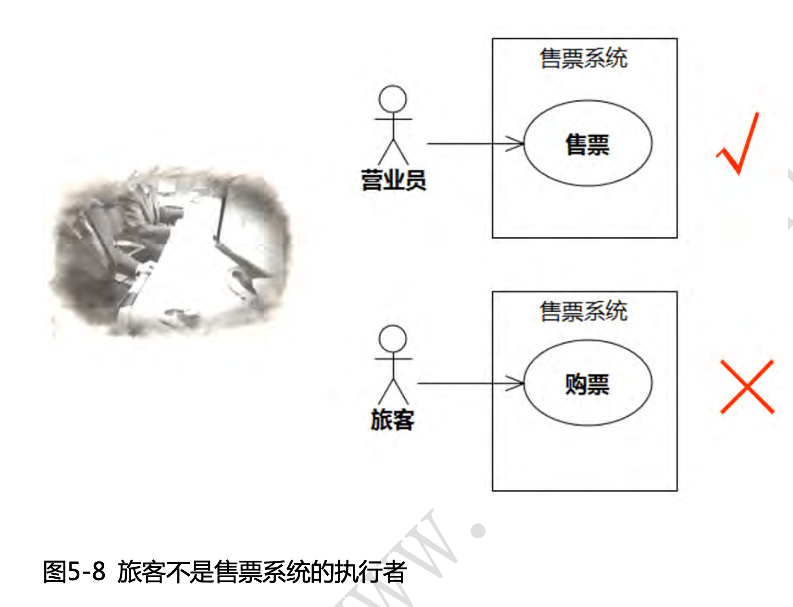

**系统执行者和重要无关。系统执行者只关注哪个外系统和所研究系统接口。这个外系统可能连人 都不是，更谈不上重要不重要了。**从平时的工作和生活经验我们也可以知道，当系统执行者当得最欢、 整天和电脑手机打交道的人，多半不是什么大人物，而是一线的打工仔，例如营业员、办事员、客服 等。大人物虽然偶尔也会用软件系统看看报表，但更多时间恐怕不是敲键盘点手机，而是摸高尔夫球 杆。

**和重要有关的概念是涉众。**

### 交互是功能性交互

**辨别的要点就是:执行者和系统发生的交互是系统的功能需求。**

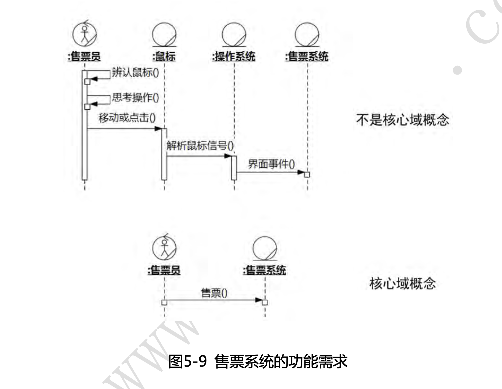

### 系统执行者可以是人或非人系统

系统执行者可以是一个人脑系统，也可以是一个非人智能系统，甚至是一个特别的外系统——时 间。在软件业的早期，一个系统的执行者往往全部都是人。随着时间的推移，系统的执行者中非人执 行者所占的比例越来越多。现在一个新系统上线，可能只有一半的接口是和人打交道，另一半接口是 和非人智能系统打交道。如图5-10所示。

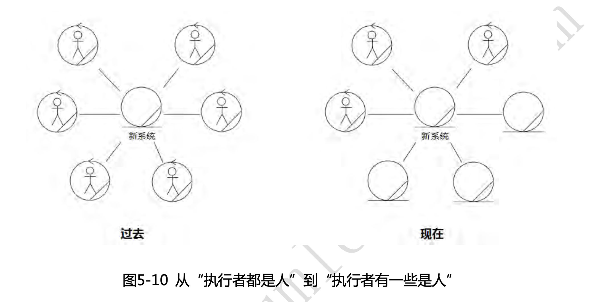

像“用户故事”这样的方法在开发一些面向大众的互联网系统时还能应付，因为这类系统的执行 者往往属于前排涉众。如果开发涉众较多、利益冲突微妙的系统，应该采用用例这样更严谨的需求技能。

建立“执行者和系统在台上表演，涉众在台下看表 演”的概念，在执行者为非人系统时对捕获需求很有帮助。

## 【步骤】识别系统执行者

### 从业务序列图映射系统执行者

如果没有做业务建模，识别系统执行者只能靠头脑风暴。可以思考类似下面的问题:什么人会使 用系统来工作?什么人负责维护系统?系统需要和哪些其他智能系统交互?有没有定时引发的事件?

有了业务建模，就不需要头脑风暴了，直接从业务序列图映射即可。业务序列图上，和所研究系 统有实线相连的对象映射为所研究系统的执行者。图 5-11 是某个房屋中介组织“寻找租客线索”的业 务序列图，从中可以看出，和线索管理系统交互(有实线相连)的有线索部经理、外呼人员、电信电 话系统和 CRM，它们就是线索管理系统的执行者。映射到系统用例图如图 5-12。

本书为了讲解需要，故意把系统执行者和系统用例分成两次识别，此处只识别系统执行者。实际 工作中，系统执行者和系统用例是一起识别的。

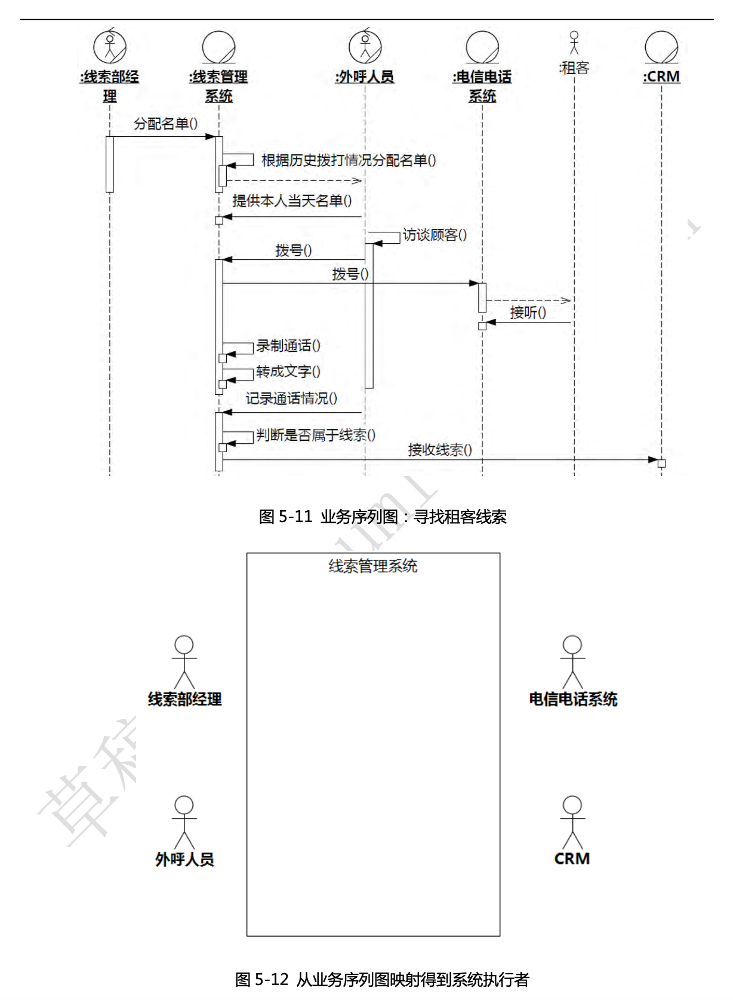

## 系统用例要点

### 价值是买卖的平衡点

系统用例的定义:系统能够为执行者提供的、涉众可以接受的价值。和第3章的业务用例相比较， 研究对象从组织变成了系统。**要理解好系统用例，重点依然是之前所强调的买卖平衡点、期望和承诺平衡点。**

用例之前的许多需求方法学，**把需求定义为思考系统“做什么”，用例把需求提升到思考系统“卖什么”的高度**。

这种思考是非常艰难的，因为它**没有标准答案，只有最佳答案**。要得到这个**最佳答案， 不能靠拍脑袋，必须揣摩涉众**。

要得到合适的用例，需要有一颗善于体察他人的心。如果建模人员总是习惯于从自己的角度想问题，**那么让他思考“什么是系统应该提供的价值”有时甚至会让他痛苦到想要逃避，或者干脆用功能、特性等模糊不清的词语代替**。

例如，“程序员”这个人脑系统为它的老板提供的用例是什么?安装开发工具?编码?为公司赚钱? 答案是编码，这是老板对程序员的期望以及程序员可以提供的承诺的平衡点，或者说，这是程序员能 卖，老板愿意买的价值。程序员不能因为装了个 Visual Studio 就理直气壮向老板要报酬，老板不给就 生气;程序员按要求编出了代码，老板就不能因为销售部门不给力或经济崩溃导致赚不到钱而责怪程 序员。正确和错误的用例如图 5-14 所示。

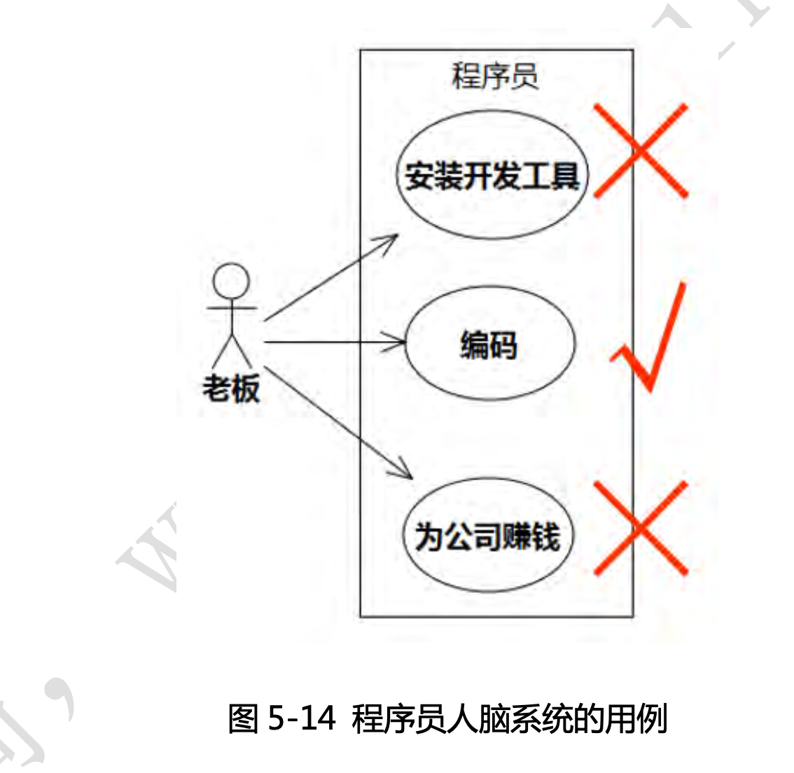

程序员如果摆错了自己的位置，没有好好完成编码的本职工作，反倒是动不动向老板上“万言书”， 对公司的发展方向大放厥词，老板是不会喜欢的，因为他不期望从程序员身上“购买”这个服务(用 某知名企业领导人的话说就是:有精神病就送医院，没精神病就辞退)。

### 价值不等于“可以这样做”

用例的执行者只是表明这个用例是为这一类执行者而做，但不代表系统一定要有权限控制以防止 其他的人或电脑系统使用该用例。

一罐可乐打开放在那里，乌鸦路过也可以喝，可乐本身并没有权限管理防止乌鸦喝它，但乌鸦仍然不是可乐的执行者，因为乌鸦不是可乐的目标客户。

有的书中给出“最佳粒度原则”，例如:一个系统的用例最好控制在××个之内、一个用例的基本路径最好控制在×步到×步之间......这些是没有根据的。**市场需要各种各样的系统，有功能众多的也有功能单一的，有一步到位的也有交互复杂的。应该把屁股坐到涉众那边去，揣摩涉众的心理，实事求是写下来。不过，“粒度”、“层次”这些概念迎合了建模人员的“设计瘾”，很容易误导建模人员。**

如果建模人员在粒度问题上热烈争吵，纠缠不清，有可能已经犯了错误。最常犯的错误是把步骤当作用例。如图 5-17，右侧的“验密码”和“扣除金额”其实只是用例“取现金”的步骤(一眼可以 看出其主语是系统)，不是用例。Include(包含)关系也不是这样用的。Include的目的是为了复用在多个用例中重复出现的步骤集合，形状往往是多个用例 Include 一个用例。看到这种一个用例 Include 许多个用例的形状，基本上可以判断它犯了把步骤当作用例的错误。正确的做法是:把右侧的“验密 码”和“扣除金额”作为步骤写在用例规约中。

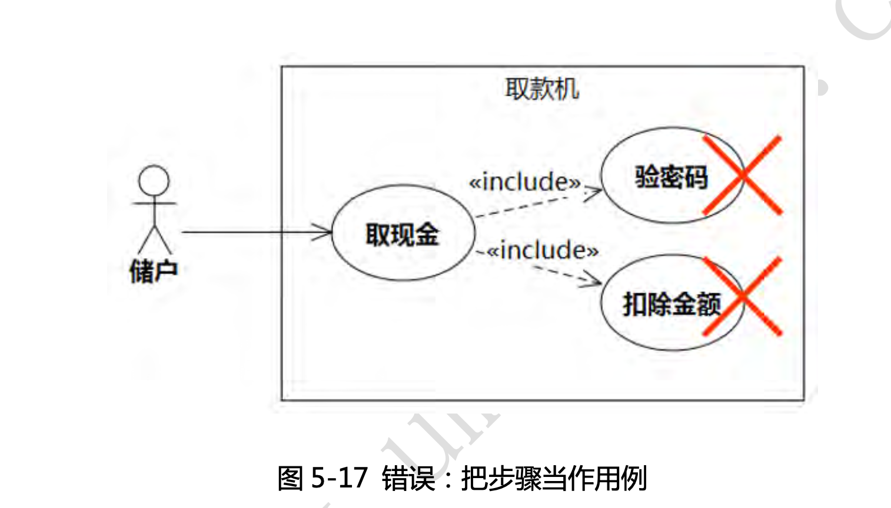

### 增删改查用例的根源是从设计映射需求

打开一些用例图，映入眼帘的用例是四个四个一组的。仔细一看，刚好对应了数据库的四种操作。 相当于把数据库的各个表名加上新增、删除、修改、查询就得到了用例的名字。很多用例书籍和文章 都提到了这个典型的错误，有的建模人员就学乖了，干脆把每四个用例合并，改名叫“管理××”(或 “××管理”)，然后新增、删除、修改、查询等用例再扩展它，如图 5-18——可惜，依然是换汤不换药。

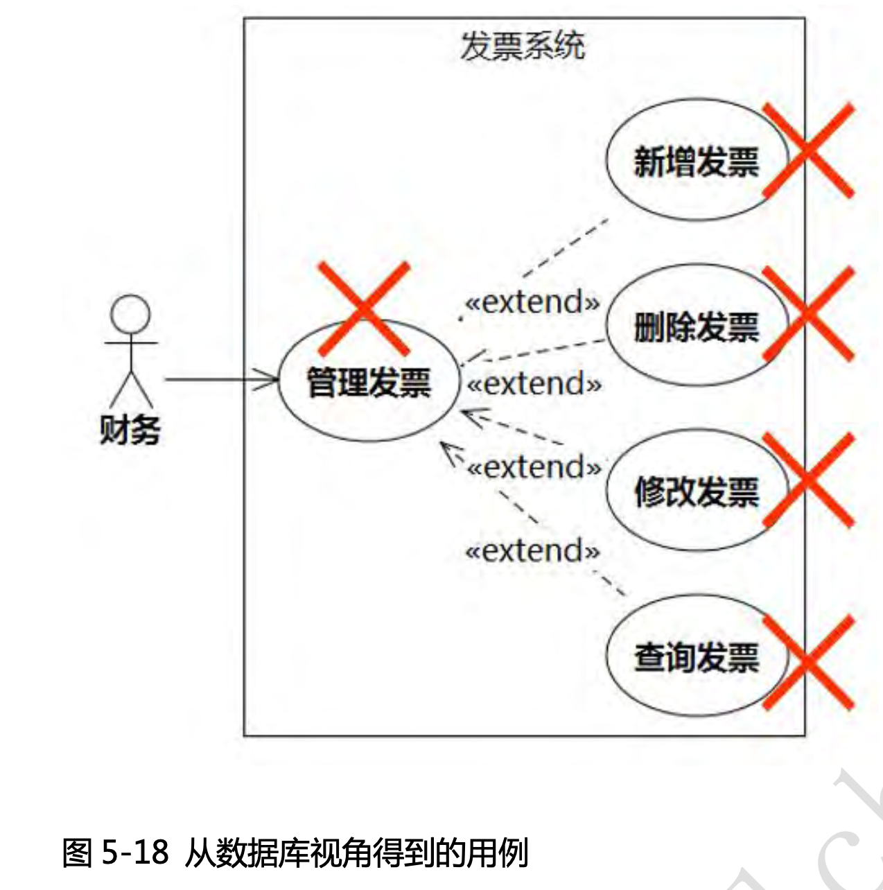

问题在于: **做需求的目的不是为了安慰自己或走过场，而是让系统更加好卖**。需求工作中，我们所写的每一个字，所画的每一张图都必须对好卖有推动作用，否则还不如不做。即使再难，也只能从涉众的视角来定义需求，不能贪图方便选择一个自己熟悉的视角应付了事。如果允许应付了事，我还有更好的绝招:我就是程序，程序就是我。您问我，某某系统的需求是什么?我回答:就是 0 和 1 的 组合。对吗?对得不得了。可惜，这种正确而无用的废话，对做出好卖的系统没有帮助。

如何避免这样的错误呢? 老老实实去研究业务流程，做好业务建模，尽量从业务序列图中映射出 系统用例，这样得到的系统用例是不会骗人的。新增、修改、删除、查询、管理、改变状态......这些词 是数据库的“鸟语”，不是领域里的“人话”。

业务流程中不会有人说，小张等一下，我到系统那里去 管理一下发票，只会说，我去开一张发票，我去作废一张发票，我去开一张红字发票......而且，这些事 情以不同的频率发生在不同的业务流程中。所以图 5-18 的用例图应该修改为图 5-20。

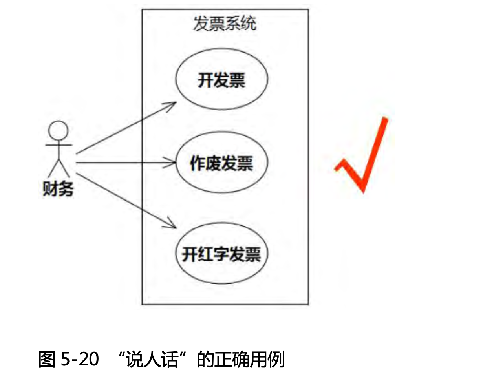

当开票量较大而且需要即时开票时，如果只有一个开票员无法应付，需要增加开票员，这样就可 以独立开票而且明确责任，所以系统需要为管理员提供一个“添加开票员”的用例。这个思路是可以 的，而且我们还可以看到这里提到了领域知识，后面写用例规约时寻找到的涉众利益也丰富得多。

### 从设计映射需求错误二:“复用”用例

增删改查用例实际上就是从设计映射需求，导致“复用”用例的一种情况。再看图 5-21 的例子:

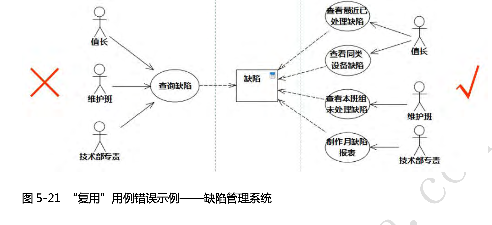

从不同的业务序列图分别映射得到系统有右边四个用例，但有的建模人员会动起心思:这些实现 起来不都是针对“缺陷”表来“Select ××× from 缺陷 where ×××”吗，合并成一个用例“查询 缺陷”多好!于是得到左边的结果。实际上，右边这四个用例面对的执行者不同，背后的涉众利益也有差别。

说到这里，可能有人就会说了:哇，这样的话我故意把用例搞多一点，搞他1000个用例，那不是 乱套了?——“我爸是李刚”的感觉又来了，用例是你搞出来的吗?是客户乐意“买”才有的。如果 说真的按照“卖”的思路去找，确实是这么多，那是好事来着!事实上，往往用例的大量膨胀根本不 是因为这个，而是因为建模人员把很多不是用例的步骤当成用例画出来了!

害怕用例多了会导致工作量大增，背后可能隐藏着这样的问题:研发团队做分析设计时缺乏循序渐进的抽象能力，只会把需求直通通地映射，所以害怕用例变多，或者在发现“此处似乎可以抽象” 时害怕此时不抽象以后就忘记了。研发团队分析设计能力不足，会反向损害需求的质量，进而损害系 统在市场上的竞争力。

讲到这里，**就要来说一个需求的基本要点:需求不考虑“复用”，如果在考虑“复用”，要警惕自 己是不是已经转换到了设计视角来思考问题**。

图 5-22 犯的错误和图 5-21 一样。因为最终结果都是导致数据库的“保单”表里增加一行，建模 人员干脆让几个执行者共用一个用例“新增保单”。

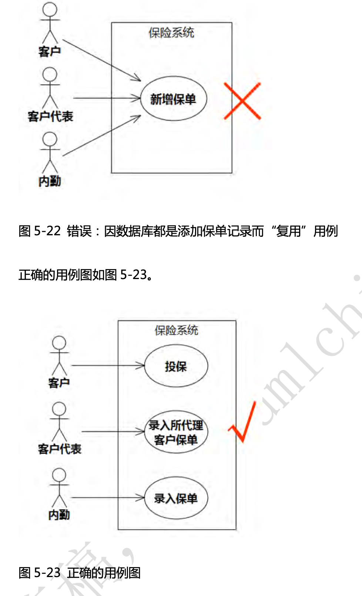

客户在家里通过网络投保，操心的是“可别上当”;客户代表录入自己代理的客户的保单时，操心 的是“佣金要高”;内勤面对堆积如山的待录入保单，操心的是“省力一点”。从“卖”的角度来看， 这是系统的三种不同用法，背后的涉众利益不同。不能用“都是往数据库的保单表里插入一条记录啊” 这样的理由合并而抹杀其中的差别。

下一个错例如图 5-24。因为顾客、店员和经理都参与了退货的流程，干脆共用一个用例“退货”。

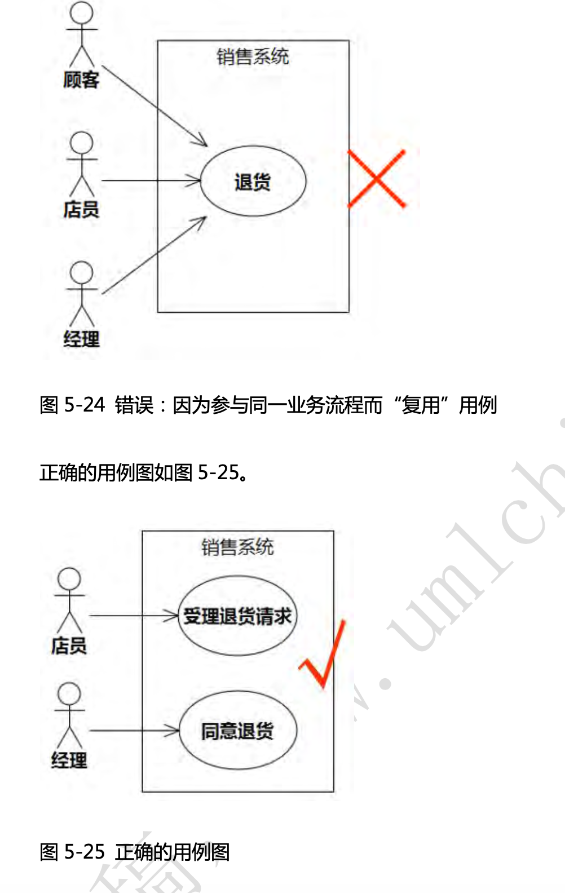

图 5-17、图 5-22 和图 5-24 的错误用例图有一个共同点:多个执行者指向同一个用例。**已完工的用例图不应该出现这样的形状，如果出现**，可以有两种修改方法。要是我们揣摩系统的这个用例针对 这几个执行者来说并无区别，就泛化出抽象的执行者，或者不需要泛化关系，直接用单个更合适的执 行者代替;反之，如果对不同执行者来说有区别，就把该用例分成几个不同的用例。后一种往往更常 见。如图 5-26 所示。

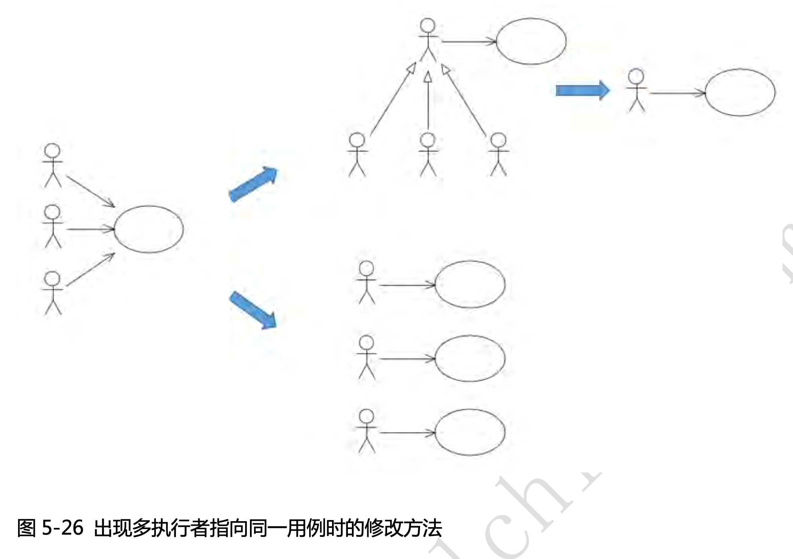

### 系统用例不存在层次问题

系统用例的研究对象就是某特定系统，不是组织，也不是系统内的组件。如果存在“层次”上的 疑惑，背后的原因是研究对象不知不觉改变了。

像医院信息系统的用例，有人会画成图 5-27，原因可能是前面没有画业务用例图和业务序列图， 所以建模人员头脑里不知不觉把医院信息系统的价值和医院的价值混在一起了。

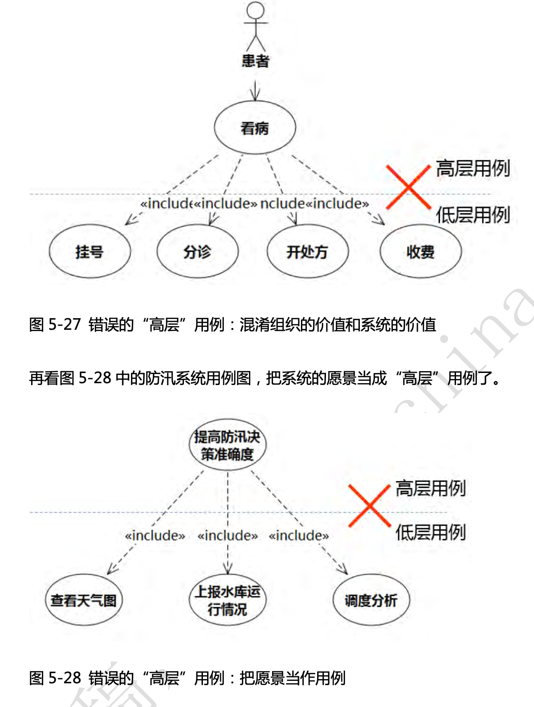

以上错误是因为缺少业务建模导致研究对象不知不觉改变。下面的错误更常见——为系统的“模 块”画用例图。如图 5-29，建模人员觉得系统的用例比较多，所以把用例分了包，认为“记录出车”、 “记录违章”等是“车辆管理模块”的用例。

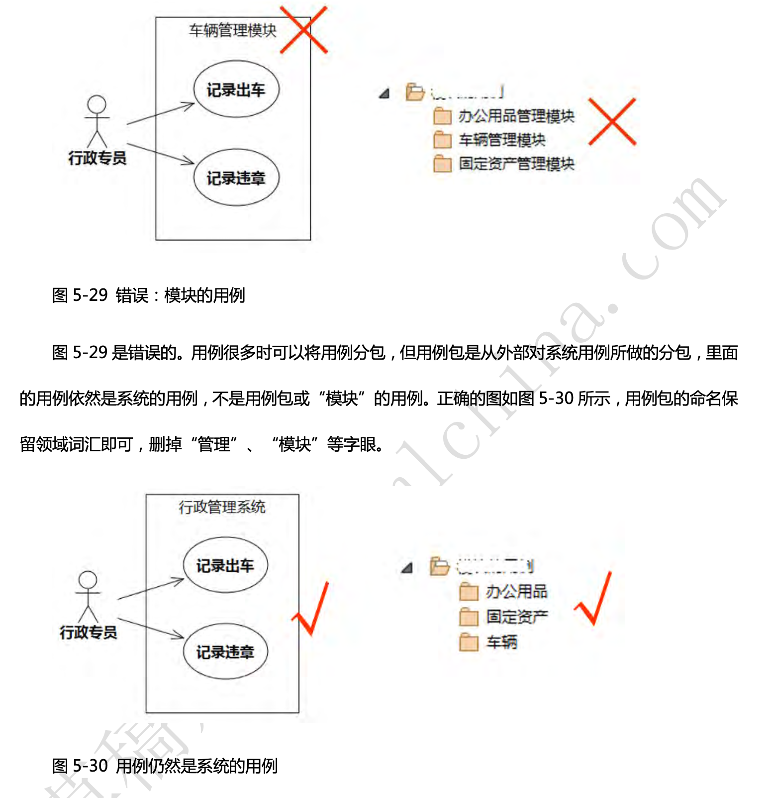

上面说的是内外不分的情况。假设建模人员已经清楚内外的区别，他理解的子系统确实就是子系统。那么，可不可以如图 5-32 为子系统画用例图，方便分包给研发团队各小组开发?

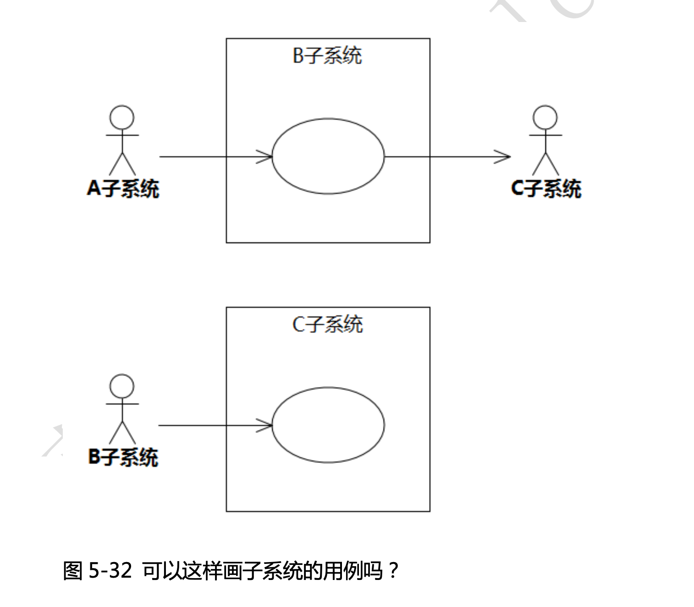

答案仍然是否定的，理由是:客户找你买的是整个系统，他不关心内部分成几个子系统以及它们之间如何协作，这不属于需求。如果要表达这些内容，可以用类图、序列图、组件图等，不需要用例图。

### 用例的命名是动宾结构

用例的命名是动宾结构，例如“取现金”。动词前面可以加状语，宾语前面可以加定语，把一句话 的主语砍掉，剩下的可以作为用例的名字。

给用例起名时不要使用弱动词。用例之前的需求技术，可能是以“名字+动词”的形式命名系统的 功能，例如“发票作废”，后来要改成用例的动宾结构了，有的建模人员就在前面加一个弱动词“进行”， 就变成了“进行发票作废”，这个也是不合适的。

如果“名词+动词”已经成为行业中的一个术语，也未必要严格的动宾结构。例如“成果分析”在 某行业是一个术语，也就不必硬要倒过来变成“分析成果”了。

##【步骤】识别系统用例

其实只要认真做好业务建模，从业务序列图上映射系统用例，得到的结果自然就会符合上面说的这些要点。

业务序列图中，从外部指向所研究系统的消息，可以映射为该系统的用例。我们从图5-11的业务 序列图上找出从外部指向“线索管理系统”的消息，如图5-33所示，然后映射成“线索管理系统”的 用例图，如图5-34。

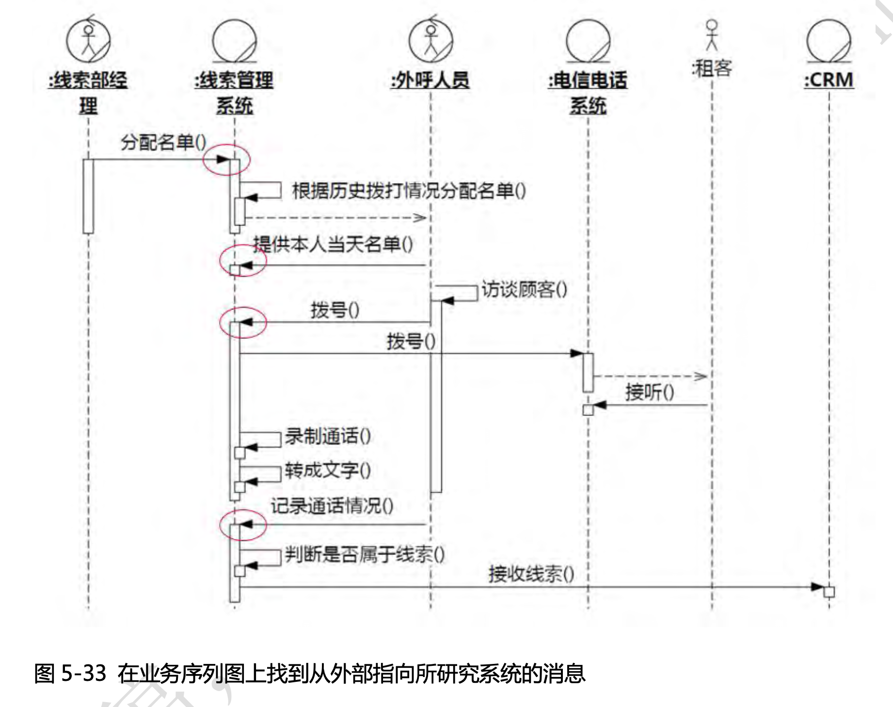

图 5-33 在业务序列图上找到从外部指向所研究系统的消息

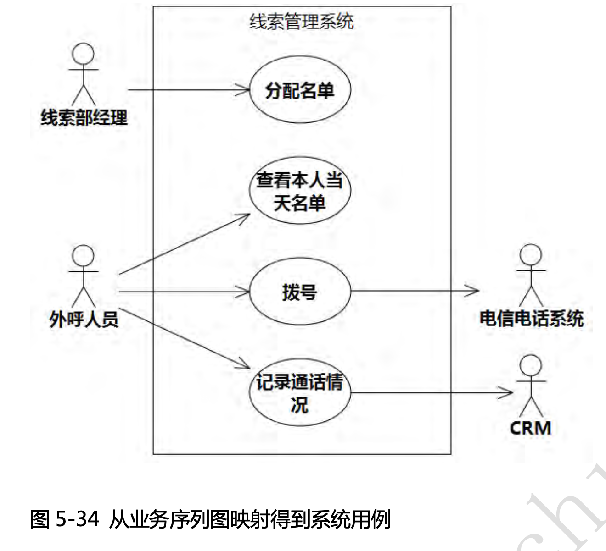

图 5-33 中，“外呼人员”指向“线索管理系统”的消息为“提供本人当天名单”，但在图 5-34 中，用例名改成了“查看本人当天名单”。因为序列图上的消息代表“请求某系统做某事”，用例代 表“用某系统来做某事”，所以有的地方要调整。

图 5-34 的用例图中，有的箭头是从执行者指向用例，这样的执行者称为用例的**主执行者**，有的箭头是从用例指向执行者，这样的执行者称为用例的**辅执行者**。主执行者主动发起用例的交互，辅执行 者在交互的过程中被动参与进来。UML 标准中，执行者和用例之间没有要求使用箭头，但我认为用箭 头表示主、辅执行者是有意义的，建议还是加上。

##【案例和工具操作】系统用例图

我们从图 4-51 的业务序列图上找出从外部指向“UMLChina 系统 2018”的消息，如图 5-38 所 示，然后映射成“UMLChina 系统 2018”的用例图，如图 5-39。

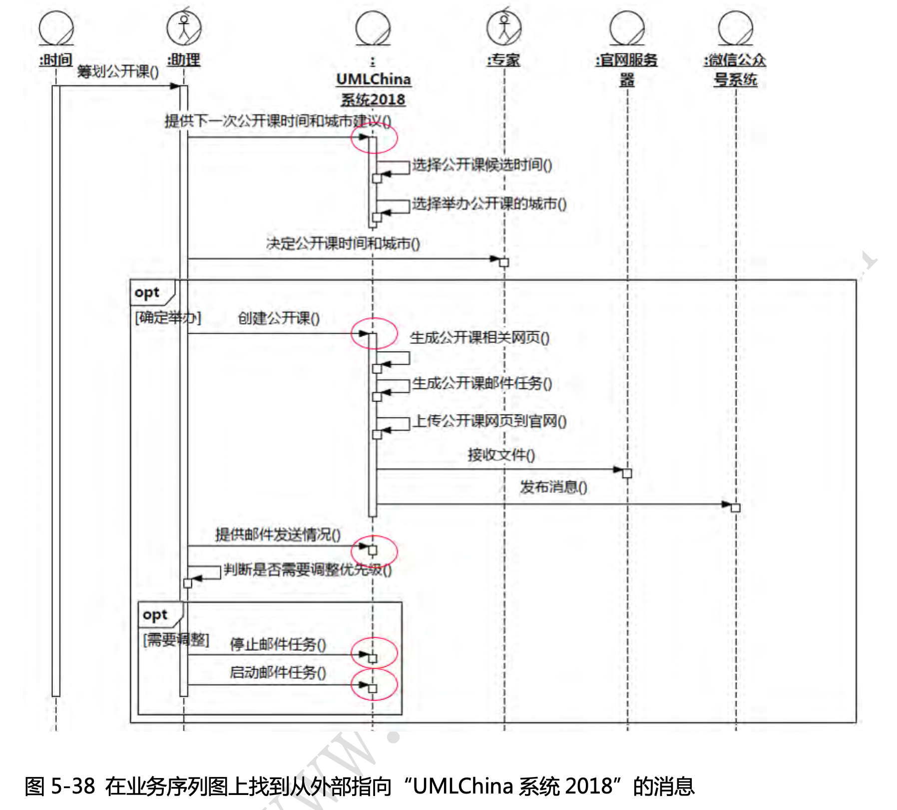

图 5-39 中，有两个用例的名字和序列图上的消息名称不完全相同——“查看下一次公开课时间 和城市建议”和“查看邮件发送情况”，这是因为序列图上的消息是“A 请求 B 做某事”，而用例的 名字是“A 使用系统来做某事”。

# 第6章 需求 之 系统用例规约

## 用例规约的内容

用例图表达了用例的目标，但是对于完整的需求来说，这是远远不够的。用例的背后封装了不同级别的相关需求，我们需要通过书写用例规约把这些需求表达出来。

用例规约就是以用例为核心来组织需求内容的需求规约。有了用例规约，可以不需要另外写其他格式的需求规约。用例规约的各项内容用类图展示如图 6-1 所示。

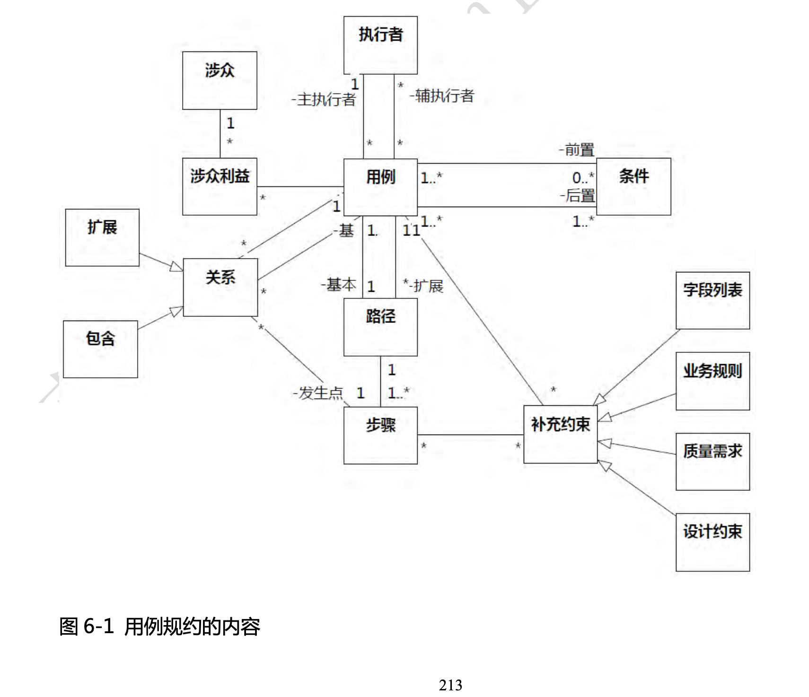

### 前置条件和后置条件

用例通过前置条件(precondition)、后置条件(postcondition)以契约的形式表达需求。**用例相当于系统的一个承诺:在满足前置条件时开始，按照里面的路径步骤走，系统就能到达后置条件**。

	前置条件:用例开始前，系统需要满足的约束。

	后置条件:用例成功结束后，系统需要满足的约束。
	
**前置条件、后置条件必须是系统能检测的。**

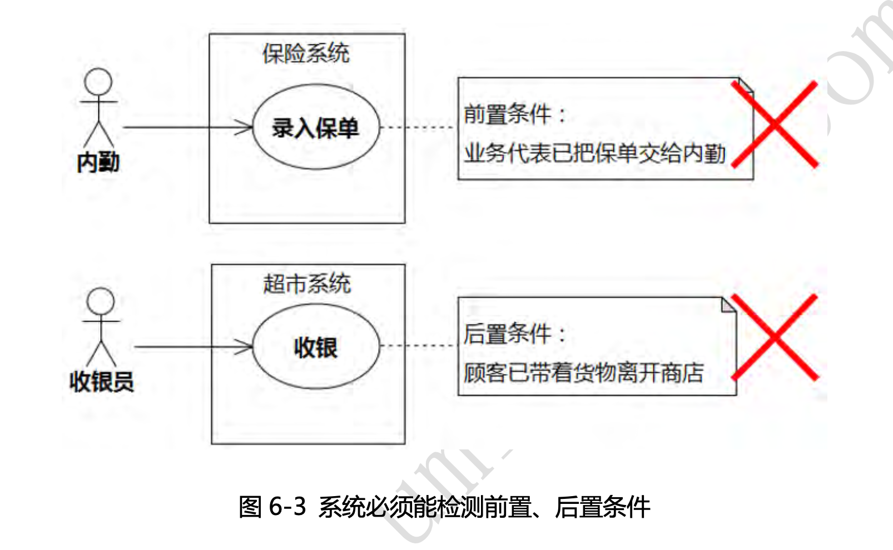

**前置后置条件是状态，不是动作。**

例如，“经理→批假”的前置条件不能写“员工提交请假单”，因为是一个动作不是状态，应改为 “存在待审批的请假单”。特别要注意的是，写成“员工已经提交请假单”很可能也是不对的，因为状 态和导致达到某个状态的行为不是一一对应的，请假单未必是员工自己提交，也可以组长负责帮本组 人员请假，也可能是从另外的系统批量导入。

**前置后置条件要用核心域词汇描述。**

“系统正常运行”、“网络连接正常”等放之四海而皆准的约束，和所研究系统没有特定关系，不 需要在前置条件中写出来，否则会得到一堆没有任何增值作用的废话。

后置条件也不能简单地把用例的名字加上“成功”二字变成“××成功”。例如，用例“顾客→下 单”的后置条件写“顾客已经成功下单”，这不是废话吗?更合适的后置条件是“订单信息已保存”

**“已登录”不应作为前置条件。**

一些用例规约会有这样的前置条件:××已经登录。下面花一些篇幅来讨论这样做是否合适。

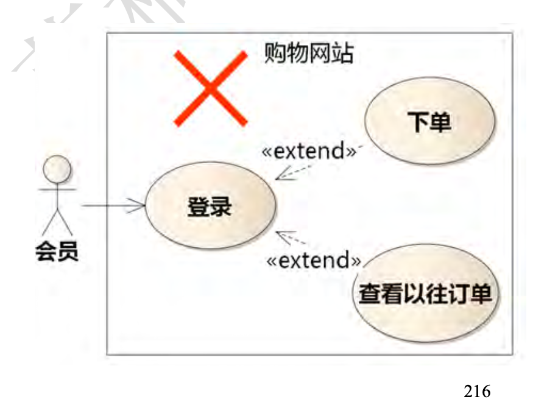

第二种做法如图 6-6，把登录变成被其他用例包含(Include)的被包含用例(Included Use Case)。 这样做是正确的。登录用例本来不存在，后来在写用例规约的时候，发现下单、查看以往订单等用例 里都有以下步骤集合:

- 会员提交身份信息

- 系统验证身份信息

- 系统保存会员登录信息

- 系统反馈会员定制界面

为了节省书写用例规约的工作量，考虑把这些形成一个小目标的步骤集合(不是单个步骤)分离 出来，作为一个被包含用例单独编写规约。这个用例只被其他用例包含，不由主执行者指向。被包含 用例的这个特点和类的私有操作很相似。

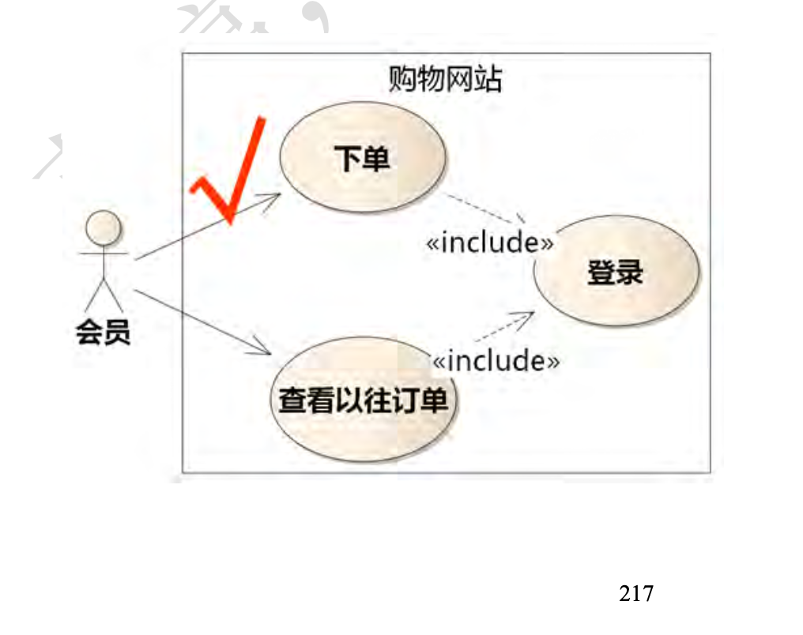

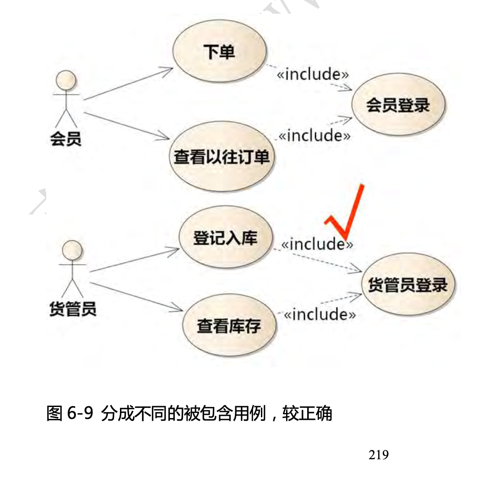

被包含用例(以及扩展用例)严格来说不能算用例，应该有更好的名字，例如“交互片段”，否 则名称中带的”用例“二字容易误导开发人员从实现的角度定义用例，而不是从对外提供价值的角度。

### 涉众利益

前置条件是起点，后置条件是终点，中间的路该怎么走?这就要由涉众利益决定了。如果只考虑 目标而没有考虑到涉众利益，正确的需求是出不来的。

假设我需要 1000 元现金。为了达到这个目的，首先我会拉开家里的抽屉，如果里面有超过 1000 元的现金，我就从中拿 1000 元;如果抽屉里没有现金或者现金不够，我就拿上银行卡，到楼下 ATM 去取。问题来了:同样的目标，为什么家里的抽屉拉开就可以达到，而楼下的 ATM 却要插卡输密码?

**背后的原因是涉众利益不同。涉众利益即针对某件事情，某类人担心什么和希望什么。家里的抽 屉只涉及到我和家人的利益，如果我和家人和睦相处，拉开抽屉就可以拿;反之，如果我和家人的利 益冲突得非常厉害，那么可能需要买一种长得很像 ATM 的抽屉才能满足我家的需要。**

认识到需求由涉众利益的冲突和平衡来决定，我们的需求过程就会充满“人”的味道，变得乐趣 横生。扩展开来看，我们为什么在现在的公司工作，为什么选择现在的配偶，甚至午餐吃什么，都是 权衡了各种涉众利益的结果。

为了寻找用例的涉众，可以用“醉酒法”思考。假设台上的演员“喝醉”(“喝醉”加了引号是因 为在台上的未必是人)了在台上表演，谁看到这个场面会担心自己的直接利益受到侵害?担心的人就 是这个用例的涉众。主要有以下来源:

- 涉众来源一:人类执行者

用例的执行者如果是人类，当然是用例的涉众。执行者如果不是人类，就不是涉众，因为它没有 利益主张。针对图 6-11 中保险系统的“内勤→录入保单”用例，内勤是人类，是涉众，而 OA 系统不 是人类，不是涉众。

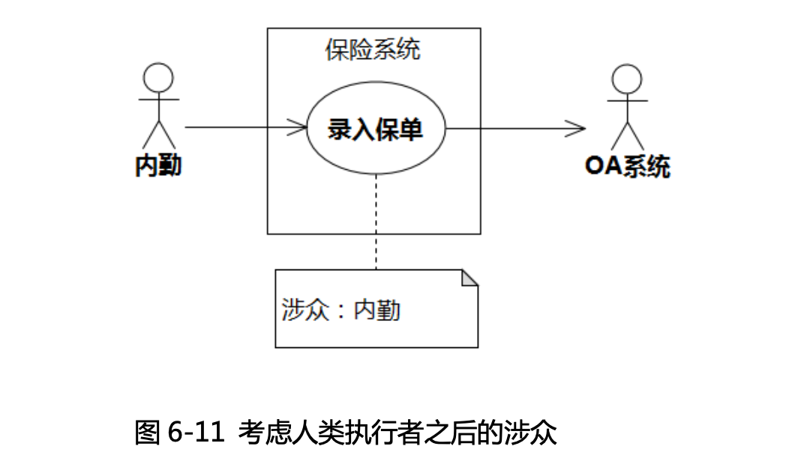

- 涉众来源二:上游

执行者要使用系统做某个用例，可能会需要一些资源，这些资源的提供者很可能是该用例的涉众。 还是以“内勤→录入保单”为例，保单由业务代表提供给内勤。如果内勤喝醉了酒乱录，信息错得一 塌糊涂，业务代表的利益就被损害了。考虑上游之后，“内勤→录入保单”用例的涉众如图 6-12 所示。

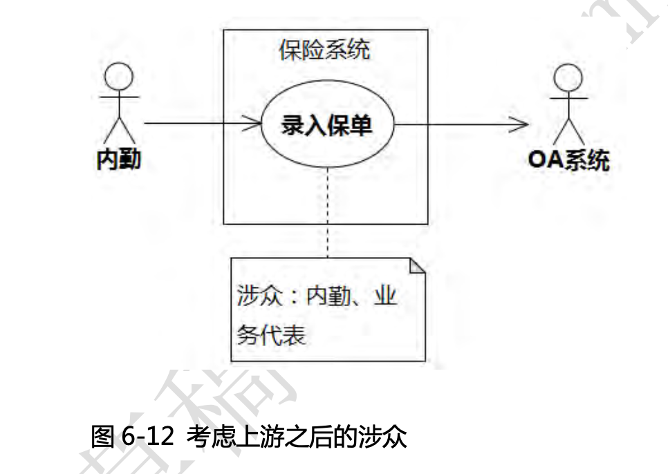

- 涉众来源三:下游

执行者使用系统做某个用例，产生的后果会影响到其他人。受影响的这些人也是涉众。还是以**“内 勤→录入保单”**为例，如果系统做得不好，没有检测内勤录保单时是否填了必填项就放了过去，后面 负责审核的**经理**工作量增加了。

还有，OA 系统虽然不是“内勤→录入保单”用例的涉众，但这个用例产生的结果会影响到 OA 系统 背后的人。假如保险系统不停向 OA 系统发垃圾数据包，导致 OA 系统瘫痪，OA 系统维护人员的工作量 就增加了。所以 OA 系统维护人员也是下游的涉众。考虑下游之后，“内勤→录入保单”用例的涉众如 图 6-13 所示。

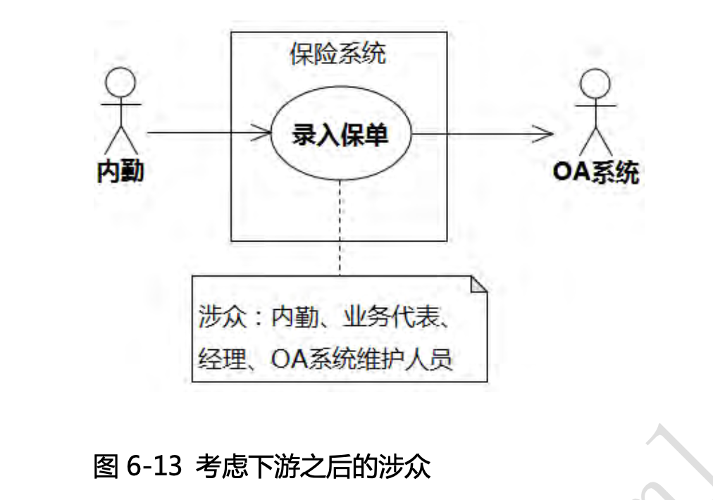

- 涉众来源四:信息的主人

用例会用到一些信息，这些信息可能会涉及到某些人。虽然这些人也许并不知道这个系统的存在， 但他们是用例的涉众。还是以**“内勤→录入保单”**为例，保单的信息涉及到了**被保人、投保人和受益人**，如果信息出错或泄漏，这些人就会遭殃，所以他们是涉众。

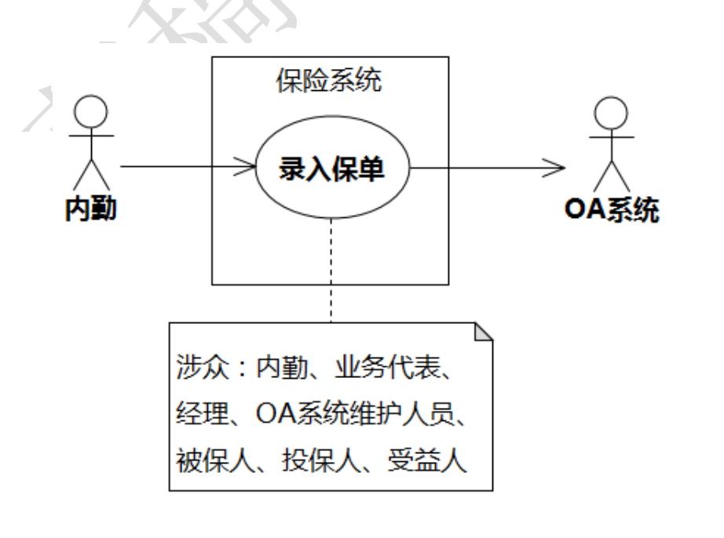

说到这里，也许您已经看出来，业务建模对于识别涉众非常有帮助。如果我们在需求之前做了业 务建模，会更了解一件事情的前因后果，大多数涉众都能够从业务序列图中看出来。例如，从图 6-15 的业务序列图中，业务对象内勤、业务代表、经理和投保人很容易看出来。另外，消息参数“保单信 息”提醒建模人员还会涉及被保人和受益人。这样，图 6-14 中所列举的“内勤→录入保单”的涉众就 找齐了。

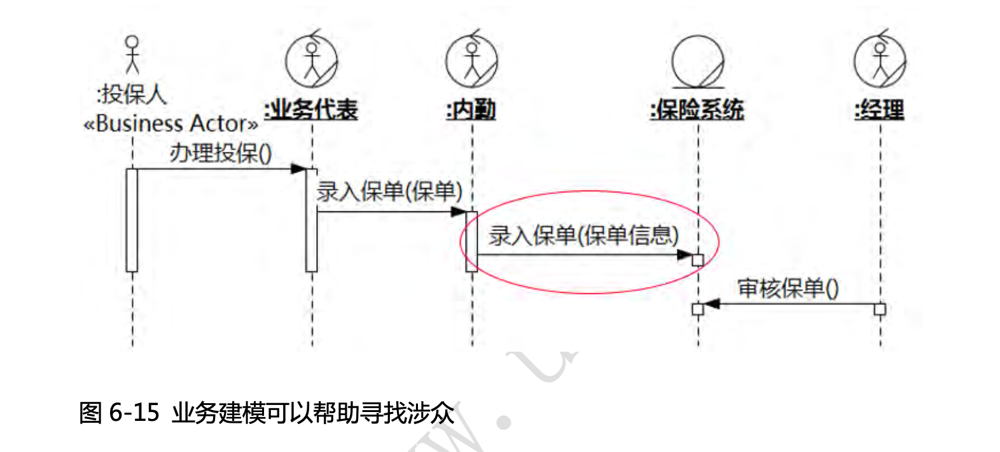

#### 寻找涉众利益

用例会用到􏰙些信息，􏰑些信息可􏰛会涉及到某些人􏰇􏱈然􏰑些人也􏰓并不􏱒􏱓􏰑个􏰤􏰥􏰏存在， 但他们是用例􏰏涉众􏰇
